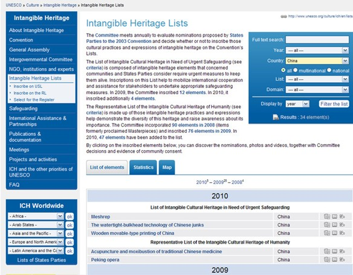
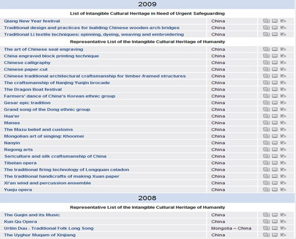
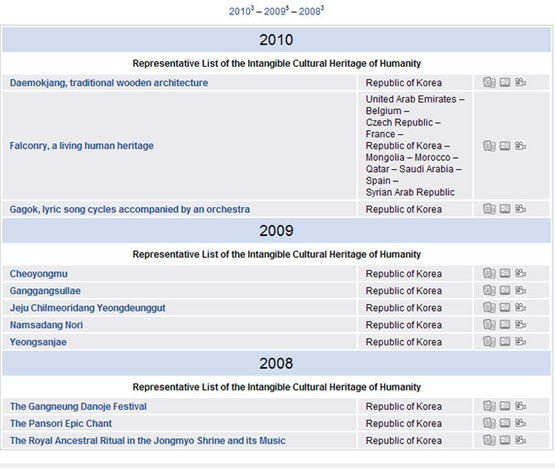

# ＜摇光＞韩国人到底偷走了什么？

**一个人，他是不是被人看不起，能不能赢得别人的尊敬，也许在初次见面毫无了解的情况下是取决于他的国籍，但是一旦双方有了一些了解，共同生活过一段时间，这种判断的依据很快就从国籍变成了个人能力、个人魅力。如果我们身边的熟人都瞧不起我们，那问题八成不在人家，而在我们自己。**

### 

### 

#  韩国人到底偷走了什么？

### 

## 文/ 王粤北（同济大学）

### 

### 

借着各种机缘巧合，我在假期有机会参加赴韩国交流的暑期学校，成行前偶然在网上百度中国人对韩国人的印象，发现果然还是很差，两边的相互仇视的声音俯拾皆是。一开始我只是担心自己去了韩国会不会受到歧视，幸好事实很快证明我的担心是多余的。不过另一个问题却始终阴魂不散---我们为什么讨厌韩国人？ 一提起韩国人的讨厌之处，我们中国人首先会想到什么？包括我在内的多数人第一反应就是偷窃别国传统文化，无耻地宣称孔子、汉字、端午节都是他们的，而不明真相的联合国教科文组织又天杀的站在了“狗棒子”一边。可是，事情真的是这样么？韩国人到底偷走了什？为了解答自己的问题，我也就这么磕磕绊绊稀里糊涂，踏上了追索偏见之路。 **谁的非物质文化遗产** “有形文化遗产”即传统意义上的“文化遗产”，根据《保护世界文化和自然遗产公约》（简称《世界遗产公约》），包括历史文物、历史建筑、人类文化遗址。我们都知道，关于各国传统文化方面的项目，大多属于非物质文化遗产，“非物质文化遗产”指被各群体、团体、有时为个人所视为其文化遗产的各种实践、表演、表现形式、知识体系和技能及其有关的工具、实物、工艺品和文化场所。凡是申报成为世界非物质文化遗产的项目在联合国教科文组织的网站上都有名录和详细介绍。[http://www.unesco.org](http://www.unesco.org/) 网址在这里，UNESCO也就是联合国教科文组织的缩写了，网站是英文的，当然我们可以使用中文版本的网页，不过很有意思的是，中文版本的UNESCO网站和英文、法文版的内容是不一样的，其实，也可以说成是没有什么内容的。在中文版本下，只有关于UNESCO的简介，以及一些会议通知，无法找到非物质文化遗产名录，至于造成这种状况的原因，笔者不得而知。 在非物质文化遗产名录一栏中（不得不使用英文版），可以看到不同国家的申请列表，点开“中国”，样子如下：       以下列举中国的世界非物质文化遗产名录，也就是上图内容的翻译。 （注意红字） 2001年（1项）昆曲 2003年（1项）中国古琴艺术 2005年（2项）： 新疆维吾尔木卡姆艺术， （阿塞拜疆也有同名为木卡姆的遗产申报）, 蒙古族长调民歌 （与蒙古国联合申报） 前几项视为08年之前。 2009年（22项）： 中国蚕桑丝织技艺，福建南音，南京云锦，安徽宣纸，贵州侗族大歌，广东粤剧，《格萨尔》史诗，浙江龙泉青瓷，青海热贡艺术，藏戏，新疆《玛纳斯》，蒙古族呼麦，甘肃花儿，西安鼓乐,朝鲜族农乐舞，书法、篆刻，剪纸，雕版印刷，传统木结构营造技艺，端午节，妈祖信俗。 2010 京剧，中医针灸 从以上名录中我们可以清楚的看到，中医针灸，雕版印刷，端午节都明确归属于中国，它们很安全。引人注目的是朝鲜族农乐舞，我们可以在它的名字中很清楚的看到korean。我在查找韩国人对中国的不满及其无理要求时，好像大多集中在领土问题，并没有看到太多和农乐舞直接有关的申斥。 韩国媒体认为这是因为韩国端午祭被认定为非物质文化遗产之后，中国更加意识到保护传统文化的重要性，但似乎没有把这视为一种抢夺，因为中国确实有大量的朝鲜族人居住，而他们的很多民俗习惯也确实已经产生了自己独特的变化。  韩国的非物质文化遗产名录如下 

 可以看到，韩国的非物质文化遗产总数是很少的，如果真有那么多我国遗产被抢注，也不会只有这么几项登记在册。在这其中，也找不到任何偷窃中国文化的痕迹，至少TAI JIN同学支支吾吾把这些东西讲给我听的时候，我没有发现那种痕迹。（这里也没有发现北朝鲜的名录）而且"申遗"没有"抢注"的概念，文化遗产也没有"专利"概念，联合国的教科文组织也不是文化遗产"专利"认证机构，联合国的教科文组织是主张"鼓励多国联合申报，不占名额"的，例如阿塞拜疆有"木卡姆"非物质文化遗产项目，而中国的新疆也有"木卡姆"这个项目，两者并不矛盾。 这说明，韩国人并没有在联合国教科文面前偷走我们的东西，就算他们有这个心，至少联合国没有愚蠢到通过那种申请。 **著名的端午节之争** 实际上，韩国端午祭与中国端午节是完全不同的节日。韩国江陵的端午祭实际上是由舞蹈、萨满祭祀、民间艺术展示等内容构成，这与中国人吃粽子、划龙舟、纪念屈原是两回事，惟一的相同点是时间框架，都是在中国的端午节期间举行，因此被称为端午祭。我的韩国同学再提起中国的特色美食的时候还不忘了提起蘸糖吃的饭团，过了半天我才反应过来她说的是粽子。 江陵端午祭的确是东亚“汉字文化圈”有趣的文化现象。以节日习俗而言，端午节虽然发源地在中国，但是在长期的流传和国际交流中，它被中国周边的国家和民族所吸纳，所接受，并置于自己的文化土壤之中，形成韩国民族独特的节日习俗。（这和朝鲜族农乐舞是很相似的）如果追述韩国江陵端午祭的原型，受中国文化的影响是不容置疑的。在韩国的许多典籍中都记载了对“端午”的解释，这种解释和中国人的观念是一样的。如韩国也称五月初五日为“重午”、“重五”、“端阳”、“五月节”，韩国特有的词是称“端午”为“上日”，意为神的日子。中国端午节的许多习俗如插艾蒿、菖蒲、吃粽子、饮雄黄酒、戴荷包、五毒兜兜，拴五彩缕，划龙舟、纪念屈原等习俗，在韩国的端午习俗中并不存在。但韩国江陵地区的端午祭，同样包含了丰富的内容，祭祀、演戏、游艺是其主要内容。其中的祭祀仪式保存了完整的形式和内容，可以说是韩国江陵端午祭的核心。这也是韩国江陵端午祭1967年被指定为韩国第13号无形文化财产的主要原因。 详情请见[http://baike.baidu.com/view/790700.htm](http://baike.baidu.com/view/790700.htm) 这里对两边的端午分别进行了介绍。 **连汉字都揽下了？ ** 针对国内有媒体再次爆料少数韩国学者企图把汉字标注为“韩国人发明”，并申请世界文化遗产的做法在中国读者和网民中引起一片哗然。广州一家报纸上星期连续3期在“热辣网事”版面刊登“中韩传统文化之争”的“汉字之争”、“端午之争”和“名人之争”。在“汉字之争”中，文章说汉字“申遗”在韩国已经热了一年多，去年10月10日的韩国《朝鲜日报》就报道说，韩国首尔大学历史教授朴正秀经过十年研究和考证后，认为是朝鲜民族最先发明了汉字。他还建议韩国政府理直气壮地恢复汉字，并向联合国申请汉字为世界文化遗产。这篇报道很快引起韩国媒体的广泛关注。韩国联合通讯社13日报道称，首尔大学没有名叫朴正秀的教授，而且韩国国内也没有要求为汉字申请世界文化遗产的举动。事实上，经过《环球时报》记者调查，中国媒体的报道确有出入，少数韩国人确有主张“汉字是韩国人发明”的，但他们的主张在韩国并非主流，相反还被本国行家嘲笑。 至于“汉字之争”的来龙去脉，在[http://news.sina.com.cn/c/2007-12-19/134114557466.shtml](http://news.sina.com.cn/c/2007-12-19/134114557466.shtml) 有比较详尽的论述。 **浑天仪确实上了韩币** 社在消息中称：浑天仪是浑仪和浑象的总称，均为我国东汉天文学家张衡所制。韩国拥有所谓独创的浑天表，韩国媒体表示，将浑天仪印在货币上，可能使人误解为浑天仪是能代表韩国的科学成果。首尔大学历史系教授文重亮(音)说：“浑天仪最早源于中国，因此不能出现在韩国货币上。”韩国网民也在银行网站留言，要求“更换设计图案并停止发行”。业内人士则认为银行方面在选择新版纸币图案时忽视了货币特有的科学性和历史内涵，这种做法显然不妥。外界质疑，韩国银行前发行局局长金斗经解释说：“浑天表的箱体型设计与货币图案显得格格不入，因此，我们退而求其次，选择浑天仪作为货币图案。” 银行还发表声明称“纸币图案中所用的浑天仪是浑天表的一部分，浑天仪虽由中国最先制造，但有多种形态，认为纸币上的浑天仪是中国制造的浑天仪是没有道理的。浑天表中的浑天仪中间有一个地球仪，这种设计是韩国独创的。” 韩国《朝鲜日报》分析，引起这次事件的另一主因，是银行的货币图案咨询委员会中没有科学及历史专家。 韩国报章批评，韩国银行只考虑图案设计，忽略了纸币图样应具有的科学及历史意义。韩国历史学家指出，韩国银行把中国发明的天文观测仪浑天仪印在韩国货币上并不恰当，可能会使人误以为浑天仪是韩国的科学成果。 详见[http://baike.baidu.com/view/51672.htm](http://baike.baidu.com/view/51672.htm) 根据维基百科的说法，韩国科学家蒋英实是朝鲜半岛上首个制作浑天仪的人，他是根据从中国和印度传过去的残破书籍自己做出了浑天仪，当然，他并不是第一个发明者。 **又见“****风”****生“****水”****起** 笔者在之前的搜索中发现，在众多贴吧里曾经发起过给联合国写联名信抵制韩国将风水学申请为非物质文化遗产的浩大行动，仅在WOW吧里就有40万人参加表示支持，见[http://tieba.baidu.com/p/623160064?pn=1329](http://tieba.baidu.com/p/623160064?pn=1329)。很多朋友甚至认为，是我们的联名抵制促使联合国驳回了韩国的申请。但是，在正规网站却完全找不到有关于韩国风水申遗的新闻，说韩国人计划风水申遗似乎成了一件空口无凭的事，消息来源也无从考证，搜来搜去倒是方舟子先生对此事的澄清文早早进入了视野。详见[http://www.360doc.com/content/07/1219/05/16239_907398.shtml](http://www.360doc.com/content/07/1219/05/16239_907398.shtml)**** **韩医也来凑热闹** 早在06年，韩国准备将“中医”改称“韩医”，打包申遗的消息就引起了公众的极大兴趣，由此也产生了一些争论。从目前的情况看，韩国申请的，不是“中医”，不是“汉医”，甚至也不是“韩医”，而是一本医书《东医宝鉴》。2013年，韩国人将迎来《东医宝鉴》出版400周年纪念，因此韩国打算把这本书申请“世界记忆遗产”。 韩医学是朝鲜半岛的一种传统医学，主要是在传统中医和印度传统医学的基础上发展起来的。其治疗方法和技巧与中国传统医学相像。“大韩韩医师协会”这样的正式机构一般如此描述韩医史：高句丽平原王三年(陈文帝天嘉二年，公元561年)，吴国的知聪带了包括《内外典》、《药书》等中国古籍图书赴日，途经高句丽而传授汉医。其后韩医在药材及处方上达成相当成果，但是一直没有发展出自己的理论体系。一直到《乡药集成方》与《东医宝鉴》写就之后，韩国的医学才有了自己的医学理论。而到了1900年完成的《东医寿世保元》，则又更进一步确立了韩国医学的自主性。在互联网上，则可以看到诸如“韩国的传统医学虽然和中国有点类似，然而是自然发生，自然发展出来的”一类的说法。“舍岩五行针术学会”等机构则称，韩医早于汉医，《黄帝内经》及其记载的针灸术是由朝鲜半岛传入中国的。不过，后两种说法仍然是少数声音。详情可见[http://tech.sina.com.cn/d/2006-10-23/15571198400.shtml](http://tech.sina.com.cn/d/2006-10-23/15571198400.shtml) 关于更多“韩国起源论”的信息，可以参考[http://baike.baidu.com/view/2185782.htm](http://baike.baidu.com/view/2185782.htm)，这些内容实在可以说是挑战人类想象力的极限。其实，当中大部分都包含了中日网民的误传。而且这些韩国起源论大多是少数言论，这些奇谈怪论在韩国虽然无法被官方禁止，但是大多数韩国人也不会去拿它们当真。 **关于汉城的改名** 韩国首都“首尔”的名字早在1945年南韩独立之后就开始使用了，在韩语中一直延续至今未曾有过变化，意思就是“京城”。只有其中文翻译写成汉城，而从汉城到首尔的名称变化也只发生在中文里。很多中国朋友认为韩国此举就是找中国麻烦，其实韩国本身并不是中国的一部分，不存在类似于台湾的去中国化问题。作为单一民族国家，韩国想要强调本国文化，弱化别国文化这也不难理解。虽然改名一事会造成很多麻烦，要付出很多成本，但是国家首都的译名还是有本国自己决定，韩国朋友如果坚持要改，我们客随主便就是。 [http://www.360doc.com/content/11/0111/08/53347_85641338.shtml](http://www.360doc.com/content/11/0111/08/53347_85641338.shtml)至于外语地名的一般译写原则、译写方法、本次改写经过，以及如何看待韩国首都译名更改、这种更改带来的利弊得失，在浦善新先生的这篇文章里有非常详尽的论述，这也是我找到的在韩国首都改名问题上写得最为精彩的一篇文章。 **韩国人看不起我们？** 除了偷窃我们的传统文化，中国人讨厌韩国人还有一个很重要的说法：韩国人普遍看不起中国人，牵强一点，也可以理解成韩国人“偷走了我们的尊严”，“偷走了我们的面子”。 关于看不起的问题，[http://news.50018.com/news/12/26732.html](http://news.50018.com/news/12/26732.html)可以给出一个值得参考的答案： “到韩国打工的中国人很多都生活在韩国社会的最底层，在韩国干最苦最累的活（在韩国打工的中国人有60多万人，朝鲜族40万，汉族20万），这些庞大的打工大军在韩国直接和韩国人接触，他们接触的也大多是韩国社会的底层，因为意识形态和生活习惯等方面完全不同的原因他们和韩国人之间矛盾较多，某些底层的韩国人认为是中国人在抢他们的饭碗，所以对中国人印象不好。” “在韩国汉城市生活生活着大约40多万中国人，走在汉城大街上和地铁里不时能够听到说汉语的中国人，在汉城有两个中国人的聚集区，九劳和安山，这里大部分居民是中国来的打工者，这里有中国人开的中国饭店、串店、超市、按摩房、手机店，这里的牌扁大部是汉字，随着中国人的不断增加，和韩国人之间的接触也越来越多，两个不同国度的人之间的世界观和生活习惯在这里产生了碰撞，来韩国打工的人员大部分是乡村地区出身，文化水平不是很高，带来了不少不良的生活习惯，最典型的是随地吐啖，大声喧哗，不守交通规则，打架斗殴等等，很多韩国人认识的中国人首先是从这些人开始的，所以对中国人的偏见也是由此而产生的。” 当然这是原作者的意见，我的观点则是：一个人，他是不是被人看不起，能不能赢得别人的尊敬，也许在初次见面毫无了解的情况下是取决于他的国籍，但是一旦双方有了一些了解，共同生活过一段时间，这种判断的依据很快就从国籍变成了个人能力、个人魅力。如果我们身边的熟人都瞧不起我们，那问题八成不在人家，而在我们自己。当我在KAIST旅行的时候，看着两国的教授们坐在一起吃饭喝酒研讨课题，个个彬彬有礼，风趣幽默，我不会在乎他们谁是来自哪个国家，他们不说话我从相貌上也无法把他们区分开来。他们对我来说都是很聪明的人，是值得尊敬的人，这和国籍无甚关联。我们作为短期交换的学生，很幸运，一路上都是宾至如归，从没有被冒犯过，倒是我们自己有的时候犯二，会说些让人家为难的话。有人说这采样特殊，也对，KAIST的学生算是韩国年轻人里素质相当高的，很多人都有海外经历，家境也很富有，从小到大一直受到最好的教育，他们其实最有资格傲慢，可是他们没有那么做，相反，我们成了很好的朋友。不过，我们乘出租车的时候偶尔会被司机的态度吓着，韩国同学还安慰我们说不用较真，这些人素质有限。所以我得说，值得尊敬的人是不分国界的，当然，傻逼也不分国界。我们自己的尊严是靠自己的言行举止和学养风度来维护的，它不会因为空喊口号而增加，也不会因为“他人偷窃”而减少。 在我写这篇文章的时候，一位我非常尊敬的前辈还和我说过“多言数穷，不如守中”，这话自然无可非议，可是我是总是觉得，我有某种责任，去做点什么说点什么来尝试着弥合人与人之间无穷无尽的误解和争斗，我觉得如果我对误解和偏见的存在视而不见，心里愧对那些耐心为我讲解文化常识的韩国朋友。有的朋友说，随着两国交流深入，误解和偏见会自己消除，无需特意写文章来伤害国人感情，我对此的回应是：工作总是由人来做的，我们有了好的制度可以“无为而治”，但是制度也终究要作用在人的身上，我们不能什么都不做什么都不说，就期望问题自己消失。言论是一个市场，做过功课的人也有义务为大家提供另外一种声音，供大家做出自己的判断，毕竟这个市场，做过功课的人不去占领，没做功课的人就会去占领，明白人不去占领，糊涂人就会去占领。 至于韩国人对我们的偏见误解和仇恨，也是客观存在的，而且可能同样十分严重，但语言不通的我没有那个能力去向他们解释这些事件的前因后果，没有能力化解远方的仇恨，所以，我和韩国同学说好了，我们大家各自行动。 这么一看，其实韩国人并没有偷走那么多东西，害我们一次次感情受伤的最大原因也不是韩国人的偷窃，而是我们自己的“傲慢与偏见”。 有关韩国旅行的其他几篇日志都在这里：[第一次与韩国人面对面 ](http://blog.renren.com/blog/280895281/748862807) [也说衣食住行（上）](http://blog.renren.com/blog/280895281/749283812) [也说衣食住行（下）](http://blog.renren.com/blog/280895281/749789224)

### 

### 

（采编自投稿邮箱 责编：陈锴）

### 

### 
