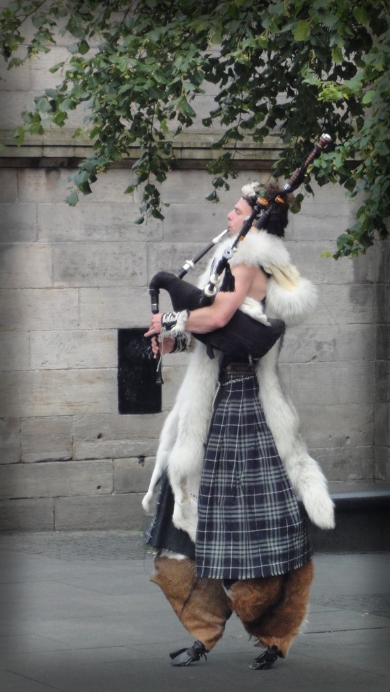
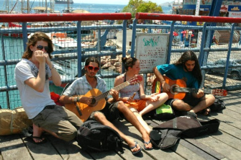
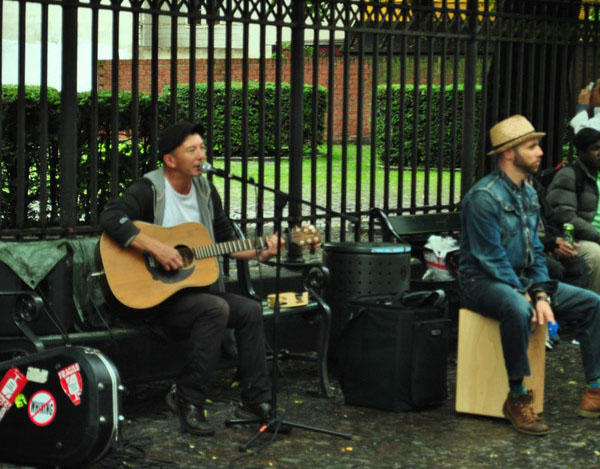

# ＜摇光＞音乐家与乞者

**音乐家：暴雨瀑布般的浇下，淋湿了他赤裸的手臂和皮毛围巾，他却泰然自若。周围都是匆忙避雨的人群纷乱的脚步，这时候卖艺肯定不会赚钱，而这位潘神却依然为这座城市吹奏一支风笛与暴雨的协奏曲。** **乞者：有的人甩开她的手，嫌恶的躲开，有的人被她缠不住，赶紧给点零钱打发，有的人看中了她那句好人工作顺利步步高升于是想跟她买点人品。**  

# 音乐家与乞者

##  文/莫婷（厦门大学）

 

存在于我想象王国中的欧洲某城市，最美的风景莫过于一位孤独的街头艺人，背靠着古老的哥特教堂，或雄壮的市政厅，或废弃的石门残垣，或低头沉思的青铜雕塑，在湛蓝或阴霾的天空下，双目微闭地沉浸在自己正在演奏的或悲凄或欢快的旋律中，仿佛向自己讲诉自己的故事，周遭来往的人群，纷飞的白鸽，面前乐器箱里零散的硬币，都与他无关。音符在城市的空气中飞舞。

第一次亲眼见到这幅幻想已久的场景，是在冬季的剑桥。白雪皑皑的三一学院笼罩在一片寂静冷清中，游人寥寥。冷风吹痛了我的眼睛我只想快步走，突然一个角落传来了竖笛声，像有魔力的磁石一般停住了我的脚步，竟然是张韶涵的《寓言》（此曲本身是英国民谣，而不是张韶涵流行到英国去了）。悠长哀怨的笛声在学院上空萦绕流转，为剑桥平添了一丝奇幻色彩。吹笛者是一位面容恬淡的老人，安然站在刺骨寒风中，他的面前只有一块小小的方布，只有零星的面值不过几十便士的硬币散落在布上。

后来去了苏格兰，在一个叫做fort william的高地小镇上，我又看到了一位卖艺者。同样也是寂静冷清的小镇，这位蓄着蓬松长发的年轻人抱着吉他，唱着古老的苏格兰民谣。这是一首旋律欢快的歌谣，只是在这个茫茫高地环绕着的孤独小镇上，欢快的音符竟然有一种鹰一般的苍凉。或许这是因为苏格兰民谣深入骨头的落寞伤怀之美吧。

爱丁堡是一座魔幻城市，黑色的魔笼罩着整座城，苏格兰历史的血雨腥风仿佛凝结在这片黑色的沉默中。一排排阴沉宏大的古老建筑和雕塑仿佛神祗的黑翼，悲天悯人地守护着这座城，庄严肃穆。纵然是英国的大都市，人流如织，这个城市却无法摆脱苏格兰特有的那种苍茫冷峻的气质。在那里，我见到了吹风笛的牧神潘。他身着苏格兰的传统格子服装，双眼紧闭地吹奏苏格兰民谣。7月的爱丁堡依然阴冷，他光着胳膊，脖子上围着厚厚的皮毛，在他的苏格兰格子裙下，竟然是一双牧神潘的山羊腿。我被他这身奇特的打扮吸引了，远远注视他随着风笛的节拍用牧神潘的脚轻轻跳跃摇摆着。我不想打扰这位灵魂的舞者，于是远远地给他拍了一张效果并不好的照片。在他这身潘神的装扮下，我不由猜测，他是不是腿有残疾呢，或许他并不想把自己的苦难暴露在众目睽睽之下换取怜悯，还不如扮成音乐与诗歌之神，给人们带来美与快乐。当然也许是我多想了，他也许仅仅是一位健康的艺术家。正在想着，突然，爱丁堡上空的乌云裹挟着雷电君临这座城市，暴雨骤然降下，驱散着溃败军队般的人群。我也害怕地在闪电雷鸣中逃向附近一个商场避雨。然而，耳边的风笛声却没有被暴雨和雷电冲断。我回头望去，那位潘神，仍然矗立在原处，和着暴雨的节拍吹奏着一首急促激昂的乐曲，洪亮的乐声穿透了雨帘。暴雨瀑布般的浇下，淋湿了他赤裸的手臂和皮毛围巾，他却泰然自若。周围都是匆忙避雨的人群纷乱的脚步，这时候卖艺肯定不会赚钱，而这位潘神却依然为这座城市吹奏一支风笛与暴雨的协奏曲。除了他的音乐他的灵魂，仿佛一切都与他无关。而他的音乐他的灵魂，幻化成了这座城市的节拍。我犹豫了片刻，还是决定冲进雨中，悄悄地在他面前的铁盒子里放入一枚硬币。这绝不是怜悯和施舍，而是感激。

对卖艺者的尊重和感激，是我从中学养成的惯例，只要他打动了我的心灵。那时，一位盲人老爷爷时常坐在中学门前的一棵大树下，吹奏口琴。他吹得也许并不专业，音符和大街上的车水马龙一样纷乱嘈杂，但是他却非常卖力地吹奏着，蹙着的眉宇下是一双什么都看不见的灰白的眼睛，却显得极其认真。我和熊猫走过时，会悄悄给他一元钱，老人什么都没有觉察，继续卖力地吹奏着也许并不着调的口琴。

回国后，地铁里的广播里有一句“共同抵制乞讨卖艺等行为”。显然我有时候是不太愿意拥护这项政策的。我总觉得一座城市的灵魂，有一部分是存在于卖艺者的乐声中的。有一次，地铁车厢的那头传来一阵凄婉美丽的歌声。那是一首我从未听过的歌，诉说着爱情。接着，慢慢走近一位满面沧桑怀抱吉他的年轻人，旁若无人地唱着歌，这首歌也许是他自己谱写的诉说他自己的故事吧。

我觉得不能把卖艺者与乞者混为一谈，虽然国内的卖艺者在你购买他的服务后会停下来说声谢谢。英国的街头艺人是不说谢谢的，甚至不多看我一眼，不论是剑桥的那个长笛演奏者，fort william的歌者，还是爱丁堡的潘神。他们并没有向我乞讨什么，他们是在为这个世界带来了美好，而我恰巧经过，与他们共同分享了这份美好。

在北京地铁的经历，并不是都那么美好愉快。不知道为什么，当10号线经过三元桥时，就会有一对老夫妻“谢谢，行行好，可怜可怜我们，好人有好报”的声音传来。有一次，地铁很挤，我被挤在中间很费力的抓着扶手，突然，被很粗暴的推搡，我回头一看，原来是那对孜孜不倦的老夫妻，在今天人很挤的地铁里，仍然锲而不舍地拨开人群进行乞讨。后来我就再也不愿站在车厢中间了，宁可找个小角落站着。前两天地铁不是很挤，但是我仍然站着，突然感到有人很用力的捅了我一下，我转身一看，是一个中年妇女侏儒症患者，她正在用她残缺扭曲的手，挨个地拽着乘客讨钱，嘴里照例不停的说着“行行好，好人有好报，好人工作顺利步步高升”。有的人甩开她的手，嫌恶的躲开，有的人被她缠不住，赶紧给点零钱打发，有的人看中了她那句好人工作顺利步步高升于是想跟她买点人品。当然，她收好钱后照例说“好人好报工作顺利步步高升”，然后就奔向下一个人。然而，我却为她口中的谢谢和祝福感到很害怕，因为这么美好的话语，却从一个很职业的不夹杂任何情感的口中说出。美好的祝福语没有来自真心，而是用来降低自己人格向他人屈尊俯就讨点小钱，这是怎样的一副弃绝美好情感的冷漠心肠才能说出的话做出的事，让我感到心里一阵发冷。刚来到北京和猫叔一起去西单大悦城，一下子就看到天桥下一个年轻人跪着，前面铺着一张写着什么的纸，旁边一个老人就盖着床单直挺挺地躺在烈日下。后来我们经过天桥，又看到同样的景象，但是不知道是不是同一个人。

我不太了解乞者背后，到底是怎样一个超越我想象力的错综复杂。曾经看过《贫民窟的百万富翁》，心里很是五味杂陈。但是，不管他们有多么苦难，不管他们是真的苦难还是假的，我对这个行业感到很害怕。他们在向这个世界输出丑陋，不管是在外观审美上还是内在价值上，或者说，他们利用了这个世界的丑陋，为自己谋利。他们的职业要求他们拼命把自己最丑陋的一面展现出来，用或真实或捏造的血淋淋的脓疮降低自己的人格，以换取他人居高临下的施舍。如果施舍者正中下怀，竟然为这种他人为自己自我轻贱的姿态感到习以为常，甚至找到了一种心理满足感，那么我只能感到非常悲哀了。那是得多么扭曲的心灵，才能共同上演这一出闹剧啊。有一种“中国式尊严”最近越来越让我感到厌恶。也许爱国者们看到了会不高兴，会辩称外国也有，但是这种现象我在外国没见过，而在中国却很普遍，感到比较有中国特色，姑且冠之“中国”二字，并非恶意诋毁。这种尊严建立在对他人随意贬低轻贱的可能性上，并且为付诸这种行动而感到倍有面子。比如在餐厅中，可以大摇大摆走进去，鼻孔朝天大喊“小妹点菜！小妹敬酒！”，看着小妹揣着惶恐的心脸上还要挤出乖巧驯服的笑容，心里感到极大的满足，若是小妹不小心倒酒洒了，还可以板着脸吼一句让自己爽一下。这种人的做人逻辑，就是把人与人的关系归类于S（sadist）和M（masochist），当他们面对他们认为是“低他一等”的人时，他就是S，当他们面对他们认为是“高于”自己的人时，他就自动转换成M。在他们眼中，人只分S和M两种。我想起以前看过的一些古装片，面对比自己权位高的人，臣民奴才总要撅起屁股匍匐在地，嘴啃泥一般地磕头，嘴里还要叨念着驯服的话语，若是那些人让他们自己“掌嘴”或者干脆扒下自己裤子打一顿屁股，他们不管心里怎样想嘴里仍然要“谢主隆恩圣上英明”，并作出一副心甘情愿感恩戴德的样子。当然，他们面对自己的奴才时，也会享受奴才匍匐在地对他们又恨又怕地喊出“谢恩英明”的那一刻。在这种SM关系中，没有原则没有尊严，只要S要求的，不管再荒唐离谱没道理，M必须心甘情愿去做并且作出幸福状。依稀记得小时候看小皇帝溥仪的电视剧，有一段演的是小屁孩皇帝让一位老臣吃屎，老头子大臣竟然就真的吃了。在这种SM的社会中，也许人们心中隐隐都会想成为能够有权让别人吃屎的S吧，并且随时愿意向自己的S无限谄媚以求自保或者谋利。那些展示自己血淋淋伤疤贬损自己尊严哀求别人“行行好”的乞者们，或多后少满足了人们潜在的SM心理吧，SM的社会催生了自贬尊严者，而自贬尊严者又固化了SM社会的这种逻辑。

从乞者讲到了SM，似乎有些扯远了。我喜欢街头的音乐家们，他们用自己的歌声，琴声，灵魂，骄傲，为这个世界带来了美和尊严。

 

（采编：张韧刚；责编：黄理罡）

 
