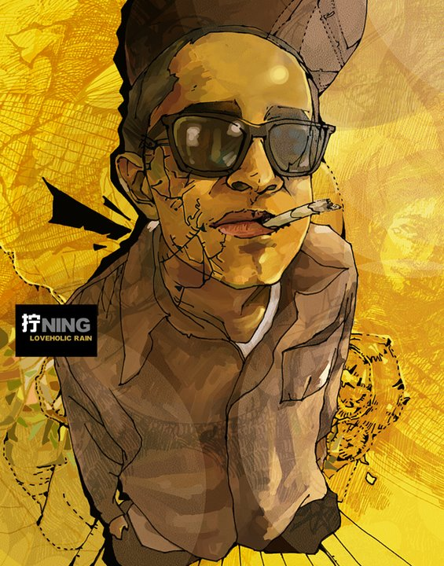
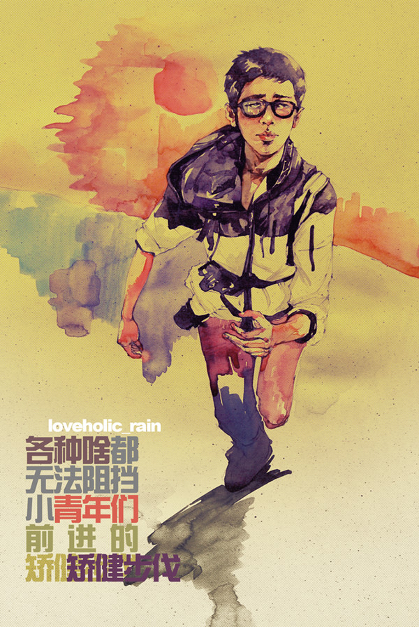

# ＜摇光＞飞扬张狂啊，你的名字叫年轻

**管那么多十年以后呢！以后的事情以后再说！今天，年轻的我们，就是张扬跋扈，就是敢做敢当，就是不计后果！** ** 我们的轻狂，不代表我们不遵守社会道德，不代表我们不维护公平正义，甚至不代表我们不是君子温文尔雅。我们只是满怀激情地追逐理想，为之不顾一切。** ** 沉郁如少陵，都有“性豪业嗜酒，嫉恶怀刚肠”“饮酣视八极，俗物都茫茫”的放荡；浪漫如谪仙，怎无“三杯吐然诺，五岳倒为轻”“十步杀一人，千里不留行”的豪情！**  

# 飞扬张狂啊，你的名字叫年轻

## 文/终南俗人（清华大学）

 

（图/[宋昀](http://www.renren.com/247288481)）

寒假回家，听长辈唠叨最多的，是申请的事情。长辈们坚持要我将全部八所学校的历史背景、地理位置、就业情况、课程安排等所有信息细细地看。 

我在学车，母亲总是放心不下。甚至我已经考完桩考，上路开了八十多里，她仍心有戚戚，强烈反对我在没有教练的陪同下开车。 

和大人们谈起想退党，他们既反对，又有保留。反对的原因是，退党对我将来回国发展没有好处。保留的原因是，党员在申请出国时据说会受到歧视。 

我很理解大人们。他们是从旧时代出来的，对于那时候说错一句话，就可能被抄家的恐怖记忆犹新，所以对做错事有近乎于本能的抵触。于是他们做事习惯于考虑方方面面，力求万无一失、滴水不漏。这是他们的成长环境在他们身上烙下的印记。 

然而，作为年轻人的我们，非战战兢兢、如履薄冰不可么？我们非谨言慎行不可么？我们非绞尽脑汁寻找最优不可么？我们非时时刻刻考虑事情后果不可么？ 

这会让我觉得很烦。我讨厌瞻前顾后。做事情何必犹豫太多？认准了的事，喜欢的事，自己觉得正确的事，干干脆脆去做，做得轰轰烈烈，有什么后果自己一并承担就是了。 

骆宾王的檄文洋洋洒洒，文质俱佳，我却嫌“凡诸爵赏，同指山河。若其眷恋穷城，徘徊歧路，坐昧先几之兆，必遗后至之诛”太不自信，竟要威胁恐吓一帮人垫背，犹豫顾虑、眷恋徘徊的反倒是他。如此拖泥带水，哪比得上成吉思汗对花剌子模的战术，铿锵六字：“你要战，便作战！”豪气千丈，何惧一征万里，埋骨他乡？书生和武士的气场与处事迥异如此，两人的结局大概是早就暗设好的。 

这本来就是个二元对立的世界，阴阳互补，祸福相倚，吉凶同域。确不要顾虑太多，忧患太多。 

清华人往往给人严谨、踏实、勤奋的感觉。在清华我遇到太多人，他/她们对自己的未来有一个清晰的规划，并从入学开始就为了他/她们的目标，按照预设好的道路前进。他/她们总是有条不紊，从来不打没把握之仗。学术，社工，感情，在他/她们眼中都是一场场竞赛，他/她们做足充分的准备，计算每种策略的成功概率，关键时刻选择其中最佳果断出手，总能得到很好的结果，并以此为最大光荣。这一方面说明他/她们可靠，将来能担大任。但是另一方面，也说明他/她们缺乏激情，少有年轻人的冲动。 

就我而言，我实不喜欢这种井井有条，这也是暮气沉沉呀！如果这个世界总是按部就班，在开头就能猜到结尾，那还有什么意思呢？ 

意外，是世界上最动人的东西。 

那可能是雨巷中一场美丽的邂逅，可能是情人节一份奇妙的惊喜，也可能是车窗外一帧漂亮的风景，还可能是邮箱中一纸久盼的信笺。 

意外促使我们去渴望，去探索，去发现。生活的激情，往往不是来自精密的计算、复杂的运作。带给我们快乐的，可能就是偶尔看到的一幅温馨画面那么简单。 

更何况，我们还年轻，我们没有经历太多磨难，我们对这个世界还有纯洁的假想。 

我们相信爱情的存在，所以愿意为了爱人不顾一切，一起去远方，去流浪。每次我看飞儿《我们的爱》的MV，总是非常感动。 

我们坚信友情的长远，所以毕业时，我们一醉酩酊。有人长歌当哭，有人嚎啕泣涕；有人借酒浇愁，有人酒后吐言。 

我们不在乎前途多舛，所以不畏惧霸权。我们敢在会上说真话，直视领导不满的目光。我们敢在网上揭露真相，何惮谈话喝茶？ 

我们什么都不怕。我们喝过酒，打过架，爱过女孩，顶撞过老师。我们敢在路上拦住横行的汽车大喊：“好好开车！”我们敢瞪着老板拍桌：“你真是个混蛋！” 

一切的一切，都因为我们还年轻。我们不怕做错事，我们会改。 

也许十年后，我们混熟了社会，开始在办公室低调内敛，帮主任端茶倒水；也许十年后，我们在生意伙伴的屁话前满脸堆笑，说“合作愉快”；也许十年后，我们看着新闻联播连声赞叹“共产党好”；也许十年后，我们缩衣节食，算计着买下三环里的复合套房。 

管那么多十年以后呢！以后的事情以后再说！今天，年轻的我们，就是张扬跋扈，就是敢做敢当，就是不计后果！ 

我们的轻狂，不代表我们不遵守社会道德，不代表我们不维护公平正义，甚至不代表我们不是君子温文尔雅。我们只是满怀激情地追逐理想，为之不顾一切。 

沉郁如少陵，都有“性豪业嗜酒，嫉恶怀刚肠”“饮酣视八极，俗物都茫茫”的放荡；浪漫如谪仙，怎无“三杯吐然诺，五岳倒为轻”“十步杀一人，千里不留行”的豪情！ 

我们还年少，我们不会畏首畏尾，我们输得起。 

我们还年少，我们有一说一，我们不要圆滑世故。 

我们还年少，操蛋的世界啊，且让我们再轻狂几年！ 

（图/[宋昀](http://www.renren.com/247288481)）

 

（采编：麦静；责编：麦静）

 
