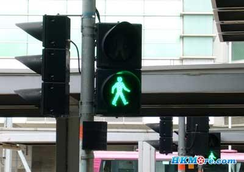
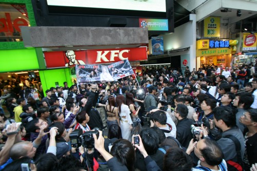

# ＜摇光＞香港散议

**但我相信任何社会都存在各式问题，贫富差距、资本霸权、金权结合等，香港的房价、人均居住空间、移民权利同样成为绕不过去的现实。但是宽容，应该是自由社会的本质特征。宽容，既包括一种自生自发的秩序形成，也包括激进的制度变更的可能性，因为谁都不能确信未来将指引人类走向何处。** 

# 香港散议

## 文/后玉婷（武汉大学）

 

初次香港印象由于接触的是廉政公署、申诉专员公署、法律援助署、平等机会委员会、个人资料私隐专员公署、律师事务所和各式各样的民间团体，因此充满了宏大词汇的体认：法治、秩序、自由、廉洁；百年的法律传统、自律的职业伦理、结社自由的公民社会。这一次我只是一个看望朋友的游客，行进的是简单自主的客居生活。

一大早出门就看见参加区级议员选举的林怀柔博士与其两位助手在街头派发宣传单，原来是前日里八号风球刮倒了路边的树，他迅速报警处理。对于动则以上百亿GDP为政绩考核标准的大陆人来说，报警这样的小事似乎不值一提。然而从社区的意义上来看，无论是地理意义或人群划分的社区，都是因为某些共同利益和兴趣连结而成，理论上他们熟悉自己的社区，有着不同一般的归属感，积极参与社区事务，通过自治以令它有所改变。社区事务既小且大，天气预警已经有很多渠道和责任主体，而一树悬而未落的枝干，虽不起眼却可能伤及无辜。走在街上听着宣讲的广播，护栏低处放置着喇叭，重复播放着参选者对外佣居港权判决的忧虑。据知，部分香港市民清晰表达过对外佣拥有永久性居留权的立场，无论是出于自我利益的考量，还是以期获得更多选民的支持，这一系列的公关行为不断地强化表明他对民意的把握。反观大陆，十八岁以上的所谓选民如同一对感情深厚的情侣之外暗恋的第三者，始终在爱情之外纠结反复而不得入。听友人说，就连某些地铁附近“唰一下”即可坐地铁优惠的福利都是议会与港铁斗争博弈所得。或许在一个成熟的社会，政府只能关心这些鸡毛蒜皮的日常小事。

时值周末，很多公共场合成为菲佣集会的地点。他们三五成伙七八一群，在汇丰大楼的一楼大厅，在散落的小公园，在较为宽阔的桥面，用硬质纸盒将自己的小群体围起来，随意聊谈，分享食物。工作之外若寻不得栖身之所的生活是没有尊严的。但是庆幸，在他们争取更好生活的过程中，城市给了她们缓冲的机会。我并不热衷于购物，对香港的商业文化缺少直观的体验。但我相信任何社会都存在各式问题，贫富差距、资本霸权、金权结合等，香港的房价、人均居住空间、移民权利同样成为绕不过去的现实。但是宽容，应该是自由社会的本质特征。宽容，既包括一种自生自发的秩序形成，也包括激进的制度变更的可能性，因为谁都不能确信未来将指引人类走向何处。

在南丫岛，羡慕一位女孩的独居生活。她租住在海边的小楼，起床即可看到碧海蓝天、沙滩绿山。她平淡地说起家里长期养着的壁虎，时常防止蛇、蚊子、蟑螂的拜访。酒间，果真有一只壁虎挂在墙上，一动也不动，安静地听着我们的谈话，屋外不时传来蛙声仿佛自然的应答。在佛学班研习，听佛经音乐，虽不能达致物我两忘、神游情动，至少可以忘记中环的繁华喧闹，电脑前的潦苦作业。在香港这样寸土寸金的地方，能得如海景房，该是何等的幸事。我不敢问她，一个人居住在这里，会不会感觉到城市以另外一种方式存在着她的世界之外，更何况她今后的职业规划是成为freelancer。本来想了解更多艺术NGO的工作，公益形式的多样化等问题，无奈前段时间的拜访工作耗费了大量脑力和体力，觉得脑子都塞满了浆糊，反应比较迟钝，疏于对谈，只能冷眼旁观。但是这样自给自足的独居生活却不小心在内心翻起了波澜，让我不断构想设计自己可能的方式。 凉风袭来，乘坐狭窄的叮铛车穿越各个街道，我喜欢这种将速度放慢的方式，竞争激烈的商海大厦中，能够留存这般不紧不快的交通工具，对游客是眷顾，对港人恐怕也是珍贵城市记忆。沿着海边，从中环码头走至最西端，一路赤脚，任风浪打湿，蔓延的灯光和海景，即使没有以电子数据的形式保留，也会成为铭心刻骨的明信片。香港很挤、很窄、很贵，却以独特的制度优势和城市韵味吸引对岸骚动的旅客。

 

（采编：应鹏华；责编：黄理罡）

 
