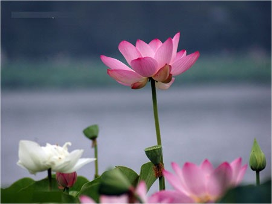
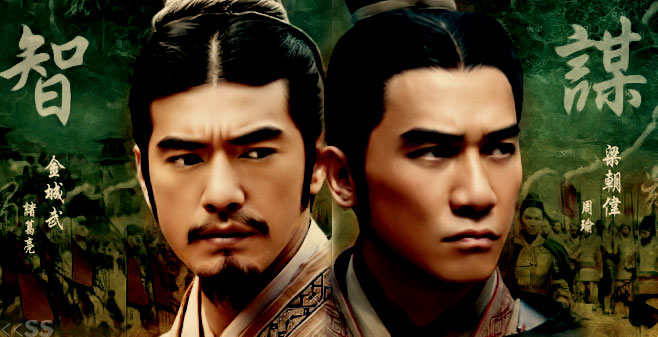
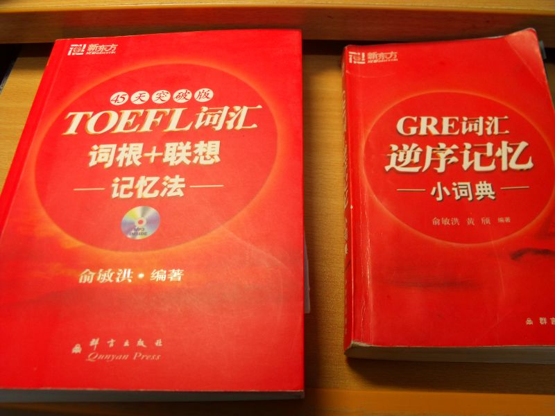

# ＜清华百年校庆特稿＞中国知识人解不开的羁绊——献给清华大学建校一百周年

**中国的知识分子都左的时候，她也跟着左转。中国万马齐喑的时候，她也跟着谈起《东方红》的观后感。中国卷入“文革”疾风暴雨里时，作为“梁效“之一的她也热热闹闹。中国开始出国潮和经商潮的时候，经管的EDP项目就沾满铜锈味道。** ibeidou.org ibeidou.org

# 中国知识人解不开的羁绊

# ——献给清华大学建校一百周年

ibeidou.org

## 文/元淦恭（中国人民大学）

ibeidou.org ibeidou.org 再过几天，恰逢2011年复活节的那日，清华大学，将会迎来一场空前的校庆。 她的校友中，有现任的正副领导人、以及立法机构负责人，她将获得在人民大会堂万人大礼堂举办百年校庆典礼的殊荣。 一百年前，上帝送这片东方土地两个礼物。亚洲的第一个民主共和国、一所用“庚子赔款”兴办的清华学堂。 一百年后， 当年450亩的校园，扩大到6000亩。当年的留美预备学校，却依然是美国PHD的最大海外来源学校。 一百年，清华在变。一百年，清华不变。 ibeidou.org **红白校园** 虽然不是一个清华人，可我敢说，我几乎走遍了清华。 我走过校园的红区，那些红墙包裹的建筑，恰似万里之外大洋彼岸大学的样子。每一个角落里，有美国人留下的痕迹和那段中美友谊的见证。每一栋建筑里，默默记述从满清、到北洋、再到国民政府，一路风风雨雨走过的坚毅。 我知道这一片地方，其实早被改变过模样。 譬如那被清华人成为“西操”的地方，体育馆曾经有一个名字，那是以美国总统西奥多.罗斯福命名的。那些被铲平的字和浮雕，仿佛那个时代，渐行渐远，在今日的清华人中，已是渐渐模糊。 胡锦涛今天从二校门走过。我脑中挥之不去的，却是四十五年前的画面。那一年，清华的红卫兵将二校门摧毁，而那时，他也还在清华吧。不知道曾经见证过那段疯狂时代的领导人，对于避免那个时代的悲剧，是不是真的有过反思。 我走过校园的白区，那是1949年之后的建筑群。 如果说红区充满了“帝国主义”的气息，白区则有鲜明的“社会主义”色彩。那一栋雄伟的主楼，只要一看见你就会想起莫斯科。 后来修的房子，渐渐地不再有苏联风，新建的各院馆，尤其是人文社会科学的经管、公管、法学院、美院，都有了一股浓郁的现代气息。豪华的装修、舒适的座椅，还有一个一个的咖啡厅，阳光照在这些院落里，四季轮回里都有清新的气息。 ibeidou.org **清华梦** 每一个人都有属于自己的梦，而在这个梦想如此单调的国度，“清华梦”几乎是这个国家最多的人做过的梦之一。 有人说，中国人最大的梦想就是移民，而清华就是这个国家距离移民梦想最近的那个台阶。有人觉得，中国人最重要的追求是成为人上人，而今天清华占据了太多“人上人”的位置。 我其实从来没有想过移民，也从来不认为一个国家应该有“人上之人”。但是，我也曾有一个鲜活的清华梦，虽然我是一个文科生。 很多在清华念文科方面的朋友都是“阴错阳差”来到这个学校，而我高中的时候对清华其实已经有好感。四年前，我第一次来北京，本来去了北大，没有任何要到清华的计划，可是离开北大天色尚早，于是我便动身去了清华，和清华的初次邂逅，变成后来一直没有忘记的牵挂。 喜欢清华，可以有很多理由。 而清华梦的存在，很多时候不需理由。 ibeidou.org **谁还记得那片荷塘？** **ibeidou.org**

****

**ibeidou.org** 如果说清华校园里，亦西、亦苏，你不能忽略的是“亦中”的一面。 曾经颓圮的近春园，如今又变成繁荣茂盛的样子，天光云影里，春天的花开得正好。那是已看不出一点显赫的园子，但却因为那篇《荷塘月色》变成每个中国年轻人都有的共同记忆，一个扬州人，在北京城里，叙写成一篇温婉如江南的清雅之歌。 还有那个“水木清华”的工字厅。 后面的水池虽然不大，可是四季各有风景。上个星期又一次从那里走过，杨柳依依中，这里有这所园子的妩媚。 荷塘边，月色里，你可以循着清华那些有点幽暗的道路，行走在那些有诗和画描绘的地方。不经意间，你可以遇见石碑，纪念光荣的西南联大，纪念永远的王国维。你也可以突然邂逅了朱自清和闻一多，他们似乎在这园子里，从来不曾离去。 我突然想起了蒋南翔。那个曾经在这里搞运动的清华人，中共建政后，他有段时间恰好不在，却就在那一段时间清华经历了她历史上最重大的灾难——院系调整。他后来说，如果他当时在，他无论如何不会同意清华改造成一个工科学校。 可是，历史没有假设。 在长达数十年的时间里，这个曾拥有梁启超、王国维、陈寅恪、赵元任的学校与国学无缘。在长达数十年的时间里，曾经诞生了《荷塘月色》的土壤却和文学毫不相关。 ibeidou.org **陈岱老** 经济学原理的老师，是高鸿业的学生。 有一年，高鸿业要组织一个会，邀请陈岱孙参加。他对他这位学生说，对陈岱孙要叫“陈岱老”。陈岱孙是毛泽东时代北大经济学系的系主任，和人民大学的宋涛，地位相仿。虽然宋涛因为是研究资本论的“马克思主义经济学家”，被我的学院尊崇到无以复加的地步，我却还是更钦佩陈岱孙。 他是福建闽侯人，18岁的时候在上海考取了清华的插班生，一辈子的轨迹从此改变。 他的故事很传奇。 他20岁赴美留学，先在威斯康星，后来到了哈佛读PHD。27岁取得博士学位，遂回到清华任教。他28岁成为清华经济系肇建的系主任。29岁成为主管整个清华社会科学门类的法学院院长。 因为1952年的那一场劫难，他离开了清华。但是他在北大的时日，始终没有忘记他在最好的时光呆在的那个清华园。1979年，清华将要恢复经管专业，他成了最热心的校友。后来，他的头像立在清华大学经管学院的伟伦楼一楼，注视着那里进进出出的人们。 那里的老师有不少是他在哈佛的师弟，譬如现任的钱颖一院长、李稻葵主任。 那里的学生们，也有好多把常春藤当成自己的梦想。 当年我的经济学原理老师去请陈岱老来讲学，他正好讲到一节课的时间，一分钟没有差，不提前下课，也不拖堂，内容却也刚刚好。 所以陈岱老说过，他一辈子只做了一件事：教书。 陈岱孙一生里著述很少，他把太多宝贵的时间都用在备课上。现在知道他的人不多了，可是那个当过若干党和国家领导人导师的厉以宁，其实也只是他的学生。 ibeidou.org **他们的感情** 陈岱孙，在唐师曾笔下是情圣。 他在《一诺千金》中写道，陈岱孙二十多岁的时候，和他的好朋友周培源，爱上了同一个女孩子。这个女孩子说，此二人谁先拿到博士学位她就嫁给谁。 陈岱孙从哈佛毕业，就赶回了中国，却发现自己的心上人已经嫁作他人妇。而她的丈夫，正是周培源。 陈岱孙后来依然是周培源家的常客，周培源家的孩子都叫他“陈爸”。 如果这个故事是真的，那实在是太浪漫了。陈岱孙终其一生，居然一直没有娶，用时髦的话来说，真是“没有向这个操蛋的世界投降”。 但是，遗憾的是这个故事并没有得到许多人的证实，譬如周培源、冯友兰等家庭的后人，都没有确认过唐先生的故事版本。 不管陈岱孙是不是周培源的情敌，他终身未娶，却是个事实。 前几年，有人传清华一个著名的经济学教授娶了比他小二十多岁的女研究生，其实只是谣言。只不过，杨振宁先生迎娶了翁帆，却是个不争的事实。 有时觉得清华的男子，要不是中规中矩、年纪很大都没有破处，结婚后也往往恩恩爱爱长长久久。要不就是风流得很，有过极为丰富的感情经历。陈岱孙和杨振宁，便是这二者的代表吧。 前一段时间有一篇文章传得特别火，名字叫《而我现在才知道他》，讲的是叶企孙。叶企孙和陈岱孙一样，也是终身未娶的清华人。 一个是科学家，一个是经济学家，他们都是清华历史上最重要的灵魂性人物。 ibeidou.org **瑜亮情结** **ibeidou.org**

****

**ibeidou.org** 清华永远和旁边的学校有瑜亮情结。 过去，是教会大学燕京大学；现在，是中国“最高学府”——北京大学。 其实，因为1952年的疾风骤雨，清华和北大，已经开始“水乳交融”。 许多清华人，变成了北大人，甚至还有人到了人大。其中有名的太多了，譬如说被誉为“国宝”的季羡林。 所以，在1949年以后谈大学的精神和气质，和1949年之前也大相径庭。因为各个学校的精气神早就不纯粹了。 民国的年代，北大和清华同为国立大学，却一个在城里，一个在郊外。而现在，北大和清华终于面对面了。 它们好像永远在争夺“中国第一名校”的殊荣，可是这样的争拗原本没什么太大的意义。它们都集合了中国最多最丰富的资源，是这个国家倾尽一切力量，要挹注在它们身上去成就“世界一流大学”的宏伟目标。 其实，她们曾经都是“世界一流大学”。 我之所以得出这样的判断，是因为“大清天下北大荒”的历史，已经开始改变。毕业去甘肃这样的偏远省份去投身建设，一步一步爬升到国家领导人的高位，原本是清华工科学生的轨迹，如今也有好多北大毕业生走上这条路。共青团中央第一书记的特殊地位，过去清华人比较多，九十年代以后也不复当年气象。 张舒迟曾说过：“你以为考上了北大，蔡元培就灵魂附体了吗？”，其实清华和北大的学生，现在的区别，已经不像外界想的那么大。你去清华经管和北大光华看看，这两个学校的学生，区别真的不像在脸上贴了标签。 ibeidou.org **历史的投射** 有人说，厦门大学是和厦门气质最契合的学校，北京大学是和北京气质最不契合的学校。其实我倒特别好奇，什么是“北京的气质”呢？ 其实，北京的“帝王气质”并不一定压倒她的平民风，她的首都地位也不一定就决定了政治的高压。无论如何，历史将无可争议地记载，中华民国在大陆，最自由民主的一段时间就是定都北京的北洋时代。 其实在那个时代，北大的桀骜不驯，与这座城的气质并不那么冲突。 在那段时间，清华还没有正式以一所大学的方式登上中国历史的舞台。她的主业还是与预备留美相关的东西。二十年代以后，清华逐渐有了大视野和大格局。她的历史从此开始成为波澜壮阔的史诗。 于是，在校友墙上，杰出者的名字写不完。 很多人不知道叶企孙，却一定听说过他的那些学生们。中华人民共和国的科技江山，大部都是这帮人马打下。穿越历史回望那段特殊时日，这个民族的光荣里，抹不去清华的印记。 站在大历史的尺度上，如果说北大是中国的叛逆者，那么清华，便是中国知识人，乃至中国社会的反映者。 清华这幅画，是中国的投影。 她的灰色、白色和红色分别代表中国的传统、苏联的影响和西方的精神。而她的历史，确凿反映了中国知识人和知识界的命运。 清华是中共植根最深的大学，早在1935年的时候，就成为中共指挥北平地下学生运动势力的中枢，后来成为中共最高领导成员的姚依林等人，都是那时候清华学生工作的积极参与者。 在那段时间里，清华是民主同盟的中流砥柱。她充满了左翼的进步色彩。她是国民党政权的“国立大学”，却深受共产党、民盟的多重影响。1949年的时候，她的学生站在夹道欢迎共产党入城的队伍里。 那时代里，确实有很多清华人还在坚持守着自己的一方书斋，却也有许多清华人投身社会运动。他们对于“一个政党、一个主义、一个领袖”的执拗反对，成为这个国家政治发展的动力。 回顾历史，那一段时间知识人一路在《新华日报》《解放日报》的“历史先声”指引下，一步步变左的过程，让人不胜唏嘘。 清华是被斯大林主义改造最彻底的北京名校。1952年之后，在清华植根的除了倚重工科的学科结构，还有斯大林主义的治校方式。 共产党国家，大学生都是预备役，大学于是都有“人民军队”的模式，所以这种国家的大学不同于西方大学只有院系，没有班级。不仅有班级，还有班主任、辅导员，特别是还发展出“政治辅导员”。清华大学的团组织至今仍然在北京高校中居于最为发达的行列，大量的共青团活动，承袭了从那个时代而来的传统。 而现任的最高领导人胡锦涛，也曾经担任过清华的政治辅导员。 因而，对清华而言，“政治辅导员”富有象征意义。 1957年，“反右”运动时，清华受灾已经不若北大、人大严重，可是数百人被划为右派之后，“万马齐喑”之势在清华进一步铺开。 在那二十年的时间里，清华虽然也有人有过抗争，但是清华没有像北大、人大一样产生林昭、张志新、林希翎等重要的标志性人物。显然，北大和人大产生的杂音，在那个时代相对于清华的驯服，确是这个国家的异数。 清华文科的全面取消，是在五十年代。而清华文科的逐渐恢复，则是在七十年代以后。清华文科的命运，照见中国人文社会科学的命运。虽然今天崭新的经管院、人文馆已经开张，在大时代的背景下，这些再光鲜的建筑，都回不到那个辉煌的属于资深的梁启超和青春的陈岱孙的年代。 ibeidou.org **行胜于言** 一个年轻如我的青年清华校友，写了一篇文章，批清华人“多是既得利益者”。我觉得对她当然不能施加挞伐，可是她对清华人的要求，似乎也确实严苛了些。 六十年代的清华毕业生中，有不少都做了高官吗，譬如胡锦涛、吴邦国、吴官正。他们在清华的时候，校长是蒋南翔。 蒋南翔曾经送他的学生们四个字：“听话、出活”。 我们人大的吴思师兄曾经说过，那就是他们那些人成功的原因。 他对台下的观众们说，“听话、出活”，这样的人是好人还是坏人？关键还是要看“听谁的话”。其实，清华人并非天生地世故和僵化，很多很多贴在清华身上的标签，只是这个社会的投射而已。 确实，相对于北大，清华是这个社会的主流，而不是这个社会的异端。我们知道社会进步需要“思想偏激”的人发出振聋发聩的声音，但是社会变革也离不开“行胜于言”的睿智和果决。 其实，“行胜于言”，大概是清华人百年来最经典的传承。“自强不息 厚德载物”，是清华的校训，但却不如“行胜于言”那样深入人心。即使是木讷寡言的清华人，也可以淡淡说一句“行胜于言”。 清华当然也有一些“清华的异端”，如同我们这个国度还是有一些“国家的敌人”，只不过其实清华人参与的方式，往往不会那么决绝。 谁知道压垮一个王朝的最后一根稻草是什么？ 我相信，许多清华人一直在。 ibeidou.org **一去不返** **ibeidou.org** **** **ibeidou.org** 似乎，清华已经变成了一个“留美预备学校”，她的校友已经越来越多不在国内了。 是的，惊人的统计数据，恢复高考三十年来中国内地县以上的状元中，已经有百分之四十移民了。这些人中，清华人显然占了最高的比例。 对于那些跑路的人，我其实觉得可以理解。如果这个国家的官员都在做“裸官”，这个国家的精英拥有逃离的条件又为什么要坚守？何况，其实有句话说得好，北大人是骂着这个社会准备出国，清华人是唱着颂歌准备出国。既然都是出国，在国内的时候，是颂扬，还是批判，其实对这个社会的未来影响并不大。 清华就是一个微缩的中国社会，中国怎样，她便是怎样。 中国的知识分子都左的时候，她也跟着左转。中国万马齐喑的时候，她也跟着谈起《东方红》的观后感。中国卷入“文革”疾风暴雨里时，作为“梁效“之一的她也热热闹闹。中国开始出国潮和经商潮的时候，经管的EDP项目就沾满铜锈味道。 清华人是这个社会的精英，但很多人认为他们没有精英的担当。其实，大多数时候，清华人也是习惯了，麻木了，不再挣扎了，才选择向这个操蛋的世界投降。 “你是怎样，中国便是怎样。你有光明，中国便不黑暗。” 公义之光只有照在这片土地上，公义之花只有栽在我们每个人心中，她才会在清华盛开，才会在每个清华人的生命中怒放。 ibeidou.org **复活的生命** 从更大的意义上来说，我们每个人都是清华人，我们走不出这个社会的大局面，走不出这个时代的大框架。 工科学生最被诟病的，是他们精于技术，却缺乏大战略和大视野。在这个工程师治国的年代，我们已经分明看到了他们的短视，也感受到他们的无奈。 这个社会的病，不是一两个人可以医治。作为“大清天下”的清华，同样也是这个病中的一环。 如今庚子赔款还在清华，只不过不在北京，在新竹。1949年，梅贻琦去往台湾，并且在新竹复兴了台湾的清华大学。 他毕生没有忘记他的大学理想，“大学，非大楼之谓也，大师之谓也。” 清华百年，百年清华，校园里处处都洋溢节日气氛，大楼比过去宏伟太多，可是大师呢？我们谁都不敢说。 那个曾经高扬着“独立思想 自由精神”的清华，正在等待每一个清华人去寻找。那个宏伟的“世界一流大学”目标，其实背后更需要的这群高考考分最高的天之骄子的省思。 当年的北平四大名校，两个在城外，那是清华和燕大，两个在城内，那是北大和辅仁。清华和北大是国立大学，燕大和辅仁是教会大学。 如今，燕大和辅仁消失了，只不过却都和杭州结下了不解之缘。燕大的创办者司徒雷登，最终未能得偿魂归燕园的梦想，部分骨灰安放在西子湖边。而现在浙江当局正在斥资，打算在杭州复建大陆辅仁大学。 或许是上帝注定的安排，清华的百年校庆，正好是复活节。 这是个不再有教会大学的复活节。当年国立大学、私立大学、教会大学三足鼎立的景象，告别这个国家，已经六十三年了。 多少那个时代北京的名校，中国大学、朝阳大学、中法大学，都被那些从延安来的“又红又专”学校的名校吞并，然而那个盛产地下党的清华，如今真是“历久弥新”了。 可是我们期待清华复活的生命。 我知道这不是一件可以指望的事情，因为清华的“复活”，需要这个国家从一种可怕的状态中改变过来，这一改变并不容易。 然而我们责无旁贷，我们要和清华人一起走在这条崎岖的路上。 ibeidou.org ibeidou.org

（采编：陈锴；责编：陈锴）

ibeidou.org ibeidou.org 
