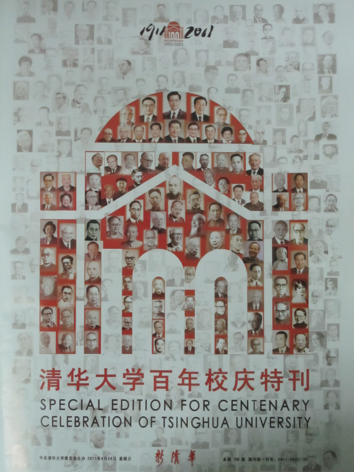

# ＜清华百年校庆特稿＞百载春秋，谁的清华？

**然而，马上就要走过一百年的清华，跟王国维他们有毛的关系吗？人头大礼堂的等级森严，领袖视察的戒备森严，早已经赤裸裸地告诉你我：这清华，归根结底是属于他们的。** ibeidou.org  ibeidou.org 

# 百载春秋，谁的清华？

ibeidou.org

## 文 / 庞自立（清华大学）

ibeidou.org ibeidou.org

七年前的这个时候，还是大一新生的我，很喜欢骑车在园子里溜达。春夏之交的清华园，总是晴朗的。绿树掩映之中，弥漫着浓烈丁香花的味道，而等待投喂的松鼠时常会窜到跟前，眨巴着眼睛盯着你攥在手中的花生……有一日，徜徉于工字厅附近，在一教北边的空地上，我第一次“发现”了王国维纪念碑，在清华这并不稀罕，校园当中随便走走就能发现有故事的风物，而那一天，真正给我震撼的，是碑后面陈寅恪先生亲撰的悼词：

ibeidou.org

“海宁王先生自沉后二年，清华研究院同人咸怀思不能自已。其弟子受先生之陶冶煦育者有年，尤思有以永其念。佥曰：宜铭之贞珉，以昭示于无竟，因以刻石之词命寅恪。数辞不获已，谨举先生之志事，以普告失下后世。其词曰：士之读书治学，盖将以脱心志于俗谛之桎梏，真理因得以发扬。思想而不自由，毋宁死耳。斯古今仁圣所同殉之精义，夫岂庸鄙之敢望。先生以一死见其独立自由之意志，非所论于一人之恩怨，一姓之兴亡。呜呼！树兹石于讲舍，系哀思而不忘。表哲人之奇节，诉真宰之茫茫。来世不可知者也，先生之著述，或有时而不章；先生之学说，或有时而可商。惟此独立之精神，自由之思想，历千万祀，与天壤而同久，共三光而永光。”

ibeidou.org

这是我第一次聆听“独立之精神，自由之思想”这一振聋发聩的论断。那时的我，初入大学的兴奋与荣耀已逐渐散去，新生的迷茫与混乱的课程才是真实的生活。而读到这番文字的下午，我由自内心感到了触动与震撼，这种源自思想的历史厚重感，远远超出那些古老建筑物的力量。我第一次意识到，大学，是一个可以让你思想自由徜徉的殿堂。

不令人意外的是，这块常年静立于大草坪一隅的石碑，并无多少人问津。对于多数清华学生来说，此地大约只有在拍毕业照时，才或可能到此一游，若问王国维何许人？回答大抵只能是“牛人”之类。至于碑上的“独立之思想、自由之精神”，则真的就只是在碑上了。

百年清华走到今天，早已不属于这群人。即便就是这块纪念碑，也一如二校门，是在“砸烂一切”的最高指示下，经过革命小将洗礼之后重新立起来的，对于现在的清华人来说，他本就是陌生的。大二时杨振斌书记做校史讲座，特别提到这个碑：这是王国维先生的纪念碑，不是什么“海宁王”，清华园里没有埋过王爷。

这几日，百年大喜将至，熙熙攘攘。王国维、陈寅恪连带梁启超和赵元任，这些早已进了校史馆的四大导师，又一次次被请了出来，在电视、报章、讲话、MTV中接连走穴，忙得不可开交。在那首名为《我要回家》的MTV里，各种温拿如书记部长、EMBA老板、明星学者等等，在一群不知姓名的龙套学生簇拥之下竞相登场之后，四大导师终于博得一个镜头，以黑白玉照迅速草草结尾。这着实意味深长到有些黑色幽默：难不成是说等有权有钱了之后，咱才可以谈文化？

在一个工科学校里，一群活跃于85年前如今已经死绝的文科学者，在平日和特殊日子受到如此殊遇，着实让人有点适应不了。四大导师如若活到今天，恐怕也如王国维遗书当中所写的“义无再辱”了。

只可惜死人不能说话，更何况连死人的儿子也都是死人，所以，辱你完全没得商量。今天看到网传的新一期《新清华》，封面令人叹为观止，在这个用人头像拼成的“大礼堂”中，新旧常委雄姿英发立于最高处，颇有“上层建筑”的意思；副国级的委员长、政协主席充当门楣，以示共同协商，肝胆相照；部级干部则竖立两侧，于是三面包围之下，是无官无衔的四大导师，孰令人受宠若惊啊也么哥。

然而，马上就要走过一百年的清华，跟王国维他们有毛的关系吗？人头大礼堂的等级森严，领袖视察的戒备森严，早已经赤裸裸地告诉你我：这清华，归根结底是属于他们的。

在大喜的日子说这些，可能让很多热爱清华的学子感到不快，然而我相信邓卫副书记所言之“爱之越深，责之越切”。细细想想，那天在校园里经过动态迷宫、层层检查、早早就位准备忘情欢呼的同学们，如今的清华，除了这些过节才请出来的四大导师牌坊、民国培养出的14位两弹一星元勋，以及一大票部级以上领导干部、亿万富翁之外，于你我而言，清华在当今这个时代，有哪些值得你去特别骄傲的呢？我们，而我们，又从这所学校学到了什么？独立之精神、自由之思想有木有？被曲解的“行胜于言”有木有？

一所大学，对待校友的态度，折射的是大学的理念。将书记部长奉为上宾，背后是对权力的崇拜；将老板经理归为杰出，背后是对金钱的谄媚。然而书记部长任期有限，老板经理可能破产，今天的座上宾，明天就有可能沦为阶下囚，在清华历史上，已经有过李嘉廷、慕绥新这样的先例。

于此，惟有将知识、文化的追求作为一个大学恒久不懈的理念，才是通往所谓世界一流大学的必由之路。这应当成为日后每一个清华学子牢记于心的理念。

而我们这一代清华人，注定如同这百年校庆一般，在未来成为历史的笑话。

ibeidou.org

ibeidou.org ibeidou.org

（采编：陈锴 责编：陈锴）

ibeidou.org ibeidou.org
