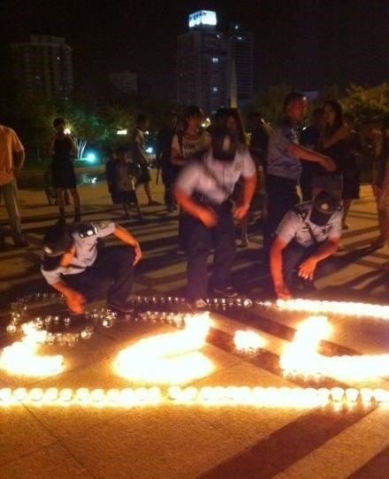
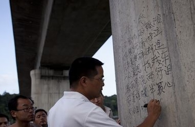
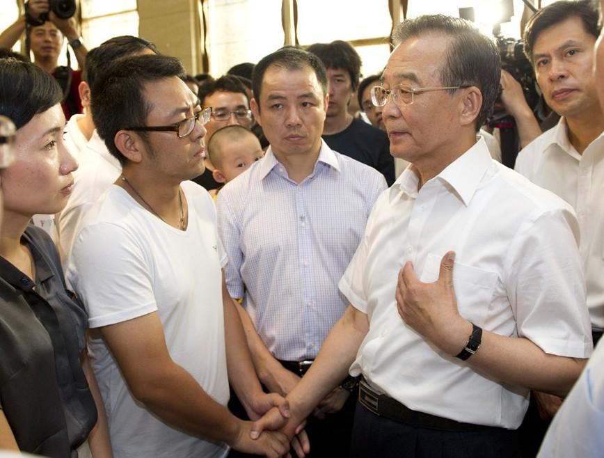
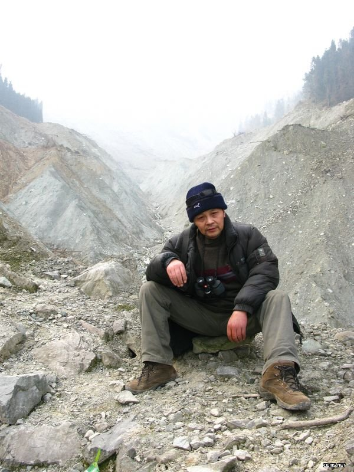
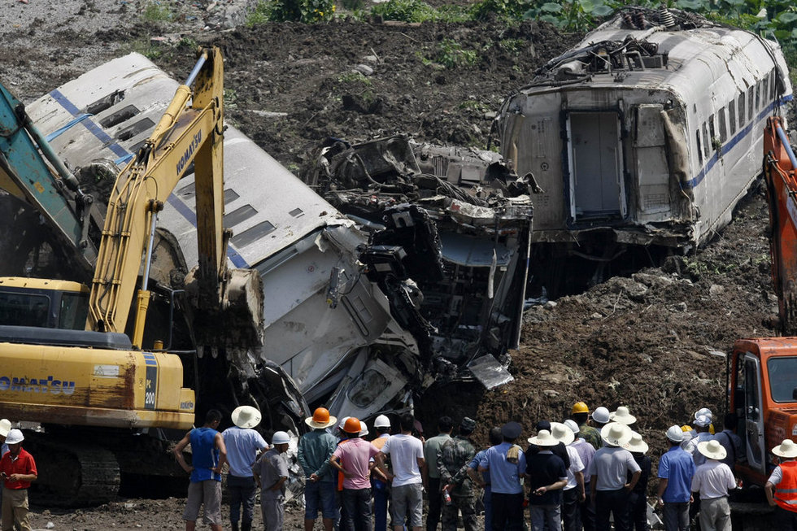
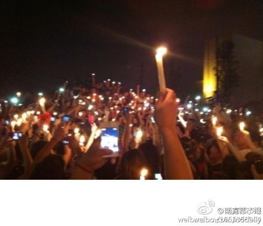

# ＜温州7·23动车事故特稿＞为了即将忘却的纪念

**从来没有一个政权，会因为一起火车事故而轰然倒塌，也不会有人，仅仅因为一个事故而否定一个政权的一切，但是我们需要真相，需要你们说实话。爱国青年们总说，在网络上对政府的批评，其危害是长久的，是在人民心中的。那么好吧，你们总将临时工当成替罪羊，当公众将这些话当做谎言，每一次，无论真假，当你们将罪过归咎于临时工时，都是将过去的一切旧事重提，都是在帮人民回忆你们过去的每一个谎言。** 

# 为了即将忘却的纪念

## 文 / 申毅（南开大学）

 

**忍看朋辈成新鬼，怒向刀丛觅小诗。**

** ——鲁迅**

#### 

#### 

####  一 多余的话

很久以来都不曾动笔了，吃过亏的人，即便嘴上说得有多无所畏惧，心里面，总是恐惧会经受第二次摧折。家中父母年迈，去年十一月的时候，他们为我的冲动而担惊受怕，看着他们眼中深深的忧虑和毫不掩饰的恐惧，我平日里那些豪言壮语总是无法说出口。我无法对两个深深爱着我的人去说什么“苟利国家生死以”，我也无法对两个经历过文革的老人去争论什么是非曲直。我只能低下头去，用沉默回应他们的沉默。 也曾经想过，假使我没有经历过这一切，现在的我也许会是一个更温和的人，也许我会走上一条完全不同的道路。去年的风波之后，我也试着做一个沉默的人。 然而，这次的事情，我无法再沉默下去，被视作国家科技进步标志的高铁一再出事，现在又发生了温州的惨剧。现在，事故路段已经通车，而死难同胞的人数依然众说纷纭，不知有多少同胞的未寒的尸体，和自主研发的动车残骸一并埋在地下，随日月星辰一同腐朽。昨日被人调侃，是否又要“放炮”。当时我无话可说，只觉所处并非人间。两日来，谎言、谣言、流言，迷乱人眼，更让我自觉世界荒诞到令人发指，我仿佛是一个外国人，站在一片陌生的土地上，但是我又清楚地知道，这片土地就是我的祖国。 雷雨大作，调度事故，动车追尾，死伤惨重，生命信号消失，紧急掩埋，生命的奇迹，这一切发生在我面前，我只感到个人的渺小。我运即国运，死者已矣，而生者依旧要在血痕中前行，生命终将继续，那些死了的人和死了却不被承认死亡的人都会被活着的人忘记，然而我还是想为他们写一些东西，对于死了的人，这些没有意义，但这也不过是我所能做的全部了。我希望有人会记得，这个夏天，中国发生了什么。为了即将忘却的纪念，即便再没人记得也罢。 

#### 二 炮灰而已

动车、高铁，中国铁路的进步有目共睹，在媒体口中，这已经不仅是交通运输的技术进步，更是国力增强的标志，是民族复兴的先声。几次往返学校，坐的也是动车，确实更舒服也更便捷。我想，那些死掉的人，也曾这么想过吧。 这两天里，许多遇难者生前最后的信息被公布，我看到那个少年兴奋地说他订到票了，他说，社会进步就是好；我看到那个父亲给自己的女儿拍照，因为这是她第一次坐动车，而现在，她躺在医院的病床上，医生说，她依然处于观察期。 我忍不住去想，我本来可能是那个人，我可能会死在碰撞之中，或是侥幸一时未死却没有成为“生命的奇迹”。最让人的感到沮丧和恐惧的是，这个国家未必就会因此而改变，将来的某一天，你、我还有我们所爱的和爱我们的人，也可能坐在一辆注定要通向死亡的列车上。你我，不过是后死者罢了。 

#### 三 嘘！

惨剧，已经让人不忍目睹，而之后的一切，更让人毛骨悚然。 事故发生了，对事故原因的猜测，对相关部门的问责本就是题中应有之意，况且近年，媒体一直在宣传动车的先进技术，如今惨剧发生，群情激奋也是正常，然而有的人却告诉我们，不要说话，不要生气，闭上嘴巴，为中国的美好未来而奋斗。不要抱怨，抱怨没有意义。 更有人说，那些质问政府的人，是别有用心的人，要么就是没有理智的脑残。 

 我不明白，要怎样没有人心的看客，才能说出这样的话。你们叫嚣着，怒斥着，成熟着，理智着，仿佛那到现在都语焉不详的事故就从未发生过一样，就仿佛你我不曾亦有可能是某次事故中让人“依旧充满信心”的牺牲品一样，就仿佛我们平日所耳闻目睹的一切都不曾发生过一样。 这是我们的祖国，这是我们所生活的土地，我们的衣食住行找不到半件可以让人放心的东西，平日含污忍垢也就罢了，怎么出了这么大的事情，还说不得了呢？死了这么多人，难道问一个是非曲直都不行了吗？你们说，这是发展的代价，为了国家的发展，这点牺牲可以容忍。韩非子说，国家有五种人，留之无用，该杀，你们的政治课本里说这是法家的残暴，是忽视了人的意义与价值。怎么，韩非子说有人该杀就未必该杀，你们说有人死了就是活该受死？你们是玉皇大帝吗？ 若是平时，忍了也就忍了，可这样的惨剧发生，看着满屏幕的“要理智”“要冷静”“要自省”，我实在无法忍下去。贼娘，你们撞了火车，还要我们自省？我们是该自省，就是我们的纵容，我们的懦弱，我们的妥协，才搞出一个尾大不掉、有恃无恐、怙恶不悛的特殊利益集团！ 更无法想象，为什么，一些出身草根的人，也要为惨剧的导演者文过饰非、粉饰太平？你也是受害者啊！难道埋在地下的，就没有一点可能是你吗？你就那么确信，你的一生，都不会为今日的纵容吞下苦果吗？难道你非要抱一具撕成两半的尸体，然后再望着天空欲哭无泪？ 有的人说，这些抨击政府的人会破坏国家的发展，会危害国家的世道人心。让我问问你们，究竟是一个只能在网上说几句良心话的大学生“危害”大，还是执掌国家重点工程却贪赃枉法的官员危害大？究竟是一个无钱无权，只有一只笔杆子的记者“危害”大，还是执掌权柄却贪污弄权的政客危害大？你们对真正的祸害不置一词，却对受害者的愤怒极尽批驳之能事，你们是真糊涂还是装糊涂？ 你们真的相信这一切吗，你们真的相信自己说的话吗？你们真的相信，那些为了这个国家奔走呼号殒身不恤死不旋踵的人，是坏人吗？我不由得想起那个站在北川中学废墟上，攥着筷子一般粗细的钢筋，咬牙痛哭的人，那个人，会是坏人吗？ 

 为了这个糟糕的国家，连他妈身家性命都不要了的人，会是坏人吗！ 你们真的相信自己说的话吗？你们真的觉得自己做的事情是对的吗？你们真的以为这些人该死吗？ 我们总用一种虚假的希望来安慰自己：恶有恶报。是的，恶有恶报，因为当恶行没有被惩罚，就不会有人胆敢称其为恶。相反，说出真相的人却会被堵住嘴巴，挖去眼睛。即便我此刻如此愤怒，我依旧不敢说出一些名字。此时此刻我才忽然明白，为什么《哈利波特》里面，人们管伏地魔叫you-know-who，我终于明白，那种即便最最悲愤之际也不敢明言的恐惧，是何等的深入骨髓。 

#### 四 生命的奇迹

随着更多的消息传来，更多令人齿冷的事实呈现在我们眼前，在宣布生命信号消失之后，又从残骸里救出一个女孩；出事车厢被迅速拆解掩埋，遇难者家属领到的，是被铲去面孔的残缺不全的尸体。新闻发言人屈尊来开发布会，宣称“至于你信不信，我反正信了”。 

 这句话是11个字，用白话文，4个字足够。 爱信不信。 是下最后通牒吗？ 这就是积极解决问题的态度了，新闻发布会的目的是为了澄清真相，获得理解，可连“我反正信了”这种话都说出来了，你说，我们理解不理解，那些人在乎吗？ 他们为什么要在乎？别人的死，死掉的是另外的生命，那些人自己不会受任何影响，甚至会财运亨通，封妻荫子，高侯万代。是啊，别人的生命，区区草民的生命，又算得了什么呢？亡者尸骨未寒，杀人者已然能逍遥法外，对着死者家属的号哭露出狰狞的冷笑。鞠躬，道歉，找来几个御用文人引导舆论，控制媒体，删除新闻，跨省抓捕那些不甘的声音，太简单了，也太容易了，简直是驾轻就熟。亡者的尸体尚未找到，家属已然不得不放弃对公道的追求，早点签协议居然还能获得几万元的“奖励”，几万元，不少了，攒一攒就能在北京买半个厕所，死了的人，就当死了吧。 不这样，又能如何？对于无根基无背景的平头百姓，尊严实在是太奢侈了点。当一些人挥金如土、贪腐弄权的时候，有一些人，一生下来就是注定要没尊严地活，没尊严地死，没尊严地不了了之的。当生命的一切需要都极度匮乏，生存环境极度恶劣的时候，一条命，是可以明码标价地出售的，哪容得那么多的讲究？ 大学生又能怎样？艺术家又能怎样？正义注定得不到伸张，命都没了，尊严又有什么用？就像《窃听风暴》里，被文化部长玩弄的女演员对他丈夫说的：你做的事情，和我有什么不同？在权力面前，我们不都是妓女吗？ 我们中国人的尊严，就这么稀有吗？我们中国人的命，就这么贱吗？ 中国人的命，从来都不是自己的，妻子是丈夫的，儿子是老子的，下属是上司的，命都是别人的了，还谈得上尊严吗？ 中国人是怕的，生命一钱不值，可最可悲的，就连这一钱不值的狗命，都有人要来夺了去。中国人怕鬼神，在我们的文化中，妖精是坏的，牛魔王，白骨精，这些是坏的，如来佛祖，观世音菩萨是好的，可再好的如来佛祖，也要把斩妖除魔的孙行者压到五行山下，天威难测啊。再好的神仙，干起坏事来也有那么多堂皇的理由，我们理解不了，只好躲得远远的，跪得低低的。于是好的也怕，坏的也怕，从阎罗殿里的小鬼到玉皇大帝，都要吃人世间的一炷香，连土地公公灶王爷这种不入流的货色，也能拿草民一把，更别说官吏了。 能说什么呢，无法可想。那个被救的小女孩，假如不是特警队长邵曳戎坚持原地清理，她恐怕也无法成就这个“生命的奇迹”。在宣布已无生命信号之后，最后又找出这样一位幸存者，我不敢做更多的猜测，因为其他每一个猜测都将是血淋淋的，王勇平说这是一个“生命的奇迹”，是的，我们每个人都是生命的奇迹，但这一切不是，这一切是人类的奇观。 

#### 五 你们是不是骗子？

事故发生之后，急急忙忙地掩埋残骸，先说是掩埋车头，而后又承认是将残骸掩埋。发言人先生说是为了运送更大的机械设备，好吧，王勇平自己也说，他听说掩埋残骸的消息，第一时间想到的是：这样的事故，是掩埋得了的吗？    从来没有一个政权，会因为一起火车事故而轰然倒塌，也不会有人，仅仅因为一个事故而否定一个政权的一切，但是我们需要真相，需要你们说实话。爱国青年们总说，在网络上对政府的批评，其危害是长久的，是在人民心中的。那么好吧，你们总将临时工当成替罪羊，当公众将这些话当做谎言，每一次，无论真假，当你们将罪过归咎于临时工时，都是将过去的一切旧事重提，都是在帮人民回忆你们过去的每一个谎言。人必自侮，然后人侮之，每一次故技重施，都是这个政府对自己的公开羞辱。也许并不是每一次都有天大的隐情，但是你们紧张，你们恐惧，而每一次你们去搞消息封锁，言论控制，都是在昭告天下，有见不得人的丑闻，你怕记者不知天高地厚，你怕他们问不该问的事情，你怕悠悠之口揭露内幕，你怕拔出萝卜带出泥。而当公众认定你们是骗子的时候，你到底是不是在说真话已经没有意义了。 在我看来，国家的治理有他唯物的一面，同时也有唯心的一面。科技进步经济发展固然必不可少，但是同样重要的是，国家政府要让人民相信你的话，活得有尊严，有希望。人民相信你，就愿意服从你的命令，遵守你的法律；人民活得有尊严，在平常的时候，就会乐于多一点谦恭礼让；人民有希望，他们就会维护你，因为维护你就是维护自己的未来。否则这个社会就会变成一个处处钻营投机、处处与权力勾肩搭背吊膀子的名利场。 人是最关键的因素，一切强大的物质力量，都需要人来操控。固国不以山溪之险，威天下不以兵革之利，因为如果失却人心，即便你拥有巨大的政治资源，也可能一夜之间满盘皆输，即便你拥有庞大的经济力量，也可能被消耗殆尽，即便你给两百万党军都武装到牙齿，这一切依旧是不可靠的。 

#### 六 可能会惹来麻烦的一些话

很多人跟我说，民主制度也是会剥削人民的——请注意他们所用的副词——美国也如何如何。说实话，我不明白，为什么在有些人眼中，一旦有人批评政府，就是一定要搞西方政治，就是要颠覆政权，这种反应总是让我对他们心中“好的政治制度”的定义深感兴趣。 我当然清楚，对于人民来说，好坏官吏之间的区别，不过是虎和狼之间的区别，人民总是要吃苦的，每一种制度下都有一些吃苦的人。但是，不能做到完美不是不去做好的理由，更不是作恶的理由。况且，难道批评政府是西方政治的专利吗？社会主义制度就不需要人民监督了吗？我们何曾自轻自贱到这个程度？ 共和国建政师从苏联，虽然苏联完蛋了，但是以苏联为代表的一党执政的现代国家，其组织结构的理论基础是确定的，就是泰勒的科学管理理论。科学管理重视的是效率，如果不能做到正确地管理社会，哪来的效率？没有严厉的监督，又怎么会正确？ 决策未必正确却又缺乏监督，治理官僚又软弱无力，这既不科学，又无管理，我不知道这个国家还如何能“和谐地”运行下去。最近我们学校有一个讲座，题目很吓人：改革与革命赛跑——论晚清政局与辛亥革命。这个讲座其实是一个房地产企业搞的商业活动，可这些商人能意识到这个题目能吸引眼球，难道不是一个可怕的象征吗？不管愿不愿意，我们都必须承认，一百年前激起大论战的问题，恐怕又要落在我们面前了。俗话说分久必合合久必分，我一直不愿意相信这个预测，但是有的时候我很困惑：这么个搞法，是不是有人一心不想让中国过这个坎儿？ 我不喜欢疾风暴雨的暴力革命，但是我们必须看到，如果当局不能积极进行改革，改善自身形象，缓和社会矛盾，重新获得人民信任，那么就会有残酷的事情发生，那么就会如同梁启超所说，“革命党者，以扑灭现政府为目的者也。而现政府者，制造革命党之一大工场也。” 我们过去在提到一些社会问题的时候，总是会说：大海是有自净能力的。是的，大海是有自净能力的，当一种方法无法解决问题的时候，历史就会选择另一种方法，这是不以人的意志为转移的。而后一种方法，是绝大多数中国人，都不愿意看到的。昨晚我看到温州世纪广场上烛光悼念的照片，我感到悲伤，我更感到恐惧，因为我想起一句话：星星之火，可以燎原。 

#### 

（采编/责编：黄理罡）

