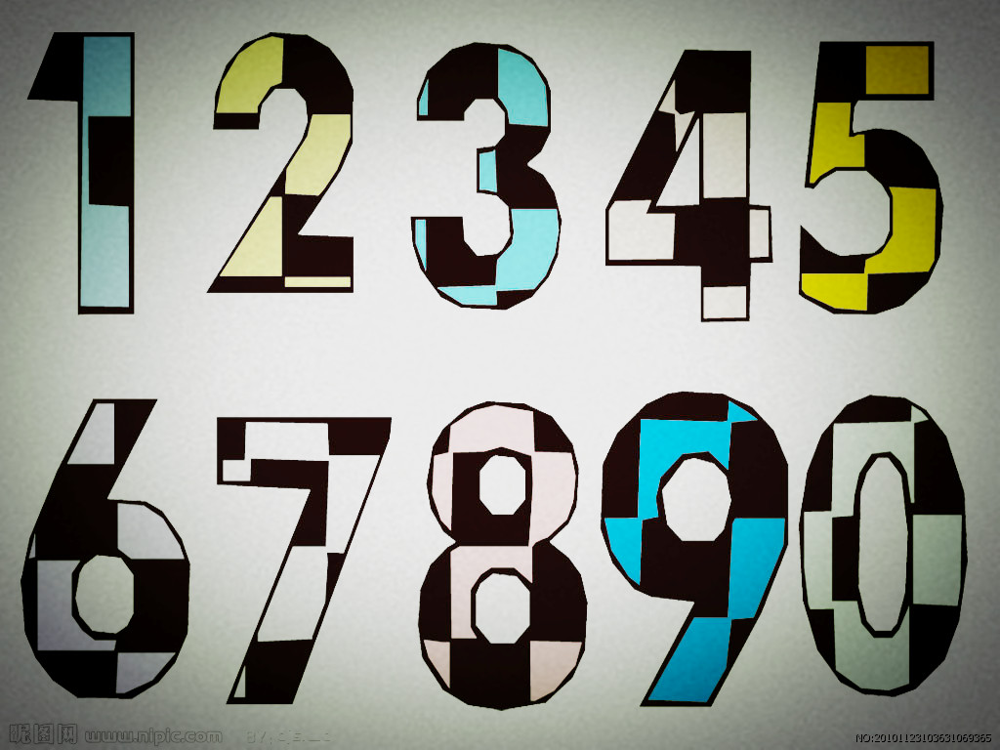
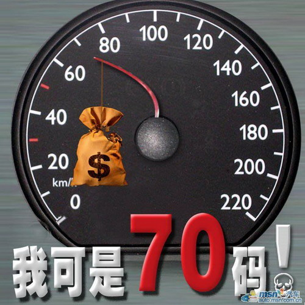

# ＜温州7·23动车事故特稿＞你不能用谎言去打败谎言

**无论是同情或者愤怒，因为发自肺腑，所以都应该是奢侈品，不应轻易地施予。这并不是要求网友凡事必查证，只是提个醒，在这个微博、扣扣的低成本传谣时代里，保持住起码的耐心。毕竟，你不能用谎言去打败谎言。**

# 你不能用谎言去打败谎言

## 文/[半辈子](http://www.douban.com/people/banbeizi)

想说几句是因为关于“35”这个被喻为中国灾难事故死亡“特定”人数的神奇数字：

“一个神奇的数字。动车相撞35人死亡，河南平顶山矿难35人死亡；重庆暴雨造成35人死亡；云南遭大雨袭击全省35人死亡。知道为什么死亡人数控制在36人以内吗？超过36人，市委书记这个级别的要撤职，所以一开始发生，就注定了死亡人数不会超过36。”

我看到时，推荐人数近千了，但是细一看，就有点吃惊，只需随手一搜，就会发现发生于2009年9月的平顶山矿难，[官方公布的死亡人数是42人](http://www.chinanews.com/gn/news/2009/09-09/1857523.shtml)；只需随便一想，就能想到鄂湘暴雨即便是问责也不至于两省合并，何况据南都报道，[2011年6月湖北湖南因暴雨灾害死亡人数分别是22人+19人共计41人](http://nf.nfdaily.cn/nfdsb/content/2011-06/11/content_25302743.htm)。这么一份传谣帖，我不想再酌条查证了，只看了下当年做过的2008年山西襄汾矿难，[官方公布的数字是56人](http://bjyouth.ynet.com/article.jsp?oid=42977103)。

作为一名不靠谱阴毛论者，我并不完全相信官方的数据，这是因为安全事故存在着大量瞒报漏报的事实，我赞成并且赞美耗时费力的质疑者们。但是在这个人人随便成为帮凶却不自知的低成本传谣时代，我更不相信网友们动辄艹人妈的指控。

前两年吴思提一个观点，说中国当下应该是个官家资本主义社会，社会主义早不是了，领导阶层工人阶级都集体下岗了，作为基础的农民阶层是彻彻底底的弱势群体。资本主义呢，也是算不上的，按照“谁说了算,谁就是主义”的旧思路来分析，在当下中国，说了算的是官家和资本，这两者多数情况下是互相配合的，利益有冲突时，则往往是官家说了算，穷人怕富人，富人怕官家，大概是这么个道理。

从阶级斗争的旧理论来看，当下中国最大的矛盾是不断扩张的官商利益和工农及知识分子权益诉求之间的斗争，阶级斗争是丢垃圾堆踩两脚的破理论，但用这种既熟悉又简单粗暴的理论分析当下出现的种种乱象，又似是而非像那么回事。

当年杭州七十码事件才出，我的一个朋友发表了一番看法，大意是从媒体的角度，这起肇事案并没有值得关注的价值，这样的交通肇事案每天都在发生，所谓的富二代，也不是一个合格的概念，八十年代以来殷实人家的二代，绝对数量很大，也没有明晰的共同性，以仇富为市场的噱头式操作，不靠谱。

后来这事情成了举国关注的一件大事，肇事者在事故后流露出的“满不在乎”激怒了民众，在争议声中，终以交通肇事罪入狱，事情就这样结束了。但今年，那位“我爸是李刚”的肇事者，又将这一切以相似的过程重演。单以李公子的事情看，是一起普通的交通肇事，道路上每天都在发生这样的悲剧，在悲剧之外，民众对官二代的仇恨甚至超过了对被害者的同情，在一片谩骂声中，对象往往是李刚之子，被害者反而颇有些道具意味，无论是央视直接无视的奇怪操作，或者是网上流传的一位“漂亮的被害者”假照片。

这种超于事情本身的愤怒和同情，背后当然不是，不只是一起交通肇事罪，而是这起交通肇事罪用一种生动但惨烈的形式演绎了官家资本主义社会下的普遍矛盾，官二代的性别、座驾、以及肇事后嚣张的态度，都使得他的身份不断地被强化，普通人的愤怒并不指向一个交通肇事罪的疑犯，而是一个始终处于强势的权力和资本那一方，“我爸是李刚”则为媒体提供最为简单有力的传播要点，以至于他能在最短的时间内，激起权益常常受到伤害的普通人的愤怒，当然了，在网络的低成本表达的习惯下，这种情绪普遍来看，真挚，但廉价，以至于“我爸是李刚”造句横扫，一个血淋淋的惨剧，居然成了网络上的娱乐活动。

微博上广泛传播的“世界上最远的距离不是生与死的距离，而是我在你面前，你却不知道我爸爸是李刚”，这么个惨案，演变成为一个闹剧。嘲讽一下、骂两句娘并未化解什么戾气，反而是任何一个悲剧都在被娱乐化。我越来越难以理解一些行为，即便是灾难，QQ群里也有“哀悼同胞”转载5个群再看看你的头像的游戏，愤怒和同情被肆意倾倒，一个事件，人人都在积极表态，让受害者再次受到伤害，并且乐此不疲。

怎么说呢，无论是同情或者愤怒，因为发自肺腑，所以都应该是奢侈品，不应轻易地施予。这并不是要求网友凡事必查证，只是提个醒，在这个微博、扣扣的低成本传谣时代里，保持住起码的耐心。毕竟，你不能用谎言去打败谎言。

而对于那位想要凑足一份35人死亡名单的造谣者，我向你推荐一个网站，能让你在十分钟内轻松制作出任意数字的死亡者，并且一定是官方认可的：[国家安全生产监督管理总局。](http://www.chinasafety.gov.cn/newpage/)

（采编：宋晓慧；责编：黄理罡）
