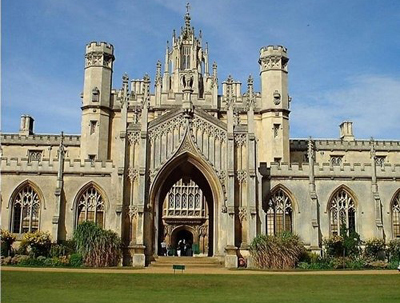
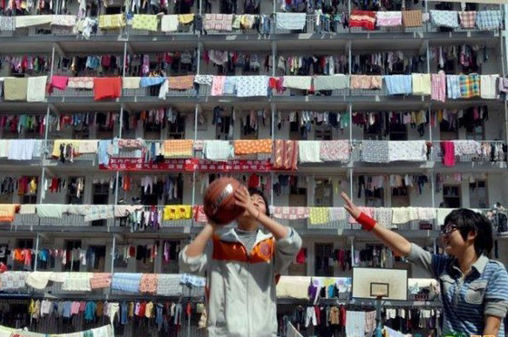
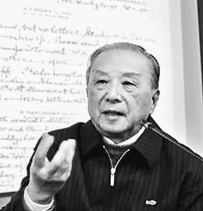

# ＜特稿·开学啦！＞我对大学教育的一些感想和思考

**这并不是我想在这篇文章中直接回答的问题，但无论如何，大学确实一边造就出爱因斯坦，一边造就出韦伯所谓的“没有灵魂的专家和没有心肝的纵欲者”；一边造就文艺复新式的人物，一边造就出新式庸众。应该承认的只是，真正成功的大学独立于社会，因为大学就其本身是为了反思和改进现存的人类社会，它略微悬浮于之上（或者我们期待它是这样），充满了有志于此的教师和学生，带着批评精神和创新精神，回应于前人的实践和当代的现实。**

 

# 我对大学教育的一些感想和思考

##  文 / 郑勉（HEC, School of management, Paris ）

 

#### 一、大学的时间

说到大学的时间，其完整的含义应该包括一个人接受高等教育的全部时限，

不过因为我刚刚完成了本科的学习，我就只谈及本科四年这段时间。

中国的大学生通常非常重视大学生活，大概是因为大学处于每个学生生活的一个重要的、甚至富有戏剧性的转折点上。

在这以前，大部分人在高中倍受压力，在从家长和老师的各种各样教导、劝说、帮助、限制，和各种各样的统考、月考、周考、测验中沉浮。在这个背景下，高中生的时间是被一件件精确到分钟的事件所占据着的，大部分人需要顺从这样的时间安排，以一种据说最有效率的方式来应对排名和升学压力。这种以高中这样的规训机构为中心的生活，实则是被动的而又充实的，一个高中生可以用一种机械的态度和姿势来度过它（对衡水中学生活状态的报道可以当作一个例子）。

在经历了高考这个转折以后，中国大学生似乎瞬间被投入了一种新的生活方式，一种全新的日常生活形态。我们对此早有期待，以前应有不少高中老师都描绘过大学轻松与放纵的生活，以此来激励过度负重的学生。夸张点说，憧憬与实现大学生活，甚至成为了每个高中生的第一堂成功学课程。

我觉得在大学里的活动可以粗略分为四大部分：学习与研究、生活与休息、社交与娱乐、工作准备。这几种活动相互也有关联。到了大学，时间不仅仅是不再需要以学习为中心，而且像高中阶段与此相关的一系列关于时间的安排、分配、被迫、制度都可以被抛诸脑后。在大学中，学校的管理和家庭的压力都几乎不能影响到学生对自己生活的时间安排。

这种改变使大学生们开始拥有一种对自己时间进行支配的近乎完全的权力。

然而对自己的时间进行支配却绝对不是一件容易的事。时间和注意力是很有限的，浪费它们却很容易。拥有了时间和注意力以后，选择有价值的活动来参与又取决于自己的目标、眼光和价值观。因此，在大学中，我们只要稍微留心观察，就能够发现各种各样支配自己生活时间的方案和模式，这些方案和模式也带来不同的结果。比如，有的人热衷于从早到晚地游戏、娱乐；有的人热衷于参与各种组织以及社交；有的人保持高中的学习和考试习惯；有的人把精力放在打工、实习、创业等职业准备上。这些类型并不容易概括，因为每个人都有着自己的侧重，无论是有意识的还是无意识的。

可以这样说，大学生几乎是时间意义上的“自由人”，大学之所以如此的重要，一方面也在于大学生所拥有的时间自由。然而自由并不会自动地产生好的结果，事实上，一个时间上的自由人可能更容易受到自己滥用自由的伤害。如果一个人的心智迟迟不能成熟，没有培育良好的行动习惯，那么他突然拥有的自由反而会让他不知所措，并且荒废时日。作为时间上的自由人，大学生应该是独立自主的，为他的每一个行动负责，即便在没有人引导的情况下，也能掌握自己的生活。

我觉得，在大学里第一件最重要的事，就是学会如何不辜负时间上的自由。这是再怎么强调也不为过的。

#### 

#### 二、大学的理想

即便到了此时此刻，谈论大学的理想仍旧让人觉得是一件力不从心的大话题。

有人说中国的大学就像一间间商业公司，一年一批的流水线服务，学生是客户付钱，大学出售课程和文凭。这个比喻道出某种中国大学的现实，让人体会到社会对大学的功能的看法。学生们好像在购买某种知识，而这种知识就像一种手艺、技术一般能给学生带来金钱的回报，由此大学是学生及其家庭社会阶层上升的机制的一环。

这样的想法绝非没有道理，实际上，法国社会学家布迪厄曾经以法国为例考察过大学与社会等级秩序的维持、传递的关系。大学提供的文凭是一种文化资本，是通常为那些源自中上层家庭的孩子提供的一种特别的凭证。这些孩子的趣味和倾向在家庭中被特别地调适好，然后再送入各类精英大学，通过各类仪式打上某种“神圣化”的烙印，使他们之后在社会等级秩序中的特权合理化。由此文化资本与经济资本乃至权力资本就结合起来。

不过，即使有布迪厄这种角度对大学教育的剖析，和大家隐约感受到的中国大学的现实，大学存在的本身，是否有其现实主义之上的理想光辉呢？

也还有不少人保持着对大学更为传统的和古典的看法。雅思贝尔斯认为大学的本质是由学者和学生组成的，致力于寻求真理的学术共同体。从雅典的学院到中世纪的神学院，从孔子的学院到现代遍布世界的综合性大学，古今中外的大学相信其处于人类社会中的特殊地位，在研究与教学中探索真理、传播真知并且推动整个社会的进步，这是大学的理想。

正是由于大学的独特理想，使大学从其它那些自相矛盾的共同体幻影中脱颖而出，成为一个真正的爱知共同体。按照柏拉图的观点，也许这样的共同体才是唯一真正的友谊，唯一真正共同的善。

这样统合的理解，也没有改变大学中各种各样的人、机构等主体对大学理解的分裂。毕竟进入大学我们首先的观感是不同的学院和学科，以及这些学科在诸如什么是最重要的问题、最可靠的方法等方面的争论。

从我个人的感受来看，归类于科学的自然科学和某些社会科学，逐步发展到完全以“真实性”为导向，秉持价值中立原则，教学研究也通常是高度专业化和技术化的；归类于人文学科和某些艺术学科的，则保持以“可能性”为导向，教学以伦理判断的研讨和审美的培育为重，通常是寻求广博与交融的。这两大门类相互冲突，在许多最根本的判断上无法达成共识，形成一些对立体：数学-语文，当代-古典，唯一-多样，细节-整全，创新-持旧。它们又相互补充，为我们的教育提供一副完整的图景，以契合人类心智追求的需要。

大学的根深蒂固的复杂性时常将其中的人置于矛盾之中。很多大学生对于大学从没抱过超越性的期求。通过大学获取更高的知识水平、技能以获取更高的收入和社会地位是无可厚非的理解。那么，在大学生受教育期间，大学是否应该按照它的理想和功效要求大学生接受原理性的、伦理性的、审美性的教育呢？尤其是，当前一种教育和后一种教育相冲突的时候？

这并不是我想在这篇文章中直接回答的问题，但无论如何，大学确实一边造就出爱因斯坦，一边造就出韦伯所谓的“没有灵魂的专家和没有心肝的纵欲者”；一边造就文艺复新式的人物，一边造就出新式庸众。应该承认的只是，真正成功的大学独立于社会，因为大学就其本身是为了反思和改进现存的人类社会，它略微悬浮于之上（或者我们期待它是这样），充满了有志于此的教师和学生，带着批评精神和创新精神，回应于前人的实践和当代的现实。

应该承认，在大学的理想中的个体，老师和学生是排斥随波逐流和平庸的，他们甚至是排斥平等的。大学之内应该追求的是个人的，继而是整体的卓越，大学正是系统性地推动这种教育追求的机构和机制（实验室、庙宇和竞技场）。通过点燃不同人的天赋，大学帮助我们积累观念与手段的进步，为社会创造出新的美好观念和事物。

不过，正如对待一切追求一样，只有当我们能恰当地考虑这种追求的现实的时候，我们才能更好地实现它的理想。

美好而崇高的理念并不是没有代价的，至少你不能要求每种给你带来愉悦或真实的知识，能同样给你带来大把的金钱。一种良好的审慎是有益的。

#### 三、老师们的老师

在我个人很喜欢的一篇列奥·斯特劳斯论述自由教育（通识教育）的文章中，他谈到了通往文化的自由教育其实是对心灵的培育。他提出，培育方法是研读所谓“最伟大心灵们”留下的堪称杰作的书籍。而之所以要这样做的原因是心灵需要老师，但绝大部分老师们也是学生，因此最终要寻找的是一些不再作为学生的老师。这些不再是学生的老师是那些最伟大的心灵。我们应该在阅读中，倾听这些伟大心灵的交谈。

这样的叙述曾经长久地给我带来一种对高等教育所能拥有的传承品质的意象的迷恋。正如同斯特劳斯的学生阿兰·布鲁姆在述及他年轻时第一次看到芝加哥大学的仿哥特式建筑时所产生的那种致力于崇高的感觉。他说，它们指向于一条通往伟人相聚之地的学习之路。你在那里能看到一些自己周围不太可能见到到楷模，没有他们，你既不能认识自己的能力，也不会明白作为人类的一员是多么奇妙。

然而，若按照斯特劳斯的观点，理想的自由教育变成了一种“文学”的教育，即在书写之中和通过书写进行的教育，因为我们只能以这样的方式去接近那些过去的伟大心灵。而现在的我们却明白，这样的教育可能并未能填满教育的核心目标，也不能满足大学理想所需索的教育资源。

是的，正如斯特劳斯也承认的观点，所谓的最伟大的心灵们在最重要的问题上彼此之间相互矛盾，他们就迫使我们在他们的独白中做出裁决，然而我们却并不胜任这样的裁决。这样的裁决预设了我们比斯特劳斯文中“最伟大的心灵”还要高的智识地位。

我们不能不注意到，康德这位伟大心灵者之一，在论述启蒙的一篇著名的文章中写到，启蒙运动就是人类脱离自己所加之于自己的不成熟状态。不成熟状态就是不经别人的引导，就对运用自己的理智无能为力。并且，当其原因不在于缺乏理智，而在于不经别人的引导，就缺乏勇气与决心去加以运用时，那么这种不成熟状态就是自己所加之于自己的了。

康德说他听到从四面八方都发出这样的叫喊：不许争辩！军官说：不许争辩，只许操练！税吏说：不许争辩，只许纳税。神甫说：不许争辩，只许信仰。而在康德看来，必须永远有公开运用自己理性的自由，并且唯有它才能带来人类的启蒙。

那么，当下的人们又是否应该，以及如何保持这种持续不断的争论的开启呢？我们如何脱离自己加诸自己的不成熟状态，开始有勇气公开使用自己天赋的理智呢？已处于启蒙时代的人如何面对斯特劳斯所珍爱的古典心灵？

这些难题使古典与现代交混的交谈乃至论战显得必要且有趣，处于自我觉醒高峰的人在面对古典心灵时也有了更多的勇气。

所以我们可以注意到一些变化。当代的圣经诠释者不再认为，圣经这本可被认为由最伟大心灵所写的书，能寻求于与自然科学相对等的对自然世界的解释。他们说，圣经并不再寻求诸如物理学、化学和生物学等的具体知识。我们会明白这应该是因为圣经中的相关知识并无法在这样的争论中取得优势。

达芬奇在他的笔记中强调画家的训练不应该是临摹伟大画家的画作，而是直接面对自然作画，绘画是自然的女儿。

卡尔·波普尔在一本评述了柏拉图、黑格尔、马克思的作品中说，伟大的心灵也会犯出巨大的错误。

我心目中有个答案隐约可见，真正裁决这些争论的人，并不是古典的心灵，也不是当代的心灵，而是伟大的自然和社会本身。

因为自然和社会的事实是更高的老师，是比任何智慧高超、言辞优美、身份尊贵的老师更高的老师。它们才是老师们的老师。而历经岁月长河洗涤而长存的敏感的心灵，确实是我们的引导者和启发者，也是我们的同学。而每一代的人，仿佛有一定理解和反思力量的某种探索的“容器”，都可以从自然和社会的事实中获得增益。这样的增益是不间断的，难望见尽处。

关于老师们的老师的争论，是向我们的袭来的诸多争论中的一个特别的例子。在这些争论中，不同的心灵发展出不同的方法去扩展我们的共同体，这些风暴漩涡始终在当代的大学中得到反映，或者说，或多或少地被大学捕获。

在大学中如何选择老师，以及老师的老师，也是在决定自己如何理解和参与这些通向真实的争论的方式。因而，就是关于大学教育的最重要的一个问题。

斯特劳斯在论述自由教育的文章结尾引用了古希腊人描绘庸俗的词，apeirokalia，形容缺乏对美好事物的经历。他相信自由教育是从庸俗中的解放，自由教育将赠予我们这样的经历，在美好之中。

这样的结尾很美，充满了诗意的张力，而我却从来都不确定这样理想的教育是否真的能把我们从庸俗，或者说从某种时代的大众文化中解放。

我比较确信的是，这样理想的教育绝对不会是单调无聊的，而是充满了激动人心的趣味。一趟足够远的心灵的探险，有危险，有乐趣，有自由。

 

（采稿：薄然；责编：黄理罡）

 
