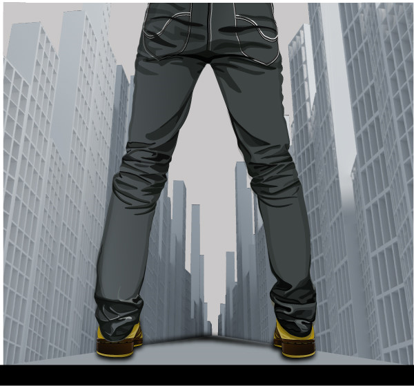

# ＜特稿·开学啦！＞杀死那个大一新生

**你刚刚从食堂出来，眼睛紧盯着手机屏幕，一边熟练地在小道中穿行一边给室友发短信，抱怨食堂已经被大一新生攻陷了。你给她指路时多少有些敷衍，以至于你不确定她是否真的听懂了。你转过身继续走，手机震动着跳出室友的回复：“你当年不也这样么？”**  

# 杀死那个大一新生

## 文/YZ（沃德姆学院）

 

 你看不到他，但你听得到他，他的行李箱与地面平稳地摩擦着，把你从深睡中吵醒。你皱皱眉，看看窗外午后略显阴闷的天空，打开耳朵接收窗外升腾起的聒杂人声，于是你知道，他来了。 他是那个刚刚到达报到地点的人，望着并不长的队伍稍微松了口气。他翻开背包，取出早已准备好的报到材料，开始打量排在前面的人，那些就是自己将来的同学么？会有自己将来的室友么？ 她是那个跟在学姐后面的人，努力保持着和学姐一样的速度。学姐卖力地说着，手势眼花缭乱，她感觉什么也没记住，但还是保持微笑，面部肌肉和身体其他部分一样疲惫。她只希望宿舍不会太远。 他刚刚把行李搬进寝室，父母像旋风一样开始以极高的战斗力布置他未来四年的窝，并和已经入住的新同学谈笑风生，他觉得他似乎也应该加入到这谈笑风生的队伍中，却不知道该说些什么。 她走出宿舍楼，决定吃大学生涯的第一次食堂。之前好像听说某个食堂还不错，但她实在拿不准应该怎样走。于是她拦住了迎面走来的你，用准备充分的热情询问你食堂的方位。 你刚刚从食堂出来，眼睛紧盯着手机屏幕，一边熟练地在小道中穿行一边给室友发短信，抱怨食堂已经被大一新生攻陷了。你给她指路时多少有些敷衍，以至于你不确定她是否真的听懂了。你转过身继续走，手机震动着跳出室友的回复：“你当年不也这样么？” 此时初秋的晚风应景的轻拂而过，你回过头看着那个快要消失在人群中的背影，觉得有些恍惚。你隐约觉得当年似乎也有这样一个人，面对这个过于复杂的大学生活有着过于复杂的情感：有深深浅浅的不安，被时间一路推进得不情不愿；也有似乎马上就要发现什么的期待，在快速闪过的画面里蠢蠢欲动。无论怎样，即将到来的生活是新的。 但那个人，现在到哪里去了呢？ 大概是被谁杀死了吧。  

（采编：黄理罡 责编：黄理罡）

 
