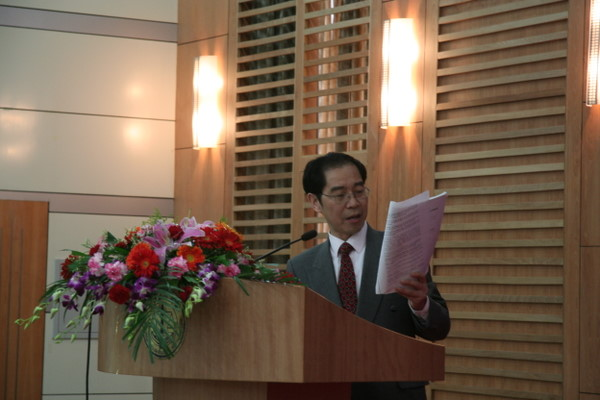
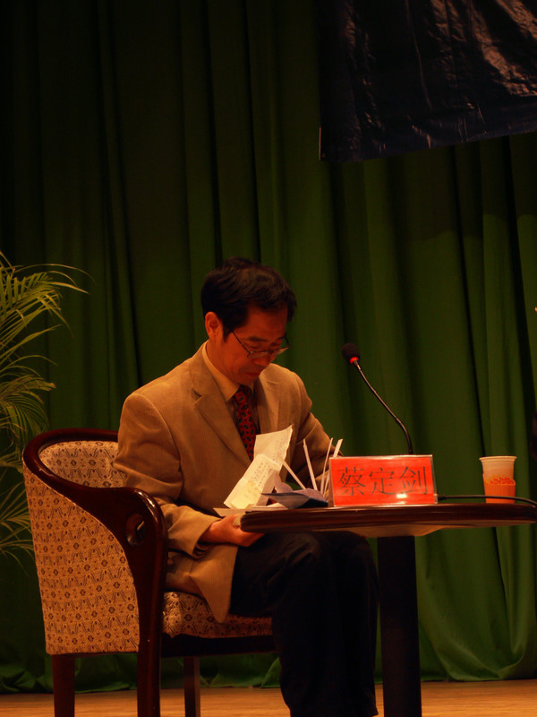
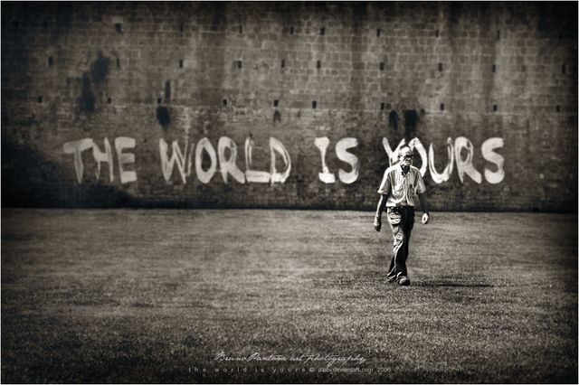

# ＜特稿·悼念蔡定剑＞在悲伤中 继续前行

**民主自由是我们的理想，更是我们的使命。作为一个使命，我们必须抱定明知不可为而为之的信念。如果我们一定要看到民主必然胜利才去推动，这一行动则不复为使命，仅仅是政治投资甚至于政治投机而已。**

# 在悲伤中 继续前行

# ——宪政民主是我们每一代人的使命

## 文/元淦恭（中国人民大学） 

今天，是上海胶州路大火过去整整一周，这一场大火，不仅烧痛了盛会之后的上海，也烧痛了整个中国。昨天，白花摆满胶州路，十万上海市民，用行动表达了自己的公民立场。

被压抑了许久的悲伤，在这个周末的上海，汇成一股爱心的洪流。上海人，开启公民中国的另一个起点。对于这场大火遇难名单的主张，对于大火发生原因的问责，对于媒体自我审查的不满，对于地方管治疏忽的质询，展示出上海，乃至于全国民众，权利意识的进步。

今天凌晨，另一个人离开了这个世界，他叫蔡定剑，中国政法大学宪政宪政研究所所长。共识网上贴出的讣告，称他为：当代中国法治思想和理论的重要贡献者、法律制度的建设和推动者、法律实践行动的先行者。

他今年只有54岁，英年早逝，令人唏嘘。

2010年是充满悲伤的年份，对于每一个关心中国民主和宪政的人而言。朱厚泽、谢韬、李昌、李普，一个又一个民主老人的生命之烛，油尽灯枯。他们的声音，化为绝响。

当年提倡“三宽”的中宣部长朱厚泽，在那一群民主老人中算是年轻的。还没有年满八十岁的他，匆匆撒手人寰，让人遗憾而叹息。他曾是意识形态的主管，却亲自推动了社会风气的改善，舆论管理的松动。他五十多岁的时候离开了要害部门的职位，却留下了许多的思想财富。

2007年写出《民主社会主义模式和中国前途》的谢韬，其实身体状况早已很不好，八月离开，也并不令人意外。从在成都念金陵大学开始，他走上一条终身不悔的道路，在幽暗岁月里承受二十多年的磨难，又在改革春风里开启了人民大学和社科院的新风气。他走了，然而他的精神影响着许多后人。

李昌，“一二九”运动的积极参与者，三十年代清华主要的学生积极分子，在谢韬逝世后一周也病故。他投身革命，正好是在“一二九”时代，那时的中共，对青年有着民族救亡和民主运动的号召。像他这样的人，后来被他的同门师弟杨继绳称为“两头真”，他们年青时代为追求真理真诚地参加革命，离休以后大彻大悟、真诚地面对社会现实。

据说，杨继绳最早提出这个论断的时候，是为了说李普——和李昌一样，都曾担任杨任副社长的《炎黄春秋》的顾问。李普是新华社的前副社长，中国著名的新闻人。1949年中华人民共和国建国时“开国大典”新闻稿的主要写作者，他还曾在文革的关键时期在广东担任当时广东书记的部下。他倡导制定《新闻法》，呼唤新闻自由，推动宪政民主。2008年，他称为唯一一个在12月10日发布的公民文件上签字的退休省部级官员。

11月8日，李普也走了。

蔡定剑弥留之际，说了一句话：“宪政民主是我们这一代人的使命”。看到这一句临终遗言，对于这个国家还有梦的人，很难控制自己内心的情绪。

这是多么重的一句话！

一生致力推动民主宪政，促进政治改革的智者，没有看到他所期待的宪政中国。然而他并没有放弃他伟大的理想。而我们，又当如何，面对逝者的嘱托？

我认识一些老人，他们仍然还像我们一样，定期聚会，讨论各种问题。每一次聚会的时候，他们都常常对他们的晚辈说，“我们是看不到了，你们会看到中国民主的那一天。”而他们的晚辈，大多也都是四、五十岁了。

他们的晚辈，见到我们的时候，也会转述这样的话。他们对于自己看到中国的宪政并不抱太大希望，但是他们还是在努力推动着这一进程。好多年轻的朋友，常常会悲观地看待政改的前景，我总是劝慰他们，即使再悲观，也不能放弃努力。民主自由是我们的理想，更是我们的使命。作为一个使命，我们必须抱定明知不可为而为之的信念。如果我们一定要看到民主必然胜利才去推动，这一行动则不复为使命，仅仅是政治投资甚至于政治投机而已。

宪政民主是“两头真”一代的使命，离开我们的朱厚泽、谢韬、李普，他们用一生践行了这句话。

宪政民主是毛泽东时代生人的使命，他们在少年时代经历过跌宕，他们在青年时代把握改革机遇。离开我们的蔡定剑先生，用自己的笔，用自己的脚，用自己的口，反复地呼吁着这个民族的政治现代化。

宪政民主也是我们这一代人的使命，是我们80后、90后的使命。这是这一代人对于整个中国历史，不可让渡的责任。

我们要为了上海大火的逝者，为了汶川地震的孩子，为了大饥荒死难的前辈，为了所有没有名字的牺牲者，追寻正义。我们不需要煽动仇恨，我们不能够鼓吹暴力，我们不主张清算历史。但是，我们需要责任得到追究，真相得到澄清。我们热切地希望逝者的尊严能够得以保全，生者的痛苦可以得到告慰。

问责，永远不晚。道歉，永远不迟。

我们要为了那些毕生付出的前辈，实践他们未完成的梦想。这个梦已经做了许多年，可是到现在还是远远看不见。他们等了太久，却终究没有等到这个国家实现政治转型的那一天。他们已经做了太多太多的工作，他们的努力已经见到了许多成效。如果我们放弃属于我们这一代人的公民责任，我们的前辈所做的一切，都会功亏一篑。

宪政，尚未实现。同志，必须努力。

我们要为了我们的上一代人，追求整个时代亏欠他们的公正。我们的上一代人，有的把握住社会变革的机遇，成为精英和翘楚，实现了自己命运改变的中国梦。然而，他们中间有更多的人，成为经济改革的牺牲品，社会转型的边缘人。他们或许错过的仅仅是机遇，然而失去的却是一生。

我们要用一个稳健的体制，来汲取他们牺牲的教训。

我们要为了我们自己，追求我们梦寐以求的平等。我们对政治的所有关心，并不出于“吃饱了没事干”。政治是“众人之事”。一个健康的政治体制，一个公平的竞争环境，正是青年一代实现命运转折的重要凭借。世界是我们前辈的，也是我们的，归根结底是我们的。一个稳定和繁荣的国家，离不开宪政民主的制度基础。

我们要用一个良性的制度，促成我们这一整代人的自我实现。

我们要为了我们下一代，努力推动社会的进步。或许，真的我们这代人会像每一个重复过宪政民主责任的前辈，无法见证这个国家的伟大变革。但是，当我们面对我们后辈的时候，我们总要做出自己的交代。当我们老时，面对我们的孙子，我希望我能说，你爷爷曾经为这个国家的进步奋斗过。

我们如果能够这样告诉我们的晚辈，我们才会在死时心安理得。

蔡定剑先生离开了我们，留下一句话，在这片古老而满目疮痍的土地上漫长回荡。

“宪政民主是我们这一代人的使命。”

今天，我想说，宪政民主是我们每一代人的使命。

让我们在悲伤中，继续前行。

2010年11月22日
