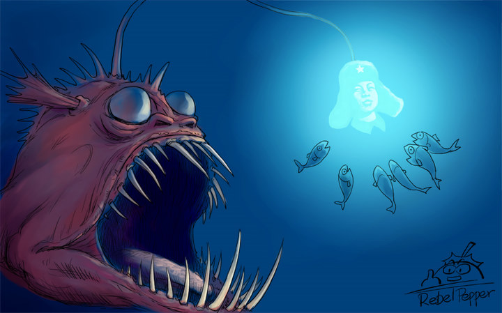
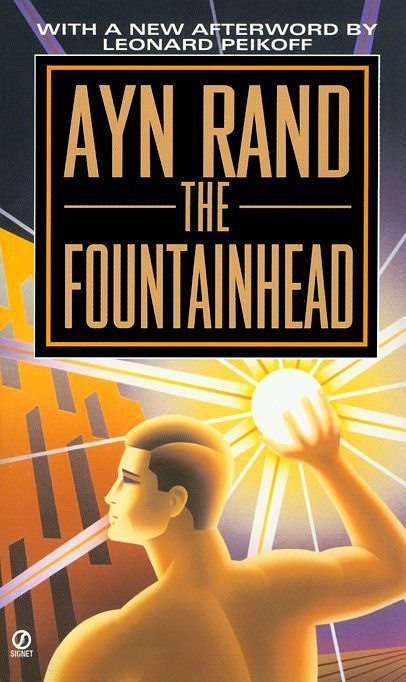
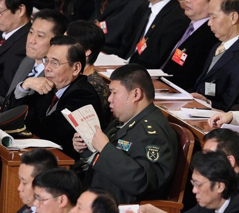
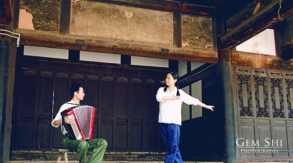
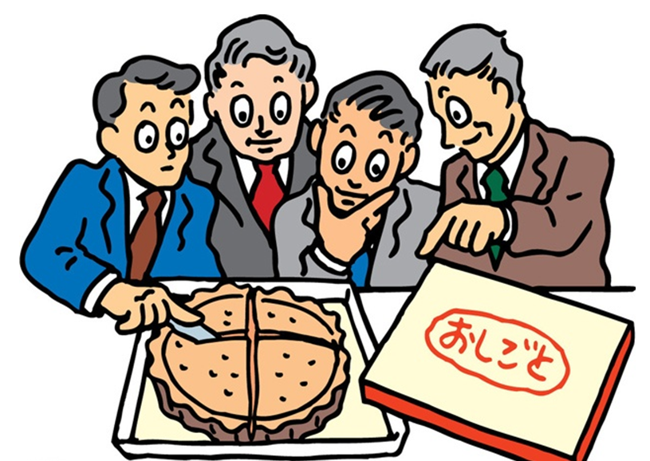
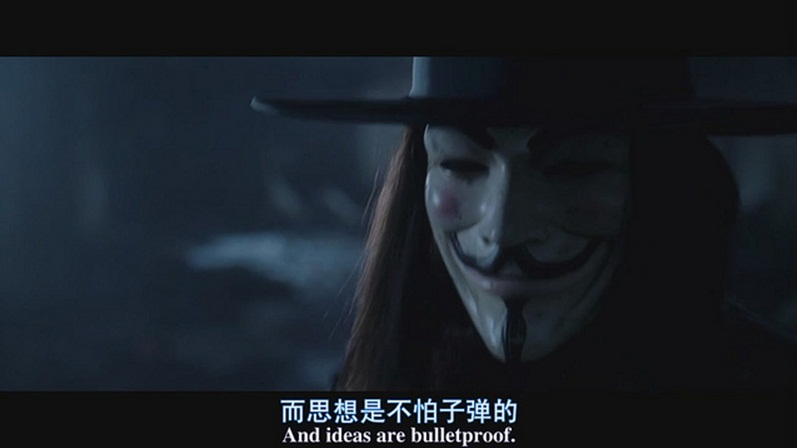

# ＜特稿＞Ideas are bulletproof——漫谈雷锋、两会和 New iPad

**思想是杨小凯的精灵，从冬天飞向春天；是李敖囹圄里的色情杂志，在黑市里被疯狂传阅；是苏格拉底喝下的毒堇汁，化为克里西托的章节；是希伯斯的无理数，变成现代数学的起点。她不会死，不会消亡，不会被囚禁。一旦她存在过，便永远存在。**  

# Ideas are bulletproof

# ——漫谈雷锋、两会和 New iPad

## 文 / 尹桑（Bentley University）

Beneath this mask there is more than flesh. Beneath this mask there is an idea, and ideas are bulletproof.

前天是3月5号“学雷锋日”，网上对“雷锋精神”议论纷纷、莫衷一是，随后今天两会话题的加入更是让气氛热闹了许多。借题发挥，我来话话雷锋、谈谈两会、说说思想。

**一． 雷锋、唐骏与安兰德**

雷锋这个形象从60年代起逐渐深入人心，每年3月5号都是全国人民“学雷锋，做好事”的日子，到了2004年我小学毕业的时候，雷锋依旧是少年儿童心中一块不倒的丰碑。然而雷锋这几年受到的质疑渐渐多了起来，比如那个“随时随地帮雷锋拍照的记者”，还有60年代三天一张照片的频率，以及“大白天打手电看毛选”都让人啼笑皆非。“雷锋日”到来之前，校内微博上传满各种嘲笑日志和相册照片，众人一齐加了把力，推倒这个被包装的“人造偶像”。

推倒的同时也伴随了一些人的质疑，“就算雷锋不完全真实，那为了让中国多一个信仰、多一种精神去学习，大家一起助人为乐、舍己为人，难道不是好事吗？中国社会道德已十分不堪，再打倒雷锋的话，那可真是道德沦丧了。”我先不谈这些人的“造神理论”是否能成功，亦不谈“中国道德低下”的本质原因何在，“雷锋”真的是一种信仰、一种精神吗？会让人一心向善吗？

有趣的是，3月5日“雷锋日”本身便是一个大大的讽刺，这个日子既不是雷锋的诞辰、也不是雷锋的忌日，而是毛主席发表雷锋题词的日子，那它到底是纪念雷锋、还是宣扬助人为乐、亦或是纪念毛主席呢？（结合60年初期的历史背景，大家可以自行揣测）再看看当时学雷锋的口号，“学习雷锋好榜样，忠于革命忠于党”，整个口号并没任何道德情操的追求、而是把“两个忠于”限定了，让人不禁想问，到底学雷锋是学了什么？

90年代以后，雷锋精神渐渐变成了“学雷锋、做好事”，生长在这个年代的某些人便把“学雷锋”和“做好事”划上了等号，然而真正的雷锋精神是什么呢？摘抄雷锋语录三句，“坚决听党的话，一辈子跟党走”，“为了党，愿洒尽鲜血，永不变心”“我们每个人的幸福也依赖于祖国的繁荣，如果损害了祖国的利益，我们每个人就得不到幸福！”，如果思考一下便会发现，“无条件舍己为人”才是雷锋精神的核心所在，这个伟大精神让大家趋之若鹜，然而躲在黑暗里的大鱼正等待你牺牲个人权益去满足“国家大义”。这才是“学雷锋”的真正目的。

如此看来，雷锋精神的最核心并不是“做好事”和“助人为乐”。同样，没有了雷锋精神，社会道德并不会沦丧：乐于助人的人并不会因为没了“雷锋”就不让座，见义勇为的人更不会面对恶行默不作声（相反，“彭宇”才是见义勇为的拦路虎）。引用某位同学的一个状态 : 有人说：“雷锋事迹的真假不重要，重要的是雷锋精神。”——为政治目的去伪造的榜样，即便宣传机器将其吹捧成完人，其精神品质也必有一条不可弥补的缺陷，那便是诚信，而这是做人之本。失去诚信，喉舌口中再高尚的“雷锋精神”，其归宿也只能是摆拍、造假、吹牛，就如同雷锋所作的那样。雷锋精神最忠实的实践者，是天天“到群众中去”演戏的我党官员们。另外，造假出的雷锋精神，除死忠于党、做统治者的螺丝钉等内容外，其他内容与自古流传的“仁义理智孝”无任何区别，重塑榜样是洗脑需要，雷锋精神纯粹是政治工具。

一提到雷锋，我立马就想到了唐骏——这个将成功学在中国发扬光大的人。“我的成功可以复制”，唐骏一夜之间成为了千万人的偶像，然后又在一夜之间，他被彻底地击倒。学历伪造、涉嫌偷渡以及各种造假，让他个人公信力荡然无存。然而就算是这个道德破产的骗子，很多人依然对他很是宽容，比如有许多人依旧怀着“虽然唐骏是个骗子，但是他的思想却颇有价值”的态度。我不禁想问，唐骏的那叫什么思想？！多少信徒举手投足间、言语谈吐中都在模仿唐骏，夸大其词、心浮气躁甚至作弊造假，企图也“复制出一个成功”，然而通过谎言和欺瞒在哪行哪业能取得成功？唐骏吹的这个泡泡太大、太过诱人，多少人在里面跟着一起光怪陆离，其实等待的是梦碎时分。

“雷锋精神”是谎言制造出来的利他集体主义，而“唐骏思想”却是制造谎言的自私利己主义。与之相反，卢梭的社会契约论看似“创造集体、限定自由”，却让18世纪的人心向往之。更令我感动的是“理性主义”之母——安兰德和她小说《源泉》里塑造的那个霍华德洛克，**“个人的精神就是他的自我，这是他意识的本质”**，洛克是一个特立独行、崇尚自我的建筑师，他否认为社会牺牲自我的意义、也反对别人为他牺牲，因为只有拥有独立价值观的人才会去创造价值，“自我主义被理解成-为了自我而去牺牲别人、而利他主义则被理解成-为了他人而牺牲自我，这种观念使人无可挽回地与他人栓在了一起。**然而自我主义者并不是为自己牺牲他人，他在任何事情上都是与他们无关的——无论是他的目标、他的动机、他的思想、他的欲望、还是他力量的源泉，都与他们无关。他不是为了他人而存在的，他也并不要求他人为了他而存在”**。这才是“最无私的私心”，只有对自我价值的肯定，才是社会的灵感与力量的源泉。这是本长达700页的“哲理小说”，却丝毫没有说教成分，在20世纪最受读者喜爱的100本小说中《源泉》名列第二，第一则是兰德的另一本小说《阿特拉斯耸耸肩》。**“这是他平生所目睹最让人心驰神往的自由境界”**。

**思想虽是虚构的，但并不是言之无物或是夸大其词，只有真正触动人心、为之动容的才可称思想。思想虽是被创造，但不是靠造假或包装，而是当她最真实地站在你面前，你可取之为用，而非被其所用。**

**二． 两会，毛新宇和杨小凯**

“雷锋日”刚过，两会便浓妆淡抹登场。所谓“浓妆淡抹”，一个是“两会时装周”，老百姓诟病他们生活过于奢华，另外就是每年都有的“雷人提案”。其实这两件事我倒觉得没大问题，前者错在太夸张，人大代表有钱这件事谁不知道？但在这CPI月月上涨、房奴年年增多的关头，公仆们秀一下自己的爱马仕确实伤害了中国人民感情。理智点说，当官和有钱都不是问题，不过，**其他国家有钱的去当官，中国是当官的变有钱**。“提案”则错在头脑太简单，很多人大代表提出的议案过于“理想化”，引起了老百姓极大的抵触情绪。还有一些提案完全是有讨论价值的，比如“卖淫合法化”，虽然无法实现，但拿出来谈谈十分有必要——虽然无法让所有性工作者从良，但是好歹让她们的女权也摆上台面。花钱打水漂还听个响，我们养着这群人民代表，提提“雷人提案”总比行“举手之劳”有存在感一点。

所以我想吐槽两会的并不在于此，而是其一直鼓吹的思想。每到两会，新闻联播就把“坚决贯彻毛泽东思想、邓小平理论”“认真学习实践三个代表重要思想”“弘扬八荣八耻”说上数十遍，小时候的我很好奇，为什么所有领导人都有一套自己的思想？后来我才知道，领导谈思想就像皇帝修宫殿一样，如果不搞得富丽堂皇，就怕没人记住他们。修宫殿花老百姓的钱，不过大家眼不见心不烦，人民也懒得去管；相反，谈思想却是让人民跟着一起吹牛，上学时每次写各式申请都要“点兵点将，毛邓胡江”、唯恐漏了哪位大人，不然就一句——“退回重写”！可是，他们谈了思想、说了理论，就能让后人记住吗？“三个代表重要思想”我一直不知重要在哪里，政治老师说“你只要记住就行了”，当年倒背如流的我现在却丝毫不知道它代表了什么，脑海里只回响着那么一句“**Too Simple, Sometimes Naive**”

毛少将则是两会另外一个亮点，胖嘟嘟的他继续着指点江山的工作，今年的核心思想还是把老调重弹——“再造毛主席在反腐倡廉上创造的世界奇迹”。观毛新宇这个人，最大的特点是十句话有九句半是关于他的爷爷，“我一生最大的幸福和满足，都来自于真正理解了一位伟人。而他，正是我的爷爷。” “爷爷是我的‘上帝’，我崇尚中国历史上的秦始皇、成吉思汗、朱元璋等英雄人物，但我最崇拜的是我爷爷”，而这正是他本人最大的悲哀——因为他一无是处，所以必须捧出这尊神去提醒大家有关他的出身。而毛泽东的悲哀更甚：曾经“毛思想”举国皆知，毛选销售超过圣经，文革时期平均每人携带两到三本。而随后权力一旦交接，毛选不再印刷、也再无人主动购买，红极一时的“红思想”随即走向沉寂。除了大学必修还在一遍一遍提醒人们有这个东西，只剩下那个穿着军装、四处题字的胖子才会不停嚷嚷他的名字吧。**思想不会因为呼风唤雨、叱咤风云便会流芳百世，你的无知象征着它定会消亡，而你的毁灭将是它的绝唱**。

说到毛与文革，想到去年从“北斗荐书”里看的《牛鬼蛇神录》，读后的我顿感唏嘘不已。作者杨小凯，文革时期19岁的他因写《中国向何处去》而被判入狱10年，《牛鬼蛇神录》正写的是那一时期他的亲生经历。没有自哀自怜，也没有描写自己的不幸，而是记录了他遇见的28个人和他们的故事。他记下了与这些人的相识相知和别离，他们一起下棋一起做数学题一起谈论中国未来的赫鲁晓夫，而那些人大多在文革中死去。1978年的春天，小凯刑满释放，他写下“我心中充满着对未来的向往和不安。但不管将来发生什么事情，我一定不能让在这片土地上发生的种种动人心魄的故事消失在黑暗中，我要把我亲眼见到的一段黑暗历史告诉世人，因为我的魂永远与这些被囚禁的精灵在一起”这本书已译作外文传遍世界。杨小凯这一生最大成就是被诺贝尔经济学奖提名两次，但在读者心中留下的确是那些熟悉的故事和陌生的面庞——建妹子被打骂却不忘的爱情，逼疯了的黄文哲，还有“断手”临刑前的婚礼。虽然他们被时代洪流卷走了，被历史车轮碾过去了，我也没用见过这些人，但是我知道：他们是真实的，是触手可及的，是鲜活存在过的。正是因为名不见经传的杨小凯，让这个世界记得他们曾来过，曾经快乐地奔跑着玩闹着，向我们挥手微笑说道“你好，未来的中国”。

**思想是杨小凯的精灵，从冬天飞向春天；是李敖囹圄里的色情杂志，在黑市里被疯狂传阅；是苏格拉底喝下的毒堇汁，化为克里西托的章节；是希伯斯的无理数，变成现代数学的起点。她不会死，不会消亡，不会被囚禁。一旦她存在过，便永远存在。**

**三． 腾讯，乔布斯和中国天使**

上周《Fast Company》选出了2012全球最具创意10大网络公司，Google排名第一，第二的却出乎所有人的意料——腾讯Tencent，这是唯一上榜的中国公司。课上讨论时，美国同学纷纷表示对这个公司上榜的不解，“这不就是一个在中国的山寨IM公司嘛”。

听到此话，我感慨万分，如果真说中国最具创新的公司是“山寨寨主”腾讯，大家是不会信的，但也从另一方面证明了中国在创新领域的悲哀。曾经刚刚起飞的中国互联网曾以模仿为主要形式，诞生了一批以腾讯为首的网络巨头。人们认为，在有了资金和人才之后，腾讯会走上创新之路、成为中国互联网的新向标，谁料到腾讯在不断扩大规模的同时，更加疯狂地把别人的产品拿为己用。当他看到一个好服务或产品时，第一步是谈判并购，深圳网游、Foxmail以及康盛创想就是这样被整个吞下。一旦并购不成，腾讯便把其“山寨化”了，然后通过自己的衍生产品将这个山寨的规模变的越来越大，原创始人一看情况不妙、便妥协然后被收购。网上曾疯传一个段子，当投资人和网络创业者谈到最后一步时，往往那个问题便是“如果腾讯盯上你，你该怎么办？”而结论偏偏是“没什么办法”。中国创业者在计划创新的时候，先要接受各项规章的层层约束，还要考虑中国市场的接受程度以及消费条件，最后还要面临各大巨头的垄断或山寨，可谓四面受敌。在巨大阻力下，中国创新产业一度不甚乐观，福布斯评中美30岁以下创业者对比，美国皆是“重塑世界的颠覆者”，而中国创业大部分则还是集中在电商。

谈到创新，今天iPad出了新款，不过反响已大不如前。很多人感慨如果乔帮主还在世的话，情况应该不会如此。我虽不是“果粉”（除了07年买的一个iPod之外再没别的苹果产品），但这丝毫不改变我对乔布斯的敬佩，并不因为去年苹果1000亿的销售额，而是因为他坚持“思维改造视野，视野创造价值”的理论。曾做过苹果的案例分析，教授分析乔布斯时总结道“他并不像别的制造商一样去揣测消费者想要什么产品。他是先设计理念，然后创造产品并赋予价值，最后才引导消费者去喜欢。”美国这种“乔布斯”还有很多，他们怀揣崭新的想法，去创造新奇的产品，虽然经常不知道有多少人会喜欢，也没有任何前人涉足过，但是他们会着迷的继续下去。Google工作室“无人驾驶汽车”的已进入第三阶段，在不久以后你可以坐在车上看电影或吃午饭，汽车会自行安全地将你送到目的地。另一革命创新是一种“隐形眼镜”，当你戴上后可产生电子视觉效果，比如你使用GPS时它会在你视线前方会显示箭头和路标，告诉你右转或直行；当你路过餐厅门口时它会自动提取数据、并告诉你它在“大众点评网”里的评价是什么，其他的用途也都诸如此类，仿佛在眼里植入了电子芯片。 除了高科技创新外，低成本甚至无成本的创新也遍地皆是，比如CouchSurfing这个peer-to-peer网站，将旅行者和当地有空闲房间或沙发的居民联系到一起：一方面旅客减少了住宿花费，另一方面也让他们更快融入当地生活和居民进行更直接的交流。

虽然中国在科技创新方面还落后不少，但是网络创新已初现端倪。比如19岁少年季逸超的猛犸4，名噪一时的“师兄帮帮我.com”，还有handsup.cn反向定价团购以及dreamore.cn的p2p追梦网，都是80、90后青年人的杰作，其中大部分还是在校学生。去年年底去MIT听了真格基金的演讲，演讲前和创业者交流许久，发现他们想法都十分有创意，如果能实现的话将会改变整个行业现状。“天使”徐小平和王强的演讲极其有意思，王强从莎士比亚讲到新东方，徐小平从世纪佳缘讲到聚美优品，虽说是商业演讲、其实却更像两位长者给小孩讲故事，下面的学生并没有听商业演说时的激动或疯狂，更多的付诸沉思。演讲结束后，我排了一小时才和徐老师讲上话，中间看着那些上去下来的同学，眼睛里、神态中透露的不是平时随处可见的浮躁，也不是渴望抑或贪婪，而是一堆堆散发希望的火苗，有越烧越旺时的欣喜，也有渐渐熄灭时的不甘——人道星火燎原，我说莫过于此。

**安兰德、杨小凯或是北斗摘星星的孩子也好，乔布斯、中国天使或是青年创业者也罢，在每个盖伊·福克斯面具之下，有的不仅是那鲜活的血肉，还有着一颗跳动不止的心, and ideas are bulletproof.**

 

（采编：麦静；责编：麦静）

 
