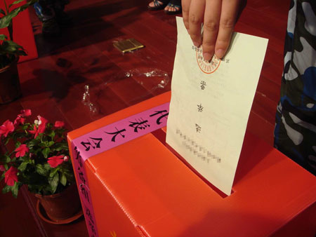

# ＜特稿＞“我们必须用最有限的时间和经费帮助更多的人”——我们的2011

**我们活着是为了使命，为了那些为不义焦灼的沧桑的脸绽放幸福的笑容，为了下一代孩子们纯真的脸。2011年革命的话语悄然兴起，我们依然是建设者，在历史的天空下，有一群站立的公民，2012我们不相信世界末日，我们相信这个国家美好的未来。**  

# “我们必须用最有限的时间和经费帮助更多的人”

# ——我们的2011

## 文/匿名（独立参选人）

 

#### 一

2011年第一天记忆深刻，整个下午我们在丰台一处拉着铁丝网的三层小楼前一次次拨打110期待警察解救黑监狱里的上访者，直到夜晚寒风中，一位勇敢的上访者趁人外出门缝打开之际突然用力拉开铁门闯进碉堡一样的小楼，里面的上访者趁机往外冲，几分钟后警察就来了。我和王功权、单亚娟等十几人坚持要求放人，后来获释者中有赵克凤，新快报《湖北“死囚”被曝执行枪决9年后仍在正常生活》报道中被冤枉的徐浩的母亲。那个寒冷的夜晚，她去桥洞住了，为了无辜的儿子，九年来艰辛上访她一贫如洗。

很多年来，这样的故事是我们生活的一部分。从1997年冬天我第一次在中央电视台东门看见成群结队的上访者，14年过去了如今南站附近他们依然成群结队。这是一个特权腐败横行的国家，无权无势者遭遇冤屈找不到说理的地方，这个社会如此渴求公平正义，杨佳、钟家姐妹、钱明奇们泣血的呐喊久久激荡在神州大地。

在一个每年信访量上千万的国家，我们也只能挑选很少的极端个案为公正尽一点力，面对北京数十处关押访民的黑监狱，我们也只能偶尔围观一次解救几个人，面对那些极端贫困冬天住桥洞的冤民，我们也只能送一点棉衣棉被，尽量避免有人冻死。七年来为承德案四个被判五次死刑的村民我们去最高法院申诉40次了，他们是无辜的。三年来我们为结石宝宝个案争取到了近200万元的赔偿，他们大部分生活在农村是最弱者。2011年我们继续援助夏俊峰，那个被殴打时奋起反抗杀死城管的商贩，我们援助河南新乡的张好峰父子，他们在自家院子里和夜晚持刀砸门闯入的凶徒搏斗杀死了带头的村支书的儿子，父子被判死刑和死缓。很多个案我们能做的只是告诉他们到哪个部门去控告申诉其实说了也没用，更多的时候我们对来访者一遍遍说对不起，我们只能挑选那些最有广泛社会价值或者涉及众人权利的个案，我们必须用最有限的时间和经费帮助更多的人。

#### 二

就在元旦这一天，网络上我们正被千夫所指。寨桥村长钱云会遇难，那张残酷的照片，那背后数年苦难的上访路，那每每关键时刻坏掉的摄像头，一切都太像谋杀了。人们渴望真相，我们去调查真相，很快做出了判断，这是一起普通的交通事故，之所以成为一个重大公共事件，背后是村民多年为征地上访历经磨难以及整个社会普遍的官民不信任。抱歉，我们的报告第一版确实有细节错误，我们对结论的表述也太不留余地了。

激烈的批评甚至一直延续到今天，我们叛变了居然为官方说话？我们被200万收买了？我们是刽子手阴谋家？我为自己自鸣得意地仓促公布报告而深感羞愧，但是，当一年之后再回首，我依然主张公布真相，只是以后不会再那么仓促了。我们不是批评者，我们是建设者，这是2003年一直以来的立场。当执政者有问题我们就批评，比如就723动车事故发表意见要求给遇难者90多万元赔偿，就刑事诉讼法修改提出建议坚决反对秘密拘押，在鸡蛋和墙之间，我们毫不犹豫站在弱者一边，可是我们绝不会把白鸡蛋说成黑的。

当车轮下的图片飞速传播，其实很多人渴望是谋杀，那样符合自己对官僚们的价值判断，符合内心深处的诅咒，对不起，我们没有和大家一起诅咒，他们确实有罪，但不在于这个交通事故，而是背后整个权力体制的贪婪与傲慢。我们的报告第二版指出了这些，可是已经没有多少人愿意听了，也没有多少人再关心村民的未来。这次教训之后，我们是否应该学会更“聪明”，比如看到真相不符合大众口味就不再说话？没有，我们没有改变，我们不能改变。当官民裂痕越来越深，当站队已经成为微博达人们的自觉行动，我们依然在原地，其实我们早已站好了队，那是真相与正义，是美好政治的信仰。

#### 三

我们是执着的建设者。当2010年1月制定了两年半的推动教育平等的计划，觉得时间那么漫长，可是很快两年就要过去了。两年来家长志愿者团队从最初的4人壮大到6万多人，去教育部请愿19次，迫使有关负责人一年内做出4次回应，成立专门的团队研究随迁子女输入地高考方案。

行动其实是从2002年开始的。那时我在《中国改革》杂志社兼职负责农村版月刊的采编，每个周末例行接待上访者时知道了收容遣送制度，知道了1961年大饥荒成千上万的人饿死在被遣返的路上。2003孙志刚之死，我们建议全国人大常委会审查收容遣送制度。2006年我们继续推动户籍制度改革，总结了北京户籍人口比没有户籍的人口多出19项特权。2010年开始重点关注依附于户籍的教育体制。改变历史遗留的城乡户籍歧视，推动社会公平，我们一直在努力。

庞大的守旧势力幻想着北京能脱离中国和东京纽约伦敦比富丽堂皇，其实真的要把穷人赶走了，他们连饭都吃不上，垃圾都能将他们掩埋，还有一些教育部门的官员怕出事故自己官位不保，两者合力取缔打工子弟学校，从2006年就开始了。2011年6月他们下达了关闭20多所学校的命令，8月初我们代理被关闭学校的孩子起诉政府，正像很多所谓敏感案件一样，法院顾的是官僚们的大局而不是法律的尊严，不受理。后来舆论压力下他们承诺安置每一个孩子，但事实上，仅东坝实验学校就有一百多个孩子重新成为留守儿童，他们曾想坚持把学校办下去，可被停水停电，坚持了半年还是放弃了。

在城市化的历史背景下，每年春运潮背后是2.2亿城市新移民缺乏正常的家庭生活，最不幸的是孩子，他们从小没有一个健全的家。现在，家长们行动起来了，征集签名壮大团队，去教育部请愿，给人大代表寄信，组织公益活动，这已经是最温和的方式，也只能采取这样的方式，坚韧执着，年复一年，期待着感动这个国家。

#### 四

当中东古老的沙漠茉莉花开，北方正寒风肆虐，一些勇敢的公民失踪了。帮助身边的公民是我们的责任，一边准备法律辩护，一边小心翼翼不敢声张。每次和他们见面，彼此都会探听一下消息，我问，滕彪怎么样了？他们会问，你们下一步打算怎么办？如果开始了法律程序，我们打算都进去，我如实说。4月初，胖子也失踪了，那天早上我被带到宾馆，晚上回来才知道。形势紧张到了极点。

办公室要不要关闭一段时间？几个朋友好心提醒，不是故意前冲，但客观上我们又一次站在了最前沿。但是，如果我们这样理性建设性的团队都不能存在，这个社会还有希望吗？今年只打算做几件事：法律援助和救助，关注暴力拆迁，推动教育平等，推动人大代表选举，其中选举是最敏感的。可这是宪法赋予公民的权利，我们的工作不过是编写《联名推荐候选人参选指南》和选举法解读，联络公开站出来的独立候选人聚餐分享经验，给求助者解答问题，观察选举总结报告。

5月江西新余的刘萍率先打起了竞选旗帜传单被夺走本人也被非法拘禁，6月全国人大法工委站出来说“独立候选人”没有法律根据接着是媒体全面封杀，李承鹏等勇敢的公民高调宣布参选很快遇到各种诡异的压力，北京13位公民联合参选被限制人身自由，广东这号称最开放的南方所有公开参选的独立候选人全部落选。30年前就有先辈们开始了竞选，然而遗憾的是这么多年我们几乎没有看到政治体制的任何进步。

我必须参与，哪怕只为表明一个姿态。我想告诉选民们，请珍惜这张选票，不要觉得无所谓，那些因社会不公绝望的受难者，其实和你我息息相关。我还想告诉大家，政治必须有底线，无论对方如何造谣诽谤，我不会。今天我是一个失败者，可我宁愿用无数次的失败奠定中国人灵魂深处政治伦理的基石。当辛亥百年革命和民主的话题重新流行，我们不去争论民主好不好，不去争论民主了会不会乱套，政治文明是我们毕生的事业，无论多少人绝望了放弃了，我们评判自己国家的未来永不悲观，因为我们不是旁观者，也不只是参与者，我们是行动者，是建设者，是历史责任的担当者。 

#### 五

这一年，卡扎菲死了，金正日也死了，从中东到东北亚，专制的冰原一块块崩塌，新技术带来的革命浪潮正席卷这蔚蓝色的星球。而我生活的这古老土地上，渴求正义的人们依然成群结队。

人权日前夕，我收到一个短信：“恩人，我是河南长葛王金英来到了北京，我已身患癌症晚期将不久于人世，请你一定要帮我弟弟伸冤啊，感谢主！”2005年5月的一天在崇文门医院，王金英躺在医院走廊的尽头，哭着讲述她的遭遇。她弟弟王明轩生前是长葛市人大代表，被人陷害以故意杀人罪判处死刑，从案发到执行死刑不足6个月，后来我问他的辩护律师，律师一声叹息，说有政治背景，很无奈。王金英上访路上曾遭遇七次毒打，这一次他被截访者打断脚踝骨和三根肋骨，扔在今天北京南站所在位置的枯井里，幸亏访民相救送到了医院，没钱医治，被放在走廊里。没想到6年过去了，她还活着。几天后我们又一次见面了，她步履蹒跚把轮椅拎过公盟办公室的门框，我再次看到她浑浊的泪水。我很想拥抱她对她说这世间我们其实只是一个游戏中预设的角色，可是每个人又怎能摆脱各自命中注定的哀哭？

我们活着是为了使命，为了那些为不义焦灼的沧桑的脸绽放幸福的笑容，为了下一代孩子们纯真的脸。2011年革命的话语悄然兴起，我们依然是建设者，在历史的天空下，有一群站立的公民，2012我们不相信世界末日，我们相信这个国家美好的未来。

2011年12月29日

 编者注：主标题“我们必须用最有限的时间和经费帮助更多的人”为编者所加。  

（采编：佛冉：责编：黄理罡）

 
