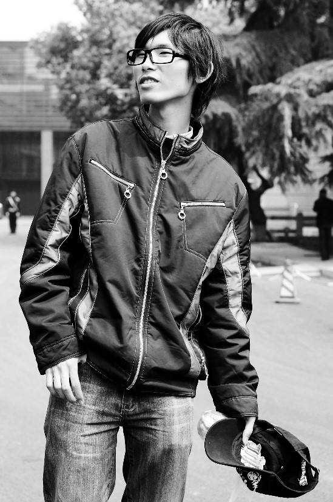
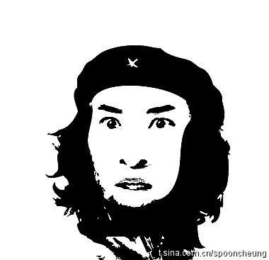

# ＜特稿＞“茫然弟”还茫然吗？——北斗网专访茫然弟

**茫然弟：恩，是的。其实事情来说，也是有两面的。会有利有弊。不利的方面，可能在你的形象上，会给大家一些定式，有利的一面呢，可能就是会给自己带来一个平台，给自己的一些爱好方面的展示有一个平台吧。如果没有红的时候，别人要想关注你的东西就比较困难。有了这样一个机会之后就会有很多人关注。**

### 

### 

# “茫然弟”还茫然吗？

### 

## ——北斗网专访茫然弟

### 

### 

** ** ** **

#### 【编者按】

所谓的**[“龅牙哥”](http://baike.baidu.com/view/5460561.htm)**和**[“茫然弟”](http://baike.baidu.com/view/5458643.htm)**，起源于2011年3月网络拍客上传的一张很有喜感的图片，图中一位露着整齐洁白牙齿的男生和他身后一位一脸茫然眼神呆滞的男生因网友PS图片的传播红遍互联网。 随后我们知道了“龅牙哥”和“茫然弟”的真实身份。流传的照片是他们高中时候拍的，现在他们都是普通的大学生，本来过着平静的生活。 北斗网七星新闻于第一时间接触了事件当事人“茫然弟”**[余朕哲](http://www.renren.com/profile.do?id=251844903&from=0&ref=userSearchResult[0])**，下面就是对他进行的访谈： 

### 

北斗网：你好，能够简单地跟我们介绍一下你自己么？ 茫然弟：恩。大家好，我就是茫然弟，现在是在杭师范动画专业就读，是一名大三学生， 北斗网：你现在读的是动画的专业，能够跟我们简单地说一说，对于动画设计方面你的一些认识吗？ 茫然弟：其实。。我对动画设计这方面爱好并不是特别多。我的爱好主要就是像唱歌，还特别喜欢写小说。 北斗网：恩，其实能有多样的爱好确实是一件好事。能简单地跟我们说一下你和龅牙哥两个这张照片的来历么？ 茫然弟：关于那张照片呢，是高一的时候一个同学在下课的时候拍的 北斗网：那当时你知道自己成为了这张照片当中的一个背景么？ 茫然弟：当时是并不知道的。就是觉得这是一张挺普通的照片。 

### 

### 

北斗网：当时没想到后来会引发这么多的事情吧？ 茫然弟：是啊。那个时候根本就不会想到这些。 北斗网：现在很多网友都把你叫做茫然弟，因为你在那张照片中表现出了一个很茫然的表情，能给我们回忆一下你在当时的那个心理状态吗？在茫然什么？ 茫然弟：那张照片因为是下课的时候拍的，可能是拍照的同学偶然间抓到的一个场景吧。 北斗网：那你觉得，现在的这次事件对你来说的最大影响是什么？ 茫然弟：对于生活来讲，最大的影响就是，一下子关注你的人就多了。 北斗网：那你的心态和生活方式上有没有什么变化？ 茫然弟：心态上来讲，我还是比较平和的。也没有觉得自己很有明星的那种感觉。还是挺普通的一个人。 北斗网：那你现在正在做什么样的工作？除了你本专业的学习之外？ 茫然弟：大部分的时间都用在了和网友的聊天和回复留言上。 北斗网：那你的家人对这件事是怎么看的？他们知道吗？ 茫然弟：他们知道的。他们对这件事的看法还是比较平淡的，只要不会影响学习，应该还不是一件特别坏的事情。 北斗网：之前听说过类似的事件吗？因为网友恶搞而火起来的人。 茫然弟：有了解过，像网络小胖就是这么红起来的。 北斗网：你也提到了网络小胖。我听说他现在正在参与一档娱乐节目。那末你有这方面的打算吗？ 茫然弟：其实是有的。因为我对音乐方面和其他的一些方面有一些爱好。 北斗网：那你觉得，像之前的类似网络小胖，尔康，咆哮教主这些因P图而火的人，你们的共同点是什么？是什么引起网友的注意，让他们想要去P你们的图呢？ 

### 

### 

茫然弟：可能共同点就是，我们身上都有某种能够引发别人感兴趣的心理或者一些比较好笑的，能够让人开心的地方吧。 北斗网：那末当你看到这些图片之后，你自己的感觉是怎样的呢？ 茫然弟：感觉上，一开始比较惊讶，然后有一些小小的气愤，有一点被侵犯了肖像权的感觉，随意的被别人恶搞。到最后的话，现在来讲已经趋于平淡了。想开了其实也无非是一种娱乐方式。 北斗网：那你觉得网友们恶搞这件事情，除了单纯的娱乐之外，还有别的原因吗？ 茫然弟：恩。。。别的原因的话。。。应该主要是因为现在的娱乐方式比较少，就只能借助恶搞别人的照片这样去娱乐一下。 北斗网：事实上，你认为我们网络上其实还是有比较多的无聊的东西。 茫然弟：恩。。对的。 北斗网：以前也有很多和你们经历类似的事件发生，似乎现在网络上都充斥着一种恶搞的，调侃的一些精神，那你觉得在这个现状背后，网友们的动机是什么？ 茫然弟：我觉得网友们在P图的时候，他们的意图是比较简单的，就是一种单纯的娱乐方式，给大家带来快乐，让大家觉得比较好笑这张。可能目的会比较单纯吧。恶搞过头什么的，可能也是无意间的吧。 北斗网：那对于这次事件，你觉得对你来说是一个很好的机会？ 茫然弟：恩，是的。其实事情来说，也是有两面的。会有利有弊。不利的方面，可能在你的形象上，会给大家一些定式，有利的一面呢，可能就是会给自己带来一个平台，给自己的一些爱好方面的展示有一个平台吧。如果没有红的时候，别人要想关注你的东西就比较困难。有了这样一个机会之后就会有很多人关注。 北斗网：恩，确实是这样的。之前你也提到了，在事件的一开始，你也有一种网友侵犯了你的肖像权利的一种感觉，可是后来为什么你又打消了这个想法？没有再去想维护它呢？ 茫然弟：其实也不是说没有想过维护自己的权利。只是因为这种事情之前有发生过，被恶搞的人大部分都不会去通过法律的途径来解决。应为从法律上来讲这种事很难去追究根源，而且法律途径走起来的话会比较麻烦，代价会比较大，大部分人不会去花这么多精力去作这些事情，所以就选择不会去处理。 北斗网：说到这儿我想到有这么一句话，叫做人有放弃自己权利的权利。 茫然弟：恩。。。应该是有这么一种权利吧，我也这么觉得。而且对于之前的类似事情，大家都不去追究，应该最主要的一个原因就是法律上还没有明确的规定吧。应该要呼吁一下，尽快地建立一些相关的法律吧。因为网络的一个虚拟性，隐蔽性就给这些人带来了一些机会来制造这样一些恶搞的行为。 北斗网：我还想做一个假设。如果你们的这张照片被用作商业用途的话，有一些人想通过你们的照片谋利，那在那个时候，你们还会选择沉默吗？ 茫然弟：如果这样的一种假设成立的话，那末他的性质就变了。而且处理起来，他的源头就比较明确，也更有法律依据，应该会选择走法律途径吧。 北斗网：那我们再把这件事情扩大一下，如果说涉及到其他的，比如人身的财产的权利，被恶搞，被冒犯的话，那末在这种情况下，你会怎么去处理？ 茫然弟：如果是那样的话应该还会尽可能的通过一些途径，去挽回一些损失吧。 北斗网：也就是说，在面对权利被侵犯的时候，我们都知道要主动维护自己的权利，但是维权的过程当中会有人考虑到底损失和代价成不成正比。 茫然弟：对的。因为维护自己的权利也不是说不可以，可是像网络恶搞这类的事情如果走法律途径的话我们无法找到一个依据，中国的相关法律还不健全，走这样一条路会比较艰难，这样的话你所付出的代价比你所得到的和损失的要大的多的多。所以也就没有人会选择去维护自己的这样一种权利。 北斗网：但是幸好，类似网友P图恶搞的事件，本身网友是没有恶意的。 茫然弟：恩对的，本身他们就是纯属娱乐吧。 北斗网：那我也看到你在校内的留言上呢，看到了你的很多粉丝们说茫然弟很可爱，我们都很喜欢你，想跟你的粉丝们说一些什么呢？ 茫然弟：其实我想跟我的粉丝们说，谢谢你们这么支持我，然后，之后呢，我会多出一些更多的作品来回报大家的支持吧。 北斗网：那你是准备推出一些什么作品呢？ 茫然弟：其实我现在正准备推出一部长篇小说，或者是一部改编的电影或者电视剧的剧本，自己还可能会写一些歌曲，把自己的一些想法去排成视频，主要就是这些，演艺方面的一些东西。 北斗网：能给我们透露一下你的这部长篇小说的内容吗？ 茫然弟：主要就是描写男主人公悲惨的一生吧，从出生的家境贫寒，父母双亡，由他姐姐拉扯他长大，到最后事业爱情上的屡屡的失败，映射了现在社会上得一些艰苦的奋斗历史。也并不是简单的励志故事，主要描写的是一种焦灼的感情，集亲情友情爱情与一体，是一部综合性的小说。 北斗网：为什么会对这样的题材产生兴趣？ 茫然弟：因为之前也看过很多类似的电视剧，对这些电视剧里塑造的一些主人公形象还是比较有感触，这些主人公的人生路程都比较坎坷，会由心生所感，想要写一些这样的作品。 北斗网：那，希望以后能读到你的这部小说。 茫然弟：恩，这也是我多年来一个梦想吧，去完成这么一部长篇小说。我也是一个在事业上比较坚持的人，经过了这次事件，我的梦想也不会改变的。我想要去作的事情我也一定要把他做出来。 北斗网：好的。谢谢你茫然弟，也非常高兴你能够接受我们的这次采访，很感谢你能够抽出时间来跟我们交流。 茫然弟：恩，最后呢，也想谢谢大家对我的支持。 北斗网：好。再次感谢你能够接受我们的采访。再见。 茫然弟：再见。 

### 

**[茫然弟的人人网主页](http://www.renren.com/profile.do?id=251844903&from=opensearch)**

### [点此看茫然弟的MV ](http://www.tudou.com/programs/view/3IrtzFXPCuk)

### 

### 

(受访者：余朕哲 采访者：孙微阳)

(采编：安镜轩 责编：刘一舟)

### 

### 
