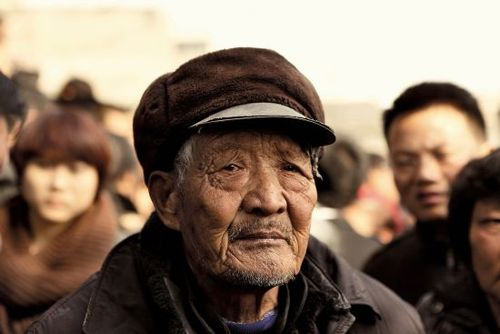
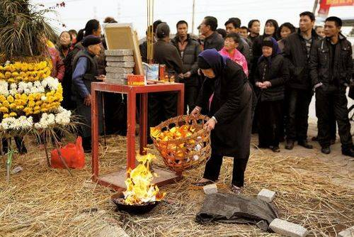
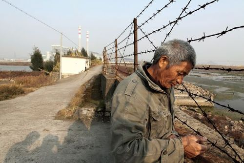

# ＜特稿＞乐清思索录——陆遥遥的钱案调查报告

**于建嵘先生说：“我真的不相信各级政府没有能力查明和公正处理这起长达六年的土地争议案。”其实也不难想象。因为钱云会、寨桥村村民、全国失地农民和当局之间的，本不是什么发展方式之争，甚至早已不是利益之争，而是你死我活的斗争了。所谓大部分矛盾是人民内部矛盾，人民内部矛盾就是人民币可以解决的矛盾，这个经典的两顿论，还能奏效多少年？**

### 

# 乐清思索录——陆遥遥的钱案调查报告

### 

## 文 / 陆遥遥（北斗撰稿人 ）

### 

### 

** **

### 

### 前言

承友人的资助，新正假期去了一趟杭州、乐清。元月一日到杭，是夜和该省公检法系统的两个故人谈话。他们言辞恳切，不像撒谎。翌日到乐清市，并试图进入蒲岐镇寨桥村。 蒲岐镇背靠甬台（州）温高速，面朝大海，地势崎岖，平地稀少。距在乐清市政府驻地乐成镇的乐青站有30㎞。到达蒲岐镇时，已下午3点余。 因元月一日适逢故钱云会村长“头七”，家属、村民和同情者发动了千人规模的游行，迅遭地方当局弹压。所以从一日开始，乐清市对寨桥村实施封村。进入该村的四个主要路口，都有特警把守。村民进出需要查看身份证——可见其目的不在于圈紧村民，而在于限制外来人进入。当然如果村民聚集后试图出村，可以想见，特警也会阻拦。 因此本人没有进入寨桥村，但通过出租车司机成功地从村里找出了一个村民，在蒲岐镇谈了一次。非常感谢我的出租车司机，他极有正义感。也要感谢王姓村民。 感谢友人F提供了乐清领导家庭的一些情况，感谢Z记者，使我大概了解了整个事情的脉络。以下进入正文。 

### 

### 一、 无法复建的真相

媒体业界有一句谚语：报道即遮蔽。因为任何报道，都不过拎出真实的一个侧面，使之更加鲜明和具体，为人了解。而因为该侧面的广为周知，真实的另外侧面就反而容易被遗忘。而任何调查也是如此。 真相是客观存在的，又是客观无法复建的。因为时过境迁，事件发生时未必有人看见。看见了未必记得牢靠。比如哈佛大学法学院有一著名实验，故意让一个学生迟到，等他在上课时走进教室入座最后一排后，问全班同学那人长什么样？没有人回答正确。所以口供、证言并不可靠。而其他诸如伤痕、指纹等痕迹，虽然客观，却不能直接揭示真相，而只是真相的外化。随着技术的发展，录像、摄影、录音等记录形式出现并普及，使真相研究变得简便；但也存在高科技篡改，或者整体隐瞒的可能，所以要想绝对复建真相，无疑困难异常。 尼采讲，真相是最深刻的谎言。太哲学气，但说正确的符合程序的推理能够且只能复建拟制真相，这大体不错。所以，本文只是试图回顾钱云会案的一些基本过程，提出质疑。并不认为本文能够给出真相。 在此背景下民间维权机构“公盟”在短暂的调查后就急于推出了自己的调查报告，且将其定名为“钱云会之死真相”，虽然该调查报告并没有回答网民对钱案的合理疑惑。这种仓促地挂起此外别无真理的做法，无疑并不妥当，也难怪坊间的质疑和反感了。 

### 

### 

### 二、 盖然性不足

盖然性，指有可能但又不是必然的性质。高度盖然性，即根据事物发展的高度概率进行判断的一种认识方法，是人们在对事物的认识达不到逻辑必然性条件时不得不采用的一种认识手段。所谓高度盖然性的证明标准，是将盖然性占优势的认识手段运用于司法领域的方法论。即在证据对待证事实的证明无法达到确实充分的情况下，如果一方当事人提出的证据已经证明该事实发生具有高度的盖然性，法院即可对该事实予以确定。 盖然性作为方法论，被广泛地适用于民事司法程序，而因“疑罪从无”的原则的排除，刑事司法并不适用高度盖然性原则，因为刑事司法要有确然性。但确认性其实也可以被理解为更高层次的盖然性，是超越高度盖然性的更高盖然性。 而作为方法论的盖然性不仅适用于司法，亦可以适用于其他涉及真相判断的领域，如新闻。 我们不难理解，新闻对盖然性的要有最低，只要大概差不多，就可以认为是真的，并对之进行报道——背后的哲学、政治学依据从略。民事司法要有高于新闻，因为民事司法涉及对当事人权利的调整。刑事司法要有最高。“辛普森案”即是如此，刑事上疑罪从无，无法确认有罪，但民事上却按照侵权要求被告人支付巨额赔偿。 对于钱案，我经过大量阅读，和多方询问，至少可以说，依据我的法感情，认定属于故意杀人的盖然性太低，甚至可以说绝无可能，甚至可以说，新闻要求的盖然性都没有达到。 因为始终不存在第一目击证人。盛行的一定是故意杀人的依据，其实不过是对于动机的主观想象，比如土地纠纷，比如对当局恶性的绝对相信。我认为人民不惮以最大的恶意揣测当局，其责任当然在当局。但人民的无责并不代表正确。误会是无责的，但又是错误的。 据Z记者告知，TA观看了大量乐青警方提供的现场照片，各种痕迹，使得TA也从刚开始的大致相信就是当局杀人转变为左右为难。我相信Z记者的职业判断力，虽然我并未能看到相关证据。 在杭州与体制内友人谈话两个小时，他们言辞恳切，不像说谎。他们说，确信不是政府所为或者授意所为。因为确无必要。请注意逻辑先后。他们首先说死了，就是没做。然后说服性地给出自己的分析，而非反之。他们说，钱云会、寨桥村和地方当局的冲突，根源于六年前的征地纠纷。（详见公盟调查报告），而此问题以村民们的失败告终。发电厂已经建起来了，村民们还在为补偿款奔走。当局对钱，就是不答应其要求罢了，并没有需要钱做什么的地方。讨厌了一点，但训诫、拘留、劳教等手段就可以奏效，并没有杀死他的必要。易言之，杀死他风险太大。且如果要弄死他，也不用最初网帖所说，按在那里缓缓压死，那种“公开处决”的方式。“公开处决”必然伴随强烈的震慑目的。而事实上，寨桥村民的维权斗争并不那么尖锐，没有什么需要震慑的。且江南本来民气柔弱，这从现在特警有效地掌控了寨桥村的局势就可见一斑。根本用不了那么强烈的措施。 

### 

### 

体制内友人反而担心所谓敌对势力对钱案的利用，显得忧心忡忡。他们认为继续大张旗鼓地调查真相，无异于搅屎，还是迅速让事情沉寂下来为好。他们的核心目标，无疑是维稳。 与寨桥村王姓村民聊天，听闻他对钱案的描述，就是不断的传言证据，风闻如何，强烈的情绪，动机揣测——比如，马上就要村委会选举了，所以市政府杀了村长，拔去眼中钉。老实讲，作为证据，证明力太弱了。 但是村民却提供了钱案被忽视的另一个背景——就是紧邻案发的前一段时间，钱云会和村民做了什么？他们做了一件事，就是和电厂斗。 据王姓村民说，2010年7月钱云会出狱。12月中旬，钱云会反复带领村民阻挠电厂以及临港工业开发区的建设。17日，村民截了来自同市虹桥镇湾底村矿山的石料车，驾驶员与村民对峙之后只得离开返回石料厂。18日，钱云会指挥村民运来数个电线杆将朝乐清电厂和临港工业开发区方向的道路堵死，电厂运煤车无法进出，而石料车也不能经过。直到20日，当地警方派出吊车将电线杆吊走，而之后却又因为当地雨雪天气，该工程队运送石料仍暂时中止，直到12月23日才得以恢复，两天之后命案发生。 

### 

### 三、 缺乏公信力的硬维稳会酿成大祸

笔者认为，刑事案件疑罪从无，而问责政府则疑罪从有。因为政府需要看管起来。政府显然要回答民间的怀疑，哪怕是稍有不合理处的怀疑。 譬如，在政府公信力本来就缺乏的情况下，迅速讲此案定性为交通肇事，显然不妥当。网民质疑的，村村设置的摄像头，为什么偏偏不录像。当局只是反复说，刚好就没有录像。我们不排除这种偶然，但谁能相信偶然呢？ 再如，钱云会出门前接了个电话，据说是副镇长打来的。而当局说调查认为是同村的王某。但公检法合一，政法合一的情况下，政府调查国营典型企业获得的证据，人民就是不认。实际上，司法不独立，就必然导致这种局面。一个社会总要有超然于各种纠纷的公正的纠纷解决机制。执政党将一切吞进肚子，自然也要吞下承担一切责任，回应一切不满的苦果。 一个政府，应该回答民间的怀疑。其怀疑的提出，可以有多种形式：比如媒体人代表人民行使知情权，比如民意代表行使国政调查权，比如公民团体通过诉讼要求国家公布某些秘密，等等。其政治伦理的根源就在于，政治的主权属于人民，政府执政因为人民的信托。不被信赖，不能回答疑问，就是辜负信托的行为。所以，从既成立法例看，很多国家只要议会对政府做出“不信任案”，政府就得辞职。只是不信任，并不需要内阁解散令。 在我国，万年执政的当局，表面上不受人类社会的清规戒律舒服。似乎本无回答疑惑的义务，只要压下去就好了。但怀疑和不满会逐渐积累。上个世纪80、90年代，说相信党国，还有好多人民真信了，今天呢？难道不发人深省？ 在这种情况下，仍然决绝回答人民的怀疑。图靠高压，想要压服一切反对意见，无异于抱薪救火而已。如果这种态势再不改，不是人民的怀疑不奏效，而是怀疑要变成不信，不信要变成排除。 现在对寨桥村封村，就颇给人此地无银三百两之感。这种掩耳盗铃的收拾事态的方法，1994年的千岛湖事件就发生在同省。该事件，彻底强化了台湾人民的分离情绪。十几年来，当局的危机管理，了无进步。其根本原因就在于，危机管理有其根本目的，就是维护某团体的领导，所以某团体不变化，危机管理本身不可能进化。 其实何尝仅仅是危机管理方式呢？秦晖先生说，“转变增长方式”，其实就是转变体制的委婉说法。体制不变，而谋求所谓增长方式的改变，甚至不是缘木求鱼可以形容的。 

### 

### 

### 四、 可能的情况

这只是我的猜想而已： 12月23日电厂恢复施工。为防止阻拦，施工方出动了大量保安人员。案发当天，钱云会又来阻拦工程车通过，几名保安即上前制止，双方发生拉扯。在拉扯过程中，钱被推倒（或者因雨雪后路滑而摔倒）。此时，工程车辆刚好开了过来，急忙制动，为时已晚，前轮将钱某压死。那保安见出了人命，急忙逃离了现场。由于事发突然，时间很短，目击者也没有来得及看清全过程。 

### 

### 余论

钱云会案可能是个悲剧性偶然事件。但席卷全国的征地、拆迁潮，却必然地导致死亡的悲剧不断重演。这其实就是很多人到今天都坚信钱是被公开处决的时代和心理背景。 实际上确实如此。于建嵘先生说：“我真的不相信各级政府没有能力查明和公正处理这起长达六年的土地争议案。”其实也不难想象。因为钱云会、寨桥村村民、全国失地农民和当局之间的，本不是什么发展方式之争，甚至早已不是利益之争，而是你死我活的斗争了。 所谓大部分矛盾是人民内部矛盾，人民内部矛盾就是人民币可以解决的矛盾，这个经典的两盾论，还能奏效多少年？历史会给出答案。问题的关键是：当局真的舍得给人民人民币以消弭矛盾吗？如果舍得给，那索性就学会藏富于民，不要巧取豪夺了。如果其实舍不得，只是不得已拿出一部分来，给那些闹得最凶的人，那岂不是鼓励不稳了？ 感谢友人们对此行的资助。
