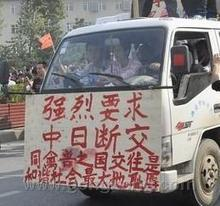
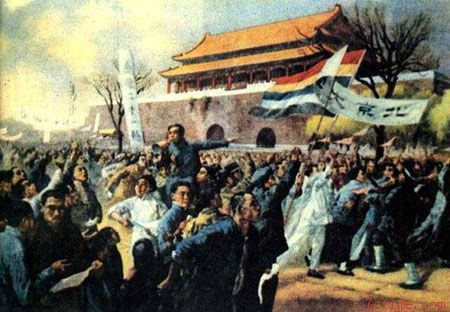
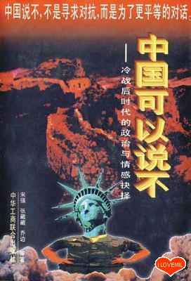
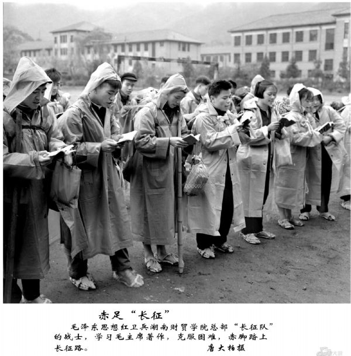

# ＜特稿＞从保钓群众运动看当代中国的“主义之争”

**我非思想史专家，本文的篇幅也不足以让我们全面检视100多年来中国现代思想的形成和变迁，但我想通过我们这一代人所亲身目睹和亲身经历的20世纪80年代以后的一系列思想论战来揭示一下当代中国社会民意的分野。在我看来，它沿着三条主线展开，分别是：“激进主义”与“保守主义”之争、“民族主义”与“天下主义”之争、“新左派”与“自由主义”之争。在诸如正在上演的“保钓”等大多数社会运动中，我们都能窥见这几条思想线索。**  

# 从保钓群众运动看当代中国的“主义之争”

## 文/陈季冰（上海商报社）

 

### 【作者按】

本文是我应《经济观察报》观察家版主编殷练女士之约所写的有关钓鱼岛之争及反日游行背后的思想之争的分析，文章借用了我四年前出版的《下一站：中国》一书中的一部分内容。文中凡有双引号的，绝大多数都是其他作者的文章和专著中的引语，由于报纸文章的体例关系，未加注释，望原作者及读者见谅。这些引语在我的那本书中一一都有注释。 

这次由钓鱼岛争端引发的席卷全国的轰轰烈烈的群众性反日运动，再次让我们对中国社会中沉寂了一段时间的各种相互对立的思维方式一览无余。事实上，正如我们连日来所不断看到的，“保钓爱国运动”的中心看点不是其诉求的落实与否本身，而是不同观点的人们对这场运动的截然不同的解读以及他们之间的尖锐分歧。 

我曾在自己的微博上评论说，这折射出以及过去的20世纪留给中国人的一笔最坏的思想遗产，那就是深入骨髓的“斗争哲学”。这一点，左派或右派皆然，我们不知怎么突然就变得不会像祖先那样遇到分歧协商博弈解决了。而“斗争哲学”之所以具有难以抗拒的的吸引力，是因为它首先将复杂的社会矛盾简单化，归咎于某些人或某些团体，满足了头脑简单的人的智力需要；同时又为暴力破坏提供了理论上的合法性，满足了另一些人心中潜藏的邪恶人性的宣泄。 

事实上，民族主义和爱国主义这两种东西为什么总是受到有识之士的高度警惕？决不是一些左派愤青一口咬定的那样：这些“公知”和“精英”全都爱美国超过爱中国。热爱手足同胞、美丽河山和传统文化，都是人性中最美好的感情。然而历史经验一再告诉我们，民族主义通常不是通过对同类的爱、而是通过对他人的仇恨和排斥来自我实现的。而一旦这种仇恨与排斥被煽动起来，失去控制，则必然演变为一场“反人类”的非理性暴行，我们从近日一些已经见诸报端的打砸抢烧行径中已经看到端倪。这是因为，“他者”总是可以无限划定的。 

虽然另外一些自觉不怎么对劲的人也想要觉悟，但他们一知半解地读了几篇小道消息和通俗历史文章后，来个180度转弯，将彻底“斗争”的对象变成了过去山呼“万岁”的对象。他们以为这样自己就脱胎换骨了，但细究下来，除了对象改变了以外，思维模式和话语模式与过去有一点不同吗？很遗憾，在我看来，这种“必须……彻底”、“只有……才能”的决不妥协的话语方式及其背后的思维模式，也许需要经历好几代人才有可能祛除。 

这笔思想遗产的源头，大概要到将近120年前的第一次中日争端——甲午海战——的失败以及直接由此引发的戊戌变法中去寻找。一个多世纪以来，伴随着一波紧接一波的国内革命与对外战争，它的形态和程度不断演化发酵，到文革时达到顶峰。改革开放以后，这种思维模式随着社会的迅速商业化和全球化而逐渐变异，日益以一种模糊扭曲的面目呈现出来。 

作为继“五四”以后中国现代思想史上的“新启蒙时代”，短暂的80年代以一种戏剧性的方式戛然而止以后，中国社会迅速折向了一条令启蒙知识分子措手不及的轨道：一方面，经济体制改革不仅没有丝毫停滞，反而在“南巡”之后义无返顾地加速前行，许多80年代不敢试、不敢闯的禁地到90年代以后变成了“创新者”的乐园。在以后的10多年里，中国经济取得了改革开放以后最快速的增长，而且，以成功加入世界贸易组织（WTO）为标志，中国经济日益主动融入西方主导的全球化进程。当21世纪的曙光乍现时，中国已经成为全世界举足轻重的经济大国，在国际舞台上的发言权和影响力也与日俱增。另一方面，由于与经济体制相配套的政治体制和诸如文化、社会、行政管理等各领域内体制改革的严重滞后，大量社会矛盾沉淀积累并日趋尖锐化。其中最突出的无疑是贫富差距扩大、贪污腐败猖獗和生态环境恶化，以及很大程度上与此密切相关的几乎整体性的思想道德滑坡。 

可以说，20世纪80年代和90年代之间存在着明确的精神“断裂”。正是这种断裂形成了一股有力的社会思潮，并对当今的现实政治产生了深远影响。 

我非思想史专家，本文的篇幅也不足以让我们全面检视100多年来中国现代思想的形成和变迁，但我想通过我们这一代人所亲身目睹和亲身经历的20世纪80年代以后的一系列思想论战来揭示一下当代中国社会民意的分野。在我看来，它沿着三条主线展开，分别是：“激进主义”与“保守主义”之争、“民族主义”与“天下主义”之争、“新左派”与“自由主义”之争。在诸如正在上演的“保钓”等大多数社会运动中，我们都能窥见这几条思想线索。 

#### **1．“激进主义”VS“保守主义”**

有人说，20世纪90年代以后中国知识界中最重要的潮流，就是保守主义思想的滥觞。“保守”与“激进”之争自上世纪80年代末至今，一直是中国大陆知识界的中心话题之一。 

有关“保守”与“激进”的这场论战，源自于对中国近现代史的不同阐释。整个争论主要围绕两条主线展开：其一，中国近现代社会思潮的主导力量究竟是保守主义还是激进主义？其二，中国近现代社会的主导思潮引发的社会政治后果主要是正面的、还是负面的？ 

1988年9月，历史学家余英时在香港中文大学25周年纪念讲座上发表了以《中国近代思想史上的激进与保守》为题的长篇演讲。这篇演讲的主旨是：自戊戌变法、特别是五四运动以后，中国近现代思想就走上了一条持续激进化的道路，到60年代大陆的“文革”时期登峰造极。这一“激进化”思想主流在中国近现代的政治实践中造成了严重的社会后果，它非但没有为中国带来其最初慷慨允诺的“自由”、“民主”，反而大大延迟了中国的现代化进程。因此可以说，社会主导思想的激进化是中国至今都不能顺利完成现代转型的罪魁祸首。演讲稿出版后于90年代初传到大陆，立刻引起了思想学术界的极大关注。在大陆，长期以来占主导地位的意识形态教育人们：“激进”的涵义是正面的，意味着革命与进步；“保守”的涵义是负面的，与落后、守旧甚至反动近义。二者黑白分明，不存在任何疑问。因此，海外引进的新鲜的思想维度，对内地思想界造成的刺激是显而易见的。 

复旦大学历史系教授姜义华是第一个对余英时的观点提出挑战的大陆学者，他们之间的对话也揭开了延续至今的关于近代中国激进主义与保守主义问题的争论的帷幕。 

姜义华在香港《二十一世纪》杂志1992年4月号上发表题为“激进与保守：与余英时先生商榷”的文章，指出：“保守主义者在近代以来的中国恐怕不是太少，而是太多；保守主义势力不是太弱，而是太强。”而在百年以来的大部分时间，激进主义事实上不是太强，而是太弱，只有看到这一点，才能解释中国的经济、社会、政治各方面变革如此之慢、如此之难。关于“文革”的性质，他的看法也同余英时截然相反，他认为“文革”不是激进和反传统，而是封建专制主义和传统中糟粕的大泛滥。 

余英时的观点得到了内地很多知名学者的认同，其支持者包括在80年代以激进态度提倡“新启蒙”的王元化及著名哲学家李泽厚等诸先生。而站在同情激进主义立场上批判保守主义的，大多为近年来活跃于国内学术界的中青年学者，他们一般都有西方留学的经历，身上带有明显的西方自由派烙印。 

随着争论的深入以及逐步“学理化”，这场关于“激进与保守”的对话渐渐转变为“唯理主义”的“法国道路”与“经验主义”的“英国道路”孰优孰劣的比较。究其实质，无非是“革命”还是“改良”之争。学者甘阳后来对于90年代的保守主义思潮作过一个归纳：即依据对西方经验的某种总结，区分“英国模式”与“法国模式”，前者代表改良、渐进，也是值得仿效的现代发展道路，后者则代表革命、激进，也是不足为训的范式；认为20世纪中国完全走错了道路，很不幸地没有走上英国道路，而是错误地模仿了法国模式，从而使一部中国现代史成了一段不断革命、日益激进的历史；由此，晚近以来的历史研究主流实际上主要也就是在检讨为什么近代中国人会走错了路，例如为什么不要改良要革命，不走渐进走激进，等等；由于近代中国走上激进道路通常被看成首先是中国知识分子的思想激进倾向所造成的，因此时人大多倾向于贬低以至否定“五四”人物及其代表的传统，而主张今天在思想学术上更应该继承民初文化保守主义理念；这种文化保守主义同时也发展为对当代西方思想学术的基本态度，即认为今天不应该再重复“五四”传统一味追随西方激进思潮的同样错误，这种看法甚至可能进一步延伸为对下一世纪东亚文明发展和东亚现代化模式的更一般论述。 

上海学者萧功秦指出，自20世纪初期以来，中国知识分子政治心态的一个基本特点是，崇尚某种抽象的中心象征符号，并以这种符号与理念作为一劳永逸地、整体地解决中国问题的基本处方。这是一种以某种“主义”来推演和涵盖解决具体问题的途径的思维模式。它认定某种主义是合理的，有功效的，只要符合这种“主义”的制度一旦建立，那么，从官僚腐败、国民道德水准低下，直到各种社会弊症和令人困扰的实际问题，都能迎刃而解。而这种从五四运动一直到80年代未在中国知识分子政治文化中一脉相承的“主义决定论”的理论基础，则是源自法国启蒙运动的唯理主义。它认定，现实世界是不完美的，丑恶的，不自然的。而理念的世界才是真实的，完美的和自然的。正是这种“完美主义”，如同宗教的救赎主义一样，对于理想主义者来说具有一种不可抗拒的道德魅力，并由此产生一种巨大的精神动力和政治感召力。而经验论为基础的英美式的自由主义的基本信念是，自由的秩序是从旧社会内部生长出来的结果。既然如此，生长的过程只能是一种渐进的过程。这种思想认为，世界上的问题没有一劳永逸的解决，任何进步都是不完美的，有缺陷的。人世间永远不会有绝对的完善，人类在争取进步的过程中，只能做到“两害相权取其轻”。正是基于这一认识，英美式的经验主义的政治传统，拒绝终极目的，拒绝完美主义地、毕其功于一役式的整体地解决所有问题。主张渐进地、逐步地逼进目标，一步一步前进。 

令人感到十分可喜的是，也有一部分人士试图跳出二元对立的思维模式，以一种多元、开放和兼容的模式来重新审视中国近代以来的激进与保守之争，从而超越那种我们已经习以为常的从一个极端走向另一个极端的思想“大跃进”。他们痛彻地指出，正是“这种两个极端的跳动，一次次非此即彼的极性思维，导致中国学术文化经验在一代又一代中断裂，总是不可通约交流，不可传递增长，每一代人总是从空白开始去获得自己的经验，然而，又重新抛弃这种经验，历史就这样一代代地荒疏和空洞下去。而在价值观上，则总是以一种暴力对抗另一种暴力，将体制的更迭变成思想的殊死搏斗，甚至不惜从肉体上消灭对手。这种状况导致了思想的反复中断，反复转圈，反复的无效劳作”。这批学者呼吁，当代中国知识分子不应当再像前人那样毫无保留地拥抱保守主义或激进主义中的任何一极，并对另一极全盘否定。相反，我们应当在理性分析的基础上继承二者的优良元素，并同时批判二者所蕴涵的负面文化因子。 

#### **2．“民族主义”VS“天下主义”**

有关“民族主义”与“天下主义（普世主义）”的争论，是构成中国知识分子在20世纪90年代立场分野的另一个主要“战场”。 

与自由主义一样，马克思主义是一种典型的普世主义意识形态，因此1949年以后相当长时期内，显性的民族主义在中国是一直受到压抑的。当然，受到抑制并不等于民族主义的思潮在中国大陆就不存在。例如，我们长期所受的“爱国主义-集体主义”教育在一定意义上就可以被视为民族主义的一种变体。随着苏联社会主义阵营的解体以及中国改革开放以后意识形态控制方面的松动，无论是东欧前社会主义国家还是中国都出现了不同程度的意识形态“真空”。这种时候，民族主义作为一种具有强大情感感召力的思潮，就大有卷土重来之势。 

在90年代，两个事件是促成中国社会就“民族主义-天下主义”展开激烈论争的导火索——先是一本粗制滥造的政论读物《中国可以说不》在海内外畅销所引起的关注，其后是北约导弹对中国驻南斯拉夫大使馆的轰炸。作为对这样一桩野蛮行经，中国学生的一些情绪化表现几乎在一瞬间内将西方人眼里的所谓“中国非理性的民族主义情绪”推上了风口浪尖。而2005年春由靖国神社和东海争端等问题而激发的北京、上海等地中国青年反日游行，则更招来了不少西方舆论对中国法治的非议。虽然中国政府在应对这一系列事件上采取了相当克制的态度，并在大体上还算“识时务”的对方的配合下，用较短时间迅速修补了与西方、特别是与美国的关系，但事件在中国民众及知识界的情感上造成的“震撼”却是异常强烈的。经过改革开放20年的潜移默化，中国社会正在逐渐滋生出一股相当具有普遍性的亲西方和学西方的情绪。然而，在一枚导弹和一架侦察机面前，人们仿佛遭到当头棒喝。许多人——尤其是内心敏感的知识分子——痛苦地发现，他们的价值立场被抛到了一个严酷的十字街头。 

实际上，对于这场争论的双方来说，最大的分歧不是讨论民族主义的善恶功过，而是民族主义思潮兴起在当今中国的利弊，以及我们对此应当采取的立场。而根据我本人的观察和分析，这种分歧在根本上又源于对当代的国际局势和国内现实状况，进而对中国未来面临的主要问题的看法和判断的根本不同。 

民族主义的怀疑者认为，当代中国并未遭遇严重的外部威胁，国家在政治、经济、文化诸方面的独立自主没有受到明显的挑战；在可预见的未来，中国的主要任务是加快各领域的改革，顺利实现现代化。基于这一基本判断，他们呼吁，社会应当对可能出现的民族主义高涨的情势保持足够的警惕。这是因为，民族主义一方面容易导致对外冲突，另一方面往往强调国家民族的绝对主权，排斥和压制个人自由和权利，因而很有可能阻碍民主化和改革进程。“民族主义并不必然导致专制，但很容易为专制主义所利用，因为它主张权力和资源的集中，鼓吹反普世的价值相对主义，具有很大的感性号召力，而其本身又无系统的理论体系，故极易被随意解释和滥用。它常常要求人民奉献出最高的忠诚，承担最大的牺牲。所以，民族主义的意外后果之一就是追求民族利益的良好愿望，反而造成了本民族成员承担了极大的个人牺牲。” 

与之相反，民族主义的鼓吹者则坚定地认为，随着冷战结束和单极化世界的形成，中国在政治、经济和文化等各方面都面临着比冷战时期更大、更严峻的外部威胁；未来中国面临的首当其冲的问题，仍然是保持国家主权和民族独立。在这种情况下，民族主义依然是我们最有力的武器。他们不无洞见地指出，自由主义者所讲的“人权”，只有在有政府保障的前提下，亦即一个特定国家内，才有意义。“只要这个世界仍旧存在着国家、民族和种族的划分，民族主义就有其存在的价值，人权就不可能完全脱离族权而存在……因而，只有对于这世界的现实一无所知的人才会否定民族主义的价值。”“说句简单化的概括：在对外关系中，族权即是人权；在国内政治中，人权即是族权。” 

普世主义者则反唇相讥说，狭隘民族主义情绪的高涨会导致盲目排外和闭关锁国，从而使中国在当今全球化时代再次错失现代化的宝贵机遇。在一些人看来，民族主义本身只是一种话语的操作平台，它必须与其他的“主义”相结合，才能进入实际政治运作状态。而就当下中国而言，最有可能在民族主义的平台上活跃的意识形态又恰恰是左翼激进主义。“中国这个多灾多难的民族，历史上饱受西方侵害，从来就不缺乏滋生极端民族主义的文化温床。”他们因而担心，结合了左翼激进主义的民族主义有可能产生巨大的破坏力量。这种破坏力量主要体现在具有递进关系的下列几方面：首先，它将凭借其压倒一切的语话优势对政府形成强大的“民意”压力，从而使我们已经坚持了20多年的改革开放的正确道路发生偏离。只要主政者在对外交往中采取务实理性的策略，都将被解读为“对外软弱”、“绥靖主义”，甚至“投降主义”而加以猛烈抨击。进而，这种“刚愤民族主义”将有可能走向新的“闭关锁国论”，并且它又必然与极左思潮的死灰复燃相联系，从而使中国重走过去的回头路。问题的严重性还在于，中国国内非理性的民族主义反过来又会激起西方同样非理性态度的反弹，并使西方世界中的理性现实的声音受到压抑。这种情况就会形成双方互动过程中的非理性的强硬派得势，务实的温和派受困，从而使任何理性解决问题的机会的出现更为渺茫。 

在民族主义的问题上，这次论争的最大成果不在于谁对谁错，事实上也不可能有对错的定论。就我的理解来看，通过这次讨论，我们在学理上理清楚了两条重要的脉络。 

第一条重要脉络是：中国在近代以前并没有民族主义，甚至连“民族”的概念都不存在。民族主义是“现代化”的产物，它起源于近代欧洲，但造化真是弄人，我们付出了巨大代价好不容易才发展出传统中没有的民族主义，将整个社会凝聚成一个真正意义上的“现代民族国家”，世界却又进入了“全球化”时代。历史上“发明”了民族主义的西方，现在又正在竭力摈弃它，这是不是意味着老祖宗发明但已被我们弃之一边的“天下主义”不久后也许将重新绽放异彩呢？这个问题很可能是未来中国在再度崛起和复兴的道路上必须作出的回答。 

第二条重要脉络是：民族主义可以分为政治民族主义和文化民族主义，它们属于性质完全不同的两个范畴，因而必须对它们作出严格清晰的梳理。政治民族主义指的是对民族或国家的政治认同，而文化民族主义指的是一种对母语文化的认同。政治民族主义一般不在意民族的传统文化，为了民族和国家的主权独立与兴旺强盛，它可以摆出一副彻底否定本民族传统文化的姿态。有人因此将这种政治民族主义称为“灵魂的典当”，因为其基本逻辑是：为了应对西方，赶超西方，中国必须舍弃自我而变成西方。文化民族主义则在很多地方正相反，它实际上是对一种特定“文明”的认同，它可能与民族的政治脱钩。有时候，为了延续和发扬该文明的传统，它甚至不惜激烈地反对自己民族的政权，反而倒能够对外族政权表达出一定程度的认同。 

在理清了上述两条线索之后，我们就可能就民族主义与天下主义之争做一个更加宏观和公允的判断。应当认识到，“民族主义”与“现代化”是高度关联的两个概念，因此，不存在要不要民族主义的问题。可以说，没有现代化，就没有民族主义；反过来也一样，没有民族主义，就没有现代化。所以有人说，不懂民族主义，就根本无法理解近现代的世界。但问题的复杂性在于，作为一个后发现代化国家，中国的情况与西方是截然不同的：我们的现代化要求并不是内生的，而是在西方压力下产生的；同样，中国的民族主义也不是随着资本主义的发展而自生自发的，它是反殖民主义的产物。因此，中国民族主义在很大程度上具有先天的“反现代性/反西方”集体无意识，百年前的义和团运动可说是这种集体无意识的最原始写照。如何利用和引导民族主义提供的巨大力量，避免民族主义可能造成的巨大灾难，将是中国未来相当长一段时期中必须走好的一段钢丝。在更深的层次上，我们还必须注意到，在西方，政治民族主义与文化民族主义通常是连为一体的——一个法国人认同自己的国家也就等于认同法兰西文化传统。而在我们这里，两者经常处于分离乃至敌对状态，由这种疏离和碰撞所擦出的火花有可能把我们国家现代化和民族复兴的旅程带上一条曲折诡谲的道路。 

#### **3．“新左派”VS“自由主义”**

相对于“激进主义”与“保守主义”之争及“民族主义”与“天下主义”之争，中国思想界中牵涉广度和深度都要深远得多、现实影响也更为重大的另一场论战是所谓“自由主义”与“新左派”之争。从某种意义上，这场肇始于20世纪90年代中期的大辩论持续至今仍在不断上演。 

论争的双方顾名思义，一方是所谓“中国自由主义者”，他们有不少是80年代“文化热”中的鼓吹思想自由的启蒙派，延续了一贯要求继续推进以市场化为方向的既定道路的改革开放的思想诉求，而新近加入者中则有相当一部分是经济学家；另一方则很不情愿地被称为所谓“新左派”，他们敏锐地看到过去将近20多年的改革开放和经济发展中积累下来的许多社会问题和社会矛盾，呼吁对目前的改革发展模式展开反思和修正。“新左派”中有很多是曾经游学海外的中青年学者，还有不少人至今仍旅居欧美，在学科上以人文领域居多。 

用我们过去耳熟能详的话来说，这场论战的核心实际上就是一个中国应该走哪条路的问题。“自由主义者”认为，持续了20年的以建立市场经济体制为导向的经济改革是一条正确的道路，沿着这条道路继续稳步推进，中国一定能够达到政治民主、经济自由、文化多元的成功彼岸；当前中国社会中伴随着改革开放而涌现出来的许多问题和矛盾——如国有资产流失、钱权交易和贫富分化等——是新旧体制转轨的过程中不可避免的，是一种暂时性的“阵痛”。这些尖锐的问题恰恰说明旧体制阴魂不散、新体制尚未充分发育，社会存在着一个模糊的“真空期”。因此，要解决上述这些问题和矛盾，只有拿出更大的勇气，下更大的力气去继续推进改革。例如，我们应当在经济体制改革的基础上加快推进宪政改革等等。相反，“新左派”则认为，中国的改革走的是一条西方式的“自由主义”路线，已经在一定程度上悖离了原来追求人人平等、人民当家作主的社会主义路线，而当前凸显的种种社会矛盾正是这种错误路线的反映。当然，“新左派”并不反对改革，但他们要求对正在进行的改革进行充分的反思和修正；他们并且呼吁社会重新挖掘和肯定改革以前中国的传统社会主义体制中的许多合理因素。 

正因为这个缘故，“新左派”顺理成章地将自己视为一种不合理的现行体制的批判性力量，而将自己的论敌归入这一不合理体制的“辩护者”行列。 

对转轨时期触目惊心的腐败和社会不公问题，自由主义不认为问题出在市场经济本身而应对其展开批判和抵制，而是认为原因在于市场没有摆脱旧的权力体制的控制，是不成熟、不规范的，因此出路在于发展和完善市场经济。自由主义相信，市场自身发展的要求和规律，加上人们的理性努力，终将使市场经济制度日益完善和发达，使建立在此之上的民主宪政体制日趋稳固。关于政治民主化，自由主义并不认为市场经济和民主政治是同义语。在相当一段时期，反民主的权力完全可以容纳，甚至推行市场运作方式，并从中大获其利，但从长远看，市场经济是瓦解集权制度的基本因素。市场不是民主的充分条件，但却很可能是民主的必要条件。因为自近代以来，还未发现真正稳定的民主与市场经济分离的事例。在“中国自由主义者”看来，认为市场经济会自动导致民主固然是幼稚和错误的，但‘新左派”反其道而行之，把自由经济视为奴役的力量，则更为荒谬。对于自由主义立场而言，中国向市场经济转型问题再多再严重，也只能硬着头皮向前走，决不能走回头路，决不能返回衣、食、住、行都被人包办，种什么、造什么、卖什么都得等上级指示的那种日子。关于全球化问题，自由主义认为，中国的改革开放进程大致与世界范围内的全球化高潮同步，这对我们既是一个机遇，也是一种考验。像鸵鸟一样回避，甚至以顽固的态度拒斥，最后吃大亏的还是我们自己。 

由于“新左派”将自己视为不公正的社会秩序的批判者，它自然就成了一种否定性的力量，其话语方式也自然以抗议和声讨为主。因此，“新左派”虽然尖锐地批评当前的社会体制，但它自身却很难端出一套对未来中国到底应该走什么路的比较系统和有条理的主张。在大多数问题上，它说的都是“不应该”，而它认为的“应该”究竟是些什么，则是相当凌乱和模糊的。 

与历史上所有的左派如出一辙，“新左派”的最重要的辩论手法之一，是质疑其论敌的辩论动机。在一定程度上甚至可以说，他们的重点并不是放在与“自由主义者”展开说理，而是质问对手：“你们这么起劲地与我们争辩究竟是出于何种目的？”他们的逻辑是这样的：社会现实是不公正的，而你却为这个不公正的社会现实进行辩护，因此，你一定是国内既得利益群体和跨国大资本的代言人。采用这样的话语方式，实际上是想从根本上取消其辩论对手在这个问题上的发言权。 

相当意味深长的是，无论是“新左派”还是“自由主义者”，双方阵营中都有人对这场争论本身提出批评。例如，“新左派”学者汪晖曾指出，自由主义的真正论敌应该是极权主义，而社会民主主义的真正论敌应该是民粹主义，然而目前在中国“自由主义”与“新左翼”却将对方视作最大的理论上的敌手，反而放过了真正的敌人，这实在是令人遗憾的。秦晖将市场竞争和“原始积累”（在现阶段表现为少数权贵大量非法侵吞攫取国有资产）比喻为“做买卖”和“抢来本钱”，在他看来“做买卖”并非都以“抢来本钱”开始，而且“抢钱”者往往是做不好“买卖”的。也就是说，市场经济未必要从“原始积累”开始，“原始积累”也不一定导向“市场经济”。秦晖正确地指出，近年来中国有个奇怪的现象，即在盛行“抢来本钱做买卖”的今天，有人忙于论证“抢来本钱”是如何不可避免，是飞向市场经济的“第一级火箭”；有人则忙于抨击“做买卖”是如何败坏人文精神，是社会痞子化的罪恶渊薮。却很少有人在为公民争取“做买卖”的权利的同时，向“抢来本钱”者做正义的抗争。因此，与其说“人文精神失落”的原因是市场上的等价交换淡化了“终极关怀”，勿宁说是原始积累中的强权原则破坏了社会公正。事实上，如果真做到了“最初财产来路清白，且后来的财富积累是通过自由交易实现”，我们现在的贫富悬殊又何至于如此严重！秦晖深刻地洞悉到，在当前中国，效率与公正的矛盾完全是一个虚幻的冲突。因为在发达国家，与“效率”相对的“公平”是指结果平等而言。竞争出效率，但竞争的结果有输赢之别，输赢无别的“平等”等于取消竞争，因而会影响效率。在这个意义上，“效率和公平”确实是个两难选择。然而从来没有人会认为竞争过程的公正与效率不相容，因为过程的公正恰恰是竞争得以实现的前提，从而也是效率的前提。因此“效率与公平之争”从来就不是针对过程的公正而言的。 

假如我们认可秦晖的立场，那么究竟什么原因造成了这种牛头不对马嘴的自说自话呢？答案恐怕还是在于对中国国情认识的偏差上，即自由主义模式是不是已经成为或正在成为中国的现实？当“新左派”义正严辞地质问“自由主义者”——“反对极权主义就是为了让我们沦为资本的奴隶吗？”的时候，他们应当首先搞清楚的是：当前中国社会中最主要的奴役力量是什么？而什么又是有可能瓦解这种奴役力量的重要的批判性力量？我们的确应当反对一切不公正，但在不同的情境之下，造成不公正的根源也是不同的。更有可能的一种情况是：明天很可能构成压迫性的力量在今天却正在发挥着解放性的功能。正如“自由主义者”指出的，“新左派’始终只关心资本对于民主的威胁，他们所说的资本，指与国家权力相脱离的资本，这很容易导致放松对国家权力的警惕。” 

在“自由主义者”看来，“新左派”错把中国当成了美国，或者至少在想象中认为中国在根本性的体制上已经与西方没有什么太大的区别。“自由主义者”认为，“新左派”的问题意识与问题表述完全是从西方来的，但问题的指向却是中国。事实上，“新左派”在面对自己论说问题的时局时，对于当代中国问题的症结究竟何在的判断，是与现实中国问题完全错位的。 

在这一点上，我本人是与“自由主义者”站在同一立场上的，中国是否以及在多大程度上已经资本主义化？这确实仍然是一个问题，决非“新左派”想象得那么简单。如同中国的“后现代论者”一样，“新左派”在批判西方中心主义的同时忽视了民主自由等所谓西方“现代性”在中国依然是一个“尚未完成的工程”。在西方社会，“左派”从来是一种边缘化的批判声音，尽管是不可或缺的，而实践中走的是资本主义的现代化道路，但在中国，资本主义现代性或所谓自由主义从来没有真正实现过，至今也依然没有成为主流。因此，对所谓“现代性”的反思在西方发达资本主义社会中或许是一剂良药，而在很大程度上尚处在“前现代”阶段的中国则难免“淮橘为枳”。 

从某种意义上看，上述这些“主义之争”是中国知识分子群体在经历了80年代的狂热与挫折之后的一次集体性自我反思。具有历史意义的是，自此以后，中国的社会思想进入了一个1949年以来从未有过的全面分化时代。今后，对于每一个重大社会问题和每一项重大政策举措，不同个人和不同群体都会依据各自不同的利益和价值立场作出不同的分析和评价，并决定自己对它们的不同态度。以往那种通过口号或动员将全社会的思想统一在一个目标之下的机制将难以行之有效，这反过来又将有力地改变现实政治运行的模式。  

### 【编者按】

原文发表于2012年9月24日期的《经济观察报》“观察家版”。见报标题：中国现代的“主义之争”，链接：http://www.eeo.com.cn/2012/0921/233940.shtml。 本文经授权后转载，所有权利归作者所有。  

（采编：彭程；责编：周拙恒）

 
