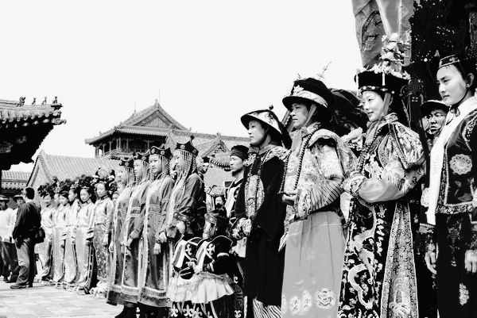
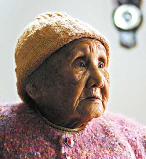
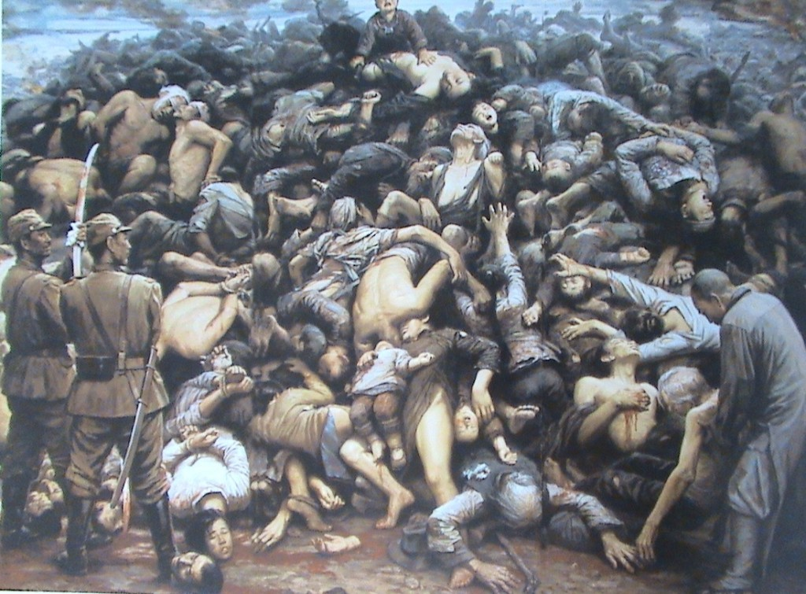

# ＜特稿＞写给那些“爱国者”

**胡适说：“历史是任人打扮的小姑娘。”我看啊，历史是个婊子，舆论是号称处女的婊子，艺术是向往纯洁的雏妓，政治是控制婊子们的老鸨，真相是个老姑娘，失足多年，被人操多了也就没罪恶感，而且丫还不怕得艾滋……**

**反侵略的根本目的是什么？无非就是不做亡国奴。既然早已经做了奴隶，国有何用？如果我们不能维护国人利益，怎么维护国家利益？更谈何“爱国”？**

 

# **写给那些“爱国者”**

# **——如果当年日本灭了中国，**

# **你们敢纪念南京大屠杀吗？**

## **文/兰天（浙江大学）**

 

今天，2011年12月13日，南京大屠杀74周年，我们每年都在纪念南京大屠杀，可是这样的屠杀在中国历史上不是首次，更不是最惨绝人寰的。可为什么我们唯独纪念“南京大屠杀”，我们有多少人纪念甚至知道“甲申国难”呢？

1644年，甲申年，清兵入关，嘉定三屠，两万，扬州十日，八十万，江阴残杀，十七万。中国人口从明天启三年（1623年）的5165万锐减至顺治十七年（1660年）的1908万，杀死汉人3200万，人口减少近三分之二!后来还有血洗江南、岭南。屠昆山，屠常熟，屠海宁，屠广州，屠赣州等等。转战烧杀三十七载。史称“甲申国难”！

2004年，甲申年，没有人为那些惨遭屠杀的几千万同胞举办悼念活动，更有甚者，沈阳市堂而皇之地纪念清军入关360周年，举办“紫气东来”清文化节。沈阳市委书记张行湘在沈阳市思想宣传工作会议上说：“今年是清入关360周年，沈阳‘一宫两陵’申报世界文化遗产也将在今年揭晓。沈阳将利用这一契机，做大做强‘清文化’品牌，举办十大主体活动，加快建设全国一流文化名城步伐”。

几千万被屠戮同胞的亡灵要抗议：我的同胞几百年不为我举办个悼念会，却为杀戮我的异族刽子手和汉奸败类举办文化节、表彰会，还组织凶手后代回满洲故里旅游并提醒他们别忘记老家，看来还是当汉奸好啊！

日本人也要抗议了：我比满洲人杀的人少两千多万，满洲人强迫你扎辫子，我又没强迫你穿和服，你每年几十部电视剧歌颂满清王朝，却对我干的事情年年抗议，年年纪念，人世间公道何在？

在对比甲申国难与南京大屠杀时，有学者提出，满族已经成为我中华民族一员了，甲申国难，属于民族内部矛盾，而南京大屠杀属于民族间矛盾，不可同日而语！

这确实是中国人自古以来的逻辑：自己人杀自己人，那不叫杀人。可以死在自己人手里，不可以死在侵略者手上；可以被满人砍死，可以被批斗整死，可以被坦克压死，就是不可以被日本人杀死；清皇室杀了几千万汉人，当时不照样被汉人自称奴才叩谢皇恩，现在汉人不照样给他们拍这秘史那秘史给歌颂歌颂，一会儿宫，一会儿步步惊心，被汉族少女们“四阿哥”、“八阿哥”幻想着倒贴吗？我们太祖倒行逆施弄死几千万人不一样伟大领袖山呼万岁么？我中华民族，天朝上国，什么都缺，就不缺人，死几千万人算个屁啊，反正老百姓你早死晚死也都是死，这么“一点点”内部矛盾只要“三七开”就过去了，还是功大于过。大清朝、中华人民共和国又不是你小日本建的，凭什么屠杀我们三十万？换句话说，想屠杀而不被骂还被赞颂可以啊，你有本事灭了中国，夺了政权呀，那就名正言顺啊。

那假如当年日本真的像满清一样灭亡了中国，夺取了政权，现在我们敢纪念南京大屠杀吗？ 这个答案很简单，欲灭其国，先去其史。鲁迅先生说：“对我最初的提醒了满汉的界限的不是书，是辫子，是砍了我们古人的许多的头，这才种定了的，到我们有知识的时候大家早忘了血史。”乾隆三十八年开《四库全书》馆，全国图书都要进献检查。乾隆三十九年命各省查缴“诋毁本朝” 之书，尽行销毁。不仅不利于满清的文献被禁毁，连前人涉及契丹、女真、蒙古、辽金元的文字都要进行篡改。《天工开物》、《物理小识》、《武备志》、《明将军传》等非常有用的，记录中国科学成就的书籍也被清朝列为禁书。《扬州十日记》和《嘉定屠城记略》，在中华本土消失了二百多年。二百多年后，才从日本找出来。满清就是这样阉割了中华的光辉科技和灿烂文化，使中国回到了欧洲中世纪黑暗蒙昧的境地。

如果当年日本赢得了战争，统治了中国，不照样可以让清人不了解“甲申国难”、大多数现代中国人不了解5.35真相一样不了解南京大屠杀吗？ 你知都不知道，你还纪念个屁啊！ 你知道又怎样？你穿越到清朝在衙门口一身缟素，衣服上写个“勿忘扬州”试试，或者，你现在到天安门广场举个牌子写着“支持天安门母亲”，然后看着表看几分钟之内警察扑倒你。

如果日本成功了。日本人又会建立一个类似于满清的日本朝代，即使日本朝代被推翻了，汉人又夺了权，专家学者文人们会不会又说大和民族已经成为中华民族一员了，南京大屠杀是民族内部矛盾，纪念南京大屠杀不利于民族团结？XXXX年7月7日，会不会开始纪念日本入华多少多少周年？天皇会不会像康熙、乾隆一样成为中华民族的崇拜的偶像，然后又有天皇王朝、天皇秘史的电视剧出来歌颂了？

**胡适说：****“****历史是任人打扮的小姑娘。**

******我看啊，历史是个婊子，舆论是号称处女的婊子，艺术是向往纯洁的雏妓，政治是控制婊子们的老鸨，真相是个老姑娘，失足多年，被人操多了也就没罪恶感，而且丫还不怕得艾滋****……**

南京大屠杀是国耻，没错。我们该做的，是反思这个耻是怎么造成的，怎么去避免再一次发生这样的耻辱。缅怀逝者更没错，兴百姓苦亡百姓苦，人民是最无辜的牺牲者。但是，你们是不是打算一命抵一命来报仇雪恨？中国历史上所谓开疆拓土的时候杀的人屠的城多了去了，你愿意用你的命来给中华民族赎罪吗？你们的命是命，别人的命就不是命吗？侵略者当然可恨，如若无故来犯，抢我饭碗欺我女人，我定当拼死一战。

你叫我们要爱国，那我们就先说说什么是“国”，对于“国”的理解，恐怕要追究一下历史。最初人类并没有国的概念，早期人们处在土地经济的时代，人们必须要有生养的地域，没有了地域就没有了一切。土地是一切生活与财富的唯一资源。如果谁要侵占了这个地域就会把当地人的生计剥夺，当地人的利益就会丧失；甚至被杀掉或沦为奴隶，人们必须保护自己的土地，保护自己的同胞。人们永远都是从生存和利益的角度作为出发点考虑问题，于是，慢慢有了“国”，产生了疆土的概念，用国来保护自己的生存条件和利益。随着文化的发展，人们对既有的生存方式、族群和土地产生了依恋的感情和习惯，于是祖国的观念开始产生、强化。

“国”是利益共同体，国之所在乃利益之所在也。没有共同、共认的利益存在，这个国就会分裂，共同的国就不存在。爱国不是空洞之物，它与民众认可的生存条件密切相关。历史上，祖国的地域不断在变，民族在变，文化在变，统治者在变（不管是本土还是外来），人们通过综合的利益考量，只要生存条件获得认可，就会接受新的变化——比如清朝统治者作为外来人，依然像其他王朝一样统治中国数百年，并被普遍接受为正统，纳入中华民族一样，一成不变的祖国是不存在的，这就说明了，生存条件和利益决定一切。人们之所以会爱国是因为国人的利益系于国之中。国人之所以要爱国是为了保护自己的生存条件和利益不会受伤害。所以，一切爱国之行为必须以国人的利益为依据。

在土地经济时代，随着生产和分配的延续，财富向少数人集中，于是产生了家族对国的统治，是家国，普天之下莫非王土。二十世纪又出现了党对国的统治，是党国，党的利益高于一切。在家国中，王（皇）是唯尊者，在党国中，领袖或领袖们是唯尊者，都是专制统治。尊者为主，国家之主权在尊者手上（千万不要以为国家主权一定为国人所有），国人的利益服从于尊者。当尊者严重地伤害了国人利益时，在大众忍无可忍的时候，国将不国，国会分裂，主权会更替。只有主权在民的宪政社会中，国之意义才得以充分体现。

专制者为了让无权的国人支持自己的独裁政权，多以激发爱国热情作为手段来蒙骗国人，通过爱国宣传鼓动来掩饰自己漠视、践踏国人利益的本质。说到热衷爱国、爱民族的宣传，历史上当数独裁者希特勒为最，不信你就看看他的演说，几乎没有几篇不谈爱国、爱民族的。现代法治国家，多以自己的体制为自豪，不管对外、对内，爱国以捍卫人权与法治为宗旨。人们把对政府的批评监督视为一种爱国行为，社会绝不能容忍政府凌驾于民众之上。

时至今日，南京大屠杀仍如芒在背一般刺痛每一个中国人的心，三十万人的性命在6周内灰飞湮灭，每一个有良知的人，不管是中国人、美国人、非洲人，还是日本人，面对这样灭绝人性的历史，都应饱含愤怒与控诉！

我们应气愤日本对我们的恶行，但更应气愤的是，是同胞们自己对自己人的恶行。我们更该怒斥的是，那些为了掌权，不惜围城饿死同胞无辜百姓的人，为了权力，整死那么多同胞的人，为了利益，无视百姓生死，制造血拆、躲猫猫、睡觉死、追尾、嫖宿幼女、地沟油、毒大米建豆腐渣工程的人。

******反侵略的根本目的是什么？无非就是不做亡国奴。既然早已经做了奴隶，国有何用？如果我们不能维护国人利益，怎么维护国家利益？更谈何****“****爱国****”****？**

 

（采编：徐海星；责编：黄理罡）

 
