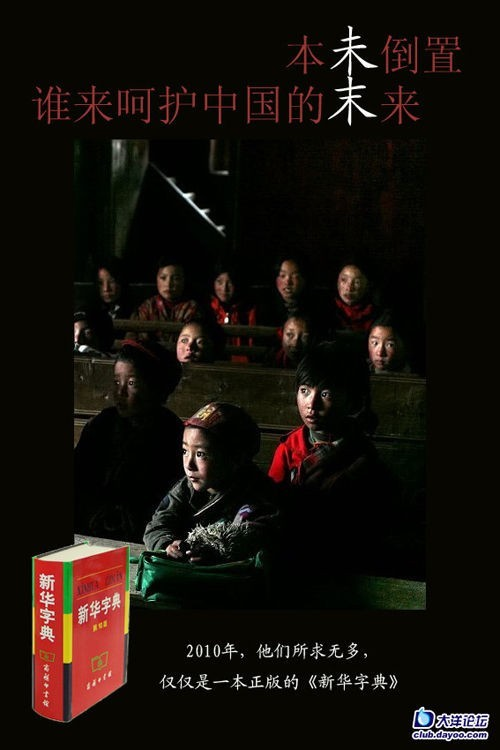
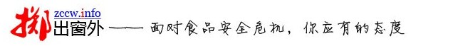

# ＜特稿＞吴恒——一个过路人的故事

**“就是让更多的人了解到这样的一个现状吧。让大家了解到当下的食品安全问题是很严峻的，我所想要达到的一个期望就是，将来想要去表达自己的不满的话，可以把这个当成是自己的援引资料，就是说，你看，那个资料库上那么多的东西都出了问题，你们是怎么管的，大概就是这个样子。相当于就是让大家有一个比较感情集中的爆发点吧。”当笔者问及吴恒对“掷出窗外”的目标时，吴恒如是说。**

# 吴恒——一个过路人的故事

## 文/孙微阳（辽宁大学）

2009年8月，复旦大学历史地理研究中心的学生吴恒离开繁华的上海，前往宁夏固原市西吉县三合村三合中学支教。有生以来第一次，他由学生变成老师，教的科目是语文。像很多青年支教者一样，吴恒对于自己的支教生活也是充满了憧憬和希望。随着支教的进行，吴恒发现当地的孩子们没有条件使用正版字典。这让他很忧虑。 “孩子们所犯的错误恰恰是因为他们认真查阅了字典，”吴恒说起“首末倒置”和“未来的未”。“字典作为工具书，如果连工具书都出了问题，这个是非常非常黑色幽默的事情，这个比其他的那些读物啊那些，会更有戏剧效果，会更讽刺一些吧。”吴恒回忆道。 于是吴恒开始想办法筹款，目的是让学校里的孩子们都能用上正版字典。在他正在发愁如何筹款的时候，和老罗的相遇，给了吴恒继续下去的动力。 “如果没有他，我也就不会做这个项目了。因为我是计划出国读书，所以要考GRE，，所以就去报了老罗的班。然后到班上就认识他了，开始还没有想到，后来课上到一半了我突然想起。当时就想到他钱多，而且以前也做过公益，我就打算直接向他要钱，就要了几千块钱，就可以给我的学生买词典了。然后他说这个事情直接上网络上去做，这样影响能大一点。我一想觉得有道理，他能够去帮忙去宣传的话就比较靠谱。我就开始着手去准备这个东西了。如果没有他的话，我还是会去做，但是不会做这么大，也不会把计划列得这么详细。” 

之后，老罗将“一本正经”计划转发布到了牛博网上，并引起了广泛的关注。短短五天的时间，求助信以惊人的速度传递着，网友们强大的爱心让吴恒提前实现了他的计划。 而“一本正经”也让吴恒的名字第一次被这么多人看到，并记住。 在此之后，吴恒又发起了“天使的翅膀”一对一帮扶计划，同样获得了广泛的响应。而吴恒在联系好了几个一对一帮扶的家庭和学生之后，悄然退出了公众的视线。 直到2011年6月17日，吴恒的网站“掷出窗外”上线，《中国食品安全问题新闻资料库（2004-2011）》出炉。 这是一个专门搜集整理与中国食品安全问题有关新闻的网站，他用一个月时间，和34名志同道合者一起，做了一个“中国食品安全问题新闻资料库”，并做好了详细的数据统计工作。网站上线的第一天，浏览量就已经突破了9000，并且迅速成为一大新闻，引来各路媒体采访。 “其实食品安全的问题离你一点儿也不遥远啊，你应该是对所有人都抱有一个同情之心，更需要要感同身受，就是尽量去理解别人的苦难，其实也是发生在自己身上的苦难。这种情怀会更强烈一点吧。” “就是让更多的人了解到这样的一个现状吧。让大家了解到当下的食品安全问题是很严峻的，我所想要达到的一个期望就是，将来想要去表达自己的不满的话，可以把这个当成是自己的援引资料，就是说，你看，那个资料库上那么多的东西都出了问题，你们是怎么管的，大概就是这个样子。相当于就是让大家有一个比较感情集中的爆发点吧。”当笔者问及吴恒对“掷出窗外”的目标时，吴恒如是说。 有媒体说吴恒是文化人物。“啊？！什么时候的事情？”，“我怎么没有听说”，吴恒听到笔者谈及这个说法的时候，相当惊讶。惊讶之余，吴恒还表示“更要低调了”。 “并不是说我苦心积虑想了好几年，才想到要做这个，只是正好我路过这里，我发现了问题，然后我琢磨了一下我自己的能力，我觉得我应该有所作为。” 说起这一系列的事情，吴恒坚持认为自己只是一个过路人。 

### 从小生长地很自由

1985年11月29日，吴恒出生在湖北荆门的一个农村家庭。有一个亲哥哥。“当时父母对哥哥的管教是很严的，就把精力主要放在对哥哥的管教上，对我的管教就稍微比较宽松一点。也就基本上没怎么管我。”吴恒认为自己很幸运，因为哥哥的存在，自己可以“自由地生长”。 “小的时候我也会看一些书，就是一些很传统的书。我印象比较深得是一个是看上下五千年看的比较多，另一个就是《童话大王》的这个期刊。”甚至《童话大王》对吴恒的价值观和审美观都产生了决定性的影响，“人保留自己的想象力这一点是非常重要的。而且童话大王的文章当中会有一种善恶分明的，好人有好报这样的一种观念，这种价值观在我的小时候影响是非常大的，甚至是影响到了现在。” “不过总体来讲也没有看过什么特别有深度的那种书，都是非常普通的那种作品。” 自小成绩优秀的吴恒考入了当地最好的一所高中就读。因为那所高中聚集了来自各个其他学校的尖子生，到了这里，吴恒的优势显得不是那么明显了。“有的时候就有一种比较强的被遗忘的那种感觉吧。” 这种“被遗忘的感觉”在吴恒被调到高中的“实验班”上的时候更加明显了。“因为班上有很多成绩很好的学生就会很招老师的喜欢嘛，老师就会动不动就去问他复习地怎么样了这样子，然后就感觉这方面，不知道是我太敏感还是怎么回事，就感觉自己不太招老湿的喜欢。后来我也就干脆放弃招老湿喜欢了。” 所幸吴恒有一个很好的同桌，证明了吴恒并不是“被遗忘的”。“整个高三其实对我影响最大的是我的同桌，我是有不懂的就会向他请教，他不会觉得教我是浪费时间这样子，就很耐心地讲解，可能是从那个时候开始，当我遇到一些困难的时候，我更倾向于把目光投向我的同辈人吧。” 说起他所在的实验班，吴恒很有自己的看法。“实验班这个东西，我觉得决策者他可能是对所谓的毛泽东思想比较领会贯通吧，就是集中优势力量歼灭敌人的这种思路吧，我站在他的角度上市可以理解的，但是如果站在学生的角度讲这样子是非常不公平的，在实验班上都是最好的老师，但是剩下的学生更需要老师的指点，可是还得不到好的指点。我是因为自己在实验班所以没有很深切的感受到这种差异，但是如果我当时没有进到实验班里，那估计可能结局就会不一样了。” 面对高考，吴恒依然有一套自己的看法。“有的时候上课都不听老师讲了，一方面是听不懂，另一方面觉得我已经落下他们很多了，在这条路上已经很难赶上他们了，那我不如自己再找一条路，说不定能跑在他们前面嘛。不一定非得和人家抢一条路嘛。” 最终，吴恒的成绩让所有的同学都惊讶了一把。他考上了武汉大学空间信息与数字技术专业。 

### 第一次接触启蒙的大学

大学本科阶段的专业是吴恒的表哥给他建议的。“因为表哥是早几年读的大学，所以他对形势有一个比较好的把握吧，他可能觉得男生做技术还是比较靠谱一点吧，然后他就跟家里推荐了这个专业，我一看也不会觉得太讨厌吧，然后就报了。” 说起吴恒的思想变化，他说“我是进入大学的时候才开始进入传说中的启蒙阶段的（笑）。”在混了一年的社区之后，吴恒彻底改变了对世界的看法。“有一段时间有学长就介绍我去猫眼看人，凯迪社区。就是在那个地方狂看了一年的帖子，就是纯看的那种，看完了之后就彻底改变了对这个世界的看法。” “其实现在想起来，中间也有一些帖子非常偏激，但是当时也就不管这么多了，就全部都读进去了，然后就觉得很可悲，然后我现在回忆起来那段时间就是，之前的20年被洗脑了一次，然后那个时候又被洗脑了一次，而且那段时间走得比较极端，就是之前觉得电视上，书上讲的都是真的，觉得不可能事假的，但是在凯迪上混了一年之后就发现，书上讲的全是假的，没有一个是真的，就是产生了那时候的一些非常极端的虚无主义的想法。” 崇尚魏晋风骨的他，研究生阶段则选择了历史地理作为自己的专业。“当时最初打算就是研究的是魏晋，就是觉得好像那个时候的人都比较牛逼一点，就是很拉风的感觉，魏晋风骨啊什么之类的”。 “而且那个时候我在想，既然书上都是假的，那要不我自己去看一些世界是怎么个样子的，就是产生了想读历史这样的一个念头。” 对于这个世界的好奇，和本科阶段的专业训练，则让他最终决定了自己未来的方向。“我本科阶段学的是空间信息嘛，通过那个时候的学习我发现，现在的高科技会很容易地让我们知道现在的样子，但是我更好奇它是怎么变成现在这个样子的。而且从历史的角度会更容易地得到这样的一个答案。又的确是和这个相关，我就觉得，哎，要不就考这个吧。” 

### 感谢父母并没有刻意地要影响我

面对山区孩子们期盼的眼睛和近在咫尺的食品安全威胁，吴恒总是无法保持淡定。他在日记中写道，“凭什么呀？都生活在同一块国土上，同一片蓝天下，都聪明伶俐、活泼可爱，都是祖国的花朵、民族的未来，和城里的孩子相比，凭什么他们就容易 受伤害的多。是因为他们家境贫寒，没有更多的购物选择？还是因为他们没有见识，不知如何表达不满？那些无良商人就敢这样肆无忌惮把毒手伸向他们，就敢往牛 奶里加三聚氰胺，就敢往字典里掺错别字。”    “起初他们在婴儿奶粉里掺三聚氰胺，我还没有养孩子，我不说话；接着他们在火腿肠里掺瘦肉精，我不怎么吃火腿肠，我仍不说话；此后他们使用地沟油，我很少在外吃饭，我继续不说话；再后来他们使用牛肉膏，我决定不吃牛肉了，但还是不说话；最后，我依然被毒死了，但没人能告诉我是什么原因，因为，后来大家都被毒死了。” 他坚持认为，大学阶段，学生应该保有自己的梦想，并且在能力范围之内，勇于承担责任。当笔者问及这一系列的项目时，他觉得自己“只是做了自己应该做的”。 “我一直是相信能力越大，责任就越大的”。“我没有做过我能力范围之外的事情，都是在我觉得我应该做的时候才去做尝试的。” 他相信每个人都天降大任。“我觉得每个人在历史当中都多少会承担一点责任，所以也会觉得自己有一点历史责任要承担，那我现在就是要做好准备去承担这样的一种责任，我觉得每个人都应该有这样的想法，因为每个人都会多多少少的改变历史。” 当笔者问及吴恒为什么会从小时候相信电视，相信书本，一路走来，到现在开始怀疑，开始思考，开始行动的时候，吴恒说，“因为我总是在自己去成长和判断，再加上后来的一些事情的证实，我发现自己走的路还是可以走下去的，就更坚定了。” 对于父母给的影响，吴恒这样说道，“我现在想来他们对我最大的影响就是没有试图对我施加影响。这样就会让我的自我意识更强一点。” “我觉得我最大的特质就是同情心吧，会乐观地相信很多事情都是可以改变的。”说到这，吴恒很自豪。  **[掷出窗外——面对食品安全危机，你应有的态度 ](http://zccw.info/)**  

（采编：刘一舟；责编：刘一舟）
