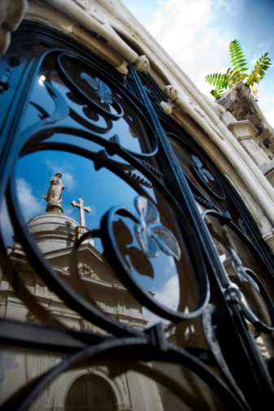
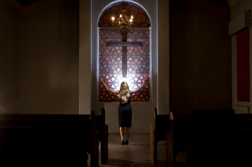

# ＜特稿＞想念温州，想念她的基督教——献给上个月不欢而散的北斗武汉聚会

**这次聚会最终不欢而散。事后想来，信仰问题无小事，在自己安身立命的信仰面前任何事物总是次要的。武汉的基督教氛围淡薄，信奉外来宗教的基督徒与这个社会并不是完全融洽地存在于一起。他们太需要有人倾听他们的声音，因为压抑而不免过激，不自觉地干涉他人的自由意志。对于自由主义者来说，所谓的自由不是为所欲为（free to）的积极自由，而是免于他人强制（free from）的消极自由。**  

# 想念温州，想念她的基督教

# ——献给上个月不欢而散的北斗武汉聚会

## 文/陈芝（华中师范大学）

 

遥记得小学时候读《圣经》，毫无敬畏可言。如今唯一记忆清新的，是在寒冷凄怆的无冬之夜，大姨点燃起长明火，于阴暗的哥特式小教堂里念叨《传道书》中的章句：“虚空的虚空，虚空的虚空，凡事都是虚空……已有的事，后必再有；已行的事，后必再行。日光之下，并无新事。”彼时我好奇，一座商人的城市，一座中国的城市，一座据说有悠久的耕读持家传统的城市，又是如何这般轻易地接受了基督教，相信这凉薄的人世间，存在一个看上去虚无缥缈的上帝，会庇佑凡世间渺小的人类。而据说为了众生一体承担罪孽，这上帝又残忍地将自己的亲生子送上了十字架。

因为不相信荒谬，所以始终不信仰。无论是小时候，还是现在，我都不是基督徒。我大姨一家是，我爷爷奶奶是，我认识的很多亲戚朋友都是。然而，我不是。记得以前不信仰基督的理由，在于我认为这不过又是一尊邪神，又是一个可恶的奴隶主，我不愿意自愿为奴。直到许多年以后我才啼笑皆非地想到，为什么我作为一个中国人，会默认一群卑微的凡人对自己的统治理所当然，而对这超越卑微自己的存在表示强烈反感？想来刘小枫说的没错，中国的传统里，人的地位并不是如同启蒙者所说的太低了，反而是太高了。人可以参天地，赞化育，由是主宰人的只能是活生生的人，而不是虚无缥缈的神。神可以作为王权的威示，却不能干预王权的统治。对于人而言，所谓的神不过是一种工具，使人能够在尘世获得幸福的工具。倘若在尘世不能获得幸福与完满，要神何用？这样的思维，不单单在我们这群不敬上帝不信上帝的异教徒无神论者泛神论者之中，便是真正的基督徒，能摆脱这种思维限制的又有几个呢？

反正，我见得不多。

相较于内地的城市，温州是一座宗教氛围很浓的城市。据记载，温州主要信奉的宗教有佛教、道教、天主教、基督教（新教）。佛教宗派类有禅宗、天台宗、律宗、密宗、净土宗。温州道教有正一道、全真道两大道派。基督教（新教）有内地会、循道公会、耶稣教自立会、温州中华基督教自立会、基督复临安息日会浙南分会、基督徒聚会处（又称：兄弟会、地方教会）、交通会、祈祷山，以及异端呼喊派。除了这些主流教派以外，还有1.4万回民信奉的伊斯兰教，历史上曾经信仰过的景教、祆教、摩尼教（也就是传说中的明教）等宗教，因此温州被称为“中国的耶路撒冷”。其中新教在19世纪由内地会和循道公会的英国传教士传入，到1949年以前，温州地区已经有7万多新教信徒，占全中国的1/10。而今据官方数字显示，信徒占温州总人口的比例是15％，也就是100多万。天主教在温州的信徒约有10万人，约占浙江全省的70%，其中大多数来自温州乐清，这10万人中还不包括地下的信徒。全中国绝大多数新教徒、天主教徒都与这座城市有着或深或浅的联系，每年许多新受洗的羔羊或是在温州本地入教，或是在温州派出的与组织的传教团里入教。温州人被称为中国的犹太人，如果说之前是因为经商上类似，那么如今在信仰上类比也不无不可。不单是最底层的织履贩浆之徒，乡妪野老之属力图安身立命，三十年来四处奔走的暴发户大老板洗尽一身铅华后，也虔诚地在上帝面前俯下他卑微的身影。除此外，不少中共党员干部或公开或私下加入教会。后来虽经整顿，大部分退出教会，但暗中参与活动的人数目依旧不是个小数字。我高一时候做关于楠溪江宗族文化的研究性学习，发现在温州楠溪江流域，我采访过的每一处村庄每一座小镇都有一座或多座教堂，每一个宗族每一户家庭都持有一本或多本圣经。城镇每个礼拜日，都有老中青放下手头的工作去教堂做礼拜。在我就读的高中，会有一群信基督的孩子于星期日忙碌的学习中抽出时间在图书馆一个小房间里一起做祷告。而大多数年轻人外出做生意打工的村庄，老人们差不多每个下午都会蹒跚地移步到村里的小教堂去，听年迈的牧师神父布道，唱诗。对于基督教家庭的小孩子们来说，基督教的每一个节日，如受难日、复活节、圣诞节是他们最快乐的日子。信教的父母会带着他们来到教堂，分享教堂精心准备的小点心，与同龄人在教堂无瑕的大理石台阶上上下下奔走打闹嬉戏，直到夜色深沉意犹未尽地回到温暖的被窝。稍大一点的孩子，会报名唱诗班，参加教堂组织的活动。我曾陪大姨去她的教堂参加圣诞节的活动，在那个夜晚，我吹着泠泠的冷风，听着姑娘们稚嫩的歌喉，宛如天籁，想起了自己当时暗恋的姑娘，光一般的圣洁。

其实绝大多数温州人并不信任何宗教，一如绝大多数温州人其实都没有外人臆测的那般富有。但是基督信徒在我们那里并不是异类，一如稍有钱的人也不是异类。吐露出自己是基督徒或是富人，会有人羡慕，会有嫉妒，会有好奇，但不见得会有惊讶。在温州，很少看到有人仇富，一如很少有人歧视基督徒。温州的宗教氛围相对很浓，除了遍地的基督教堂之外，还有许多传统的浮屠道观。尽管佛道的传统在我看来，保存得并不是很完整，尤其是近年来随着基督教的冲击，原本相信佛道的人纷纷改信耶稣。我现在还在想象民国十年，弘一大师来温驻锡庆福寺，拜寂山和尚为依止师专研律部，用四年时间，写成《四分律比丘戒相表记》，作为振兴律宗的起步是怎样的光景。在我熟稔的人中，唯有我的外婆是佛教徒，我从小听着梵乐长大，尽管我一句都不会唱。而我母亲偏向于道教，在我念高中的时候，每年都会去陶公洞为我祈福。不同于基督教徒有例行聚会，佛道信徒烧香祈祷的时间并不固定，总是亲朋几人临时起意相约一同前往。因此，可能人数比基督徒多，但声势没有基督教大。在中国，确定有多少基督教徒相对比较容易，因为可以查阅教堂里教徒受洗的数据。但没人可以确切知道佛道教徒到底有多少人，很少有佛道教徒去登记自己的信仰。不过，佛道传统虽然表面影响没有基督教大，但它与儒教一般默默体现在世俗文化里。每年温州都有拦街福的庙会活动，道教的享乐文化与儒佛的各种符号也塑造着这座城市的生活世界。每年听着这座南戏发源地的妮子，在冬至用那吴侬软语将祈福款款道来，看着身袭汉服的姑娘，在清明踩着碎步于瓯江平缓的波流里放下载着蜡烛的小纸船追思故旧，着实是一种享受。

但是，尽管宗教氛围相对来说比较浓重，一定的对彼岸的追求，也赋予这座城市中土大地上不一样的色彩，真正如同陀思妥耶夫斯基小说在黑夜里仰望天堂，于黑暗中向往光明的人却并不多见。换句话说，在这里，不论是基督徒还是非基督徒，信仰的目的仍然是为了尘世的幸福，而不仅仅是上帝之城的超越。信仰本身不是目的，信仰的动机才是目的。普通人的信仰，牵挂最多的还是与他有血缘关系的宗亲在尘世快活如意，而不是单单自己的幸福得救。鞭打自己，拷问内心，在极端的痛苦中从上帝那里得救，我那虔诚的大姨肯定想都没有想过。温州的基督教是非常世俗化的宗教，这超绝冷艳的宗教一落入中国的土地，便入乡随俗。如今温州的基督教，在我看来，与佛道一般无二，都植根于世俗的人情冷暖之中，彻底中国化了，只不过多了些域外文明奇异难懂的符号。相反，我在武汉接触到的基督徒倒让人感觉更纯正一些。在这座基督教并不发达的城市，我所见的基督徒的大多是高级知识分子，生活无忧，更在意自己人生惶惑的解答。倘若说温州的基督徒他们的宗教是为了生活，那么武汉为我所见的基督徒他们是真正为了生死。吊诡的是，真正信仰的反而更令人想要敬而远之。上次北斗武汉的例会，我跟武汉本地的基督徒闹得不欢而散。就在于他们是真信仰，所以迫不及待地欲图将福音传给我们这群不信主的羔羊。因此，我想念温州大家相安无事的氛围。

尽管世俗化的温州基督教说起来显得那么浅薄与卑微，但我爱这座城市。在武汉的校园里遇见过一些传教士，这在温州是看不到的，因为温州教会众多，用不着上街寻觅信徒。每次看见武汉的传教士想拉人入教时的那种急切与强势，我都会感到恐惧。他们信仰想来是真诚的，但是他们的行为总是逾越上帝定下的自由的限度。密尔在探讨群己权界的时候，认为个人只要没有伤害到他人的正当利益，没有损及社会的正当秩序，那么在他自己的领域内他是至高无上的，他人不应将自己的意志强加于他的头上。如果说，在温州，我所接触的教徒为人温和，在劝人入教的时候照顾我的情感。虽然我无数次婉拒不同人劝我入教的建议，但是我从来没有感觉到心理上的不舒服。可在武汉，面对那些整天在大学校园里转悠的传教士，我总是会感到一种压迫。他们并不意图形成一种对等的关系，总是不自觉地要在交流中处于强势地位。后来一位在武大的高中同学说，他在武汉的教堂做礼拜的时候，与我的感触一般无二，总觉得教堂的神父在强迫他的意志。想来任何一个群体，受压抑久了，便忘记了与异己的群体打交道所该遵守的限度。我在读尤比西乌《教会史》的时候，感到最为恐惧的一刻便是基督徒从起初被侮辱与被损害者时的谦卑，到转型成统治者时的骄狂。

本文的写作，其实就与此有关。上个月，北斗武汉举行例行的聚会，讨论基督教与宪政的关系。由于武汉地区一群基督徒的参与，成为北斗武汉近来聚会人数最多的一次。我们请来一位信教的先生为非教徒科普基督教的教义，料想不到的是原本的聚会因此而成为布道会，听得我们这群不信主的人昏昏欲睡。在他讲了一个半小时尚意犹未尽的时候，请他过来的基督徒丰钊接过话筒又讲了一个多小时的基督教历史。后来我忍无可忍，当众表示抗议，丰钊竟然问我何故。我委婉地指出本次聚会是为了讨论自由主义宪政跟基督教的关系，不是为了听布道福音。丰钊却满不在乎地说，没关系，趁此机会能让更多的人感悟到主的福音，启悟他们与主的机缘也是好的。其他到场的基督徒也随声附和，于是，这次聚会最终不欢而散。事后想来，信仰问题无小事，在自己安身立命的信仰面前任何事物总是次要的。武汉的基督教氛围淡薄，信奉外来宗教的基督徒与这个社会并不是完全融洽地存在于一起。他们太需要有人倾听他们的声音，因为压抑而不免过激，不自觉地干涉他人的自由意志。便是一直为我所尊敬的保守自由主义者丰钊，也遗忘了他在世俗社会所该遵守的自由主义戒律。对于自由主义者来说，所谓的自由不是为所欲为（free to）的积极自由，而是免于他人强制（free from）的消极自由。因此公民应该拥有宗教自由，拥有自由信仰与不信仰，自由参与和退出任何宗教的权利。无视我们这群不信主的人的意见，一个劲地宣扬基督福音。将原本讨论基督教与宪政关系的聚会，变成为人所不耐烦的基督弥撒。这是我认识丰钊以来，他唯一一次违背自己在俗世的原则。

联系温州较为宽和的氛围，就我个人意见而言，之所以温州的基督徒中正温和，想来与温州相对发达的宗族血缘关系不无干系。世俗的宗族关系，并没有在四九年后历次运动中被连根摧毁，由是在改革开放后，重血缘关系的温州人可以迅速在亲戚之间集资，从而使自己的生意做大。温州模式的这一特点，至今还保持着，尤其在国有银行银根紧固，不肯放松贷款的情况下，亲属内部之间的流动贷款缓解了生意人的燃眉之急。而这宗族关系表现在七九年后基督教此类唯我独尊的一神教传播上，便是信徒们顾忌到自己亲人的血缘羁绊与情感联系，不敢也不能强制自己的亲戚朋友信教。在李泽厚看来，以情为本体，以血缘亲子感情为纽带的中国世界并不讲究探求真理，而是讲究合情合理，感情上的和谐至关重要。由于认识的人都是一个大家族出来的，一个村多个大家族几百号人又有错综复杂的血缘关系，在一个熟人社会里碍于情面和传统，不能也不好意思干涉亲戚的意愿，以此为基础出发，不干涉他人的信仰便成为一种默认的潜规则，不同信仰的人彼此之间便可以相安无事。而武汉的信徒相互之间不存在这种发达的宗族关系，以知识分子为主体的信徒们周遭的人与他毫无社会关系，就算有关系也大多是邻居一类的次级关系，而非师朋乡亲一类的初级关系。没有多少关系，反而无所顾忌。想来人都是这样，太熟了就不好下手。

温州基督教还有一个特点，那就是家庭教会特别发达，这也与宗族关系有关。由于血缘的联系，因此一个家庭成员信教，可以很快带动亲人信教。比如我大姨信教后，便促使我原本信佛的姨夫改信基督，紧接着我的爷爷奶奶和其他亲友也受洗入教。在温州农村的宗族里，有一个家庭入教，可以迅速推动其他家庭入教。李向平先生在比较上海与温州的基督教发展时指出，不同于因为近代西方的传教士主要集中于上海，使得上海基督教的教堂基本沿袭了西方教会的组织结构和礼拜体系，导致教堂的建设和管理，直接制约了基督教事业的发展和基督徒信教人数的增加，甚至是直接影响到基督教社会功能的发挥。温州基督教接受西方差会的影响相对较弱，欧美差会仅有两个教派进入温州地区，中国基督教自立会等本土教会在本土的传播作用更大。李向平以为，尽管教堂为中心的崇拜形式在温州也很常见，但因为厚重的宗族传统，温州人却更喜欢以家庭形式举行团契，常以家庭为宣教单位。这种方式，使温州基督教具有了由家庭延伸出来的基督教传统。即便在取消宗教的“文化大革命” 时期，温州地区也没有完全停止礼拜和团契活动，依然以家庭形式秘密进行。

但是需要指出的是，虽然温州宗教氛围较为和谐，然而依旧发生过亲属间因为信仰的争执，爆发出的严重冲突。更是有从民国时期发端，在九十年代起来挑战现存秩序，被定性为邪教、异端的呼喊教派——只不过这支教派如同历史上曾经有过的白莲教、太平道，都是以宗教的旗帜来反对现有秩序的，宗教信仰的矛盾反倒是在其次。而且血缘宗族只是基督教能在温州近三十年迅速传播开来的一个促因，而非根本原因。伟大导师马克思指出，社会存在决定社会意识，基督教的传播与三十年来社会的变迁密不可分。依我看来，之所以基督教三十年间能够在中国得到疯狂发展，哪怕是保守的内地也有一群人为之献出信仰，很大一部分原因，在于传统的宗教秩序被摧毁，基督教应时而入，成为信仰的替代品。单个教徒可以从信仰中获得心灵上的慰藉，不同的教众以此增进相互情感上的联系。比较八十年代的改革，九十年代以来的改革并没有惠益所有阶层。相反，农民阶层、工人阶层在中国的资本主义化过程中受尽权力与资本的双重剥削。贫富差距拉大，基尼系数高扬，市场化大潮冲击着传统社会的稳定关系，卷入资本主义生产关系的人被迫从原始的关系中剥离出来，孤立无依地被抛掷至市场中去，成为原子化的个人。中国农村传统的社会关系解体，许多老人孤苦无依，得不到应有的赡养。个人生活的意义是社会赋予的，当个人与社会隔绝的时候，他们就有可能自杀。在这样的境况下，基督教很好地满足个人需要安身立命的终极关怀，并重新建立社会关系的需求。全知全能的上帝给予生民天堂的应许，使其灵魂在动荡的社会发展里得到安定。教会每个星期例行的聚会让不同籍贯、性别的个人能够形成一个共同体，为之产生新的联系而不至于孤苦无依。教友之间相互的接济，也是吸引很多人入教的理由。而这是传统宗教做不到的，也是为什么在基督教的发展面前他们的复兴如此失色的缘故，尤其是道教。

在温州的农村，年轻人多去打工做生意，遗下老人留守村庄。宗族因此也需要重建社会关系，以适应岁月的变迁。此时，基督教的传播成为这群老人新的凝结点。我前面提到过，更需要心理慰藉的老人们，在信教后每天下午都会拄着拐杖去教堂。唱圣诗，念祷文，既是娱乐活动，也是彼此联系感情的必须。而我们又知道，温州人外出经商的比例在全国是较高的。当他来到异国他乡时，情感上的孤独难依，生意上的诸多动荡，使其急需依靠。而他可以依赖的两大资源一是温州宗土地域情结，哪怕是不具有血缘关系的温州人在外打拼与求学时，彼此之间也是很团结的。还有一个便是宗教信仰，尤其是基督信仰。我小时候在襄樊呆了多年，家族里的基督徒时常在礼拜日坐车去教堂与教友们一起做礼拜。对于我们来说，这座城市尽管居住多年，毕竟是异乡。除了在我们工厂里工作的工人外，几乎都是陌生人，彼此之间我们不存在联系。但是教友们不一样，虽然没有血缘关系与地域关系，但是同一个信仰，经常的来往决定了他们还是可以相互依靠。在温州本土，更是形成了一个基督商人共同体，这群被称之为老板基督徒的人，类似于十四世纪十五世纪欧洲新兴城市形成的市民，与现代经济密不可分。有研究认为他们入教的原因在于跟教友们聚一起，并没有生意场上的勾心斗角，内心安宁。更重要的是，这群基督商人形成了一种类似新教伦理的商业精神，他们信誉高，生意经营得要比非教徒好，并且以为自己不过是在为神保管钱财，所以认为雇工做生意必须荣神益人，遵纪守法，反感非信徒老板的商业欺诈与虐待劳工，关注公益事业和社会关怀，以求死后获得恩典。李向平以为，他们通过自己的影响力将职业群体与信仰群体整合起来，形成一个职业共同体，继而影响和重建社会规范、社会信仰。想来温州本地的犯罪率并不高，外地人的犯罪率要比本地人高也是因为这个缘故。

基督教的传播或许与阶层固化也不无关系，林韬指出当下温州许多大学生信仰基督教，一方面是从小因为家庭培养起来的习惯，另一方面也是由于阶层固化大学生别无出路，内心怨恨，在教会里寻得解脱。对此我了解不多，不敢妄言。

温州基督教润物细无声的传播运动，对于中国来说无疑也是场革命，我个人是乐见其成的。伟大的导师马克思告诉我们，无产阶级唯有自己才能解救自己，这世上从来就没有救世主。马克思不是，毛爷爷显然也不是。但他们都为我们指出未来可能与不可能的路，我们这群渺小的人类不知道到底路在何方，所以我们这个世界需要宗教自由思想自由言论自由，需要试错的条件。因为家庭从小教育的无神论信仰的缘故——不要问为什么无神论会与基督教、佛教、道教和谐共存，我上面解释过了。又：我外公、老舅、小舅都是党员。——我一直无法接受基督教信仰。但我觉得，有信仰总是好的，无论是任何宗教。信仰总会增强他对社会的责任感，并利于他培养美德，促进整个社会德性的提高。在社会发生动荡的时候，有社会责任感的个人与群体是整个社会的中流砥柱，对社会的稳定起重要作用。除此之外，消化了基督教精神对华夏文明的进步不无裨益。

当然，基督教的传播就未必一定是好的。哪怕是温州，也发生过呼喊派对现存秩序的反抗。任何一种异质文明的引进，都是缓慢、痛苦的过程。中国是个没有群己权界传统的国家，我们的行为总会逾越上帝定下的自由的限度。自由的可贵不在于想做什么就做什么，而是想不做什么，就不做什么。因为己所不欲，所以勿施于人。在我求学的武汉，我想念温州，其实想念的也未必是基督教，而是我臆想中故乡消极的、宁静的自由。而这种自由真的存在吗？其实我也不知道。

日光之下，说来并无新事。我总觉得在如今苦难的中国，基督教的传播与彼时初生的基督教于罗马的传播细节极其相似。这场运动的伟大之处，需要百年的历史供人回眸。想来那时，我早就不在了。如今，我只想起彼年小学时候，在凄冷寒怆的无冬之夜毫无敬畏可言地诵读和合本《圣经》，大姨点燃起长明火，于阴暗的哥特式小教堂里念叨《传道书》中的章句：“虚空的虚空，虚空的虚空，凡事都是虚空……已有的事，后必再有；已行的事，后必再行。日光之下，并无新事。”

 

（采编：何凌昊；责编：黄理罡）

 
