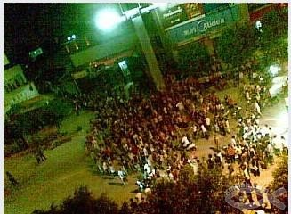
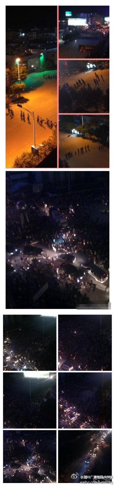

# ＜特稿＞潮涌潮安 古巷森森

****6月6日，因四川籍工人讨薪被砍伤，多名外来务工人员在广东省潮州市潮安县古巷镇聚众向官方讨要说法，最终演变成群体性事件。一名资深媒体人对笔者说，他认為此次事件是有关人员处理讨薪问题失职、导致事态恶化后，利用当地本地人与外地人矛盾，转移视线所造成。“民众太容易被利用了。”他说。****

****ibeidou.org****

# 潮涌潮安 古巷森森

### ****ibeidou.org****

## 文/匿名（北斗特约撰稿人）

  笔者于7日上午到达古巷镇。镇政府门前地上一片狼藉，布满玻璃、木头等残渣，几十辆军、警、消防车辆填满镇政府广场。古巷镇派出所的大门紧闭，招牌被人砸坏。古巷镇街道各路口有持枪警察巡逻，镇上所有的店面均关门停业，街上几乎没有行人。 “清晨的时候还能看到一地都是血。”一名载客摩托车司机说。“停在路边的车倒的倒烂的烂，没有一辆是完整的。” 有记者7日白天在街上拍到七八个人拿铁通殴打一名外地人，过路的警车却未作处置。 

### **围观政府何以变两地冲突？**

据潮州公安称，事件始末如下： 6月1日，四川工人熊汉江一家三口到潮州华意陶瓷厂讨薪未果被砍伤。 6月3日，四川老乡到潮州市委市政府的门口讨说法。由于推搡政府的铁门，派出所扣押了其中八人，并要求这八人在当地电视节目“民生直播”中公开承认错误。 6月5日，节目播出。 6月5日晚起，上午大批外来工在古巷镇政府、镇派出所门口聚集，要求严惩砍人凶手，见到3日被扣押的8位老乡。6日晚，开始出现打砸行为，除政府楼大门外，过路车辆、行人也受到袭击。 

根据官方说法，聚眾人群率先向镇政府投掷石块，随后攻击过路人车，引致事态失控。但本地本地居民C先生却有不同看法。 C先生说，他目睹了当晚整个事件过程。“先是外来人员到镇政府讨说法，有些拥到政府大门里面去了，然后警察就追着他们打，站着进去爬着出来。外来工被打出大门后，就开始拿石头砸警察反击，再后来事情就很严重了。” 针对此说法，政府人员回应，他们从来没有攻击民众。随即有人提出质疑，声称拍摄到四名身穿制服的警察殴打一名老人的场景，并准备出示录像。 “不用出示，”另外一名相关工作人员说。“确实有这事，那是因为那个老人先骂了他们的。” C先生还吐露，“昨天上面发消息来说，要我们本地村民每家都准备铁棍跟外来工报复。我觉得这样用武力解决问题是不好的。”微博上亦有多名潮州网友发帖称，晚十点半左右，枫一村委会治安队通过广播，召当地居民带上红袖圈标示，准备铁棍，进行自卫。官方则否认发布过类似消息。 然而7日下午5点多，戴红袖圈、手持棍棒的当地居民已经开始在街头三两聚集。 在7日的新闻发布会上，潮安公安称，事件参与者200多人，4辆汽车被毁，无民众受伤。人群在晚10点半已被劝离，9名打砸分子被拘留。

但据目击者介绍和相关图形资料显示，参与该事件的至少有几千人，堵住了几公里的街道。被砸车辆大概30多辆，聚众人群一直“闹到天亮”。从医院处可以得知，这次事件中大概30人受伤，现在大部分伤者被隔离，严禁与包括家人在内的其他人接触交谈。 

### **受害人：我一个老乡都不认识**

被砍伤的工人熊汉江今年19岁，来自四川省中江县。08年地震，家园被毁，熊汉江就同父母一起来到潮州打工。去年年底他患上脑疾，手术不但花光了全家积蓄，还给他们带来1万多元的债务。从今年2月到4月底，他们一直在潮安县古巷镇枫一村的华意陶瓷厂担任陶胚成型工。这两个月，熊家本应总共拿到3400多元，但多次讨薪无果。直到5月底某日，在村治安队的调解下，陶瓷厂老板苏某答应，6月1日上午结工资。 “早上9点多，我们一家三口到工厂拿工资，但老板娘说老板不在，要我们下午4点再来。我们等了几个小时，忍不住闯进办公室，才发现老板一直躲在里面。我们气不过就跟他吵了起来。吵到一半时，我背后突然有人拿着凳子朝我头上砸；我爸连忙迎上去，结果被砸得头破血流。我们逃下楼，但楼下已经有人骑着脚踏板车守在那里，他和后面追来的人一人从车里拿起一把刀，对着我就砍。”熊汉江说，他的左手、两只脚均被砍断，手指脚趾不能动弹。

6月3日市政府大楼被冲击后，潮安警方迅速反应，到6月5日凌晨，苏某等3名犯罪嫌疑人均已落网，但熊家与其同乡仍对法医做出的轻伤鉴定持不同意见。熊汉江的主治医生拒绝对外出示病例或介绍伤情，称他们“有纪律要求”。 对于这几日发生的群体性事件，熊汉江表示他这些天一直在医院里养伤，对事情的发生原因、情况、现状一概不清楚。“可能是那些老乡替我抱不平，自发去的吧。”他说，自己一家来到潮州后，每天早出晚归打工，一个老乡都不认识。交谈期间，他接到一个自称是境外媒体打来的电话。“对不起，我答应人家了，不能给你他们的联系方式，现在没有一个人愿意掺和进来。”挂了电话后，他又重复了一遍，“我一个老乡都不认识。”

### **本地外地，各有各说**

7日白天，在古巷镇及其邻近的镇上，敢开店营业的商铺寥寥无几。“我们敢开店，因為我们是外地人。”一家饭店老板如是说。几位湖南顾客在旁补充：“今天早上，我们看见本地人已经开始攻打外地人，我们怕被打，这几天都不上班了。”“他们不信政府，谁信政府？如果不是之前去闹，现在还在包庇那个老板呢。现在案子还没判，如果消停了不知道又变成什么样子。” 然而，当天白天还是本地人不敢出门，傍晚起就变成外地人不敢出门了。晚上9点，镇政府附近一家商铺将铁门打开了一条缝。年轻的女店主说，6号晚上，她紧关店门，躲到楼上，用手机拍摄当时的情景。现在已经好几天没有营业了。 “这个小地方从来就没有来过那么多记者，你看微博上把我们古巷传成什么样子了？我们政府也想要低调处理，不对吗！我想不明白，明明政府都已经把事情解决了，为什么他们还要闹？那些人还故意带着小孩来，几个月的都抱过来，不顾自己孩子的危险，你看他们多恶毒？我们的村民一定会帮忙的，不然光靠他们怎麼能守得过来。”她指着街角的防暴警察：“他们没日没夜在这里守着，打地铺，你以为他们不辛苦吗？” 交谈过程中，在本地与外地居民口中出现各种版本的传言，这些传言的内容多為己方民眾受到伤害。如外来工声称听闻有两名川籍人士被打死；而本地人中则流传外地人袭击本地老人小孩的说法。但目前这些传言都未有确切证据。 一名资深媒体人对笔者说，他认為此次事件是有关人员处理讨薪问题失职、导致事态恶化后，利用当地本地人与外地人矛盾，转移视线所造成。“民众太容易被利用了。”他说。 6月7日晚的古巷镇犹如死城，家家闭户，路上除了警察，还有几十辆在古镇内来回打转的摩托车不时呼啸而过。每辆摩托车上大多坐著两名年轻男子，在后座处放着一根长棍。古巷镇油站已经停用，为防万一，有几十名民警把守。 6月8日，潮州政府发布新一轮公告，对损伤数字有所修改。公告称截至6月7日晚，共有1辆汽车被烧毁，3辆汽车被毁坏，15辆汽车受损；共有18名群众受伤，其中15名为外来民工，3名为当地群众，没有人员死亡。目前，该事件没有引发异常情况，社会面平稳。 

潮安县县委县政府宣传部工作人员说：“现在潮州市被扣押的8位老乡已被放出来了。我们下一步工作就是找出外来工代表对话，把事情平息下来。” 截止至笔者8日离开古巷镇时，街头依然鲜有行人及开门店铺。虽然气氛紧张，但事态未有进一步恶化。

****ibeidou.org**** ****ibeidou.org****

（采编：黄理罡 责编：黄理罡）

