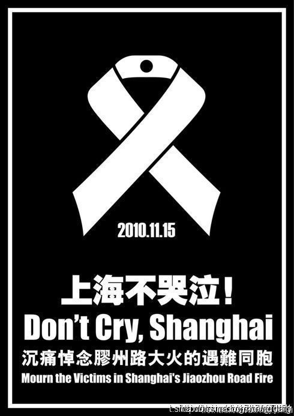
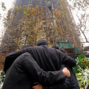
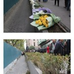

# ＜特稿＞生活还在继续——上海11·15大火后续报道

**据灾民向记者反映，许多外人不可知的细节是，要拿到租房补贴就必须要承认现在的赔偿方案，而且设有期限。超过期限不签协议的，取消过渡安置费。此外，各项方案互相捆绑，过渡安置和财产赔偿捆绑，慈善捐赠和死亡赔偿捆绑。其中，诸多事实真相与善后非人性化的处理方式更是无人知晓。政府工作人员还公开表示做好十年准备，打赔偿持久战，令灾民感到极为心寒且愤懑。**

# **生活还在继续**

# **——上海****11·15****大火后续报道**

## 文/書雁（香港浸会大学）

 

8月14日，周日，也就是农历的中元节，这一天是悼念逝者的日子，愿逝者在天国永安。

上海“11·15胶州路大火”的灾民聚集到事发地，在这个原本寄存着阖家欢乐的大楼前举行悼念活动，事发之后的9个月以来，这幢大楼并没有进行任何整修，通身黑黢黢的、千疮百孔的、狰狞的矗立在那里，即使在阳光很好的大夏天，经过它的人依旧会打个冷颤。

2010年11月15日下午，一场举世罕见的火灾，造成58人丧命、71人受伤，156户居民失去家园，直接经济损失达1.58亿元。

**走不出的“梦魇”**

事发当天中午，住在21楼的姚华琦和丈夫沈国明一起吃午饭。2点多时，姚出门回单位，丈夫还抱怨了声：“这么早走啊。”半小时后，姚接到丈夫的电话，火势已经迅速变成不可控的状态，几句简单的对白，姚在电话那头重复地喊：“你快逃呀……”丈夫说：“逃不掉了。”通话时间定格在53秒。

让姚耿耿于怀的是，如果那天别这么早走，说不定能把老公拽下来一起逃生；如果早知道他逃不掉了，为什么不在电话里多说几句，不要只留下那句“逃不掉了”让她痛苦自责至今。

姚一直在大楼面前等待丈夫出现，第一批逃生者里没有他，姚失控了，她要冲进大楼，被五六个人按倒在地。

儿子沈安（化名）在不远处的七一中学读初三。当天姚单位的同事帮着去接儿子，据沈安回忆，当时他心里一惊，看到妈妈单位的同事，以为是妈妈出事了。到了晚些时候，姚披头散发地跑去见儿子，一把抱住他，耳语了句：“这是命。”之后两人谁都没敢提沈国明，结果只有两个，生与死，那一刻没有结果，就还有生的希望。

第三天，噩耗传来。母子俩失声痛哭。后来，姚看到的尸体表述告诉记者，“烧得仅剩一块炭，劳力士手表还依稀可辨，这块劳力士，是我曾经给他的礼物”。

另一样东西是沈国明留给儿子的。沈安一周没有去上学，书包里留着一只面包，是事发当天父亲一早开车送他上学的时候买的，他没吃，放在书包里，一直没舍得丢。

在这段时间里，26楼的丁庆华住在静安医院。

每晚，在医院的安全通道，丁倚靠着墙蹲着，不停地大口大口猛抽着烟，所有人都劝，没有用。护士说他晚上睡得很少，心理医生问他要不要吃两颗安定。

火灾之后的一段时间，一家中的四人，丈母娘失踪，老丈人、他和他爱人被送去了三个不同的医院接受治疗。

再之后，丈母娘被确定遇难，妻子到了第十一天才苏醒过来，但大小便失禁。直到3月份，身体的病才逐渐康复，心理上还患有中度抑郁症。

事发后一周的时间里，丁头上添了好多银丝，白天的时间很漫长，总有人关切地询问发生了什么，他也总是一遍遍地告诉来看他的朋友那段挥之不去的经历。到了晚上，事情还是会像放电影一样，历历在目。日与夜，无尽地循环往复。

那一天，一家四口，都忙着各自的事，他在内屋里呆着，只听到客厅很吵，一时也没在意，老丈人的嗓门很大，已是稀松平常的事了。待到发现不对劲的时候，打开房门才知道，楼已经烧起来了。

一时六神无主，老丈人、丈母娘和妻子都夺门而出，当自己跑到门口的时候，却被一股巨大热浪推了回来，而且呛得不行。之后，他走到家中的厨房开始放水，但水很小，望着窗外脚手架和26楼的高度，犹豫了5分钟，“实在不敢往外跳

啊，这么高”。

决定走安全通道后，往上跑还是往下跑，又成了个折磨人的、分秒必争的决定。就在这时他看到了消防设施，他用左手砸开了上面的玻璃，取出消防龙头，开始在安全通道内放水，直到5分钟后，水放完为止，他才敢下楼了，通道里的浓烟和热气已经被水稀释了不少，接着遇到了消防员，上了救护车。 

丁当时每天整理报纸，想着有天妻子醒来，告诉她究竟发生了什么。

**灾后的生活**

遇难者家属，在恍恍惚惚中走过了九个月。

11楼的陈维中天天对着女儿大幅彩色照片，千百次地呼喊：“陈祎你能不能回来。”陈祎今年26岁，刚才英国留学回来一年。

陈维中和何放方夫妇为女儿开了个博客，里面放满了他对女儿的怀念和追思，还有陈祎同学写的悼念文章。

事发后第三天，哀恸中的陈给女儿写了封信，上海广播电台的一名主播在收音机那头里读着：“爸爸一直在想，这或许只是一场梦？爸爸一直在企盼早晨的太阳把自己从梦中唤醒，能够重新看到一个活生生的你，然而，爸爸失望了，因为爸爸无法从梦中醒来，无法再见到心爱的你。”

住在着火大楼六楼的陈祎的外婆外公，幸运逃生，刚开始的几天一直处在危险期。陈和何要面对的是，如何瞒住年过八旬的父母关于陈祎遇难的事情，避免重伤中的父母听到噩耗后，再出什么岔子。

医院里各种火灾的消息流传，陈祎外婆一听到有人议论一个英国归来的女孩的情况，耳朵就“尖”起来了。

陈何夫妇俩要求工作组将父母两人安排在一间病房内，并且“封锁”消息。为了让父母不要多疑和不安，何亲自在父母面前表态：“陈祎没事，在另一家医院治疗。”说完立刻转身离开，眼泪夺眶而出。

20天后，经过家里兄弟姐妹们开会商讨：何种方式告诉父母、在哪里说、谁去说关于陈祎的事。为了以防一万，最后何亲自，在医院里，找老人一个一个说。她老母亲当即情绪激动，就想一头撞死，不想活了。几经劝说与安慰，才阻止母亲冲动的想法。

女儿的逝世，让夫妻两痛不欲生。陈告诉记者，他不想把痛苦带给妻子，妻子也不想痛苦带给他。两人相互背着对方难过，都不敢提这个事。

有一次何在趁丈夫洗澡的时候，又大哭了一场，没想到浴室里传来丈夫撕心裂肺的哭喊。何想总该释放的，这是件好事情。

陈告诉记者，那一天他拿到女儿的骨灰，他摸了摸，那是他从来都没有摸过的东西。

所有的灾民都被要求回到那个被烧得惨不忍睹的家里清点财物。而看一次，需要多大的勇气，没人能够道的清楚。

陈维中至今不敢回去。何放方带着菊花走上21楼。

家被烧成灰烬，沙发只剩架子，冰箱烧得影子都没有，一点装潢的痕迹都看不出来，砖头裸露在外。“我跪在地上，地上的灰烬高到膝盖处，我说，妈妈来看你了。把花献在这个房间里，随即离开。”何抹着眼泪告诉记者。

12月的一天，上海飘起小雪。姚华琦的家里人都不同意让沈安回失火大楼。沈安告诉妈妈，如果家里没有过火，他和父亲有一张照片，是他小时候在影楼里拍的，头搭在父亲肩上，放在茶几旁边的抽屉里，希望能带下来。

姚先后去过两次，只是两次都忘了儿子的那个请求。她每次都从一楼哭到二十一楼，家里并没有过火，只是被熏黑了，由于姚的精神状态极不稳定，哭到根本难以自抑，她只记得拿了丈夫的衣物，因为要烧给丈夫。

>

前段时间，姚一直做梦梦到丈夫。梦里面忽一会儿是两人吵吵闹闹后又和好的场景；忽一会而是一起帮儿子买红领巾。直到2月1日那晚，在他们俩的17周年的结婚纪念日，梦里丈夫穿着件白色的衬衫，任她如何呼喊，沈头也不回的走在一条黑暗的路上，渐行渐远。姚说，“这是最后一次梦到沈国明，我想这是告别。”

**善后赔偿进程**

8月14日，30多户居民签署了集体诉讼的协议书。在记者获得的诉讼请求上写明：要追诉静安区建交委国家赔偿责任；工程材料伪劣的惩罚性赔偿；消防不作为；善后领导小组不作为；精神赔偿等。

2011年8月2日，在上海大火案一审宣判当天下午，静安区副区长方世忠在静安区人大常委会会议上提及：

截至2011年7月27日，58名上海大火遇难者中有47人火化，1人土葬，16名遇难者的家属签订了人身赔偿协议。162套产权房中，23户签订了房屋补偿协议。另签订过渡房租补贴协议103份，完成了66户室内物品财产损失的现场勘查工作。

然而灾民与政府的善后赔偿的谈判陷入僵局，且矛盾逐步升级。

去年11月，据媒体公开报道，中国扶贫基金会募捐箱管理办公室捐赠的312条羊绒被给受灾群众。但据灾民反应，直到向区领导反应之后，羊绒被最终于5月中旬，30度的高温天下发。同月，中国电信捐给灾民的156台手机，每部内含600元的话费，也在灾民提出集体书面质疑后，于6月下发。

但这样还算有效地和区领导直接对话在国务院发布的大火最终调查结果出炉后即告终止。这也成了灾民与政府协商谈判进程中一个重要分水岭。

自此之后，长达3个月之久的周六区长接待日在7月2日取消。那一天50多位灾民汇集于接待地昌平路728号处静坐反对。在长达9个小时之后，多位具有“表率”作用的灾民被强行压上警车。据现场灾民反应，因部分灾民长时间未曾进食，且有部分老人，最后因身体种种不适，出现晕倒，被120救走。下午六时，现场开始驱赶灾民，发生争执和肢体拉扯。一条原本畅通的沟通渠道彻底关闭。

7月15日，赔偿方案强行推出，分为三类。

房屋修复赔偿，指由静安建总对原房屋进行全面修复，并在此基础上给予原房屋过火前市场评估价30％的货币赔偿，灾民保留原房屋产权。

货币赔偿，每平方米5.1万元为基准，按面积、楼层进行计算，一户一价。

实物赔偿，责任方承诺在着火大楼前105号地块建设的3、4、5号楼，给每个受灾户配置一套不低于原面积的住宅，并根据楼层变更给予相应补偿。

第一个方案被灾民认为极度伤害感情，“这是一栋有58位遇难者的火葬场，拥有一辈子都磨灭不了的痛苦经历，怎么还能住人”，另外，关于这栋楼的最终处置“是去是留”、安全评估都没定论，这个赔偿方案贸贸然地出台，被指责为“极不负责”，并且违法。

货币赔偿中，评估方并未给出技术报告，只有结论报告。并以“行业规定”和“惯例”为由搪塞灾民。另外，在土地稀缺的静安区，要买到同等条件的房屋，甚为困难。不仅如此，接受这个方案的后果是，只能先拿到总房款的三分之一，其余部分要等到这幢楼的所有赔偿全部了结之后才可获得，以三分之一的现金流购房，可能性几乎为零。

实物赔偿方案中105地块采取的是图纸分房。但对于该地块的性质、成本价、明细条款尚属未知，地基也没打。 “就算是买楼花，也有预售合同，也是条款清晰的，” 灾民称，“这些方案进哪个都是进套。”

7月12日，由于赔偿方案几无进展。供职于国营企业、国有企业、事业单位的灾民，其领导被静安区政府组织开会，通过会后传出来的录音和文字证实，大致意思是，各单位领导要积极安抚自己职工，做好思想工作。并称此为最终方案，不可能更改。

灾民与政府的沟壑越来越深，政府开始表现得越来越强硬，把原本无过错方的灾民逐渐逼向墙角。

8月15日，所有安置在宾馆内的灾民再也领不到饭票。10月15日，住在宾馆内的灾民如果还不搬离，将从每月100元每平的租房补贴中扣取宾馆等额费用。

然而，据灾民向记者反映，许多外人不可知的细节是，要拿到租房补贴就必须要承认现在的赔偿方案，而且设有期限。超过期限不签协议的，取消过渡安置费。此外，各项方案互相捆绑，过渡安置和财产赔偿捆绑，慈善捐赠和死亡赔偿捆绑。其中，诸多事实真相与善后非人性化的处理方式更是无人知晓。政府工作人员还公开表示做好十年准备，打赔偿持久战，令灾民感到极为心寒且愤懑。

到现在还沉浸在悲愤中的陈维中说：“我们虽然夫妻健全，但未来我们依靠谁？要为逝去的女儿讨回公道，用自己的生命捍卫权利，追责到底，这是我的决心。”

逝者已矣，生活还将继续。

数月前，在“六七”的日子，陈维中和何放方在东方明珠游轮上为女儿陈祎举办了场追思会。亲朋好友一同追忆和陈祎在一起的点点滴滴，气氛哀而不伤。“这是最积极向上的方法，为女儿送行回到天国。”陈说。

p>

丁庆华的妻子，躺在床上跟记者回忆，火灾后让她感到最美好的事情，是七月丈夫陪着她在云南、重庆等地旅游了一个月。这是婚后20多年来第一次旅行，两人手拉着手，甜蜜又温馨。拍了很多照，重建美好回忆。

沈安后来的中考成绩优异，考取了市重点。他告诉记者，“妈妈以后要靠我养。爸爸没了要更加对妈妈好。”姚华琦在一旁听着又哭了，沈安说：“你不要哭了。我们两个人会过的很好的，爸爸不会做的事情，我也会做。”

 编者注：本文原为某周刊的稿件，后被撤。小编谨向当时作为实习记者的撰稿人致敬。  

（采编：黄理罡 责编：黄理罡）

 
