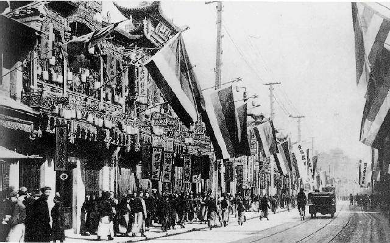
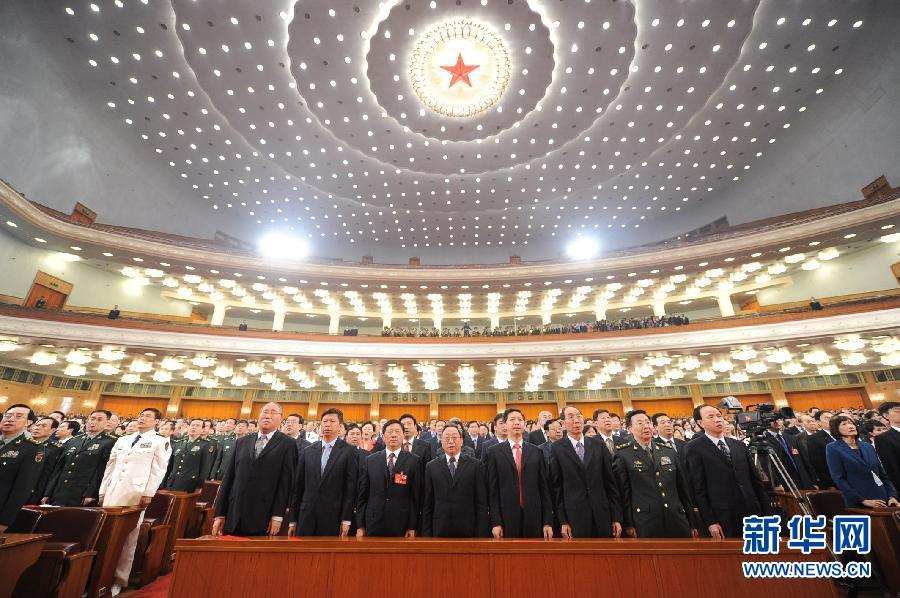
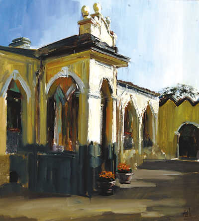

# ＜特稿＞缅怀辛亥：仰望百年苍穹的云卷云舒

**仰望百年苍穹的云卷云舒，回首历史长河的涛起涛落，不禁悲从中来，感慨万千。追赶民主自由之梦的辛亥之子弹，为何命中的却是独裁奴役的靶子？结局竟与法国大革命几乎如出一辙，又是一场让理想主义者泪满裳襟的悲剧。我们不禁要问，究竟是谁导演了这幕巨大的悲剧？**  

# 仰望百年苍穹的云卷云舒

# ——献给那个沾满血泪的梦

## 文/令霸贤 （北京邮电大学）

 

又到了秋风萧瑟的时节，北京的空气变得干爽怡人。漫步在后海边，看着已经飞舞的黄叶飘落到寂静的湖面，也别有一番情调。一直处在城市喧嚣的蚕食之下，这里却还幸存着《故都的秋》中描绘的意境，尽管距郁达夫先生作此文已经七十七年了。赏后海的秋色，横跨后海咽喉处的银锭桥是绝佳的位置。那年，也就是一百零一年前，汪精卫就是在这座桥下安放炸弹试图行刺摄政王载沣，结果事发被捕。而那时的大清帝国，早已处在了深秋的黄昏中。汪精卫被捕一年多后，在革命枪炮奏响的四面楚歌中，清帝退位，中华民国诞生，距今整整一百年矣。

站在银锭桥上仰望秋日湛蓝的天空，仰望百年苍穹的云卷云舒，仿佛能看见汪兆铭坚毅的眼神，仿佛能听见载沣辞官归家时的哀叹，也仿佛能闻到百年的硝烟与血腥。

### 

### **一个梦血交融的时代**

慷慨歌燕市，从容作楚囚；

引刀成一快，不负少年头。

汪精卫行刺失败被捕后，在狱中写下了这悲壮的诗句。而在此数月前，汪兆铭还身在日本，身为革命派的他与梁启超等立宪派进行了激烈的笔战。最终因梁启超的一句“远距离革命家”的讥讽，汪精卫毅然决心回国起事，想要以殉国的方式挽回民众对革命党的信心。这是何等的大义与悲壮，又何尝不是当时心怀救国理想的仁人志士们的缩影呢？

在汪兆铭之前有高呼“秋风秋雨愁煞人”的秋瑾，之后有书下“吾充否爱汝之心，助天下人爱其所爱”的林觉民。革命者可谓是前仆后继，为的就是一个梦，一个“天下为公”的民主自由梦。

自从鸦片战争开始，这梦就没有倒下过，而清廷的保守与固执，最终迫使这民主自由之梦不得不通过枪声和鲜血以走向现实。1909年，大臣张之洞病危，摄政王载沣探望，张之洞告诫他“舆情不属，必生激变”，载沣却信心满满——“有兵在”，张之洞大惊“此乃亡国之音也”。而在更早的时候，慈禧太后面对朝野上下改革的呼声，却下诏“五不议”，改良之路从此堵死。1908年，清廷颁布的《钦定宪法大纲》，以宪政之名，做强化皇权之实，让立宪派的领袖梁启超都大骂这是“吐饰耳目，敷衍门面”。而在辛亥革命爆发的几个月前，清廷构建的“皇族内阁”更是让朝野皆为寒心。最终武昌枪响，清廷众叛亲离，不旋踵便轰然倒地。

一百年前的这场革命告诉我们，没有人能够阻挡中国人“天下为公”的梦，哪怕是高高在上的皇族也无能为力。当民主自由之梦在敲门，要么开门优雅地迎接它进来，要么等着它带着枪炮破门而入。很不幸，刚愎自用的清廷选择了后者。

数千年的帝制在革命的战火中灰飞烟灭，亚洲第一个民主共和国——中华民国诞生。然而民主自由却依旧是一个梦，而且历史的车轮仿佛是在倒转。

中华民国建国之初，虽军阀混战，但国会依旧是制约行政者的一股重要力量。袁世凯、曹锟这样的政治强人参选总统，都要毕恭毕敬地在国会下功夫。而且那时候国会系法统之所在，段祺瑞废止了1913年选出的国会，这便成了孙文发起护法运动的一大理由，而南下至广州的旧国会议员们组成的“非常国会”，也使得孙中山的护法变得名正言顺。而且也正是那时候，报业和出版业正处于最欣欣向荣的时代，宽松的言论、学术和出版环境使得不同的思想都可以得以表达，又在多样化的思想碰撞中涌现出一大批迄今无法被逾越大师，直接造就了影响深远的新文化运动。

然而，护法与北伐皆大功告成之后，国会却变得形同虚设，就如同今天的中国大陆的人民代表大会一样，完全不被寡头政客们放在眼里了。异议人士开始成为监狱与被暗杀的常客，报纸的审查越来越多，报馆被查封得也越来越多。专制的死灰复燃最终导致历史的轮回，六十二年前，就像清廷覆灭时的那样，在一片众叛亲离之声中，中华民国政权败退孤岛。然而专制再度让历史大倒车，中华民族陷入的更黑暗的慢慢长夜之中。

仰望百年苍穹的云卷云舒，回首历史长河的涛起涛落，不禁悲从中来，感慨万千。追赶民主自由之梦的辛亥之子弹，为何命中的却是独裁奴役的靶子？结局竟与法国大革命几乎如出一辙，又是一场让理想主义者泪满裳襟的悲剧。我们不禁要问，究竟是谁导演了这幕巨大的悲剧？

也许，我们能从一个细节中找到答案，那便是从1930年沿用至今的《中华民国国歌》。

### **一首阴森耳熟的国歌**

也许读者们会很奇怪，《中华民国国歌》曲调和平、有力，又给人一种宗教般的圣洁感，于1936年夏季奥林匹克运动会上被选为世界最佳国歌，为什么笔者却觉得它很阴森？自大陆沦陷之后，《中华民国国歌》在中国大陆就被严禁传唱，自小生活在中国大陆的笔者又为什么会觉得耳熟呢？看看《中华民国国歌》的歌词便知。

《中华民国国歌》的头两句便是“三民主义，吾党所宗”，既有“主义”又有“党”，身在政治渗透进每一个毛孔的中国大陆，笔者怎么会对此不感到耳熟而阴森呢？把这两句翻译成红色中国特色的语句便是“必须坚持三民主义作为我们党的指导思想”，或者将《中国共产党章程》里的话翻译成这样便是“马列主义，吾党所宗”，完全是一个模子里出来的。

一首国歌中既有“主义”又有“党”，则带着浓厚的专制含义，既包含了意识形态的垄断与对言论、信仰自由的压制，又包含了对一党专政推崇。这与纳粹法西斯推崇的“一个党、一个领袖、一个报纸”又有多少区别呢？这首歌原本就是中国国民党的党歌，歌词原本为孙中山在黄埔军校开学典礼的训词，又称“总理训词”，北伐成功后加以谱曲，于1929年被定为国民党的党歌。1930年，中华民国行政院明令全国，在国歌未制定前，以此党歌以代替国歌。七年后，中国国民党中央常务委员会决定以党歌作为国歌。从此中国进入党政不分的一党专政时代，整个国家背离承载着无数人血与梦的民主自由越来越远。

1931年，国民政府颁布实施了《中华民国训政时期约法》。其第三十条为“训政时期由中国国民党全国代表大会代表国民大会行使中央统治权。中国国民党全国代表大会闭会时，其职权由中国国民党中央执行委员会行使之”，以训政之名，行专制之实，开创了中国一党专政的先河。这部约法制定仓促，对人权保障极弱，但对国民党完全统治政权，对党国这种形态提供了法理基础。政府由党产生，政府对党负责，重要法律由党解释，这些弊病对中国影响及其深远。看到这里，试问哪一个中国大陆人不会对这首《中华民国国歌》，不会对产生这首国歌的政治体制感到阴森而又熟悉呢？

这首阴森耳熟的国歌终结了一个梦血交融的时代，仰望百年苍穹的云卷云舒，这首《中华民国国歌》仿佛就是划破天际的闪电，也划破了无数中国人的梦。尽管后来中华民国退守台湾岛，并进行了民主化改革，但这首国歌中的阴森与恐怖却一直笼罩了大陆半个多世纪，至今未散。

中国国民党的前身是中国同盟会，其政纲是孙中山提出的“驱除鞑虏，恢复中华，创立民国，平均地权”，在辛亥革命前就发动了大量的反清起义，其成员为民主自由之理想而慷慨赴死者不计其数。我们不禁要问，这么一个追求民主自由的政党，在辛亥革命后竟成为倒行逆施之罪魁，推翻了家天下，却建立了自己的“党天下”，是为何故？

### **一种极权主义的梦魇**

1914年，第一次倒袁失败后，革命者纷纷逃亡，孙中山也流亡到了日本。他在东京将改组国民党为民间会党形式的“中华革命党”，之后更名为“中国国民党”。从此，曾是民主自由坚定追求者的国民党开始由甲式政党变为乙式政党。甲式政党与乙式政党是大师胡适在《两种根本不同的政党》提出的概念，他在这篇文章中说：

甲式政党的党员没有确定的人数，没有党籍可以查考；党员言论是自由的，没有党的纪律可以约束党员；甲式政党的原则是在两个或多个政党之中争取多数党的地位；选举结果确定之后，在法定的日期，胜利的党从失败的党手里依法接收政权。而乙式政党是一种严密的组织，有确定的人数，有详细精密的党籍；乙式政党的党员必须服从党的纪律，党员没有自由；乙式政党的目的是一党专政；乙式政党绝对不承认，也不容许反对党的存在。一切反对力量，都是反动，都必须清除。胡适认为，英国、美国和西欧式的政党为甲式政党，而俄国的共产党、意大利的法西斯党、德国的纳粹党等为乙式政党。

正是这样的乙式政党给二十世纪带来了无穷的灾难。第一次倒袁失败后，孙中山深感革命党人为一盘散沙，遂改组国民党为组织严密的中华革命党。要党员按手印，立誓约，向孙中山个人宣誓效忠。这是在将一个政党改造成黑社会般秘密结社，而效忠则更是完全违背了自由平等原则，完全是专制政治遗物，一个为推翻专制而抗争的革命党开始向领袖宣誓效忠，真乃辜鸿铭所说的“看不见的辫子”。孙文的老战友，黄兴、陈炯明、柏文蔚、钮永建、李烈钧等人均因此拒绝参加入中华革命党。而孙中山到了广东之后，在依靠苏联的力量的同时，还根据苏共的模式进一步改造国民党，从此国民党彻底踏上极权主义的道路再难回头。

后来孙中山在广东的时候，陈炯明因为与其政见不合而分道扬镳，国民党便动用喉舌媒体大肆攻击陈炯明。胡适对此非常不满，他说：“有许多孙派的人，极力攻击陈炯明，说他‘悖主’，说他‘叛逆’，说他‘犯上’。我们试问，在一个共和的国家里，什么叫做悖主？什么叫做犯上？至于叛逆，究竟怎样的行为是革命？怎样的行为是叛逆？”“陈派的军人这一次赶走孙文的行为，也许有可以攻击的地方；但我们反对那些人抬出‘悖主’、‘犯上’、‘叛逆’等等旧道德的死尸来做攻击陈炯明的武器。”胡适的这些言论发表后，立刻捅了马蜂窝，国民党的喉舌媒体纷纷把枪口转向了他，胡适对此这么分析：“我们的主张所以招怨的原故，全在我们不曾完全了解孙派用秘密结社来办政党的历史……在一个公开的政党里，党员为政见上的结合，合则留，不合则散本是常事……用秘密结社的道德标准看起来，陈炯明自然是叛党的罪人了。”后来，国共两党在宣传上都一直使用“陈炯明叛变”的提法，很好地证明了这两个党在极权主义上实为一丘之貉。

极权主义有四个特征：

一是意识形态高于一切。孙中山统治广东之后，便开始了“党化”，而且竟将“党化”渗入到国民教育之中，这与辛亥革命后广东一直推行的教育自由化完全背道而驰。陈炯明在后来所著的《中国统一刍议》一书中说：“至于党化，已属不通。党化教育，更属荒谬绝伦。盖党者不过团体之谓，绝无神妙之说。即凡主义政纲，亦以适应一时之要求，而非为化民成俗之妙用。欧美先进国家，受宗教之感化，进于文明境地，犹以政教分离，解放思想之束缚。中国向无宗教之束缚，方幸为欧美所不及，国民党何故违背真理，以一党之信仰，作宗教式之宣传，尚为未足，并此教育独立之机关，亦必入寇而摧残之，是亦何为者！”

二是信息封锁和宣传垄断。孙中山击败陈炯明后，广州市开始判若两样，记者被抓和报馆被查封时有发生。极权主义向来喜欢通过其垄断的宣传来神化领袖。孙文逝世后国民党尊其为“国父”，又因其生前奉行联俄容共，共产党也尊其为国父，然而孙中山被称为“国父”实为不妥。武昌起义爆发时，孙文还远在美国筹款，因经济窘境而不得不在丹佛的餐馆打工，其归国已经是数月之后的事了。而且武昌起义也与孙中山的同盟会无任何瓜葛，是共进会与文学社共同策划的，孙文自己也说“武昌之功，乃成于意外”。“国父”二字倒非常适用于袁世凯，逼清帝退位是袁世凯的功劳，而且当时的革命武装完全无法与袁世凯的北洋军相匹敌，孙文就任临时大总统后致电袁世凯说他这是“虚位以待”，若非袁世凯，何来中华民国？孙文实乃国民党的“党父”，国民党将孙文尊为“国父”，这是极权主义对领袖的神化罢了。孙中山在世之时，已经被宣传机器装扮为“偶像”，“三民主义”也被宗教式的宣传，这种做法模仿自苏俄，得自列宁的启示。

三是统治者的利益高于一切。护法运动之初，被“非常国会”选举为“非常大总统”的孙中山发表过政治宣言，承诺如果北洋元老徐世昌和他的北洋政府下台解散，他亦将下野。而当徐世昌被曹锟和吴佩孚逼迫辞职后，蔡元培、胡适、高一涵等两百多位各界名流，联名致电孙文和广州非常国会，呼吁孙文实践诺言下野。而孙中山却食言，并决定再开战端，这也是陈炯明与其决裂的重要原因之一。这种统治者的利益高于一切的逻辑，何尝不是后来国民党彻底腐化堕落的一大根源呢？

四是消灭异己。孙中山执掌广东后，“附逆”便成了镇压异己的万用罪名，颇与古代的“大逆”之罪有异曲同工之效。后来国民党又提出了一个叫做“反革命”的罪名，支持与反对乃信仰、言论之自由，乃天赋人权，因此获罪，与古代帝王何异？孙中山主政广东后，开始将地方大大小小的官吏都换成清一色的国民党员，仿效苏俄以党治国。后来虽容共，但不久国共便决裂相残，双方消灭异己的极权主义本性暴露无遗。

孙中山为了更有效地进行革命而将国民党由甲式政党改造成乙式政党，也确实提高了革命的效率，北伐的成功与此有很大的关系。但这也打开了极权主义的潘多拉魔盒，从此一发不可收拾，革命也就此死亡。仰望百年苍穹的云卷云舒，孙中山对国民党的改组就像是一只蝴蝶在日本扇动翅膀，却在中华民国的大地上掀起一场席卷一切的风暴，这是何等的可悲可叹？

### **再见了，国父**

毫无疑问，孙中山先生是可敬的革命先驱，他为革命，为了他的三民主义理想操劳一生，但结局却是如此的残酷，如此让人惋惜。其原因何在？

梁启超在孙文逝世之后说的一段话可做解答：“我对于孙君所最不满的一件事，是‘为目的而不择手段’。孟子说:‘行一不义，杀一不辜，而得天下，不为也。’这句话也许有人觉得迂阔不切事情，但我始终认为政治家道德所必要的。因为不择手段的理论一倡，人人都藉口于‘一时过渡的手段’，结果可以把目的拘向一边，所谓‘本来目的’，倒反变成装饰品了。”

无数理想主义革命者理想坠地之境遇，与孙中山先生有着惊人的相似，其原因不都是“为目的而不择手段”么？以“自由、平等、博爱”为口号的法国大革命最终让法兰西成为血腥屠戮场，从“路易必须死”到“罗伯斯比尔必须死”，革命者为了“祖国必须生”这个目的完全不择手段，以至于谁都可以变成“必须死”的对象，但法兰西并没有生，反而继续在帝制与革命的战火中轮回百余年。二十世纪的共产主义者们更是如此，他们为了建立一个乌托邦而不择手段，制造了二十世纪人类最大的灾难，但乌托邦反而越来越远。

革命原本是急需变革之时不得已而为之的手段，但这个手段一旦失去了底线，“革命”却成了目的，而原本变革的目的“倒反变成装饰品了”。这就不难理解为何经常革命过后，历史反而是在开倒车。孙中山为了革命成功而仿效苏联，他说：“今后之革命，非以俄为师，断无成就。”也就是说，他已经将革命当成了目的而非手段，为了“革命”这个已经变得虚无缥缈的概念，孙中山可以仿效在选举失利后用武力强行解散立宪会议的布尔什维克。孙中山原本的密友陈炯明极力反对，陈炯明对此的评价是：“若震惊苏俄专政之成功，则历史帝王之专政，何尝非绝大成功。今必欲尤而效之！”

将国民党改造成充满极权主义的乙式政党，这是孙中山为了革命不择手段的一个结果而已。对于他而言，为了革命，将党员改造成工具算得了什么呢？将“三民主义”当作一种至高无上的宗教来宣传又算得了什么呢？打压异议和异己又算得了什么呢？不遵守护法运动之初下野的承诺又算得了什么呢？向日本与苏联做出侵害国家利益的协定又算得了什么呢？但正是因为这样，革命变成了目的而非手段，而距革命原本的目的更为遥远了。孙中山先生仙逝前遗言“革命尚未成功，同志还需努力”，但他不择手段的努力反而让“革命”离“成功”更为遥远。并非“革命死了，革命万岁”，而是“革命万岁，革命死了”。1921年，陈炯明在向孙中山请辞陆军、内政两部长的电文中有这么一句：“民国前途之忧，不在腐败官僚，而在维新人物。”回首历史，这个论断是非常正确的。

革命是一把双刃剑，不确定性非常大，实为饮鸩止渴之策。而在和平环境下，以较为非暴力的方式进行变革反而是更好的选择。八十年代台湾的民主自由化就是成功的典范，孙中山先生用枪炮没有完成的事业却在非暴力的抗争运动下得以完成，告别革命的中华民国也就此成为华人世界民主自由的灯塔。而对于依旧处在暗夜中的中国大陆，“同志还需努力”去抗争以迎接黎明，而迎接黎明也许有很多条路可以走，但历史告诉我们不择手段的暴力革命肯定不是其中之一。

创业维艰，缅怀诸先烈，守成不易，莫徒务近功。

再见了，国父！再见了，革命！

一阵萧瑟的秋风吹过，又有几片黄叶飘落到了后海那倒映历史水面上。仰望百年苍穹的云卷云舒，我不禁想问脚下的银锭桥，下一个百年你又能为我们见证些什么呢？

 

（采编：安镜轩 责编：黄理罡）

 
