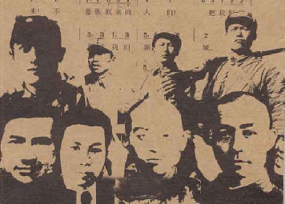
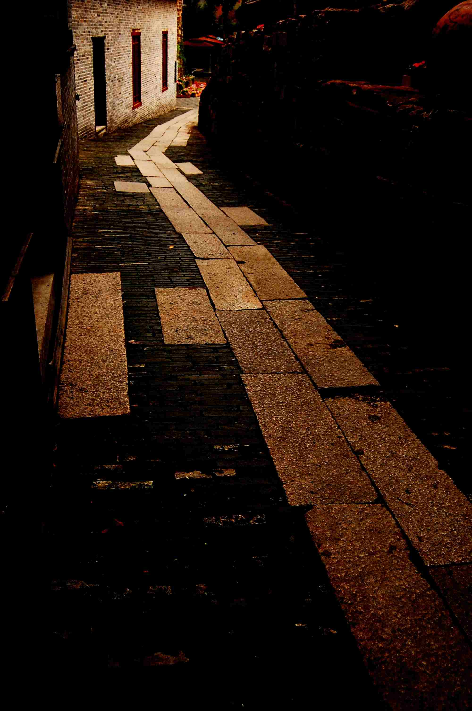

# ＜特稿＞让自由成为青春的旗帜——在“北斗”八聚上的发言

**自由，是上帝赐予我们人类珍贵的礼物。我们要理解自由，实践自由，善用自由。** **当我们谈论自由的时候，我们不只是谈论政治，谈论与公权力之间的关系，更是谈论我们的生活。对别人个人信仰的充分尊重，对不同言论的充分包容，对多元生活方式不横加干预。**

**自由，是我们对自己心灵状态的追求，青年最重要的理想，都基于一种坚持自由不羁，敢于冲破禁区的热情。**

### 

### 

# 让自由成为青春的旗帜——在“北斗”八聚上的发言

### 

## 文/ 元淦恭（中国人民大学）

### 

### 

各位北斗的负责人，各位读者，在下今天非常高兴能够前来这个场合。六聚、七聚，我都因为自己有事未能参加，所以今天的相会就格外难得。 今天是7月9日，85年前的今天，1926年7月9日，国民革命军出师北伐，从此改变了中国历史的轨迹。中国开始告别北洋时代，那一支大多由南方青年组织成的武装，已经用列宁主义的号召组织起来。国民党在北伐中取得了胜利，“一个政党、一个主义、一个领袖”的刺耳声音代替了曾经在四分五裂政治状态下的短暂自由。 85年前，国民革命军的总司令蒋介石，只有39岁。 那时候，曾经担任黄埔军校政治部主任的周恩来，只有28岁。 那是一个八零后叱咤风云，九零后已经登上历史舞台的时代。只不过那时候的八零后，指的是1880年代，而九零后，指的也是1890年代。国民党和共产党，以一群最年轻的才俊，渴望推开救亡图存与中国现代化的大门。 

 1937年，也是7月，全面抗战的烽火在卢沟桥燃起。数以千万计的青年，投身到民族救亡的洪流。他们加入了不同的政党，选择了不同的人生道路，有的提笔，有的从戎。我的爷爷，就曾是国民政府所开设的成都中央军校的学员，可是他在两年的学习之后却放弃了前往缅甸的前线，继承了我曾祖父手上经营饮食的世代家业。 那是另一个时代的注脚，大时代中的小人物，如何与时代的命运连接，又如何回归到自己最平实的生活。 对于我们而言，这并非是个明天就会金戈铁马的时代。然而，这依然是个充满机遇的时代。我们面临着巨大的危机，但是也同时拥有转危为机的资本。我们并不渴望社会剧烈的重新洗牌，我们只希望一步一步稳健地行动在社会变革的道路，不做旁观者，也力求不成为牺牲品。 我们关心自己的生活，自己的薪水，自己的学业，自己的爱情。我们坚定地追求个人的幸福，我们把对个人自由和权利的争取，对个人幸福和价值的实现，视作这个社会前进的根本力量。所以，我们每一个人都要勇敢地生活，精彩地奋斗。 北斗六聚上，我的缺席发言稿，题目叫做《守护属于我们的租界》，北斗七聚上，我的缺席发言稿，题目叫做《从网络，到大地》，今天，我的讲演题目，就叫做《让自由成为青春的旗帜》。 我们在网络上相互认识，我们在大地上相互扶持。 我们成长在这个舆论爆炸的时代，我们植根于这片充满苦难和光荣的土地。 我们知道我们从哪里来，今天我们更要了解我们向哪里去。 

 自由，是上帝赐予我们人类珍贵的礼物。我们要理解自由，实践自由，善用自由。 当我们谈论自由的时候，我们不只是谈论政治，谈论与公权力之间的关系，更是谈论我们的生活。对别人个人信仰的充分尊重，对不同言论的充分包容，对多元生活方式不横加干预。 自由，是我们对自己心灵状态的追求，青年最重要的理想，都基于一种坚持自由不羁，敢于冲破禁区的热情。 自由意味着可以不墨守陈规，意味着可以不按世俗所肯定的路径生活。 我们中间，和我们周围有太多这样的例子。 他们或许可以做一份稳定体面的体制内工作，却选择了义无反顾地投身公益事业。从此之后，他们可能随时遇到各种各样权力的威胁，随时遭遇意想不到的盘查。从此之后，他们或许没了一天安生的日子，每一天都生活在压力和阴影之下。只凭他们对于公正的坚持，只凭他们对于这片土地上苦难的怜悯，他们愿意付出牺牲。 他们或许可以按部就班地完成自己大学的学业，然后按照父母的要求成为一个“成功者”，但是他们却毅然决然地选择按照自己想要的方式生活。他们中间有人休学，有人延期毕业，甚至有人选择放弃自己的毕业证和学位。这些都是常人眼中的另类和异数，但却是和我们推心置腹的朋友。 因为，自由是他们的符号；因为，梦想是他们的坐标。 我是一个四川人，生在这个全世界海拔落差最大的二级行政单位，我渴望能够用脚步去丈量我们的巴蜀大地，走过最美丽雄浑的康巴高原。我周围有许多的朋友，用徒步、搭车和单车，去到这伊甸园一样的土地，只为自己对于美的梦想和追求。 我们认识一个台湾人，休学一年环游世界，准确地说是去发现他所想见到的美国、中国和欧洲。我们认识一个重庆人，参加“间隔年”活动，花一年的时间在那些穷困的地方，做公益活动的志愿者。我们认识一个浙江人，暂停自己的学业，从中国的东北一路行走到西南，成为对这片大地执着的丈量者。我们认识一个江西人，当知道新余刘萍的事件的时候，第一时间和我们一道到那个并不文明的地方寻找真相。 这些人，就在我们中间。 我们有一个共同的，关于自由的信念。 那个浙江的朋友跟我讲，他为什么要行走在辽阔的大地，因为他想唤起这片土地上的人们，追逐理想的热情。那个重庆的朋友跟我讲，她为什么要周游去陌生的远方，因为她想了解我们兄弟姊妹的人类，因为我们最需要的是人心的构建。 我们的信念，如同九十多年前的一帮年轻人。他们点亮过上海法租界望志路的灯光，他们拨动过嘉兴南湖平静的涟漪。他们，就如同今天的我们，一样充满理想，一样血脉贲张。李大钊说过，“为世界进文明，为人类造幸福，以青春之我，创建青春之人类。” 这是对于百年前青年的号召，这是对于百年后青年的镜鉴。 让自由成为我们青春最骄傲的旗帜，让理想成为我们青春的灯塔。 “以青春之我，创建青春之人类”，谨以此与各位共勉。 

### 

### 

（采编：陈锴；责编：陈锴）

### 

### 
