# ＜特稿＞那些变成石头的肺

**连一纸劳动合同都不给的用工单位，又怎么可能提供材料自证其罪？而因为没有一纸证明，就连工人们鉴定病情、获得救治的权利都要剥夺？在中国，弱者往往需要更为强大的力量。为生存要背井离乡，为治病要倾家荡产，为鉴别身份、诊断病情要四处奔走，而连证明自己的伤残，也要在身上再多加一刀。**

# 那些变成石头的肺

#  ——深圳尘肺病工人的死亡之路

### 

## 文/范承刚（暨南大学）

**前言**

某年国庆，游行队伍自长安街呼啸而过时，我正在湖南张家界，身旁是十三个初识不久的老师和队友。十四个人分别来自港、京、宁，粤，为着一个农民工职业病的调查来到此地。 我们所在的桑植县，是个偏僻小镇，也是贺龙的故乡，红二方面军的长征出发地。九十年代初，这里有许多人陆续离开家乡，远赴深圳，每日在尘土飞扬的建筑工地上奔波劳苦。 

[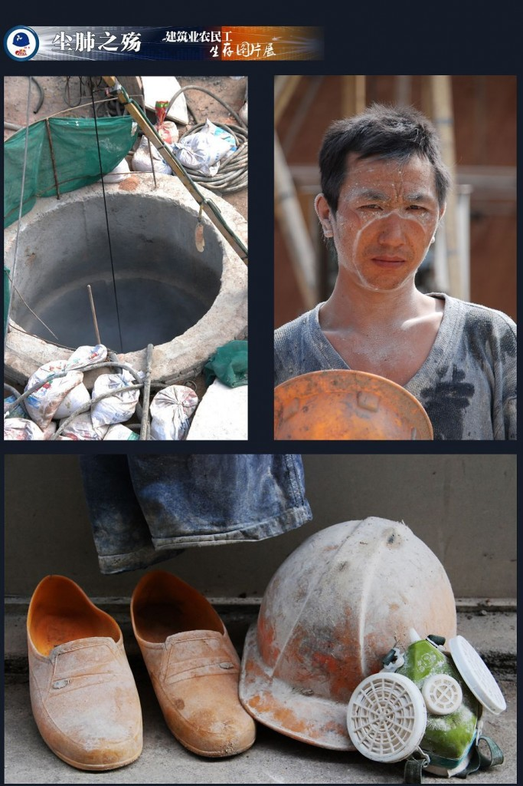](f821affb-f51a-45ab-8c50-3bec0a8908ca.jpg)

### 

这数百人从事着一种特殊的工作：风钻爆破。尘土飞扬的恶劣环境，使许多人患上了最严重的一种职业病：尘肺病。这被称为没有医疗终结的致残性职业病，目前尚无可根治药物。工人们的肺会逐渐硬化，直至呼吸衰竭，最终导致死亡。 更为可怕的是，由于难以确定劳动关系，他们甚至得不到应有的赔偿。面对数万至数十万不等的治疗费用，呼吸对他们来说，成为了最奢侈的事。 震动社会的“开胸验肺”张海超，患的也是此病。张海超的悲壮之举，使他最终拿到赔偿，而更多的尘肺病人，则无此幸运。 

### 

[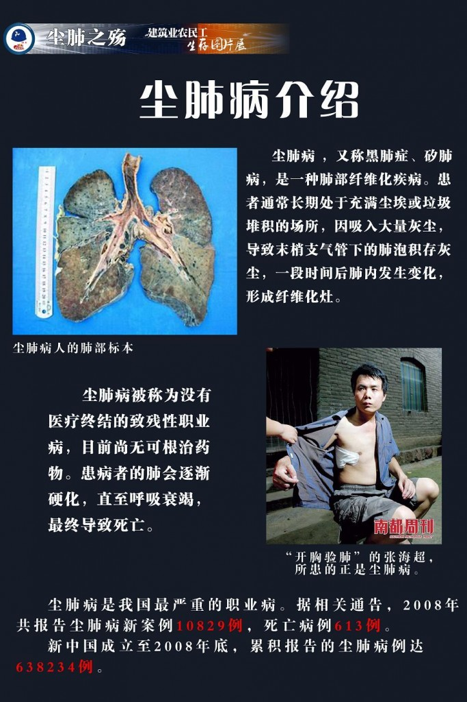](95a5291c-5a32-4e39-b1df-bf92cfffd364.jpg)

### 

2009年7月，湖南耒阳上百名尘肺病工人要求鉴定及赔偿。由于缺乏证据，能认定劳动关系的工人不到10人，而90%以上的人，只能拿到深圳政府7到13万不等的抚慰金。 现在，张家界这一两百名工人，想要证明自己的身份，获得应有的赔偿，更加困难重重。 2009年9月，张家界100余名工人来到深圳职业病防治院，要求作职业病鉴定。医院却告知：申请职业病鉴定，必须要用工单位开具工作经历证明，并提供相关健康档案资料。 

### 

[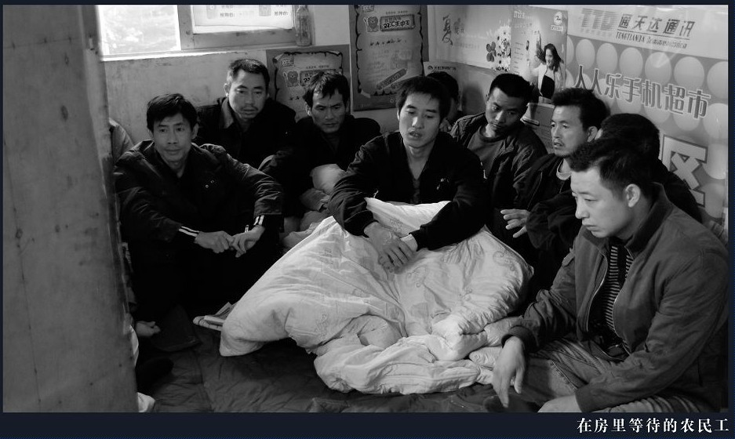](e81163a6-dfd7-460c-8aa7-e7c3bb3cb9c5.jpg)

### 

这是一个奇怪的逻辑：连一纸劳动合同都不给的用工单位，又怎么可能提供材料自证其罪？而因为没有一纸证明，就连工人们鉴定病情、获得救治的权利都要剥夺？ 在中国，弱者往往需要更为强大的力量。为生存要背井离乡，为治病要倾家荡产，为鉴别身份、诊断病情要四处奔走，而连证明自己的伤残，也要在身上再多加一刀。 本应成为弱者保护伞的政府部门，却往往陷入敷衍无为、僵化缓慢，甚至为虎作伥的怪圈。工人们不仅要与用人单位博弈争论，还要在劳动行政部门、卫生执法部分、职业病诊断机构之间彷徨无计。 失去了监督的地产资本，则更加凶狠地剥削工人。高强度的劳作、恶劣的工作环境、日益严重的拖薪、无法得到保障的生命健康……工人们创造了城市的喧嚣，喧嚣下是他们死寂般的沉默。 

### 

[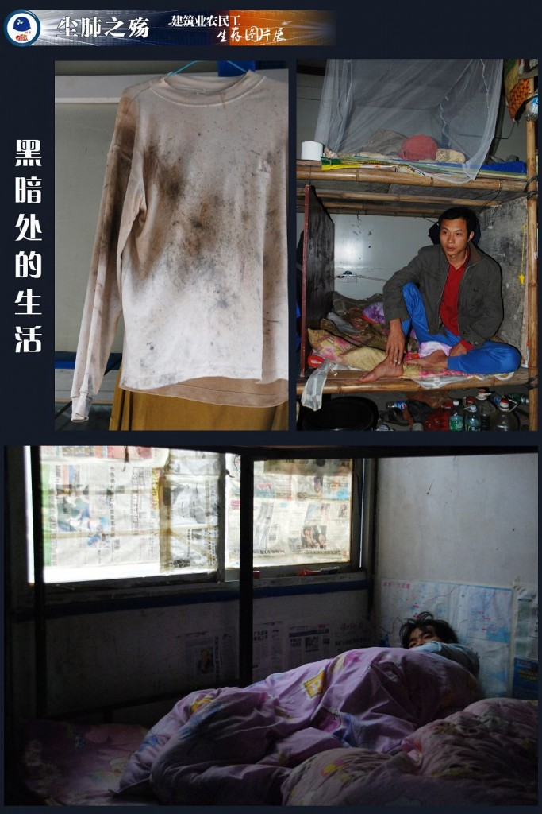](1f6c27ba-b77b-475d-b4b2-414424f7eeba.jpg)

### 

其实，工人的梦想如此简单：一纸白纸黑字的合同，一份合理稳定的收入，一个安全有序的工作环境，一套没有歧视的医疗保障体系，和一份对于他们艰辛劳动的铭记和敬意。 

### 

[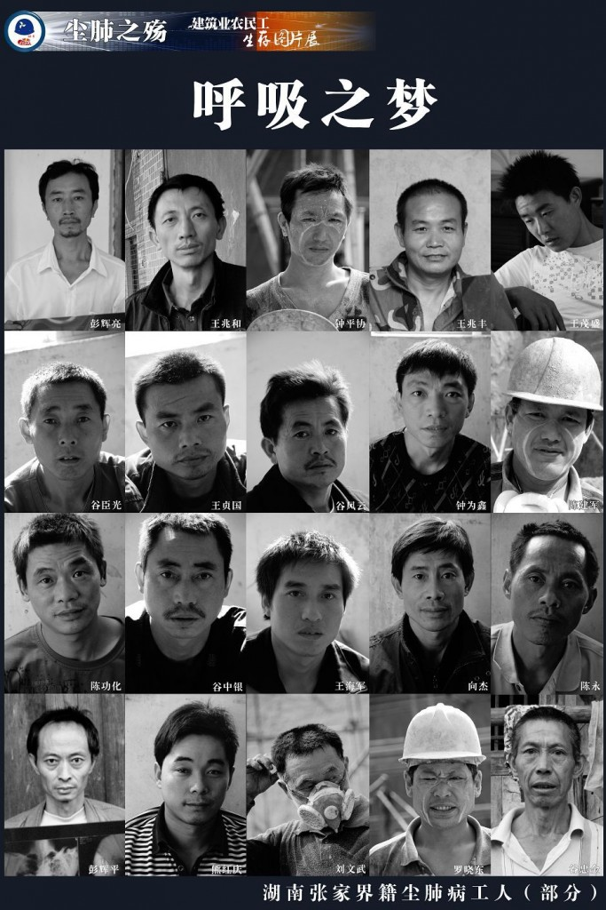](508c888f-f10c-4cc9-b786-6a8943c452d5.jpg)

### 

如果，我们连这些都无法给与他们，我们又怎么能安心宣称：歌舞升平，莫言国事。 

**一、无荣耀的缔造者**

我们下了车，他的家就在路口不远。转角处我抬头，他正蹲着石阶上冲我笑着，手里握着半个苹果，肩上搭着一条厚毛巾。毛巾下的身体，瘦削得仿佛只剩骨架。 

### 

[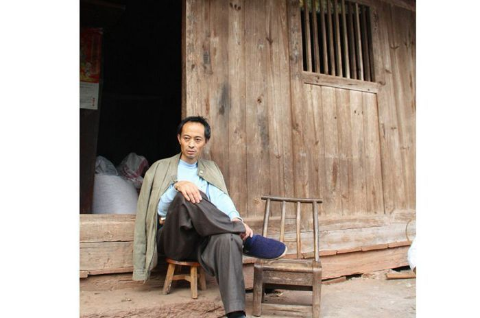](0fcb1739-54f5-4473-8512-edbbf90e3854.jpg)

### 

他叫彭辉平，张家界桑植县人。现在，他是一名垂危的尘肺病人。说话仿佛是在拉风箱，不住地咳嗽、颤抖。 1990年，彭辉平离开家乡，远赴深圳。在穷山恶水的桑植县，他是最早一批到深圳打工的人之一。那时的深圳，还远未高楼林立，入眼四处都是荒土、山坡、瓦房。 这些大山里走出的年轻人来到此处，怀揣着与这个城市一样的梦想：梦想着以尽可能快的速度，洗去旧貌，拥抱财富。 彭辉平是一名风钻爆破工。他和工友们每天的工作，便是下到直径1米至5米不等的洞里，提着40多斤的风钻机，在中心和四周打上十余个炮眼，随后填上炸药。爆破而成的数十米深的孔钻，会被灌入混凝土，最终构成高楼大厦的坚实地基。 深圳地质复杂，地下多是坚硬的花岗岩，风钻机一开动，立时粉尘四散。机器一开就是三四个小时，人爬上来已全身灰白，只能见两个眼珠转动。吐口痰，也带着泥浆。 

### 

[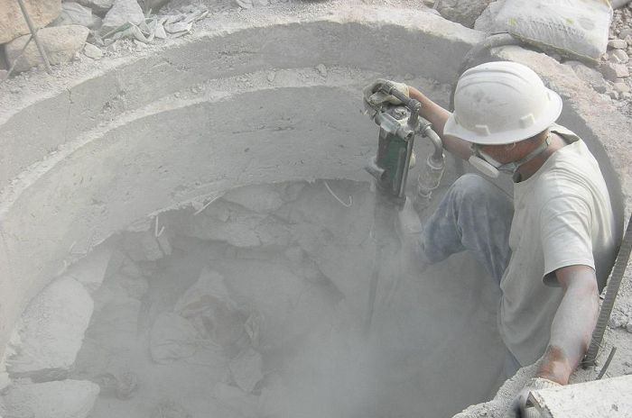](b562ae18-4c1f-4878-ba24-ac759ee4fffb.jpg)

### 

终日被粉尘包围，工人所拥有的唯一的防护工具，也只有一个口罩。而普通的棉纱口罩，并不具备防尘作用。“那时什么也不懂，也不知道会得这么厉害的病。”彭辉平说，“想着年轻，能多挣些钱，就忍吧。” 1990年，做一天风钻爆破，能赚五六十元；到2009年，这一价格上涨到200左右。这样丰厚的收入，让彭辉平坚持着拼命苦干。跟着一起来打工的张家界老乡也愈发增多，一度达到300余人。 地王大厦、赛格广场、地铁一号线……深圳的标志性建筑，都曾响起他们所握风钻机的轰隆之声。这群城市的拓荒者与奠基者，见证了深圳的飞速崛起。 

### 

[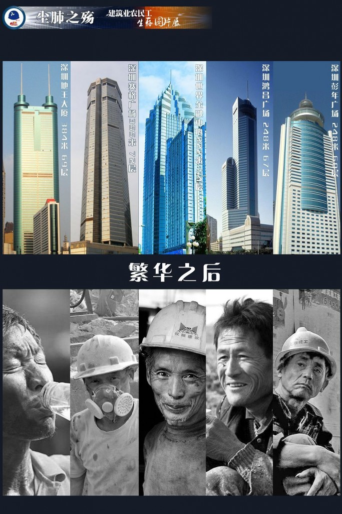](d0bd11f3-359d-41d9-b84b-03fa12dfaf96.jpg)

### 

然而，这城市从未与他们一同分享荣耀。 

**二、遥遥无期的搏命**

2006年下半年，彭辉平开始感觉身体不适，咳嗽、呕吐、呼吸困难，几经诊治不见好转。2007年3月，在广州职业病医院，他被确诊为尘肺病2期+。 

### 

[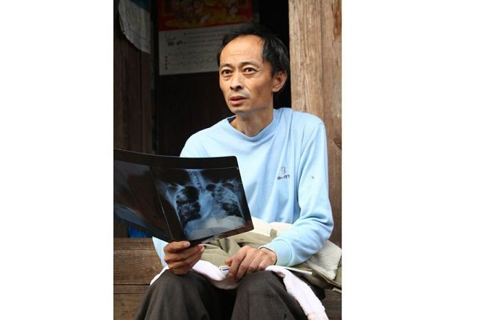](c45f2f38-c4fa-4760-826c-69d550f6b263.jpg)

### 

医生告知，尘肺病只能延缓病情，不能根治。他的肺会逐渐纤维化，随之而来的，是胸痛、咳血、高烧不退、呼吸衰竭，并一步步走向死亡。 更为可怕的是，尘肺病的治疗花费不菲，需要数万到数十万不等。而这对于彭辉平，无疑是天文数字。 

### 

###  [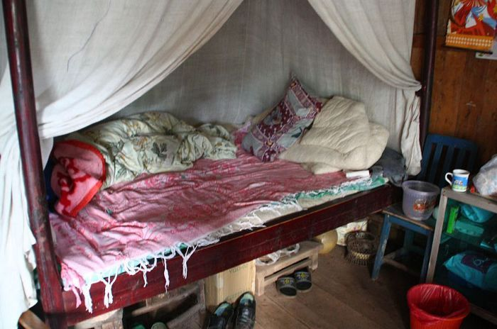](14c3432f-fe0c-4c4c-8f7f-54cb1af7631d.jpg)

### 

“医院里建议我洗肺，但洗肺要的不是一点点钱，至少需要一万块钱。我只能去找老板。”彭辉平来到自己的公司——深圳市洪坤爆破工程有限公司，要求对方出钱给自己治病。但遭到拒绝。 无奈的彭辉平，只得找媒体、找律师、找政府，一步步走上法律维权的路：劳动关系鉴定，工伤鉴定，伤残等级鉴定、索赔诉讼…… “那几年，能跑的我都跑了。从不知道到现在，怎么跑我都懂了。”彭辉平说， “怎么知道的？我在职业病医院里，那里都是得这种病的人。工厂的，石场的，差不多都是尘肺病人。他们给你提供各种信息，告诉你怎么跑。我走这个程序都是在那里学的。” 

### 

[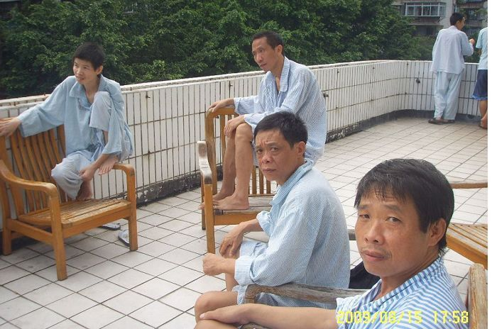](2e9cb1cb-6c38-4262-8141-30b36d9efe45.jpg)

### 

医院成为彭辉平的教室。而法院，则成了他的搏命场。 2007年4月，深圳市社会和劳动保障局认定彭辉平的职业病为工伤；同年7月，深圳市劳动能力鉴定委员会作出四级伤残评定。 洪坤公司对判决表示不服，申请行政复议。2007年8月，深圳市人民政府维持原判，认定彭所患职业病为工伤。洪坤公司又再向福田区人民法院提起行政诉讼。同年11月，法院驳回诉讼请求。 2008年5月28日，深圳市劳动争议仲裁委员会作出仲裁：要求洪坤公司支付彭辉平伤残补助金。但洪坤公司一直拖延执行。 “我跑得也是没办法。自己的存款什么的跑完了，治病都是自己垫的。没有了我就自己贷款，还有能借的就借。贷款这里最多只能借到两万，还要人担保。” 时间一点点消逝，彭辉平的病情日渐加重。 最严重时，医生在他的胸前打个洞，用针刺入胸口，抽取胸腔积液。 

### 

[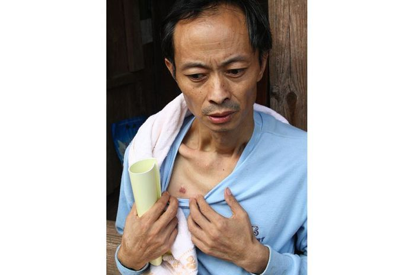](c2e791aa-2c70-4022-8fdc-0829218f6a27.jpg)

### 

胸口上手术开洞的伤痕，至今可见。 “他就是用法律拖你。他当然拖你了，他把你拖死了他好点，拖死了他花不了多少钱，死人不用花钱，给个几万块钱安葬费就行。”彭辉平握不紧的拳，止不住颤抖。 病入膏肓的彭辉平，感到自己的时间不够用了。距离拿到赔款，仍然遥遥无期。 他最终选择私了，拿到了十五万元。而他治病所花费用，远超此数。 “如果不私了，按那个法律程序，可以拿到六十多万，接近七十万，但是没办法，你拖不起…… 这时的彭辉平，已无力与死亡赛跑。 他想起，有个记者对他说过的话：漫漫维权路，何处是尽头。 

### 

[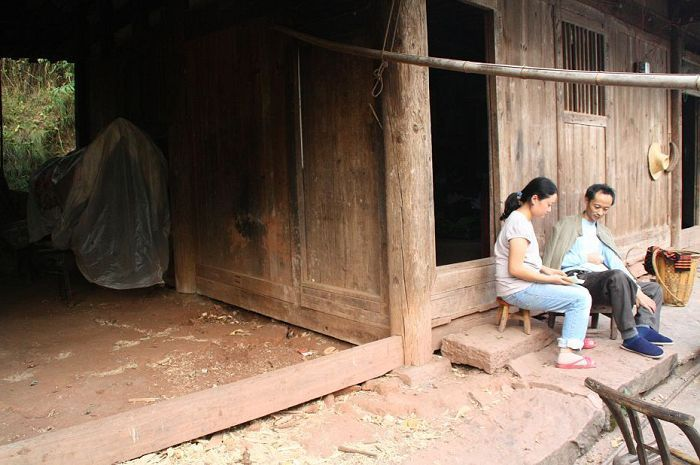](54e22d4c-07a3-4b55-9866-5b3119785734.jpg)

### 

彭辉平和他的女儿，屋角是新做的棺材。 

**三、等候康复或死亡**

2008年12月，彭辉平病情恶化，肺部感染，高烧不退。医院下达了病危通知书。 彭辉平叫家人租了一辆救护车，把自己送回桑植。租车，花了八千块。 “我要他们送回来的，我到那里多花钱。我到那里吊水什么的要钱，死了化成灰也还要钱。我还是到家里来好。死到家里面，能留个全尸。” 只是未曾想，熬过了一个春天，又熬过了一个夏天。 如今，彭辉平整日都呆在床上，床边随时都搁着一个供他吐痰的塑料桶。妻子和大女儿就挤在旁边的另一张床上，随时看着自己的丈夫，照顾自己的父亲。小女儿则出外打工，每月往家寄上一千来块，维持这个家的生活。 

### 

### 

夜里他会出很多汗，一晚上要翻个四五次身，还止不住咳嗽。母女俩是睡不好的。 大女儿讲起父亲，控制不住自己，一个人走到墙边，偷偷擦眼泪。她说：那帮人就不管人，一直拖，把爸爸弄得这么可怜。 

### 

[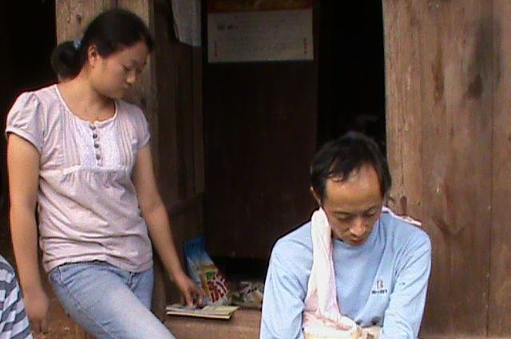](b1df71de-1b10-44b0-9c74-372da95e7a4d.jpg)

### 

[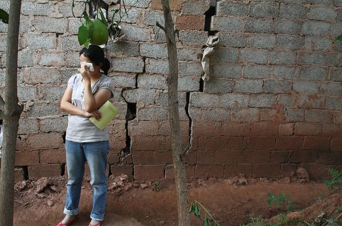](783c00a5-bb98-4097-95ed-1b918a3246a8.jpg)

### 

彭辉平说，原来有一百一十多斤，现在大概只有七十斤，现在吃饭，好的时候能吃多点，昨天就吃了一小口饭。其他还好，就是容易感冒发烧。 每隔两三天，彭辉平都得去乡里的诊所医院一趟。没钱坐车，只能步行。平常人二十分钟就走到的路程，他要花上一两个小时。 到了医院，他就呆在过道角落的一张床上，打上四五瓶的吊针。从早到晚，一天便在滴滴答答的等待中熬过去了。 只是他不知道，是在等待康复，还是等待死亡。 

### 

[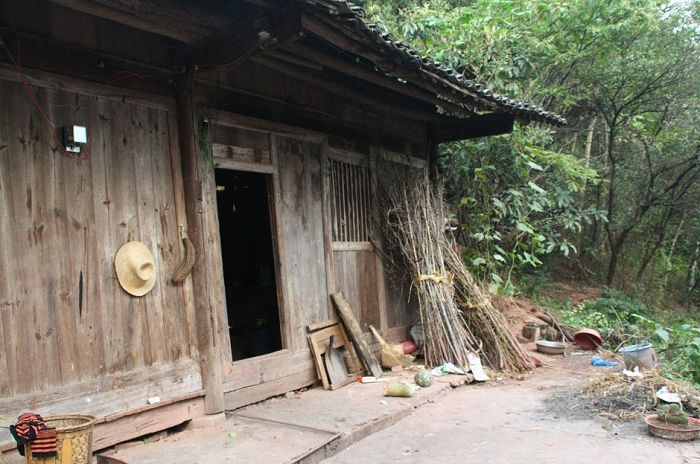](7ea80663-d517-4795-9ae9-06565058b877.jpg)

### 

彭辉平的家，至今仍是歪斜的木屋。屋子角落，放着一口棺材，用两条木凳支着，再用塑料布潦草盖上。棺材今年刚做，他说，等过几天刷完漆，不知什么时候就可以用了。 

### 

[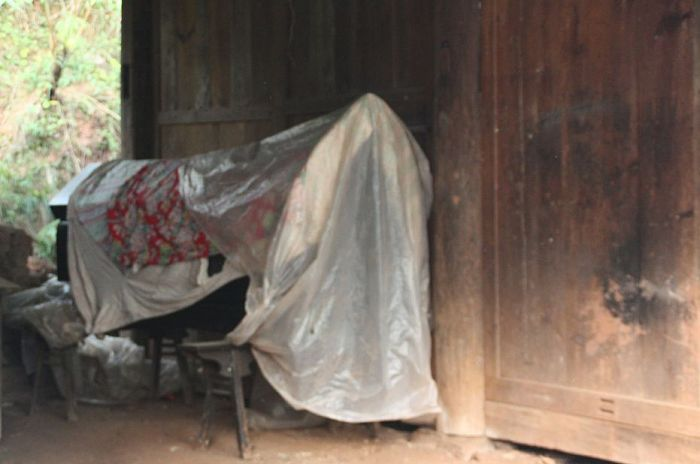](b985aa52-cf4b-40d6-b62d-d3ddf02e529d.jpg)

### 

彭辉平吃力地和我们说起这些，说起他的打工生活，他日渐坏掉的肺，还有他已不再幻想的顺畅的呼吸。听他说话，你可以想见一个人彻底的绝望。 他已看不见深圳的高楼，他已记不清那高楼下他曾流下多少汗水，他也不再去追问谁让他的肺慢慢变成一块石头。 

### 

[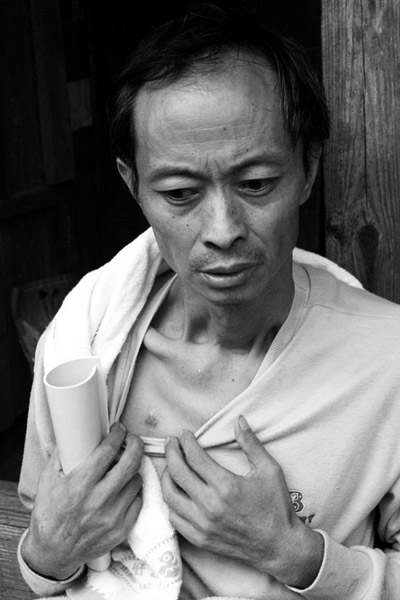](11ebc166-f08b-4867-8357-d9ff057150b4.jpg)

### 

他那几百个同乡，有人已经死亡，有人正在抗争。他与他们望得见生命的尽头，却未曾看见，那条能让他们自由呼吸、公平维权的路，究竟在何方。 

### 

[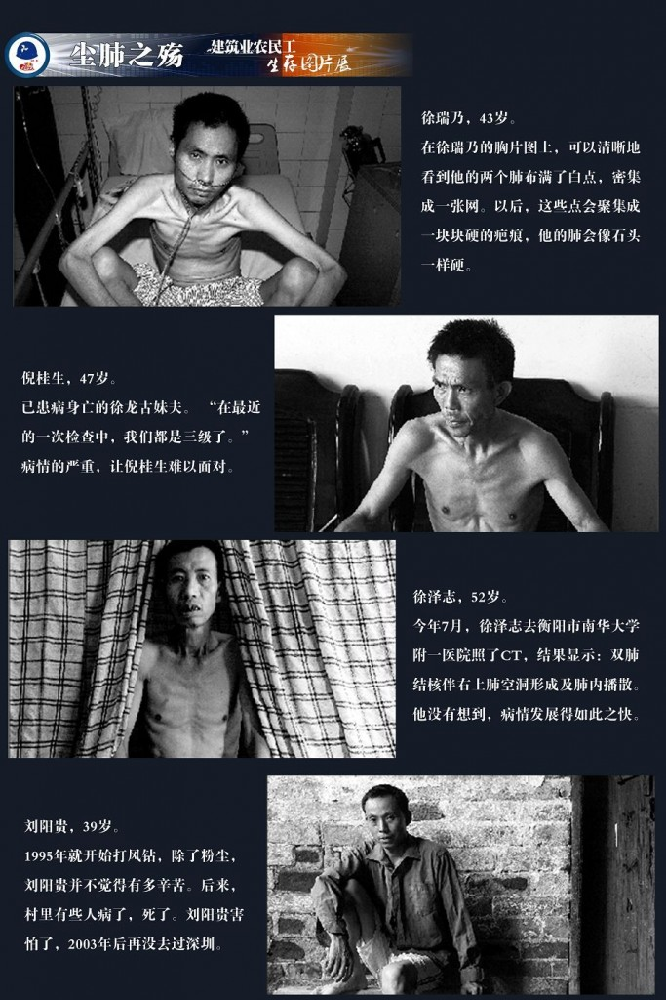](5bd58ad7-f9a6-4775-b2e8-7d6150caa90b.jpg)[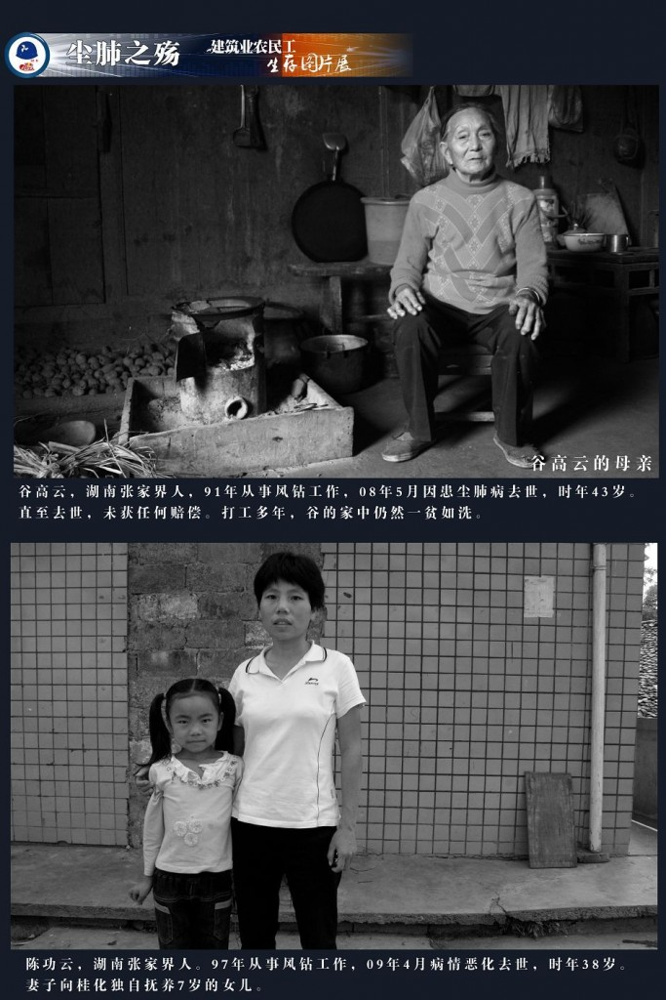](121e40ce-dfe4-4ea9-add9-69a64b86ce6f.jpg)

[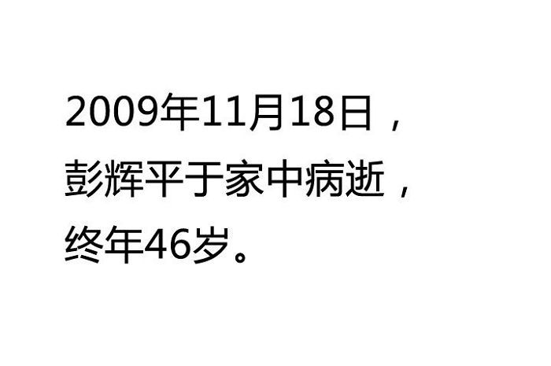](76b6522d-2aee-4b1b-8f2a-dd3964dbafca.jpg) 注：小标题为编者所加。文中图为作者摄影。 

### 

### 

(编辑：黄理罡)

### 

### 
