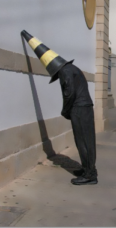

# ＜特稿＞靠谱的人，有时也未免要进派出所

**查一查国内一年群体性事件的数字，查一查一年维稳经费的数字，查一查国民财富人口占有比例是多少，再查一查每年有多少进城务工的农业人口，有多少农村留守儿童，有多少因此而失学的儿童，每年投入教育、医疗、社保的资金占财政收入的比例是多少。然后请告诉我，这样下去，行不行？ **

# 靠谱的人，有时也未免要进派出所

## 文/张舒迟（北京大学）

下午，突然看到一条状态被多人转发，内容是公民办公室一名教育公平志愿者被三名双井派出所的警官以“涉嫌煽动非法聚会”的名义传唤带走。状态中并未出现具体的姓名，只写出他的手机号。我连忙打开电话本一查，果然是小玉（化名）兄。 据我所知，小玉兄到公民办公室工作的时间并不长，短短几周而已。在这段时间里，公民办公室推动教育公平的项目，他想必一直在参与，不久前举行的有陈丹青老师、张千帆老师等国内多名学者、律师、社会工作者参加的关于教育公平的研讨会，也应属他的工作范围之内。由此推测，所谓“涉嫌煽动非法集会”，当指此事。 如果我之前没有听到过这些相关的消息，恐怕很难把我所知的小玉和“涉嫌煽动非法集会”建立哪怕最遥远的联系。与他相识是北斗还在校内网的日子里，那时他还在北京外国语大学读本科。无论是网上的交谈还是现实中的接触，我对他的印象离不了“靠谱”两个字。他的风格是沉着、低调、待人诚恳而做事讲求效率的，他的文章是严谨的，不说空话，很少煽情，却往往带有一种深思熟虑过后颠扑不破的意味。他有些不修边幅，却毫不张扬，而他会用眼神告诉你，有内涵的个性，无需张扬。 后来他本科毕业，去了一家律师事务所工作。听说工作很辛苦，我们之间的接触的机会也渐渐少了，不过偶尔在朋友们的聚会中还能看到他的身影，我们便简短地打个招呼。再后来，听说他去了公民办公室，也就是以前的公盟工作，同时去做志愿者工作的还有另一位好友黄霄。我以前也曾在那里做过志愿者，那里的前辈说有新的同事入职，后又听王箐丰兄说原来便是这二位，于是心生感慨，大家几乎是并肩前行在同一条道路上，相逢的人会再相逢。 就是这样一个朋友，别说非法集会，合法集会都见不了几次，遑论去煽动什么。 

幸好不久之后，小玉的女友李公子的状态告知，小玉已经出来了，我和很多人才松了一口气。松了一口气吗？其实原本也没紧张到哪去。啊？朋友都进警察局了你们还不紧张？可是，他这一两周来已经进了四五次警局了。 眼看着一个为人处事十分靠谱的好友三天两头往警察局跑却不觉太过惊讶，想起来也算一件神奇的事情了。 有人或许会质疑我，这人未必当真靠谱，否则轮不到他进局子啊。我不由想起这样一句话：“被枪毙便是他坏的证据，不坏又何至于被枪毙呢？”只好这样作答罢：“人生天地间，大约本来有时靠谱的人也未免要进派出所罢了。” 我不说什么政治哲学，什么合法性理论，也不说什么历史上的问题，什么别的国家的问题。请查一查国内一年群体性事件的数字，查一查一年维稳经费的数字，查一查国民财富人口占有比例是多少，再查一查每年有多少进城务工的农业人口，有多少农村留守儿童，有多少因此而失学的儿童，每年投入教育、医疗、社保的资金占财政收入的比例是多少。然后请告诉我，这样下去，行不行？ 小玉说，不行。他去做了他认为自己应该做的事情。 我们每个人也都去寻找，都去做自己认为应该做的事情。或许并非每个人都要和都有能力，去面对今天小玉所面对的风险，但我们至少要像他那样，做一个靠谱的人，即使面对风险也不改变。 小玉只比我大一个多月，我们都还很年轻，太年轻了，似乎现在还轮不到我们去为别的人，为这个社会做些什么。然而今天的事情又唤起了我另一段回忆。 那时的公盟还叫公盟，我在做志愿者，也是同一个教育公平的项目。那是一个寒冷的冬夜，我跟着一个师兄去走访一户面对女儿上学问题的外来务工家庭。几百米以外就是热闹的地安门大街和彻夜不眠的后海酒吧，在胡同尽头的这一家里却十分冷清。一个女孩子，上初中，各种奖项和荣誉证书厚厚一大摞，十几平方米的小房间里挤着一家三口，还有她几乎无处安放的书桌和课本参考书。她对我们笑着，笑容里没有一点阴暗的东西，只有同龄女孩别无二致的活泼、纯真和聪颖。我们聊到很多，很晚。走的时候，她和几个一起在场的，情况相似的女同学一起，混着从不远处间或飘来一丝的歌舞笙箫，为我们齐声唱了一首《隐形的翅膀》： _每一次，都在__ __徘徊孤单中坚强_ _每一次，就算很受伤__ __也不闪泪光_ _……_ 那是我听过的最动人的歌声，我听到了比我们更年轻的明天与希望。 从那时起，我便明白，我虽弱小，这世上仍有我能够努力去帮助的人。曾经以为改变世界并不难，如今发现就连坚持自己，不被世界所改变都是如此的困难。或许你我今日所做之事的确微不足道，然而就如发一篇日志、分享一篇文章这样小的事情，也是我们手里那一株在黑夜的寒风中摇曳的烛火。我们首先要做到的是紧握住它，每晚去白宫门口站一会，别让它太过轻易地熄灭了。 

在此谨向小玉公民，我的好朋友，一个就在今天，为了孩子们能够读书而暂时失去了自由的年轻人，致以我的尊敬、问候和关切。 今晚，请让我们一起敬靠谱的人。哪里有风，就飞多远吧。 

（采编：黄理罡 责编：黄理罡）
