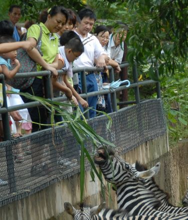
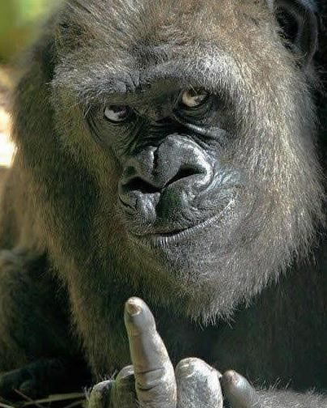
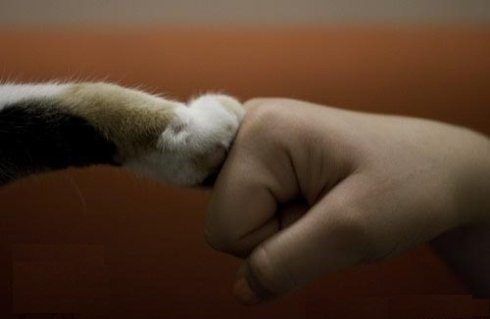

# ＜狗与人特稿＞人的自大 —— 我也跟风谈吃狗肉

**但大家最喜欢争议的不是它们的实用性，而是“感情”上的。狗是人类的好朋友，通人性，所以不能吃。这点我万万不能苟同，这个观点我与很多人说过，我以为这是在亵渎“朋友”这个词。同师曰“朋”，同志曰“友”，我与朋友永远是对等、独立的。而猫狗只是人类的奴隶而已。**

### 

### 

ibeidou.org

ibeidou.org

# 人的自大 —— 我也跟风谈吃狗肉

ibeidou.org

## 文 / 陈辞寒（香港城市大学）

ibeidou.org ibeidou.org 最近很欢乐地看到关于狗肉的问题又掀起一阵讨论，冒个泡写点东西。 我是个对那些猫狗狂热爱好者不甚理解的人，有一次在Skype上和同事聊天，我说狗不过是人类的玩具而已，她很愤慨，告诉我有人为了救猫猫狗狗耗尽了毕生积蓄。我回应说，有人为了毒品也耗尽了毕生积蓄。她惊恐道，难道猫狗在你眼里可以和那些毒品混为一谈吗。还说我肯定没有和动物建立过感情，才会这么说。 猫狗为什么不能和毒品混为一谈？好吧，用毒品好像有点夸张，就拿我心爱的相机来说吧。猫狗给人带来快乐，我的相机也给我带来快乐。你家的宠物狗被做成火锅你很伤心，我的相机变成了寿司我也会很伤心。所以从实用主义来说，二者没有区别。 但大家最喜欢争议的不是它们的实用性，而是“感情”上的。狗是人类的好朋友，通人性，所以不能吃。这点我万万不能苟同，这个观点我与很多人说过，我以为这是在亵渎“朋友”这个词。同师曰“朋”，同志曰“友”，我与朋友永远是对等、独立的。而猫狗只是人类的奴隶而已。 我不会在我朋友的脖子上套个套，我不会拉朋友去做节育手术，我不会伸出手来对朋友说“手”然后摸着他的头说“真乖”，我更不会喂我的朋友。 ibeidou.org

ibeidou.org 所有被驯化的动物都是经过一段时间的人工改造，而拥有对人类友善的本能。很巧的，近一期的《国家地理》杂志就说了这个问题。苏联科学家的试验，在短短几十年内就培养了对人类特别友善的狐狸（甚至出现了耳朵下垂、摇尾巴等外部特征）——以及其对照组，对人极其愤恨的狐狸。因此这些驯化动物对人的友善是出于“本能”，而朋友对我的友善是基于他的“自由意志”（如果自由意志存在的话）。这种人为奴化的动物和我们工厂里制造的游戏机并没有区别，通过一段时间的加工，制造出供人玩乐的东西罢了。 是人类内心的孤独造就了这个物种（准确说是亚种），它确实“爱你”，确实对你很“忠诚”，但并不是因为你可爱、可敬，也不是因为你有什么人格魅力；而是因为你的祖先可恶，把它们改造成了对你唯命是从的奴隶。 你对它的“爱”让你舍不得吃它，这很好理解，所有奴隶主应该都不会这么干——奴隶活着总是更有价值的。 看到以上的言论肯定得有同学高举道德的大棒挥向我：“它们是生命啊！怎么能和相机游戏机比！”其实我比较乐于把人和驯化动物的关系看成是共生。我依靠你完成我的需要（吃或玩乐），你依靠我繁衍后代——虽然这个关系看起来非常的不平等。 如果你是一个因为它们是有感情的动物而不吃他们的话，请你完全素食（说植物也有感情的人请吃菌类，你要是认为它们还是有感情的话，请你为了世上的有情万物去死吧）。在我看来，养猪场、养鸡场里动物生活得比一条宠物狗凄惨的多。如果让我选择的话，我宁愿成为一条成天享福的狗，然后被吃掉；也不愿意在恶劣的生存环境下度过一辈子，依然摆脱不了被宰杀的命运。因此，因野生动物“可怜”而拒绝吃它们的人，我并不能理解。我宁愿在海里过大半辈子“有尊严”的生活之后被猎杀；也不愿意屈辱地过一辈子。 人的能力赋予了他们所有动物的生杀大权，这无可厚非，但要在这之上构筑什么“道德平台”实在是可笑。 ibeidou.org

 ibeidou.org 除了植物，所有生命都依赖于别的生命。为了生存而吃是最“道德”不过的了。如果非要在“吃”的范围内找点道德元素的话，请吃素吧。我劝素和动物植物是不是有感情没有关系，我只是以为，“道德”只应该存在于人类社会之内。只要对人类整体有益的，就是“道德”的。直接食用生产者，所消耗的资源是食用肉类的十分之一甚至更少，这不是钱的问题。我以为，以目前的人口增长速度，人类在可以预见的未来必定会面临粮食危机。即使是现在，也仍然有人喝不到干净的水，吃不饱饭，得不到医疗。身为一个自私的人，我觉得救人远比救狗来的有益。因为我可以从他们那里得到真正的“友情”。你们吃的猪、牛，养的狗，正急剧消耗着淡水、土地和粮食。另外，滥捕野生动物对生物链的破坏也是对全体人类的威胁，因此我不吃鱼翅并非因为它们“可怜”。 在你玩弄着心爱的宠物时，请记得它的存在可能意味着一个人的死亡。养它供你取乐是你的个人喜好，不是道德取向。就像我本可以拿买相机的钱让一个非洲的孩子吃上几年饱饭，但我还是选择了买相机。这是我的个人喜好，我是自私的，并不以此为荣。因此也请停止这些伪善的道德大棒，承认自己的所作所为无非是个人爱好吧。 人只要愿意承认自己的卑劣，那就是好人。 倘若你愿意光着身子进入热带丛林，和动物对等地搏斗，用自己的双手捕猎、吃肉，那你是圣人。 ibeidou.org

ibeidou.org 饭后的一点补充 突然想到一种情况，如果你与一个成年的野生动物建立了感情，且没有喂食行为，那么我该祝福你，有一个动物朋友。这时候你为他/她赴汤蹈火，是英雄。 ibeidou.org ibeidou.org

(采编：陈轩 责编：陈轩)

ibeidou.org

ibeidou.org
