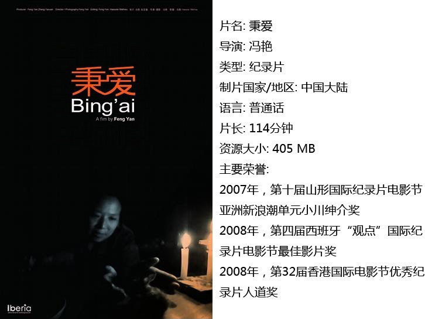
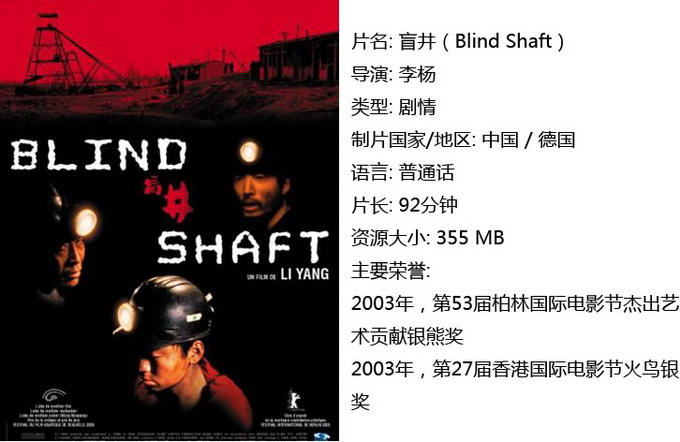
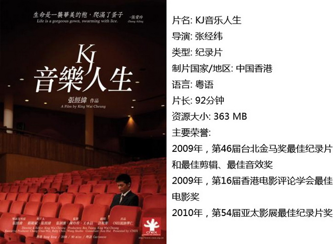
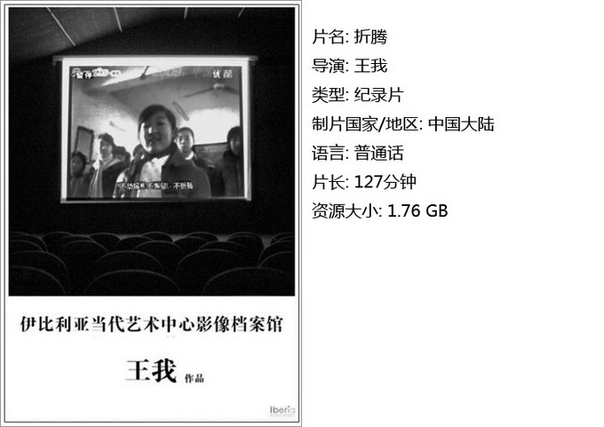
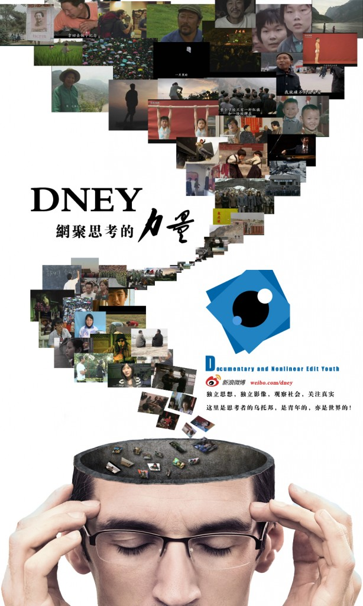

# ＜独立影像＞第一期：初识独立影像（上）

**喵喵独立影像包括独立电影（independent film）和独立摄影。****它们通常不受主流趋势的影响，而拥有独特的内容和风格，并总能表现出导演个人的艺术视角。与主流商业电影相比，很多这类作品都具有更独到的观察角度和方式，从而更真实地反映社会现状，并承载着更深厚的人文思想。** **喵喵“独立影像”栏目由北斗网与DNEY合作创办，主要任务是向读者推荐优秀的独立电影和纪录片等独立影像作品。** 

# 初识独立影像（上）

## **影评人 / 王斯王（上海海事大学）**

  亲爱的北斗读者们： **喵喵**今天是七月四日，正是美国历史上第235个独立日。**北斗**刻意于今日推出筹备已久的**新栏目**——“**独立影像**”。“独立影像”栏目由**北斗**与**DNEY**合作创办，主要任务是向读者推荐优秀的独立电影和纪录片等独立影像作品。意在通过介绍以及分享这类作品让读者深入了解社会现状，关注社会问题，感受独立思想，进行独立思考。同时，使**北斗**成为一个更加广阔的人文思想交流平台。 **喵喵**（请先阅读后文对独立影像以及DNEY的名词解释）在亲爱的们对于**DNEY**有所了解之后，**北斗**与**DNEY**合作创办本栏目的原因便不言自明，也即双方创始人在合作之初所达成的共识：**北斗**以文字的形式交流独立思想，**DNEY**则以影像的形式分享独立思想。  终于到正文了~那么，第一期会给读者带来怎样的惊喜呢？ **喵喵**相信大部分读者都是第一次听说“独立影像”这一术语（后有术语解释），所以，为了使大家能够更深入而具体地理解独立影像这一概念，我们首先推出“初识独立影像”专题。此专题分上下两期，分别推荐四部华人导演的独立电影或纪录片。这八部作品均为独立影像作品中的上乘佳作，想必绝不会令读者失望。这些独立影像作品的下载方式，请见文末~ 

#### **一、秉爱**

**喵喵**张秉爱是一个住在三峡库区的普通农妇。她并不如何地惊天动地，而只是个默默无闻的小人物。然而，病夫幼子、三峡移民、房子拆迁等诸多问题向她迎面而来，她只能以她微小的使命感与现实做着孱弱的抗争。 **喵喵**导演冯艳用秉爱的经历告诉我们：历史的车轮再强悍，也碾不碎这般小人物的坚韧。 

#### **二、盲井**

**喵喵**打开电视：今天某某矿井发生了矿难，多少人遇难，多少人被困，多少人受伤……接下来请听下一则报道……矿井并不单单只是一条简明扼要新闻的发生地，而是千万名矿工的生活与工作之处。 **北斗**《盲井》站在人性的角度反思中国煤矿业的真实状况，想钱向钱像钱，利欲熏心的矿主，危机四伏的矿下环境，而最可怕的还是人的麻木不仁…… 

#### **三、KJ音乐人生**

**北斗**KJ是位音乐天才的姓名缩写。他11岁时便已锋芒毕露，而17岁时他已经不单单只是在思考音乐，他更多的是在思考人生。什么是人？如何做人？只有先成为一个人，才能成为一名音乐家。当他的同龄人还在为奖杯为考级而奋斗之时，他只是在一边冷眼旁观。 ——“哎，你钢琴几级了？”，“考级？不，我不考级”。 

#### **四、折腾（重点推荐>_<）**

**北斗**还记得奥运火炬传递吗？还记得三•一四事件吗？还记得五•一二地震吗？还记得三鹿奶粉吗？还记得瓮安事件吗？ **北斗**不一样的剪辑，不一样的视角。导演王我带你我一同回顾已经远去的2008的那年那事。正如本片的名字一样折腾，08年不是折腾的元年，也不是折腾的休止符，以前折腾过，现在还在折腾着，未来仍将继续折腾…… 

### ****【**如何下载】~@_@?~**

**请加入独立影像流动分享群，在群邮件中下载以上四部精彩的独立影像与纪录片！** **流动下载群群号：94075202  入群请注意以下几点哦：** 1.流动群专供北斗读者下载本栏目所推荐的资源，验证身份时请注明“北斗读者”。 2.当期资源自发布后16天内可以下载，到期后QQ中转站将自动删除，请注意时间。 3.此群采取流动制，群满员时，完成下载后请自动退群，以便他人入群下载。（但是请注意：只有当群满员时才需要各位流动，现在则无需退群，需要大家流动时会另行通知。） 

### ******【****FAQ时间】~ ~\(≧▽≦)/~**

**1.什么是独立电影和独立影像？** **北斗**独立影像包括独立电影（independent film）和独立摄影。 **北斗**独立电影的概念来源于上个世纪的Hollywood。当时Hollywood由所谓“八大电影公司”所垄断，一部电影的拍摄制作遵循步骤严谨的“制片人制度”。这种“制片人制度”完全瞄准市场，期望获得最大的利润。因此，尽管这种制度为电影事业带来了大量资金，但也限制了电影创作者的发挥空间。于是，一批电影人摆脱“八大电影公司”的控制，自筹资金，甚至自己编写剧本，自己担任导演，拍出了许多与商业电影截然不同的思想性很强的电影，被人们称为“独立电影”。 **北斗**独立电影的主要特征是：绝大多数独立电影并非出自大型电影公司或制片厂，而是由个人或团队拍摄制作。即独立电影在资金投入和制作上一般不隶属于任何电影公司或制片厂，主要依靠导演或制片人自己通过各种渠道获取资金，甚至由个人出资。 **北斗**因此，它们通常不受主流趋势的影响，而拥有独特的内容和风格，并总能表现出导演个人的艺术视角。与主流商业电影相比，很多这类作品都具有更独到的观察角度和方式，从而更真实地反映社会现状，并承载着更深厚的人文思想。 北斗很多独立制作的纪录片、动画和原创DV等也是独立电影的重要组成部分。 **2.DNEY是什么？** **啊喵DNEY**是以QQ中转站为主要载体的独立影像交流和片源分享平台，关注富有创意或思想的各类原创音视频作品，同时鼓励私人或机构推广和发布地方性影片放映会。 喵喵在与北斗的合作中，**DNEY**主要负责提供“独立影像”栏目所推荐的作品以供读者下载。有意下载相应资源的读者可加入本文末尾的QQ群。 附**海报一枚**

** **

### **【广告】**

独立影像栏目长期招募荐影人负责撰写推荐稿 **要求（重要程度分先后）：** 1.在校大学生 2.对独立电影和纪录片有一定了解或很感兴趣者 3.文笔好那么一点点，思路清晰那么一点点，理解深入那么一点点 **工作内容：** 1.参与共同讨论以确定当期主题和推荐影片，之后观看影片并撰写推荐稿 2.工作时间、地点随意，每期荐影人讨论时自荐 福利：可以先于读者观看影片并随意下载海量资源 有意者请联系 **卓王孙QQ971885473 **，请注明“荐影人” 

 **流动群群号：94075202 DNEY新人群群号：152511792** 注：流动群专供北斗读者下载本栏目所推荐的资源，验证身份时请注明“北斗读者”。当期资源自发布后16天内可以下载，到期后QQ中转站将自动删除，请注意时间。此群采取流动制，群满员时，完成下载后请自动退群，以便他人入群下载。（但是请注意：只有当群满员时才需要各位流动，现在则无需退群，需要大家流动时会另行通知。） DNEY新人群则为DNEY独立影像官方交流群，非流动制。DNEY同时为流动群和新人群提供资源，但新人群资源并不一定与本栏目同步。 另， 独立影像，是一个才刚刚起步的新栏目，不知道读者们是否满意我们这种形式呢？希望热心的读者们来多多的献计献策吧^_^ 联系 **薄雯 qq173665309**，或者校内、QQ群里联系我们工作人员哟> < 喵喵 喵喵

（采编：黄希敏 责编：黄希敏）
