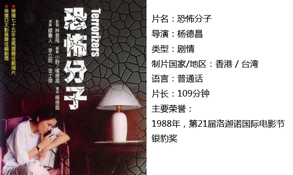
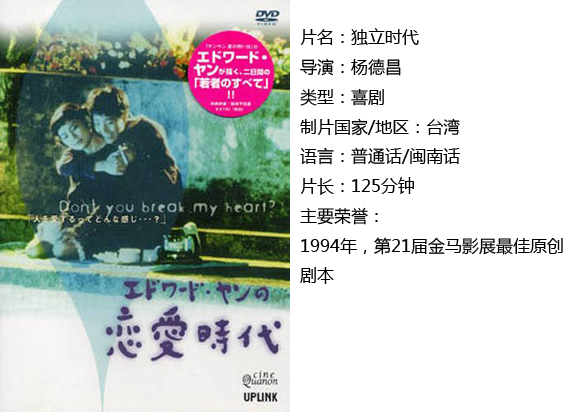
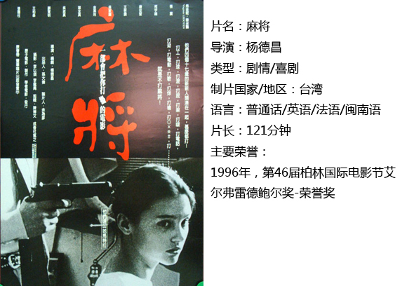

# ＜独立影像＞第三十一期：台湾社会的手术灯——杨德昌

**人们总能从他的镜头中看出对台湾社会变迁强烈的关注，这些平铺直叙的影像也能自如地反映当时台湾的社会风貌。看似平淡无奇如流水一般的能量却总能在不经意间积蓄，情感总能在最恰当的时候喷涌而出。**  

# 台湾社会的手术灯——杨德昌

## 影评人 / 王斯王（上海海事大学）

  **小编寄语：**

这是台湾正式离开故土63年的日子。太平洋上的一叶孤舟在这半个多世纪的风雨飘摇中不断寻找着自己的路。政治上从一党独裁，到88年开放党禁，如今蓝绿阵营分立；经济上成为了中等富裕的地区；文化上从当年禁忌的“美丽岛”民谣到现在流行口水歌满天飞。杨德昌作为见证社会变迁的一员，用一个个虚构的故事描摹了台湾城市生活转型中，人们各自的生活与体悟。其作品就像手术刀，切开了社会的断面；又像手术灯，照亮了这段历史的纵深。而我们看到的并不是宏大的叙事、伟大的领导人如何做出决策，只有社会背景下，每一个渺小生命所面对的困惑和迷茫。

 **王斯王：**

在大学宿舍中一直流传着这么一句——为人不识武腾兰，阅尽毛片也枉然。这句话对武藤兰在业界的地位给出了肯定。其实在任何领域能得到如此赞誉都是很高的褒奖。今天为大家推荐的就是台湾电影界的『武藤兰』——杨德昌。

正所谓看片不识杨德昌，阅遍台片也枉然。其在台湾电影界的地位是举足轻重的，与同时代的侯孝贤蔡明亮并称为台湾电影新浪潮的三位代表（侯是苍井空，蔡是松岛枫~）。杨是一名电机工程硕士，在美国工作期间，他受到德国新浪潮电影，特别是赫尔佐格的《阿基尔，上帝的愤怒》的巨大影响，意识到好电影不一定需要丰厚的投资，独立制作反而能够包含更多的真实与创新精神。因此，他于1981年回到台湾，弃机从影成为一名导演。

杨德昌的电影作品深刻、理性，有强烈的社会意识，被称作“九十年代最具影响力的台湾大师之一”、“台湾社会的手术灯”，在世界影坛享有盛誉。人们总能从他的镜头中看出对台湾社会变迁强烈的关注，这些平铺直叙的影像也能自如地反映当时台湾的社会风貌。看似平淡无奇如流水一般的能量却总能在不经意间积蓄，情感总能在最恰当的时候喷涌而出。

杨德昌最有名的作品莫过于《牯岭街少年杀人事件》了。影片长约三个半小时，各种线索穿插交错，非常缜密细腻地展现了主人公小四从怀揣梦想到最终幻灭的心路历程。杨将60年代的台湾非常直白又近乎暗色调的摆在我们面前，即使你从来没有去过那里经历过那年代，你可以切身感受到这就是小四的环境这就是小四的成长。《牯》就好似那个时代最好的影像注脚。

除了为人们熟知的《牯》、《一一》，杨德昌还有众多杰作值得大家细细品味。即使他已去世不再为影迷带来新作，每一部旧作仍能够一次次震颤心灵。在大陆人看惯了台式纯爱小品之后，这一盏永不熄灭的手术灯会带给人们对台湾最直观平实的感受。

#### 一、恐怖分子

老顾率领警察捣毁一个贼窝，唯一跳窗逃走的女孩淑安腿骨折断，被路过的男孩小强送去医院。淑安返家后，被母亲关在家中，无聊时四处打电话恶作剧，其中一个电话打给了一个叫周郁芳的女人，她假冒是周的丈夫在外面的女友，怀孕了要她出来谈判。周郁芬嫁给李立中已经有七年，丈夫是个安分守己的男人，在一家医院工作。结婚后她辞了工作，在家写作。匿名电话深深刺激了周郁芬，她对生活失去信心，而旧情人沈维彬的出现也给了她希望，于是她暂时离开李立中，小说也获了奖。分居使得李立中十分苦恼，后来他得知妻子离去只是因为一个电话，急于解释但并不奏效，最后铤而走险…

李立中无疑是一个充满悲情的角色，一直小心谨慎地经营着自己的事业与家庭，体贴关心着处于写作低谷的妻子，为了自己的晋升之路不惜出卖了多年好兄弟。然而这一切只换来了其事业与婚姻的双重崩塌——妻子离她而去却找到了灵感从而获奖，自己的出卖却换来了他人的晋升。李最终走向毁灭，因其自私之心而毁灭，而细看片中的每一个人物无不都带着自私之心。每个人都这么自私地活着，或许我们并不都是悲情的李立中，但却都是隐藏的恐怖分子。

#### 二、独立时代

Birdy、Molly、琪琪、小明四个大学同学毕业后做着不同的工作，表面光鲜程度虽有异，都有身份转变时期的尴尬。而这其中最难做人的，是夹在好友Molly与男友小明之间的琪琪，她只能暗自努力，以期好友、男友的事业与生活能有所改观，三人的关系能有所改善，却得到双方的误会。Molly的姐夫在认定生活就是由若干玩笑构成的排列组合后，开始转身面向两千多年前的孔子，然而他自认重获精神家园之时，却收获了同琪琪一样的无奈——两人被认定不过是演技好的实力派而已。人生的荒谬与悖论就此呈现，表演只有迎合了旁观者的心里，才会被认定为“真实可信”。

整部片子围绕人生在世的孤独与虚假展开，每个人物都摸索着自己人生的假假真真：带上伪装的面具装得和别人一样泯然众人逃避责任；被冤枉忍气吞声打碎牙齿往肚子里咽是会做人识时务的表现；安慰与甜言蜜语虽做不到药到病除但也是一针强力镇痛剂。谁能做到真正的真实？电影给出的答案是没人能做到。生活在人与人关系的网络中，你只能影响别人对你的看法或正面或负面，而真正的你只是一座孤岛。

#### 三、麻将

富商儿子红鱼从父亲那里学到很多骗人之术，他和纶、牙膏、香港组成一个四人小集团，到处敛财骗色。有一次，他们在咖啡店里遇见从法国来台北寻找男友的女孩马特拉，红鱼就此盯上了她，意图欺骗对方。但伦伦良心发现，并带马特拉躲到了自己家。之后，红鱼要报复曾与父亲有奸情的老女人Angel，要香港去勾引她……。另一边，一生骗人无数的红鱼父亲却深觉人生空虚，等待他们每个人的将是什么命运？

“这个世界上没有人知道自己想要什么东西，所以他们看杂志看报纸看广告看电视听电台，希望从中找到答案，希望让别人来告诉他们，他们自己到底想要的是什么。电影展现了人性的溃败：愚蠢简单，势利冷漠，极度追求金钱物欲，个性与思考被抹煞，甚至不知道自己想要什么而需要别人来告知。浮躁与轻狂的城市，没有了信任没有了道德约束只有欺骗与提防，如此的残酷又是如此的现实。而这一切是从四位少年的视角体现出来的，他们的世界观与人生价值才是真正的可怕与可悲之处。老杨用其严厉又冷峻的方式表达了他对人性在都市化工业化过程中变得岌岌可危的状况的担心。

 

### 【小编推荐】

关于以小见大的台湾电影，你还可以看…… 《青梅竹马》、《光阴的故事》、《海滩的一天》、《牯岭街少年杀人事件》、《一一》（杨德昌），《悲情城市》、《再见南国，再见》《儿子的大玩偶》（侯孝贤），《老莫的第二个春天》（李祐宁） 

### **【如何下载】~@_@?~**

**请加入独立影像流动分享群，在群共享中下载本期所推荐的独立电影！**

**流动群群号：238699763(新群)****入群请注意以下几点哦：**

1.流动群专供北斗读者下载本栏目所推荐的资源，验证身份时请注明“北斗读者”。

2.当期资源自发布后14天内可以下载，到期后工作人员将手动删除以上传后续资源，请注意时间。

3.此群采取流动制，群满员时，完成下载后请自动退群，以便他人入群下载。（但是请注意：只有当群满员时才需要各位流动，现在则无需退群，需要大家流动时会另行通知。）

关于**独立电影**和**DNEY**请参见[<独立影像>第一期：初识独立影像（上）](/?p=11506)，其中的**广告**也要记得看哦！

 

（采编：黄楚涵；责编：黄楚涵）

 
