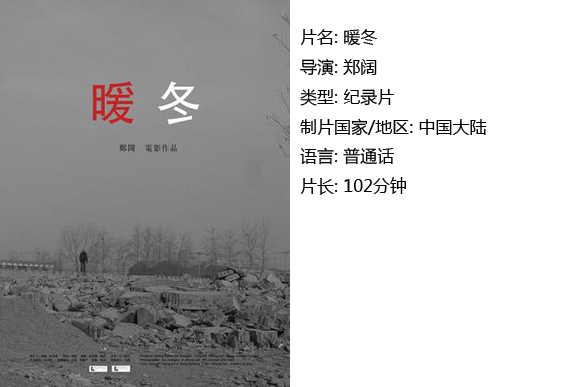

# ＜独立影像＞第三十七期：只有彼此深信不是傻逼，才能看见自由

先从纪录片开始说起。

《暖冬》，郑阔作品，讲述一群帝都艺术家遭遇拆迁的故事。从最初奔走、呼吁，到游行、获赔，再至最后的分崩离析，令人唏嘘。

事件的起、承、转、合之间，众生面貌昭然。

“暖冬”计划要的是什么？

每个人要的是什么？

处处纠结。

无法释然的终究是在这“要”与“不要”之间。

#### 一、 艺术家要什么？

艺术家是一群什么样的人？

其实不太了解。

约莫美院毕业，专业绘画或是雕塑。

他们热爱艺术、献身于艺术，因为听信电视上区委书记支持某文化产业园区发展的讲话，而兴致勃勃迁入其中，意图在一个200平的空间里，开始自己未来2、30年的事业。

他们画画挣钱，犹如你我搬砖挣钱。

他们面对城管的质疑，大喊“这是当代艺术、当代艺术、当代艺术”，犹如你我大喊，这是实心粘土砖、实心粘土砖、实心粘土砖。

不否认，当艺术家们闲谈时，偶尔也流露出“让他们看看是在和谁斗”这样的言语时，我的内心还是泛起了一丝嘲讽。

不作高下之评。

只是那份清高之气，加上这个国度的现状，使得艺术家这一已然不被了解的群体，更自行地树立了与外界的隔阂。他们在各种文本中被丑化、妖魔化，被指责务虚空论。而另一方面，其实在经济上同样窘迫的他们，又被要求成为精神文明的先锋，在危难时能够去争取一些别人不敢争取的东西。

就是这样一群艺术家，他们也遇到了拆迁问题。身份的敏感性，使得他们的抗拆故事，不光有冲突流血的R级镜头，且更易于被提高到意识形态的角度，而这，事实上超出了这些生活着的“艺术家”的能力范畴。

在正阳艺术区、008艺术区的整个为抗拆而进行的“暖冬计划”的队伍中，众生百态，没有几个清醒者，又或者也不需要清醒者。

就是这样一群艺术家，他们在整个“暖冬计划”中，从头至尾没有贯穿始终的诉求。他们的愤而跃起，是因为“断水断电断暖”的逼拆，誓师会上言之凿凿的是基本人权，将作品挂在街道的树木上，带着面具逡巡北京城，却连一个大巴司机都搞不定。

就是这样一群艺术家，他们可以被侵犯生存底线触怒，也可以因获得经济赔偿满足；他们活在精神领域维护着头脑中的形而上，写维权条款时都把经济诉求放在末尾，却又坚决不作行动的先锋，不受挑拨，不愿和“长安街”沾上关系。

就是这样一群艺术家，他们并非被圈养，也不要求自由。他们是自己画室的王，在操一口标准京普腰板倍儿直的官员面前也只有服软的份，全然的弱势姿态。

他们也不知道自己要什么。

在他们想当然的天真，和以公共管理为天职的政府之间，有着先天的沟通障碍。

#### 二、政府要什么

2.22长安街游行，是整个“暖冬计划”的转折点。之前的3个月，守夜也好，行为艺术也罢，媒体宣传也罢，都没有为这群即将流离失所的艺术家构建起与官方对话的平台。

2010年2月22日，在著名持不同政见艺术家艾未未的鼓动下，这群事实上在各种“暖冬”推广动作都已陷入死寂的情况下的艺术家们，其中一部分采取了激进的做法，他们走上了长安街。这一事件，5分钟后就有twitter传播至全世界。由此，这一抗拆事件被引入了政治的意义。

对此798艺术家老羊评论道：暖冬计划之前要求的是“奴权”，从走上长安街那一刻开始，他们开始为“人权”而战。

这样的拔高，守夜3个月的艺术家却并不领情，他们认为艾未未并没如他们想象的身先士卒，而是在台阶上拍照片，甚至事后电话通知每个人不要对政府提艾未未的名字。艺术家喻高在长安街后的第三天，也即2.25号写了文章痛骂艾未未，称他是“汉奸”“出卖那些比你小二三十岁的艺术家”。

文章最后如此写道：“希望关注这件事的朋友不要被一些媒体和传言误导，坚守了三个月的艺术家们有权过上正常人的日子，我们有权保护私有财产，有权去度假，有权拥有规律的作息和充足的睡眠，有权不被骚扰。至于这个维权英雄，谁爱当谁当，这就是一张小丑的面具。”

在此不久之后，形势急转直下。

政府采取了空前主动的动作，艺术家们纷纷从开发商处获得了赔款。

于是对于转折的关键点，艺术家们开始有了争议，有人认为是长安街的游行以及海外舆论的压力，另有人则称，政府官员曾私下表态，是喻高的文章为顺利赔款起了重要作用。

在镜头的切换，与观点言辞激烈碰撞间，导演郑阔没有表现出自己的价值指向。但如果细细分析起来，我以为事件的转折点必须是2.22的游行。这对艺术家是走投无路之后的一个冒险选择，却是艾未未策划的所谓人权斗争的起点。

喻高问：政府怕艺术家吗，艺术家怕政府吗？我觉得，好比男人不怕女人作，但是烦，而且男人讨厌自己女人被别的男人影响后跟自己作。所以政府烦游行，尤其讨厌被西方思想怂恿而成的游行。在游行后政府烦躁无计时，喻高骂艾未未的文章，成了政府完美的下台台阶。在这篇显露了发自肺腑的对政治的无知的文章发表之后，政府完成了与天真的艺术家们的和解，艾未未成为弃子。

无意指责艺术家。

拆迁拿钱天经地义。

之前的兜兜转转那么多波折，在于艺术家没有找到自己明确的诉求，以及与政府的对话方式。而政府也不明白艺术家要什么，区别只是政府不需要去找对话方式。只有当事件形成对政府的压力，才会主动和解。

而政府的压力点与和解点在哪里呢？钱？后台？海外舆论？抑或谄媚乞怜？哭诉诸如“我们只想过上正常人的生活？”

政府将所有人置入自己的游戏，却未给出自己的游戏规则。当遇到不平，靠猜，靠暴力冲突、靠迂回斡旋、靠忍声吞气、靠孤注一掷？

这里没有规则。

犹如做了自私的大男子主义者的女友，摸不准他的脾胃，该如何获取自己利益呢？一哭二闹三上吊？错，先大吵后啜泣才是正道。若有天这着也失灵了，别怨我。都是惯出来的。

他要的，就是你摸不透他的规则，摸不透，就出不去。

#### 三、艾未未要什么

获得了赔款，“暖冬”计划似乎是胜利了。

然而在获得赔款之后的40分钟，才是整部影片最精彩最牛逼的所在。

这40分钟，分为“701万的民主”和“囚徒困境”两段。

701万开发商总赔偿款如何分配的问题，导致了艺术家之间的内讧，甚至起诉公共账户的代表，进行艺术家之间的“二次维权”。

再溯源而上，在“暖冬”初期，队伍中也早有夺权与分裂的事端频频发生。

不由得令人想到，艾未未皱着脸怒其不争地说“中国的当代艺术不是良莠不齐，而是非常整齐地：很差。”或许是气话，却又戳出了人性的共通。

即使在前90多分钟里，郑阔的镜头似乎一碗水端平了，不作褒贬，但从最后一段展现拆迁后荒凉的镜头，并且以“囚徒困境”为标题，便可以看出作者郑阔的价值指向。

艾未未说的三声“傻逼”又开始在耳边回响。

每个人作了对自己最有利的选择，却造成了整个艺术区的消失与艺术家群体更为窘迫的生存状态。切身的利益当前，在囚徒与囚徒之间，便产生了天然的沟通障碍。

要破除囚徒困境，只有不当囚徒。可是在囚徒的预设下，和规则逻辑的循环下，囚徒与自由之间，更有着天然的障碍。

因此，唯一一种情况，就是每个人内心深信自由，且每个人深信其他人内心都深信自由，才可能换来自由。

这是艾未未要的（哪怕以激烈的方式），事实也是每个普通人都暗暗想要的，却又永远不敢去相信，别人也和自己想的一样。

 

### **【如何观看】**

 请关注【摘星星® 青年沙龙】在全国各大城市（目前已有西安、上海、武汉、成都、厦门、杭州、重庆、北京等城市）的线下放映活动~ [http://site.douban.com/177837/room/2069615/](http://site.douban.com/177837/room/2069615/) 请加入独立电影交流群**238699763**，验证身份时请注明“**北斗读者**”，一同探讨你的观影感受！ 

关于**独立电影**和**DNEY**请参见[<独立影像>第一期：初识独立影像（上）](/?p=11506)，其中的**广告**也要记得看哦！

 

（采编：黄楚涵；责编：黄楚涵）

 
