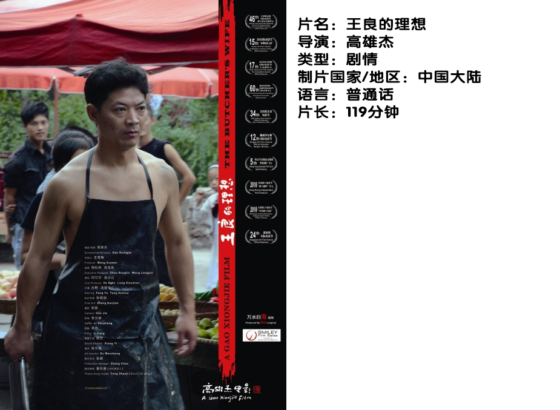

# ＜独立影像＞第三十九期：理想与生活有多远？

这是一部没有多少意外惊喜的电影，甚至让人看了开头就能猜到结尾，然而这也许恰恰是导演所表达的，那就是生活原本就没有惊喜可言，电影中人们可以充满幻想，然而生活却往往过滤掉美丽的一面，变得更加荒诞和黑色。

本来是一个《故事会》风格的故事，然而导演却有着敏感的掌控力来控制影片的情感表达节奏，让观众随着影片的发展情绪越来越走向压抑，看着主人公一步错步步错，一点点的走向悬崖边上。面对一个注定悲剧的故事，人们可以看到里面的小人物是如何在平凡的生活中与命运抗争，无谓地垂死挣扎，而这本身是非常震撼的，你看到的是一个个普通人，他们只想追求稍稍好一点点的生活，然而却被命运一次次地捉弄，承担着一次比一次剧烈的苦难。

整个故事最让人压抑的一点在于里面每个人都没有错，每个人都是为了生活，似乎都很无辜。然而正是每个无辜的人最后却导致了悲剧不断地上演，可是观众们却无法把自己带入一个爱憎分明的观影情绪中，你无法去决然地分辨谁是好人谁是坏人，谁可怜谁活该。主人公王良无疑是可怜人，他的理想就是有个妻子好好过日子，然而为了妻子而失去了一切；可他妻子李俏就是坏人吗？她也只是想满足自己的理想，去考大学去大城市。这两个人都有着美好的理想，然而理想与理想之间发生碰撞，却注定是个必然发生的悲剧，每个人都在执着追求着，然而却让自己的理想把自己拖入深渊。

片子里王良谈到自己童年的理想是建设祖国实现共产主义，而现在的理想只是有个妻子好好过生活。黑色幽默的一点是，共产主义的理想没有实现，有个妻子好好过日子的理想同样没有实现。导演并不打算去探讨政治和社会问题，然而却不可避免地触及到这一点——为什么两个人的理想会发生如此激烈的碰撞？恐怕这里面不可避免要谈到很多内容，然而最直接的原因可能是对于小城镇或者乡村的年轻人来说，大城市被赋予了特殊的意义，他们寄希望于在此改变命运。可是在片子里我们看到了李俏，这个执着于高考，执着于留在大城市的女孩最后的命运如何。执着的人往往堕落起来会更快，因为他们上坡在踩油门，下坡同样在踩油门，这种城乡发展不平衡以及大学教育被赋予的过多的价值的现状，使得一些小城镇或者乡村的年轻人背负了畸形的负担和执念。这就是片子里悲剧的起源。

坦率地说，电影从表现手法和剧本本身来说，没有太多亮点，甚至是一个很老套的故事，然而导演最成功的一点在于没有落入俗套地非要对一个故事进行过度解读，没有故作煽情地人为制造泪点，而只是平静地为观众展示一个悲剧，一个小人物的不幸。而这种平静地表达却足以抓住观众的内心，让观众跟随影片的讲述去体会这个故事里那无可奈何的哀伤与压抑。

而在这部片子里，演员就是你我，他们表现的就是我们自己生活中最常见却最不愿意承认的一点，那就是：生活，其实很多时候根本就没什么希望，一开始就注定是个悲剧甚至惨剧，所谓的希望不过是垂死挣扎罢了。

 【如何观看】  请关注【摘星星® 青年沙龙】在全国各大城市（目前已有西安、上海、武汉、成都、厦门、杭州、重庆、北京等城市）的线下放映活动~ [http://site.douban.com/177837/room/2069615/](http://site.douban.com/177837/room/2069615/) 请加入独立电影交流群**238699763**，验证身份时请注明“**北斗读者**”，一同探讨你的观影感受！ 

 关于**独立电影**和**DNEY**请参见[<独立影像>第一期：初识独立影像（上）](/?p=11506)，其中的**广告**也要记得看哦！ 

（采编：黄楚涵；责编：黄楚涵）

