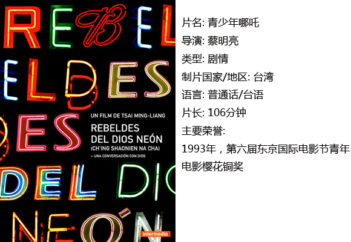
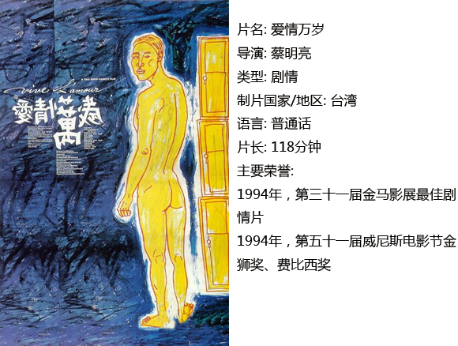
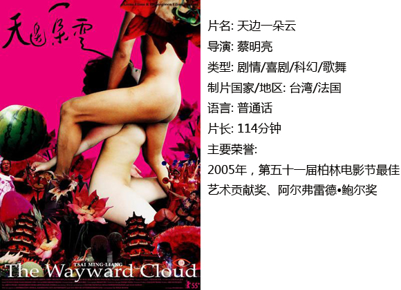
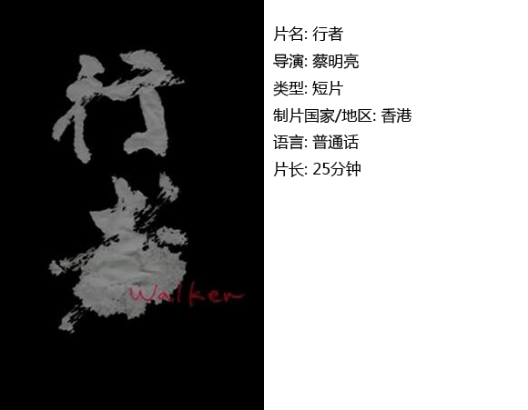

# ＜独立影像＞第三十二期： 我不愿意推荐蔡明亮

**我们当然不能去苛责蔡明亮，说你为什么没有想出来。因为在这个问题面前，蔡明亮和我们一样，面临着痛苦、挣扎和迷惑，这是每一个曾经、现在、将来生活在这个世界上的智慧生灵所都需面对的问题——无论自知不自知。**  

# 我不愿意推荐蔡明亮

## 影评人 / 张苏樊（星联士官学院）

 

推荐蔡明亮的电影是一件吃力不讨好的事情，蔡明亮说：“四百万人评论，可能有九成在骂，但我还是特别开心，因为你们终于看到我的作品了！也许你只看一分钟，就知道蔡明亮就是这么样子，你说它不是电影？无所谓。”在某视频网站，蔡明亮2012年的微电影《行者》的评论中，9895人选择“顶”——

39876人选择“踩”。

#### 一、夸张的身体表现

正如蔡明亮所说，他的电影看一分钟，就会知道这部电影的风格。事实上你也只需要一分钟，就基本上了解了这位台湾导演的风格。我连续地观看蔡明亮的电影，从《青少年哪吒》到《行者》，给我的室友带来了巨大的困扰：为什么这孩子一部电影看了半个月？

极简是蔡明亮电影的一贯风格，这不仅仅体现在电影的制作工艺朴素，很少使用特效，也是蔡明亮对他的演员表演的一贯要求。蔡明亮在台北中国文化大学就读戏剧系时，就亲自创作并指导了三部作品：《速食酢酱面》、《黑暗里打不开的一扇门》以及《房间里的衣柜》。舞台剧创作和表演经历，使得蔡明亮对于演员身体表现的要求非常极致。

这种对于演员表演效果的要求，除却放空精神和有意还原真实，还包含利用身体官能来表达电影的内涵，而后者往往显得非常荒谬。比如1997年作品《河流》中，苗天饰演的老父亲长时间的小便镜头；而在《不散》中，更是有三人一排超长小便，一人超长洗手的荒诞场景。至于空荡荡的电影院、一个人坐在躺椅上睡觉、一个人逡巡在狭窄的廊道里，这些有时候让人不知所云的镜头在蔡明亮的电影里屡见不鲜。这种风格在1998年的《洞》以后愈加夸张和发展，到《行者》、《金刚经》达到一个极致。

长达20分钟的微电影《行者》，全片就是拍摄一位僧侣以极慢的速度走在街巷里、马路上、人群中，没有一句台词。这些当然不能算作还原真实，这是在刻意地利用夸张的身体表现来表达导演的意图，蔡明亮身上舞台剧的烙印也可见一斑。

这种风格使得蔡明亮的作品很难讨得大众的亲睐，除了2005年的作品《天边一朵云》，蔡明亮意图用夸张、大胆的性爱场景来完成表达，台湾新闻局对该片也十分赏脸，“一刀不剪”。这部电影上映一周的票房即超过蔡明亮之前七部影片的总和，轻松突破两千万，而蔡先生之前还常与李康生在路边给自己的电影卖票，效果寥寥。

#### 二、单纯or单调的剧情

单纯是蔡明亮电影的另一个重要特点。蔡氏的作品，无论是单就某一部，还是将多部联系起来（蔡明亮在1993年至2005年之间的电影作品基本上都有剧情联系和人物继承），在剧情层次上都是十分单纯的。

一部单独的蔡氏作品很有可能连一个简单的故事都算不上，比如《你那边几点》、《天桥不见了》、《天边一朵云》，这三部电影只有连在一起才算是一个剧情上基本独立完整的小故事。你只需要用一句话就可以把蔡氏某部电影的剧情非常好的勾勒出来，而且丝毫不会觉得简略。

重点在于，蔡明亮的每一部电影都有自己完整的强烈的独立的精神。以2000年为分水岭，在1993年的《青少年哪吒》到1998年的《洞》中，蔡明亮的作品每一部都具有非常强烈的表达欲望和表达效果。当你把蔡氏的作品联系起来看完，你会看到一个连贯的、统一的、持续性的思考和表达。

但遗憾地是，2001年的《你那边几点》至2005年的《天边一朵云》，虽然延续了蔡明亮一贯的表达方式，但却没有能够带给人们——大众以及小众——如期的震撼和思考。你可以在这期间的四部电影里认出：啊，这是蔡明亮。但除此之外，你看到的单纯已经即将成为单调。

这是和蔡明亮以及他的电影一直思考、探求和希望表达的内容有关的。

#### 三、孤独的行者

孤独是蔡明亮电影的主题。

虽然蔡明亮自己否认了这种标签，并强调自己是在拍摄真实，处理真实。但即便蔡明亮的电影手法可以用真实来描述，他的电影以及他本人所根本关注的问题，却依旧是“孤独”。无论蔡氏是自觉地挖掘这种痛苦，还是不自觉地在表达过程中不断触及到了这个思考，孤独确实是蔡氏的主题无疑。

获得金马奖高度鼓励的《爱情万岁》即是蔡氏作品中对孤独体验和表达最淋漓尽致的一部，当然也可能是最浅显直白的一部。蔡明亮用荒诞的《青少年哪吒》、空虚的《爱情万岁》、病态的《河流》和挣扎的《洞》四部作品抛出了：“人的孤独是永恒的吗？人的理解是可能的吗？”平心而论，蔡氏提出这些问题的方式，惊艳而深刻。

但人们也需要看到蔡明亮对于这个问题持续思考，一味地追问人的孤独、质疑人的理解，既不能满足观众，事实上连蔡明亮自己都无法满足。蔡氏在接受采访时曾说：“我的作品，我比较简单说我想影响别人，影响别人干嘛呢？让他的头脑比较柔软一点，让他的品质变得比较好一点。”很显然，他不是个消极的避世主义者，他希望解答甚至解决“人的孤独和理解”这个终极问题。

这就造成了无论大众和小众——特别是一部分蔡氏老观众——都对其2000年后的几部作品产生诸多倦意甚至是失望，无论是《你那边几点》、《天桥不见了》、《天边一朵云》，还是怀旧意味浓重的《不散》，都依旧是在表达一种荒诞的、孤独的感受和体验，人们没有看到蔡明亮对于这个主题的新鲜思考，甚至在《天边一朵云》的结尾嗅到了一点悲观的味道。人们因为孤独而喜爱蔡明亮，也因为孤独而开始厌倦蔡明亮。

我们当然不能去苛责蔡明亮，说你为什么没有想出来。

因为在这个问题面前，蔡明亮和我们一样，面临着痛苦、挣扎和迷惑，这是每一个曾经、现在、将来生活在这个世界上的智慧生灵所都需面对的问题——无论自知不自知。

在《天边一朵云》后，蔡明亮曾透露说自己不会再继续这个故事。之后蔡明亮开始去探寻佛法，便有了《行者》、《梦游》、《金刚经》三部作品，蔡明亮自言非常崇拜玄奘和法显这些人：“我自己，我想那个念头很可能也是非常单纯的，他就是要来渡众生，渡化人间，为什么会讲渡？就觉得人可怜，他可能觉得人可怜，现在你说我们可不可怜？也可怜，茫茫的在过一生，也是这样的一个很匆忙，可能速度更快，要追求更多，可是到后来很可能是一场空。”

这也许就是蔡明亮在新的人生阶段对孤独对人生的思考和尝试，他希望给予普渡，并渴望得到普渡。他的作品里那些存在主义的表达，是支撑他能够坚持做蔡明亮的支柱，但也让他有消极隐世的潜在可能。然而我们欣慰地看到他依旧在努力寻找答案。对于自私的我们而言，欣慰的理由不在于他选择消极或是积极，而在于我们还会有导演蔡明亮而非隐者蔡明亮，还会有一个孤独的行者可以期待。 

### **推荐电影：**

 

### **【小编推荐】**

**观看法国新浪潮导演特吕弗的电影，你可以更加了解蔡明亮：**

**四百击，二十岁的爱情，偷吻，床第风云，爱情狂奔……******

 

### **【如何下载】~@_@?~**

**请加入独立影像流动分享群，在群邮件中下载本期所推荐的独立电影！**

1.** 新群238699763，**** 入群请注意以下几点哦：**

2.流动群专供北斗读者下载本栏目所推荐的资源，验证身份时请注明“北斗读者”。

3.当期资源自发布后14天内可以下载，到期后工作人员将手动删除以上传后续资源，请注意时间。

关于**独立电影**和**DNEY**请参见[<>第一期：初识独立影像（上）](/?p=11506)，其中的**广告**也要记得看哦！

 

（采编：黄楚涵；责编：黄楚涵）

 
