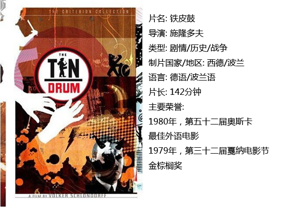
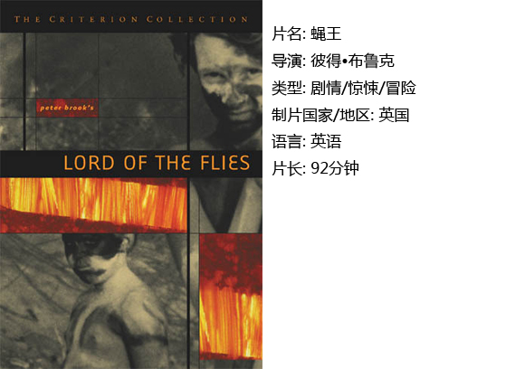
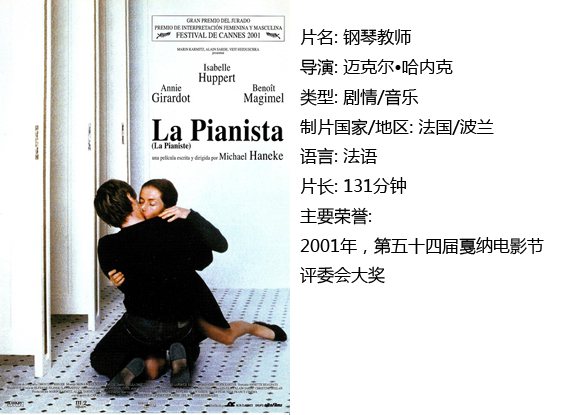

# ＜独立影像＞第三十五期：从文字到影像

中国人做诺贝尔的美梦太久，于是莫言成为2012年诺贝尔文学奖的得主，这在在中国引起了一场不大不小的风浪。

喧嚣过后，我们再次关注诺奖，如此后知后觉倒不失为一种风度。

如果说文字作为一种文化传承在人类几千年的发展中起到了非常重要的作用，那么毫无疑问，影像的力量将会加深这种作用力，有几个人真正看过莫言的原著小说《红高粱》呢，但是几乎所有人都知道巩俐张艺谋，知道他们有个代表作叫做《红高粱》。就传播范围而言，影像的力量远远高于文字，这是不可否认的事实。有好事者忧国忧民，长此以往文字将处之何地，这是多虑了，物竞天择适者生存，任何事情既然存在就有他的道理，因为影像而文字消失，我想那最少是几千年以后的事，后世自然有后世的处事法则，我们又何必为无意义的事情担忧。

也有人尝试把二者结合，赋予文字以电影性，只是文字和影像的矛盾还在于文字的想象空间永远是无穷的，影像则直接带给观众视觉上的冲撞，一千个人心中有一千个哈姆雷特林黛玉，这是不争事实。也有大获成功电影典范，像是《乱世佳人》，票房含金量第一的荣誉伴随它近一个世纪，费雯丽永远留在了荧幕上，那个有着绿色眼睛的出生于印度大吉岭的女孩子用她漂亮的面孔纯熟的演技征服了多少人的心，谁会忘记女主角在红色塔拉庄园的誓言呢，无疑的，那一刻费雯丽就是郝思嘉。当然也有人说，《乱世佳人》作为一部通俗小说来说的确适合改编成电影，因为似乎他并没有那么“深刻”。我们有生之年可能看不到资本论被改变成电影，虽然有人曾经做过这样的梦，却不妨碍我们可以期待一下素以深刻著称的诺贝尔文学奖的改编之路，尽管大多时候这多少有点吃力不讨好。

 **一、施隆多夫之嘉芙莲娜的故事、铁皮鼓**

在介绍电影之前我想谈谈施隆多夫，这个老头子今年已经73岁了，是德意志联邦共和国电影导演，出生于生于威斯巴登。父亲是个医生。曾经在巴黎攻读国民经济学和政治,又在高等电影学院学习一年,年轻时曾做过导演A.雷乃、J.－P.梅尔维尔和 L.马勒 等人的助手，这多多少少影响了他关于电影创作的观念，他的处女作《少年托莱斯的迷乱》改编自R.穆齐尔的小说，讲述了德国一所寄宿封闭式寄宿学校里面的故事，审视了人性的善与恶。即使到现在也是德国青年电影中的重点作品之一，可以说他是一个很会改编故事的导演。

1975年，他拍摄了《嘉芙莲娜的故事》。一个联邦德国的女子因为一次偶然的一夜情而陷入了巨大的灾难中，在自己的母亲去世后因为不堪压力而把枪指向了诋毁自己的记者，最后走进监狱的故事。改编自获得1972年诺贝尔文学奖的西德作家海因里希·伯尔的同名小说。电影初看好像是政治电影，看到最后人们便会惊讶于原来这是一部抵制媒体公权的电影，片子本身是虚构的，但是却具有未来式的警示意味。这部电影充分显示了导演的天分和才华，也是这部片子让施隆多夫声名鹊起，

施隆多夫另外一部改编自诺贝尔文学奖获得者的作品《铁皮鼓》，作者是君特·格拉斯，该片在1979年上映，是一部有着诺贝尔和奥斯卡双重殊荣的电影，讲述小男孩奥斯卡不愿意长大的故事，男孩的特殊包括他的高分贝叫声和一直不离身的铁皮鼓，以及他高于常人的智商，这让他很小就看到了世间的丑恶以至于不愿意长大，成人的世界太过丑陋和肮脏。他的祖母是穿着四条裙子的女人，因为这裙子的缘故她成功帮助了一位逃避追兵的青年，青年躲在宽大的裙子下面，两个人在士兵的眼皮底下做爱，这多多少少有那么一点荒诞，奥斯卡的母亲也就这么出世了，她对奥斯卡的意义非同一般，我记得她第一次出场，站在母亲身边叫卖货物的少女，眼神好像小鹿般警觉，那时她爱恋着自己的表弟，却因为近亲不能结婚嫁给了富商阿尔弗莱德，这是她一生不幸的开端。她和两个男人共同生活，包括的她的丈夫和情人，她给了奥斯卡两个父亲，这本身就是荒谬的。而当这个秘密被年仅3岁的奥斯卡发现时，这个有着异常心智的小男孩决定不再长大，他选择从楼梯上摔下去，谁知道他心里想着什么呢，从此之后，这世上只有他和他的铁皮鼓。他孤身一人。

很多人说这是一部政治电影，和施隆多夫之前的《嘉芙莲娜的故事》一样，这是一部政讲述德国面貌的电影，但是我以为这却是一部儿童电影。谁会在意儿童的想法呢，他们是天生的哲学家，每个小孩子都是独一无二的，思考最伟大的事做最浪漫的梦，但是成人的世界毫不犹豫的侵占了他们，他们逐渐变得爱撒谎，爱夸耀，逐渐变得和你我一样，有的人幸运一辈子保持赤子之心，但是那是多难得的事。在一方面上来说，奥斯卡是幸运的，他一辈子都是一个小孩子，他不会长大，但是一方面来说他又是不幸的，他那双洞彻世事的眼睛总带着几分悲天悯人，几分漠视几分疏离，他应该呆在属于他的星球，永远做他的小王子才好。

 **二、蝇王**

《铁皮鼓》只改编了小说的前两章，年幼的奥斯卡把铁皮鼓埋葬，坐火车到了远方，然后呢，然后就不是电影可以呈现给我们的故事了，这将由文字延伸，那是属于另外一个人生。而同属儿童题材的电影《蝇王》则改编自英国作家、诺贝尔文学奖获得者威廉•戈尔丁的代表作，这是一个残酷的故事，如果说铁皮鼓是一个大人的儿童梦，那么蝇王就是一群小孩子的成人悲剧，唱诗班的孩子因为一场飞机失事而坠海漂到一座荒岛，这应该是一场鲁滨逊式的励志故事，但是本应团结在一起的孩子却因为种种原因拉帮结派残杀同伴，一个小小的专制王国就那么诞生了。团长拉尔夫是理性秩序的代表，但是在一个荒蛮的世界里，如果你选择理智也就意味着选择失败，他眼睁睁的看着自己的同伴投向杰克的阵营，那个桀骜不驯满头金发的小子的确有着领袖的魅力，他传播恐惧而非善良，他虐杀动物折磨同伴。一种意义上来说，文明是在倒退的，大家对野蛮的未知的能力更加迷信，孩子们情愿接受苍蝇的亲吻，也不愿相信希望，毕竟这在那一片茫茫大海里太渺茫。孩子们的恐惧是直接的，这也是为什么整个片子在一种极端压抑的氛围里显得那么让人毛骨悚然，这些孩子又哪里是孩子，分明就是我们成人世界的缩小，孩子尚且如此，也就不难理解理智的人类为什么在战争里显得那么疯狂了。

 **三、钢琴教师**

人性最难理解的地方在于即使是你自己也无法理解自己，我们太容易受周围人和事的影响，就像是《蝇王》里善良被丑恶蛊惑，钢琴教师的女主角却是因为自己的母亲而过的不那么愉快。40岁的艾丽卡总是显得不那么和人一样，她优雅又独特，有着非常高的钢琴技艺，对学生严厉异常——这是因为她有一位非常专制的母亲，她甚至不允许自己的女儿穿太名贵太华丽的衣裳，她至今都和自己的女儿住在一起。艾丽卡的父亲死在精神病院，缺乏父爱又被母亲过分压制的她一定程度上来说，心理已经极端变态，她观看色情录像，用剃须刀刺刮身体的下处，她还是一个偷窥者，偷窥别人的性爱而获得满足。但是她遇到了爱情，男学生充满了年轻的味道，活泼有魅力，对她表示赞美，不过艾丽卡需要的已经不仅仅是爱情，她更想要的是控制这个男人。这是她的悲剧，她痛恨自己母亲的控制，但是却不由想去控制别人。男人和女人的交手中女人总是占不了便宜，当学生发现自己的老师竟然是一个受虐者时，他觉得受到了羞辱，他实施了报复，他强奸了自己的老师，然后他回到了自己的生活里，一切如旧。而可怜的艾丽卡，她那明显已经不年轻的脸上，麻木的看着众人离去，然后抬手把刀刺进了自己的胸口，她离开了音乐厅，然后就消失不见了。街道上车水马龙。

这部电影由迈克尔·哈内克导演，原作者是诺奖得主艾尔芙蕾德·耶利内克， 和原作相比，小说里面大量的心理描写是影像无法复制的，但是伊莎贝尔·于佩尔的表演是无可挑剔的，她成功塑造了一个钢琴教师的形象，这也是为什么影像虽无法再现小说，却也新鲜旺盛的地方，因为演员的魅力是人无法抵抗的。

我们完全可以期待莫言的作品会被改编成电影，例如《丰乳肥臀》，因为一方面永远不要小觑中国人对国外大奖的热忱，另一方面，文字和影像在未可见的时间里，大约还会有几千年的纠缠。

 

### 【小编推荐】

关于诺贝尔文学奖得主作品改编电影，你还可以看…… 《仆人》（作者：哈罗德·品特，导演：约瑟夫·罗西）、《日瓦戈医生》（作者：帕斯捷尔纳克，导演：大卫·里恩）、《布登勃洛克一家》（作者：托马斯·曼，导演：海恩里奇·布罗尔） 

### 【如何下载】~@_@?~

 ** 请加入独立影像流动分享群，在群邮件中下载本期所推荐的独立电影！** ** 1．请加2群238699763，入群请注意以下几点哦：** 2.流动群专供北斗读者下载本栏目所推荐的资源，验证身份时请注明“**北斗读者**”。 3.当期资源自发布后14天内可以下载，到期后工作人员将手动删除以上传后续资源，请注意时间。 

关于**独立电影**和**DNEY**请参见[<独立影像>第一期：初识独立影像（上）](/?p=11506)，其中的**广告**也要记得看哦！

 

（采编：黄楚涵；责编：黄楚涵）

 
