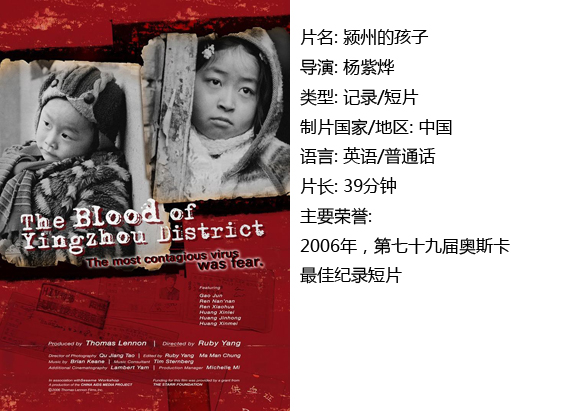

# ＜独立影像＞第三十八期：真正的永火是人

 “耶和华将硫磺与火从天上降与索多玛与蛾摩拉，把那些城和全平原，并城里所有的居民，连地上生长的都毁灭了。一时平原全地烟气上腾，如同烧窑一般。罗得的妻子不听天使的警告，顾念索多玛，在后边回头一看，就变成了一根盐柱。” ——《圣经·创世纪》14:2-3 

自1983年人类文明第一次瞥见艾滋病的身影，至今仍有许多人相信：这“不可治愈”的致死之病毒是上天、是主神、是自然伟力降在世上，去惩治那些“逆性”的情欲者、亵渎神灵的恶人的永火。

可惜世界不是上帝的，上帝是世界的。我没有宗教信仰，如果引起争执那便随教徒们去吧，薄某人在教徒看来也一定是受上帝惩治的，因为他与多名女性保持不正当的关系。就让耶和华的尽归耶和华，我的依旧是我的。

在很多官方及非官方的宣传、普及、传递和谣传里，艾滋病被描述为一种一旦感染必死无疑的病症。这种观点如果放在上世纪80年代，还是比较站得住脚的，如今艾滋病的致死率虽依旧可怕，但早已不是什么不可一世的世纪永火。

人自己才是世纪永火。

艾滋病虽然可怕，但并非埃博拉病毒那样直接致死的杀人魔，艾滋病感染后会破坏免疫系统功能，致死的患者最终都是因为并发症（肺炎、肺结核）导致生命终结。

艾滋病是不可治愈的，但高效抗逆转录病毒治疗也就是HAART已经被证实可以在很大限度上抑制病毒的复制、保存和恢复免疫功能，降低病死率和HIV相关性疾病的发病率。简而言之，即抑制病毒扩散、恢复感染者被艾滋病破坏的免疫功能，这样一来，并发症的发生及影响效果也就不足以致人死亡，艾滋病也就无法致死。它无法被根除，但也闹不出什么大动静，这听起来就好像——脚气。

当然，这种治疗——以及其他各种治疗方式——价格不菲，且需终生坚持治疗，国内目前对CD4+T淋巴细胞计数低于350的艾滋病感染者提供免费治疗。

事实上艾滋病到今天仍高企不下的致死率，有两个原因：一是艾滋病本身的治疗还没有达到可以广泛普及的作用；二是艾滋病的重灾区多在亚非拉发展中国家、经济落后地区，这使得病毒传播的阻碍更少，且治疗资源更加匮乏。

因此在这些社会中，往往流传着艾滋病一旦感染必死无疑的说法。官方机构如此表态，是落后地区资源匮乏的一种无奈；而有一部分人散播这样的说法，则一方面是无知，一方面是为了维护自身的利益——比如传教。艾滋病曾被用作宗教武器，疯狂地引用以批评、批判现代社会对宗教教义的淡漠态度，如果艾滋病被如此迅速地证明是现代科学可以对抗的，宗教的威信又将受到一次打击。

这让我们想起了曾经肆虐全球数百年、夺走无数鲜活生命的上帝奴仆肺结核君，中国也一度饱受其困扰，但时至今日已经鲜闻有人因此病丧生（艾滋病重症患者除外），医疗手段的进步和医疗资源的普及使得政府机构可以为公民提供免费的有效治疗。肺结核被裹挟在各种妖魔传说里传遍南北的时代已经过去，肺结核的今天就是艾滋病的明天。

“这是上帝的仁慈与博爱！”

别闹。

#### 一、 安全性行为

同性之爱——特别是男同性恋——是艾滋病病毒感染的高危人群，这并不是因为他们体质特殊如同某型血吸引蚊子一般，而是由男同性恋在性行为中的行为习惯所决定的。

男同性恋群体中的滥交和多个性伴侣状态相对比较普遍，这使得男同性恋者比女同性恋者、一般异性恋者更加容易接触到艾滋病病毒。假设一个人携带艾滋病病毒，而他只与一个固定对象发生性关系，那么由他所引起的传播路径至少在这一层是单线的。但如果他同时与多名对象保持性关系，可想而知艾滋病传播的可能性将会大大增加。

因此在现在的讨论中，男同性恋已经不再适于被如此单独地拿出来责难与对待，因为多个性行为对象早已不是男同性恋群体中普遍存在的现象。但拿艾滋病攻击同性恋群体、倾泄歧视乃至人身攻击的行为仍然在这个时代屡见不鲜。

“烧死同性恋！”

你可长点儿心吧……相比于人肉BBQ这种简单粗暴且难以操作的方式，对抗艾滋病最好的方法就是安全性行为知识的传递，关键即是安全套的使用。令人欣喜的是，如今包括男同性恋者在内，大多数文明社会的人已经学会和熟悉使用安全套。

而摸索出安全性行为的方式，以及对抗偏见和歧视的过程，曾让整整一代人付出十数年的光阴。这些历史的情境如今改头换面在中国发生着，所幸的是我们不必再去做第一个吃螃蟹的人。

#### 二、颍州的孩子

艾滋病的另外一个传播途径，也是最悲哀的传播途径，就是母婴传播。这种现象在欠发达国家和地区非常普遍，且造成的后果也最为严重。第一层感染者一般是通过不安全的性行为、毒品注射或血液传输携带上艾滋病毒，而这一部分群体的后代则不幸地成为第二层携带者。这种伤害在孩子身上、在落后地区，尤为突出和严重。

首先，孩子本身的体质、免疫能力较弱，对药物和治疗的耐受能力也远不如成人——事实上未成年人的用药和成人是不同的，这在很大程度上使得这些生来就携带艾滋病病毒的生命脆弱且饱受折磨。

此外，携带艾滋病病毒的未成年人大多在年幼时就失去双亲，社会福利资源匮乏的情况下，这些孩子得不到必需的照料和关怀。

最后，最可怕的并非病魔，而是人类自身的偏见、歧视、无知与仇恨。在这些伤害面前，艾滋病只是终究会被人类踩在脚下并遗忘的石块，真正的世纪永火，是人。

颍州这样的村落，在中国并不是唯一的一个，也绝不只是某一个时空的断面，直到今天这种血液交易仍没有断绝，更遑论它在数十年间带来的深重苦难。

#### 三、蓝

德里克·贾曼说：最大的理想是所有的男孩爱男孩，所有的女孩爱女孩，永不改变。

碇真嗣驾驶着初号机手握渚薰的那一帧静态画面曾给我留下深刻印象，那是动漫历史上最为漫长的一帧，没有音效没有动作，就是那一帧停留的时间打破了吉尼斯世界纪录；之后蔡明亮的影片中随时可见的生活静态画面，也让我再一次体会到“一帧”的魅力。

《蓝》却把蓝色的一帧，停留了74分钟。这部1993年的影片留在英国导演德里克·贾曼的人生的最后时刻，这位天才的诗人、画家、植物学家——以及同志艺术大师——用一部电影纪录下自己罹患艾滋病的最后岁月里的感触，影片里平静低沉的声音仿佛他的那幢海边小屋，那木屋傍着花园，和他的蓝。

这部电影依旧体现出导演的风格：对情节、具象的厌倦，对形式和抽象感触的追求。在这个角度上他的作品吸收了来自绘画与舞台艺术的印象，结合蔡明亮等静态镜头的热衷者的经历，可以看出舞台剧艺术对于静态镜头表现方式的表达的影响之大。

而在这里最为我所注意的，是他天才却又不失真实地描绘出一个艾滋病患者——同时也是一位男同性恋者——在艾滋病晚期的身体感受与世界思考。自私地说，这种死亡体验的细致纪录十分珍贵，更何况是以《蓝》这么一种天才、优美、平静的笔触。

这位诗人并不认为艾滋病需要怜悯，需要施舍，甚至也不需要理解。德里克·贾曼只是单纯把这些纪录下来，在他的坟茔上，放上一株飞燕草，一片蓝色。

 

### 【如何下载】

 请加入独立影像流动分享群，在群邮件中下载本期所推荐的独立电影！ 1.请加2群238699763，入群请注意以下几点哦： 2.流动群专供北斗读者下载本栏目所推荐的资源，验证身份时请注明“北斗读者”。 3.当期资源自发布后14天内可以下载，到期后工作人员将手动删除以上传后续资源，请注意时间。 

 关于独立电影和DNEY请参见[<独立影像>第一期：初识独立影像（上）](/?p=11506)，其中的广告也要记得看哦！  

（采编：黄楚涵；责编：黄楚涵）

 
