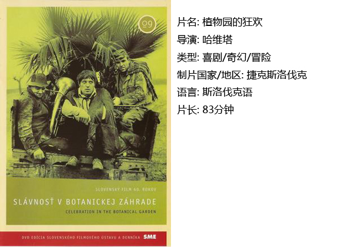
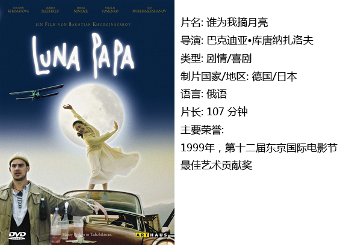
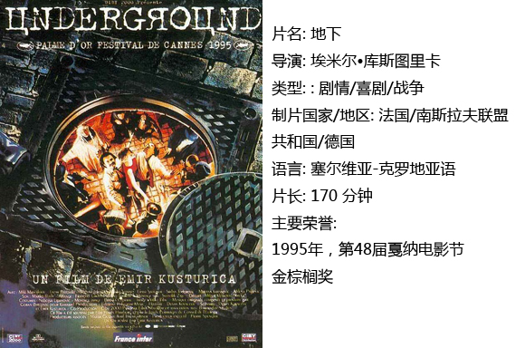

# ＜独立影像＞第三十六期：天马行空般的现实寓言

就表现形式来说，电影与魔幻的确有著先天的不解之缘。电影逼真的影像常常使人它并非真实，从而使它成为人类社会历史上最具幻觉性的艺术形式．但是电影永远不会是现实世界本身。人们看一部电影就是进行一次心理体验，虽然这种体验可能是现实生活中体验不到的东西。这是因为艺术家筛选和提炼了生活中平凡的事，把它们进行加工和升华，从而使我们在观看电影的时候产生具有强烈真实感的超常心理体验。弗洛伊德说：“生活正如我们所发现的那样，对我们来说太艰难了，带给我们那么多痛苦、失望和难以完成的工作，为了忍受生活，我们不能不采取缓冲的措施。”

“魔幻现实主义的基本风格和技巧最重要的就是把神奇而怪诞的幻想与新闻报道般的写实原则相结合的艺术特征。”也就是说，魔幻现实主义的核心精神是把荒诞的事物用写实的手法进行表现，即把神奇作为现实突变的产物和现实的特殊表现。所谓魔幻，就是神奇现实，在本质上它还是属于现实上义的范畴，它还力求用现实主义的手法来体现“真实性”，特别是在电影中。它表现的真正的物质现实，这一点它与超现实主义表现的心理真实有着本质的区别。

魔幻现实主义电影将“现实和看似幻想的神奇融为一体，现实与非现实的界限被打破，现实的元素被神奇地组合存一起。在电影独特的真实性前提下，在现实中可能存在的神奇事物被如实地表现出来，这种银幕现实和物质现实的落差更加强了现实的神奇色彩”。我们在观看这类电影的时候，常常发现它们虽然基本上符合现实，但又都不同程度地明显地超越了现实．使我们在产生神奇的感觉后，不得不为其精彩的想象力所折服．并不由自主地被整个情节所深深地打动。

下面为大家介绍三部魔幻现实主义电影。

#### 一、植物园的狂欢

这部电影被定义为代表了东欧魔幻现实主义电影的最高水准。在蓝色滤镜下的晃动着讲述了一个故事，从前有个村庄，这里住着这么一群人，他们顺从而虔诚，努力劳作，忍受痛苦，总是满怀希望。有一天年轻的植物学家卡斯帕来到了疯子村。他和少女凯瑟琳相爱了，屋顶上走路的女孩却深爱着卡帕斯，在一场喧嚣的闹剧过后死去。风韵尤存的中年妇女完全无视懦弱的丈夫科瓦奇和酒馆老板偷情，迷途的乐团在寻找酒馆老板，他们寻遍了全世界却在这个村子的小酒馆里找到了他。舞台上上演的木偶剧也是一场盛大的闹剧，台下的孩子看认真了哭了。最后一场伟大的演出，喷泉喷出葡萄酿造的水，大家在最后一场盛宴中，歇斯底里地狂欢。到处都在燃烧，稻草衣，钢琴。植物学家离去后，疯人村又恢复了往日的平静，人们依旧勤劳，回到蓝色滤镜，植物学家乘坐的马车渐行渐远。

电影中表现了一群疯狂却性格各异的人物，每个人都是疯狂的个体，每个人都在上演奇迹。在这些夸张性格的人物中，我们是不是有看到自己的影子呢？

对话混乱逻辑，带着宗教色彩。也许他们在说根本是不重要的，导演想要表达的情绪以及氛围已经淋漓尽致。而导演多次借演出，展现耶和华拯救世界时的话语，颇有些宗教意味。而话语间的选择恰好传达了电影的思想内容。

电影的色彩的运用是一大特色，各色滤镜和彩色画面交叉使用，颇似捷克斯洛伐克新浪潮电影《雏菊》，但色彩表达的意思要复杂得多。色彩从64年的《红色沙漠》开始便和人的心境相关。开场便是蓝色滤镜，由亲吻转到了全彩后很长一段没有变换色彩，而在接近本片高潮的部分频繁使用各色滤镜以表示混乱的场面。

主观视角非常独特，有时是嬉闹的花房玻璃，有时是不知道哪里来的望眼镜，有时是花眼小老头的猎枪，还有时是塞满杂草时不时伸出猎枪的墙洞。

音乐是滑稽的乐队演奏以及悠扬的女生吟唱为两大主线，凡是闹剧的段落少不了那段异常滑稽可笑的狂想曲，而悠扬的女声则出现在卡斯帕和女友凯瑟琳幻想未来成家的场景时适时的出现。玛格丽特死了，她的葬礼队也出现了那段悠扬的乐曲。这乐曲的渲染下使片子增添了悲伤的一笔。

叙事则看似混乱却存在这明晰的主线，电影被分为7个部分，每个部分之间是递进关系，到最后一个部分形成高潮和结尾的完美组合。虽然看似夸张不知所以然但却把神奇而怪诞的幻想与新闻报道般的写实原则相结合。

此外还有不符合正常时间的节奏以及跳轴等各类反常的摄影手法。

这样一种魔幻现实主义的手法常常比单纯纪实更加发人深省同时也巧妙地规避了提及公共话题中不可触及的方面所带来的麻烦。现实和看似幻想的神奇融为一体，现实与非现实的界限被打破，现实的元素被神奇地组合存一起。

#### 二、谁来为我摘月亮

这是一部中亚的魔幻现实主义电影，一个来自塔吉克斯坦的导演，拍摄了这部发生在乌兹别克斯坦的故事，影片的对白是俄语，合作拍摄的国家众多。故事情节看似简单，但内核却有些复杂。

导演同样是以荒诞滑稽的剧情来隐喻：世间万物本就是颠倒的。女主人公想当演员，但爸爸没有足够的钱，她想获得一份真正的爱情，却在咫尺之间失之天涯。她天真而善良，懵懂而勇敢。她爱着自己的家人，也被自己的家人所爱；用尽了一切办法，竭力坚持着自己的梦想，不愿放弃生命中关于美好的期待。可是——哪里都充满着邪恶，虽然有时它会被彩色糖纸包裹着。

荒诞的剧情和癫狂的表演加上法式丰富而漫无边界的想象力。其中既带着忧伤又充满幽默，既包含不可思议又是最纯粹的生活。爱情尚在，亲情永恒。但幸福只是一瞬间，文明世界或许越来越虚伪，越来越不真实，让人无法忍受。可是电影用轻盈饱满的月亮来承载这些苦难时，它就奇迹般地显得就不那么沉重了。那张被爸爸认为使玛拉卡怀上孕的演员名单，就象一千零一夜的目录一样：被爸爸和哥哥绑架回来的每一个人都经历了一场不同的冒险，却一样的荒唐而戏剧化。世人都在伤害她。玛拉卡穿着白色连衣裙在爸爸的汽车上翩翩起舞，乘着船穿过美丽的河流，到达剧场时，却发现早已散场。绝望而去踏进找不到出路的草丛却糊里糊涂地失去童贞，那象征纯洁的白色长裙被撕破。她一边照着镜子一边对着肚子的孩子说：“你是不是想见你妈妈了。”镜子在这一刻被不知哪里来的子弹打碎。世人抛弃了她，开往远方的船因为她踏上而空无他人。这就是活生生的现实。

导演借着玛拉卡父女三人寻找孩子爸爸的过程，展现了神秘中亚的民风民俗，也剖析着这些国家在复杂的国际局势下的困境。中亚的小镇里一群因奔跑而掀起尘土的马队。小镇里的人们日日夜夜地穿行与小镇的集市内，吵吵嚷嚷地说着东家长西家短。我们的生活无法摆脱这样一群人，他们无处不在，在《西西里的美丽传说》，在《羊脂球》，在《芙蓉镇》，他们是哥哥口中的恶魔，他们是罪恶的，他们整天愁容满面，他们一无所知却用所谓的道德与法律来谴责他人，他们有着封闭的心灵。

这个地处偏远内陆的小镇原来并不单纯，各色人等混杂其中，既有军纪松弛的军队，还有各路豪强土匪，更有各种各样的演出团体来来往往，而当地居民，则也穿梭其间，虾道蟹路，讨着生活。朴实平和的村庄容易被陷入陈规陋习，抹杀个性。而因为种种原因使他成为违禁之人以后，人们就控制不了自己的虐待性，自以为是的正义感。导致狂妄，如果发展到认为对方是可耻的有罪的。

于是上帝让风力带走那片屋顶，这是电影最具魔幻现实主义的场景，仿佛《飞屋环游记》中飞起的屋顶，而在屋顶的上面载着一颗不为文明世界所容纳的健康美丽的女子的心灵。

亲爱的孩子，你看到鱼在飞，牛在游泳了吗？你来到这个世界的时候到了。

#### 三、地下

塞尔维亚电影导演库斯图里卡的这部魔幻现实主义战争史诗巨作，相比于前两部电影来说，承载着更多的政治使命。

从前，有一个国家……它叫南斯拉夫，多少年来它经历了腥风血雨，生活在残忍地狱的公民，各自寻找着自己的生存之道。它从1941年一直到1992年跨度很大，不负众望地影射了南斯拉夫整个当代史，尤其是国家崩溃背后的道德危机。库斯图里卡以他特有的荒诞滑稽风格娓娓道来。

几个烂醉的年轻人在马路上闹事，配以闹剧般的音乐。人群倒映在高墙上的一闪而过的巨大身影使这个场景极富魔幻色彩，就像是童话里来无影去无踪的劫富济贫的强盗。天空在燃烧，暴风雨不远了。历史本就是一场心酸的闹剧。在这场荒诞表演中每个人都是他们身处时代的滑稽演员。在地下社会中，有着看似完整的体系，每个人各司其职，所有人都像是在为马高而工作而活着。地上地下道路纵横令人眼花缭乱。其实，地上与地下没有什么分别天天上演着闹剧。地下的人被迫颠倒时间在没有天空的世界中如此疯狂，地上的人跳着滑稽的兔子舞像看一场一连播了二十年的肥皂剧一般又哭又笑。

历史总是有着那么一股可怕的力量，它控制着每个人的生命，让他们又聋又哑，毁掉他们的灵魂。

娜塔莉是个矛盾体，她制造了很多荒唐可笑的表演，而她的人生犹然带着那股悲剧性质，她水性杨花也好，她随波逐流也好，她还是深爱着这世上唯一的亲人，坐轮椅有智障的弟弟。她艰难地存活于不停循环的时代漩涡里。作为无赖和小偷的马高，在战争中似乎是游刃有余。他在整个历史闹剧中是最清醒的人，在电影中，他的语言看起来荒诞不经实际上却有着深刻的道理。他早已明白“我们的整个生活就是谎言，我们都是说谎者。”每个人的生存之道不同，有的人选择为他人而成全自己的人生，有的人选择为自己去牺牲他人的人生。明白了这一点，当你再去恨他的时候，就会选择不咎既往。活得最糊涂的黑仔是最具悲凉色彩的人物，然而他却是国家的忠臣。在没有天空的地下社会中，他一遍又一遍地撞墙悲痛于自己的人生“如果德国人杀了我会更容易，我对上帝做了什么，他竟如此惩罚我？”他那疯子般滑稽荒唐的举动却透着一股悲凉，他死了二十年在重生的那一刻好不容易冲破地下社会来到地上，兴致勃勃地打的却是一场虚拟的战争，并且在下一刻失去了自己那尚分不清太阳与月亮的儿子。最后他选择了原谅一切，这般宽容使得他会在他的坟墓里睡好。

你害怕上帝吗？圣经也是人写的。上帝也无法阻止灾难的发生。于是便再没了太阳，没了月亮。南斯拉夫人永远处于动荡而血腥的年代中，每个人都很自然地把经历战争当作自己的命中注定。然而到处却弥漫着他们深深的不幸，在荒谬的大场景里，偶尔有几处悲情的片段。

库斯图里卡运用无厘头般庞杂而戏谑的叙事，泼辣果敢的节奏，吉普赛式狂放的音乐旋律，滑稽小丑似的人物，一系列十分怪异的意象（酒红色的烟雾，摇晃的冰柜，长不大的猩猩，波动的井水，绑在树边不停吠叫的狗）描绘了一个上下颠倒，魔幻瑰丽的世界。最后的魔幻现实主义场景为电影又添了一笔深刻，大家在水里相遇，上岸后不咎既往地尽情欢乐歌唱，原本说话口吃的伊万也变得流利而睿智。一切都是那么理想主义。

无处不在的隐喻：在黑仔心中马高是个兄弟似的存在，而也许马高对黑仔的背叛是一个极大的隐喻，他骗黑仔说：“你是我心灵和精神上的兄弟。”马高同样欺骗了自己的亲兄弟伊万，马高最后的话：“没有战争，直到兄弟杀死他的哥哥。”诚如南斯拉夫因内战而分裂的命运，这或许可以作为战争宿命性的最好的注脚。也许库斯图里卡当初拍这部片子的目的是想给南斯拉夫人一个警醒，让人们去思索现实和荒诞的电影情节的相似性，却没能敲醒沉睡中的人民，而奇迹般地成为了南斯拉夫分裂的预示。

库斯图里卡借电影之口对历史说：“我能原谅，但不能忘记。”

魔幻现实主义导演们的真正目的是为了找到一种更为精确和深刻的语言方式来揭示人与自然，与社会交往过程中所认识到的真理，事物本质和规律性的东西。换句话说，他们的本意不是为了荒诞而荒诞，为了神话而神话，而是为了更具审美性和深刻性。他们不是普通的喜剧导演，而是对现实有着尖锐和老成观察的哲学家们。他们在点击你笑穴的时候，从来没有忘记和你一起探讨人生和社会的意义。从这个意义上来讲，魔幻现实主义电影早已超越传统喜剧的规范，并具有更加深刻的现实意义。

 

### **【如何观看】**

**请加入独立影像流动分享群，在群邮件中下载本期所推荐的独立电影！**

1.请加2群238699763，入群请注意以下几点哦：

2.流动群专供北斗读者下载本栏目所推荐的资源，验证身份时请注明“北斗读者”。

3.当期资源自发布后14天内可以下载，到期后工作人员将手动删除以上传后续资源，请注意时间。

关于**独立电影**和**DNEY**请参见[<独立影像>第一期：初识独立影像（上）](/?p=11506)，其中的**广告**也要记得看哦！

 

（采编：黄楚涵；责编：黄楚涵）

 
