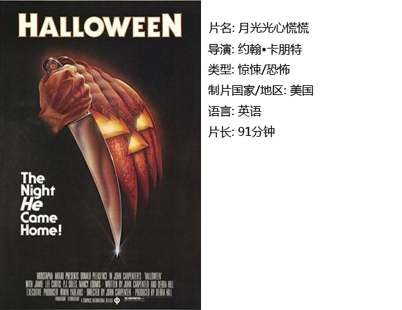
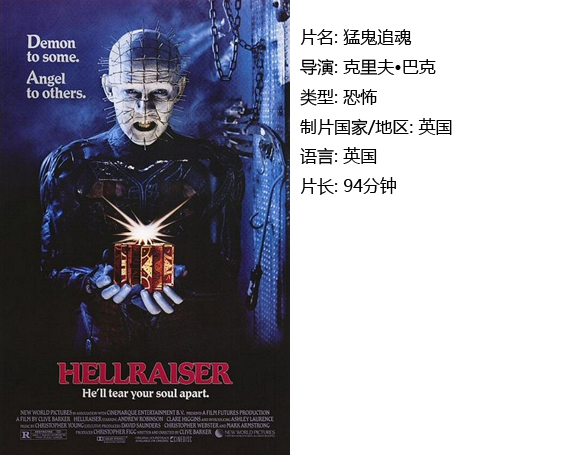
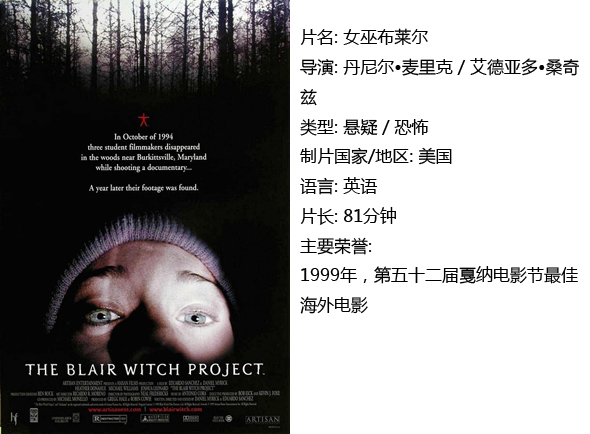
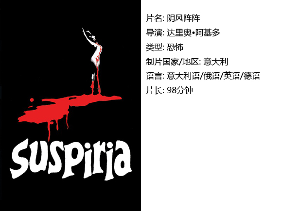

# ＜独立影像＞第三十四期：装神弄鬼的艺术

#### **小编寄语：**

一年一度的万圣节来到，虽然国人不能像西方人那样，可以在营造布置的恐怖气氛下欢乐地度过节日，但也可以自娱自乐观摩恐怖电影~恐怖片爱好者都知道，最近一部《林中小屋》将好莱坞恐怖片产业日益平庸的流水线工作讽刺得淋漓尽致。事实上，欧美恐怖电影并不是人们所认为的过度渲染暴力和血腥、缺乏内涵，相反，早期的恐怖片为电影艺术贡献了诸多创新的拍摄形式，人的内心与周遭环境的张力在这些元素的特写下得到了加强和升华。本期＜独立影像＞为大家推荐四部优秀的恐怖电影，希望大家在欢度万圣节之际，为欧美恐怖电影艺术有更深刻的理解。

#### **王冬阳：**

万圣节源自古代凯尔特民族的新年节庆，人们为了避免恶灵干扰的同时，以食物祭拜祖灵及善灵以平安过冬。而现在，万圣节已经完全没有了宗教迷信色彩，似乎没有了先人对鬼神的畏惧。主要以欢乐的节日形式呈现，孩子们挨家挨户的讨要糖果，年轻人在化妆舞会上跳舞欢颂。

先人之所以惧怕鬼神，是因为对科学的认知太少和对超于生的“事物”的好奇罢。即便至今，人们依然对一个可能的多维的世界存在太多无知。这种困惑促发了联想和恐惧。所以极富想象力的人们编造出了一个又一个看不见的，无法解释的故事。因为无知和恐惧，很多人对于宗教和鬼神论也持着“宁可信其有，不可信其无”的态度。恐怖电影的出现，是将这些民间传说用另一种更直白的方式诠释出来。

人类有一种特殊的心态，那就是寻求令自己害怕的东西，这使恐怖片产业出现，并一直发展至今。有科学家认为，有些人喜欢恐怖片就是因为它能给他们一个安全的环境去体验恐惧的刺激。这就好比有人爱探险，有人爱蹦极。

随着恐怖电影日益发展成熟，恐怖电影成为了电影艺术不可分割的一部分。大致可以将其分为以下两大类：连环杀手和妖魔鬼怪类。前者大多是在一个密闭的空间里或野外无支援的情况下发生的一系列变态杀人事件。而后者更注重触碰人的心理感受和丰富的想象力，从而使恐怖电影从心理上达到视觉和听觉以外的恐惧。下面，我想为大家介绍四部经典的西方恐怖电影。

**一、《月光光心慌慌》**

七十年代的《月光光心慌慌》，为后世的恐怖片创建了一种经典范式。

《月光光心慌慌》被英国权威科幻期刊《SFX》于2004年评选为史上最恐怖影片第一名。本片仅花了21天拍摄完成，其预算为30万美元，因此成为那一时期制作成本最高的独立电影。但因为费用的紧缺，演员均得自置行头。影片拍摄好后，没有任何一家大公司有兴趣发行此片。因此，执行制片人决定通过自己的公司来发行。

本片因建立在悬念上而非鲜血上，所以被从“血浆片”中划分出来，被认为是现代“肢解电影”的鼻祖。电影中的凶手是个没有原因、没有良知，甚至没有最基本的生与死、对与错的感知，头戴白色棒球面具的人。他来无影，去无踪，看不出任何表情，有一双魔鬼般漆黑的眼睛。在片中，他的面容只出现了极其短暂的时间，这使凶手显得更为恐怖。

因为影片中有过性乱交的女生全部死去，而身为处女的矜持女主却幸运的活下来。故从此片开始，“肢解电影”便有了一个不成文的标准：男女乱交者一定惨死。

面具连环杀手、尖叫连连的女主角、快速的镜头切换与固定机位的长镜头结合营造出的诡异气氛……这些元素不仅仅使这个系列在未来的三十多年拍了十部续集，也成为后来的大多恐怖电影的必备成分。如今，恐怖片不断翻新花样，人们对刺激的耐受性变强了，对剧情结构的追求变高了，甚至对影片主角智商的要求也变高了，所以会认为像《月光光心慌慌》这样的恐怖片始祖观赏起来毫无新意，漏洞百出。但实际上，在审美疲劳之后追根溯源，不失为享受原始粗砺的恐惧的一种方式。

**二、《猛鬼追魂》**

八十年代的《猛鬼追魂》，将恐怖电影引导至更血腥，奇幻的境界。

《猛鬼追魂》又译作《养鬼吃人》。在我看来，《养鬼吃人》更能表现出本片的内在——人性的贪婪，自私。

人是有原罪的。想知道欲望的罪恶是怎样引导一个正常人变为魔鬼的吗？鬼吃人！用史上最黑暗的方式把人类灵魂深处的丑恶即贪欲充分暴露在阳光下，这也是创作者克里夫巴克的看家本领，用场景上的最丑恶，向人们喻示着：如果人类极尽贪婪之能事，到头来所得到的就是最黑暗的丑恶！

难道人类的贪欲不正是把世界引向灭亡的事物吗？人类的一切罪恶就是来自贪欲，要修理地球、要征服宇宙、要这要那，但我们不过只是上帝的创造物，而不是造物主。试图僭越上帝这个造物主而想统治大自然，这就是最大的贪欲，这个贪欲不灭，则人类必灭。

我想，克里夫巴克就是要通过鬼吃人这种让人难以忍受的表象形式，让人们知道贪欲的危害，警示世人悬崖勒马。

**三、《女巫布莱尔》**

《女巫布莱尔》是九十年代低成本电影中的一个奇迹。原本第一周只安排二十七家影院放映，因上映后反应热烈，戏院由第二周的三十一家一下子扩充到一千一百家。其最主要的原因是，把一部单纯的恐怖片以纪录片的形式展现在观众面前。如此新颖的制作手法必然会导致褒贬不一。因为本片全部采用手提摄像机拍摄而成，所以更有观众称：“没吓晕，先被晃晕了。”但这依然不能否定本片并不只是靠纯粹的炒作卖座，事实上，它为后来多部恐怖电影提供了精彩的拍摄思路。近年来，一些中国大学生以此片为模板制作了相类似的恐怖微电影。欧美也重新刮起了伪纪录片形式的恐怖片风潮，票房冠军诸如《科洛佛档案》、《鬼影：灵动实录》都受到了本片的影响。

我想把本片推荐给感性的观众。因为，如果一味地追求本片的真实性，那么一定会认为它只是一出装神弄鬼的闹剧。然而，伪真实能够带来真刺激。有时候我会觉得一些影迷对电影的要求太高。既希望电影内容真实，又渴望得到强烈的视觉冲击并收获深刻的人生教育意义。实际上，如果有一部影片，它没有任何血腥的场景，却能营造恐怖氛围；没有出现过一次鬼神的身影，却能令观影者怀疑鬼神的存在；没有高超的幕后制作，却能给观众高成本电影才能体会到的感受……那么这部影片已经有足够的观赏理由了。

**四、《阴风阵阵》。**

《阴风阵阵》是一部典型的意式恐怖片。一名美国女学生来到异国一所著名芭蕾舞学校求学。在刚到学校的那一晚就发生了一件不可思议的事情。一名女生慌张的跑出学校，一脸恐惧，嘴里还念着奇怪的词语。进入学校后，却发现很多事情令人匪夷所思。整个学校看起来似乎被一股神秘的力量笼罩着。最后，女主角Suzy犹豫着到底是逃离这里还是一探究竟。

确切的说，本片是一部关于女巫的惊悚电影。影片中对女巫的定义：女巫是邪恶，消极和有毁灭性的，她们能改变事物的发展和人的生命。说到女巫，总会容易和地中海沿岸邪教扯上关系。也许正是因为如此，意式恐怖片才会融入更多具有独特风情的邪教元素，从而使观众容易将其和普通恐怖片区分开来。

片中的复古装扮和小饰物在今天看来有不同寻常的唯美，布景中各种鲜艳的大色块，对视觉形成强烈冲击。虽然其特效和血浆看着不那么真实甚至有些可笑，但高对比的灯光效果的运用使得人物感情显得异常饱满浓烈。

 

### **【小编推荐】**

**想过一个刺激的万圣节，观看更多与众不同的恐怖片，请点击**[**http://movie.douban.com/doulist/1517341/**](http://movie.douban.com/doulist/1517341/)

# 里面有《Time Out》杂志评出的史上百佳恐怖片~

** **

### **【如何下载】~@_@?~**

**请加入独立影像流动分享群，在群邮件中下载本期所推荐的独立电影！**

**1****．****请加2群238699763， ****入群请注意以下几点哦：**

2.流动群专供北斗读者下载本栏目所推荐的资源，验证身份时请注明“**北斗读者**”。

3.当期资源自发布后14天内可以下载，到期后工作人员将手动删除以上传后续资源，请注意时间。

关于**独立电影**和**DNEY**请参见[<独立影像>第一期：初识独立影像（上）](/?p=11506)，其中的**广告**也要记得看哦！

 

（采编：黄楚涵；责编：黄楚涵）

 
