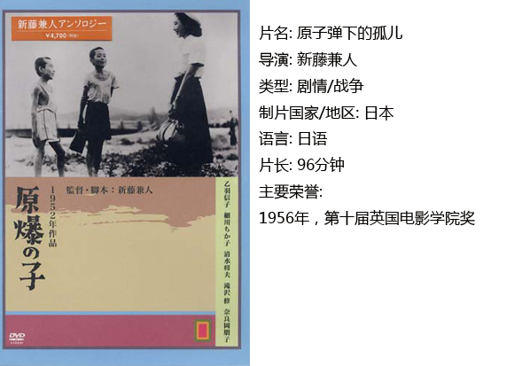
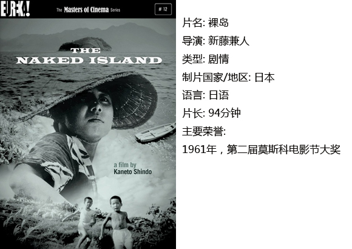
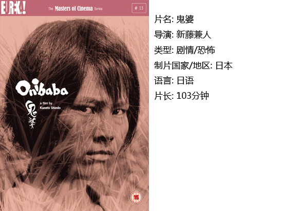
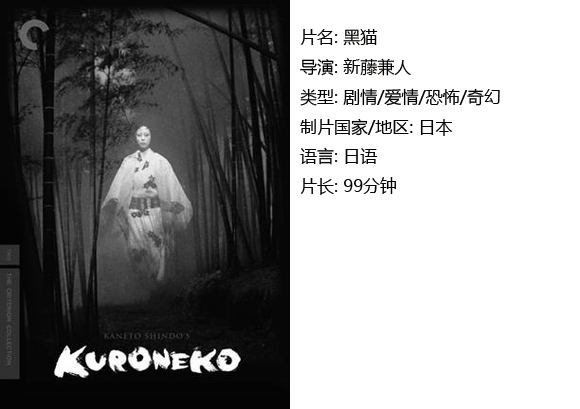

# ＜独立影像＞第三十期：新藤兼人——作为日本的一张面孔

**摘要：孝子站在船头到达广岛，一个长镜头给在两岸的居民和断壁残垣，“那天广岛的河流也和今天一样，欢快地流淌；那天广岛的天空也和今天一样，如此的美丽；那天广岛的孩子也和今天一样，自由健康地生长。”**  

# **新藤兼人——作为日本的一张面孔**

## **影评人 /王子涛（江苏大学）******

 

**小编：******

长期以来，国内大多数民众对于日本的看法基本是：日本人=日本鬼子=残忍的刽子手=军国主义狂热分子=忘我之心不死的侵略者。因此，每当中日关系出现摩擦，他们便会以各种抵制日货号召战争的言论行为表达自己有一颗“爱国的忠心”。然而，长期接受单一价值观灌输的人们可曾真正去了解过大和民族的性格？可曾了解过普通的日本人如何看待历史与战争？本期＜独立影像＞将介绍日本独立电影先驱新藤兼人的四部作品。希望读者通过观影从一个侧面了解日本的文化，摒弃盲目非理性的谩骂，在内心建立对这个国家客观的认知理解……你会发现日本并不等于一张“变态”的面孔。

**王子涛：******

就在今年4月22日，一位老者在他100岁生日上面对众人戏言道：“这是我最后的话了。谢谢大家，再见。”不想一语成谶，一个月后，他就永远离开了人世。他是日本电影史上最重要的人物之一。他也许不是日本最伟大的导演，但无疑是最重要的剧作家。而作为日本独立电影的先驱者，更是在影史上留下了不可磨灭的印迹。

他，就是新藤兼人。95岁时，虽然双眼几近失明，依旧坚持工作。正因如此，他所创立的近代电影协会也是当年诸多独立电影公司中仅存的硕果，现在依旧在其儿子执掌下推出新的作品。他的一生都在以冲刺的速度写电影和拍电影：他写的剧本早已超过240部，还曾为50多部电影担任过美术师；他还编导舞台剧；他撰写的著作和未发表的文字多得无法统计，其作品风格多种多样，有的极度写实，有的又十分抽象形式化。作为世界上从影最久的影人之一，他亲身经历了70年影坛风雨，历经大正、昭和、平成三个朝代，见证并带领了几乎整个日本的电影产业。他早已化作电影本身，只有像他这样的传奇，才配得上“一个时代结束”这样的标语。

相比于和他在同一时期出道，一切顺风顺水误打误撞就成名了的黑泽明，新藤的前半生只能用艰难困苦来形容：出身于有钱的富农家庭却因破产而早早出门打工，靠在摄影棚自学成才，偷偷写的作品叫好不叫座，好不容易混出点名声又被征为二等兵参加二战……就这样一年一年过去，直到1947年才获奖得到世人的认可。今天为大家介绍的第一部影片《原子弹下的孤儿》便是新藤的成名作之一。

#### 一、 原子弹下的孤儿

1945年夏，第二次世界大战进入尾声，日本败局已定，但是美国政府想尽快让日本投降，也想以此抑制苏联，在8月6日9点14分17秒在广岛扔下了一颗原子弹。顿时，原子弹爆炸的强烈光波，使成千上万人双目失明； 10 亿度的高温，把一切都化为灰烬；放射雨使一些人在以后 20 年中缓慢地走向死亡；冲击波形成的狂风，又把所有的建筑物摧毁殆尽。处在爆心极点影响下的人和物，像原子分离那样分崩离析。离中心远一点的地方，可以看到在一霎那间被烧毁的男人和女人及儿童的残骸。更远一些的地方，有些人虽侥幸还活着，但不是被严重烧伤，就是双目被烧成两个窟窿。在 16 公里以外的地方，人们仍然可以感到闷热的气流。

这是人类史上的一场浩劫。身为广岛人的新藤当然也是万分悲痛，于是他与制作组多方搜集爆炸时受害者的亲身经历记录。7年后，日本第一部独立制片的电影，也是世界上第一部反核战的电影《原子弹下的孤儿》诞生了。当时日本也刚好处于独立电影的兴起阶段，因此电影的尖锐性在世界上引起了强烈的反响，大力地推动了日本独立电影的发展。

故事的主角是由乙羽信子饰演的一名幼儿教师孝子，此时距原子弹在广岛爆炸已经过去了几年的时间。在核爆中，孝子失去了双亲，于是搬到另一个岛上跟叔叔一起生活，趁着暑假来临，孝子准备回广岛看看曾经的家。剧情就这样展开。笔者认为此时的新藤兼人受到了法国电影理论家巴赞的影响，并没有大量使用自己喜欢的蒙太奇手法，而是主张运用景深镜头和场面调度连续拍摄的长镜头摄制影片。孝子站在船头到达广岛，一个长镜头给在两岸的居民和断壁残垣，“那天广岛的河流也和今天一样，欢快地流淌；那天广岛的天空也和今天一样，如此的美丽；那天广岛的孩子也和今天一样，自由健康地生长。”电影以悲伤悼念为主的基调也就此确立。

随着故事的发展，孝子来到了她家的废墟，遇到了曾经的佣人，拜访了曾经的挚友，看望了曾经的学生。大家都受到原子弹强烈的影响，有的变成了残疾、有的得了绝症马上就要死去。孝子在所到之处见到的大多都是悲剧，这不由得让人心中一凉——一颗以终止战争名义投放的原子弹，破坏了多少人的家庭，杀死了多少人的父母，四处都是吃不上饭的孤儿，废墟随处可见，很多人无家可归。孝子身着白衣长裙，像纯洁无暇的天使一样置身于一片灰色地带中，她慰问着人间的疾苦。

当然这部电影也不是如此的消极，在片中，你看不到群众的怨天尤人，看不到末日来时的无政府暴乱，看不到对于百姓的不闻不问，看不到对于残疾人贫困人的歧视……人人都在干好自己能干的事，去修房，去耕地。因为成为了孤儿，孩子们从小就很懂事，个个都能帮着做农活，懂得知恩图报，懂得谦让。从中你也能得到一份对于生活的希望。

值得一提的是，在影片开始处孝子回到已成了废墟的家，她“回忆”起了核爆那天发生的事。在描绘爆炸场景时，新藤兼人并没有直接去描绘炸弹爆炸、房屋倒塌等大场景，而是用了很多在冲击波中满身是血的裸体女人躯体来展示肉体的消亡，日本电影中常被提及的“性与死亡”的由此彰显，同时也表现出了导演的恋母情节。这样的情节在后文介绍的其他电影中也有体现。

#### 二、裸岛

由于资金困难，新藤的近代电影协会曾一度濒临倒闭，但拍摄于1960年，本是作为解散纪念作品的《裸岛》却彻底挽救了公司。这部充满实验色彩、全片无对白的诗意电影只有两个演员和11个工作人员，仅仅花了350万日元，却在莫斯科电影节上大放异彩摘得桂冠，世界各国竞相购买。影片的大卖让公司彻底还清了债务，也有力地证明了脱离大公司的资本制约也能自由创作，极少的制作费用也能拍出优秀电影。此外，《裸岛》独特的表现形式与制作方法也对后来的日本独立电影产生了深远的影响。电影充分利用了电影语言表现人与自然、人与土地的深厚感情，特别是在摄影上追求构图美，为日本电影史上留下了珍贵的宝藏。这部电影成为新藤导演生涯中最重要的代表作之一。

在没有看过介绍的情况下看这部电影实际上有一定难度，并不只是因为整部电影没有一句台词，而是因为导演将他想表达的东西埋得较深。海上小岛住着一户人家，山坡陡峭，没有淡水，土地贫瘠。每天都是父母划着船去其他岛上舀了淡水背回岛上给菜浇水，时间和镜头都大把大把地花在了展现这些基本生活场景，不断地重复不断地重复，让你都在怀疑是不是开了自动循环。不是的，这就是这部电影吸引人的所在之处，它不是像新闻联播一样一语中的让你明白他们的日子有多苦、背水灌溉有多么累，而是在他们一次次的重复工作中、在他们浇下水看着水渗入地下的眼神中、在他们背着水一步一步爬上山的过程中感受到劳动的艰辛。一切进展得都是那么缓慢，正因为缓慢，所以才渗透人心，让你身临其境。整部电影的构图也是一大亮点，傍晚夫妇划着船回岛，在夕阳的映衬下显得十分美丽，虽然只是黑白电影，但是你却能感觉到此片是那么的鲜艳。

#### 三、鬼婆

先来讲讲前文中提到的新藤兼人的恋母情节。在他的生命中，母亲过早去世，姐姐因生活所迫，远嫁重洋，第一任妻子与他患难与共，却因生活贫困而死。女性在他心目中是理想的化身。戏剧性的一点是，他的第三任妻子也是最后一任妻子就是与他合作过很多次的乙羽信子，可能正因为这样，他们才会如此心灵相通，乙羽信子才能以她的演技精确地表达出新藤所设想的东西吧。60年代，他领悟出性是生命之源，不写性就写不好人，于是创作和导演了一批关于“性”的电影。这部《鬼婆》便是其中的翘楚。

此时的新藤兼人，更加深刻地剖析人性，善于用不同的女性角色去演绎出人性中的基本欲望——性欲与食欲。故事讲述一名女子因为丈夫应征参战而和婆婆生活在一个动荡的世界里，她们隐居在苇丛中，靠杀死敌方走散的士兵，扒掉他们的装备换钱为生。为了满足自己的食欲，她们不惜残忍杀害各种士兵，然而友人的回归所带来的丈夫的死讯又让他们对未来的憧憬破灭了，性欲又使他们昏了脑，不顾一切也要在一起，一切都是那么混乱，直到有一天鬼婆的出现……

两位演员的演绎极度大胆，她们脱掉了现代社会伪装的“正义”、“道德”的外衣，把野性的人类展现在我们面前。很难想象，这里的“鬼婆”就是在《裸岛》里面饰演贤惠温柔妻子的乙羽信子。其实这种疯狂全都埋藏在我们每个人的心底，只有战争还有极端的环境才会把我们的本性给逼出来。《鬼婆》的人物全都凶神恶煞似的，就连裸体也是粗俗不堪、毫无一丝美感的。观众不免心底发凉，因为看似弱不禁风的两个女子却有如此残忍的一面。从始至终我们都不知道她们的名字，无姓无名表明她们就是一个抽象的人类概念，代表着我们心中为道义和规范锁住的“恶”。

电影的节奏像一首乐曲一般，时快时慢。新藤大胆地将感情寄托在看似不起眼的芦苇丛中，通过对背景声音、芦苇摆动的掌握，让人不知不觉中变得紧张起来，跟着剧中的人物经历人世的变化。而对于“性”的描写，新藤也没有吝啬笔墨——人物赤身裸体在芦苇丛中奔跑、电闪雷鸣下，草屋中疯狂释放欲望……观众看到的并不是性这个过程，而是深深的感受到这种基本却为“道德”所不齿的欲望。由此，在本部作品中，新藤的美学风格和品位，在场景和人的关系上为电影史留下一个成功的典范。

#### 四、黑猫

又是一部日本聊斋电影。4年前新藤选择了芦苇丛，4年后他选择了竹林，两种自然背景都为电影奠定了唯美的基调。猫自古以来就给人神秘的感觉，由于它们行动快速,来去无影，总被认为是一种超自然的形象；再加上毛色是黑的，令人感到一股特殊的邪气，所以人们通常都认为黑猫会带来厄运。总之，在当时的人们来看，猫就是那样神秘，使人们害怕恐惧。

和中国的聊斋故事一样，《黑猫》的内容其实非常简单，一对母女被一群武士轮奸杀害，就像老版蝙蝠侠中的猫女一样。因为怨念颇深，他们化为怨灵，每天晚上便诱惑武士回到自己用法术变的家中，灌醉他们后将他们残忍杀害并吮干鲜血。无巧不成书，一位外地征战的武士回到了本地，被奉为英雄，除妖这事儿当然落到他的手里……最后武士知道了真相，怀着万分的悲痛杀死了母亲，自己也气数耗尽。

一个悲情的聊斋故事被讲述得极富美感，摄影、音乐都达到了顶峰。在描绘猫妖的鬼魅时,导演甚至使用了舞台剧的形式，用寅歌唱出主人公心中的悲痛。在外景戏上又多用长镜头、广角镜头及移动镜头，来展现场景的恢弘。日本恐怖片为何如此吓人，是因为他们都是直接给观众一个意境，剩余的让你自己去联想渲染。而这个概念从这个时期就已经有了：竹林中各种光与影的交媾，黑猫婴儿般的叫声都让人不寒而栗。

剧中对于所谓的“武士精神”极尽讽刺，这是新藤对于日本文化内涵的反思，人们也可以直接联想到打着正义旗号的洗脑教育。他对于情感矛盾的刻画也是近乎完美，武士的进退两难、官与民之间存在的隔阂，处处都是难以化解的矛盾，让人捏了一把汗。而电影最终没有明确给出善与恶、对与错的答案，这对于命运模糊而无奈的态度也值得人们去细细回味。

** **

**结语：******

生于1912年4月28日的新藤兼人，2012年在东京时间5月29日早上9点24分，于都内自宅因老衰而去世，享年100岁。作为“一生现役”的导演，新藤把毕生全部心血都倾注在电影中，百岁之际谢幕。R.I.P.

 

### **【小编推荐】**

**关于反思战争与人性的日本电影，你还可以看……******

**《人间的条件》（小林正树）、《黑雨》（今村昌平）、《战争与人》（山本萨夫）、《战场上快乐的圣诞节》(大岛渚)、《缅甸的竖琴》《野火》（市川昆）、《日本最长的一天》（冈本喜八）、《萤火虫之墓》（宫崎骏）******

### **【如何下载】~@_@?~**

**请加入独立影像流动分享群，在群共享中下载本期所推荐的独立电影！**

**流动群群号：187213480(新群)****入群请注意以下几点哦：**

1.流动群专供北斗读者下载本栏目所推荐的资源，验证身份时请注明“北斗读者”。

2.当期资源自发布后14天内可以下载，到期后工作人员将手动删除以上传后续资源，请注意时间。

3.此群采取流动制，群满员时，完成下载后请自动退群，以便他人入群下载。（但是请注意：只有当群满员时才需要各位流动，现在则无需退群，需要大家流动时会另行通知。）

关于**独立电影**和**DNEY**请参见[<独立影像>第一期：初识独立影像（上）](/?p=11506)，其中的**广告**也要记得看哦！

 

（采编：黄楚涵；责编：黄楚涵）

 
