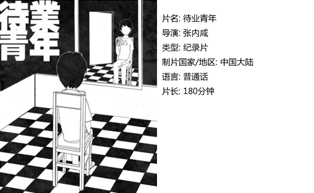
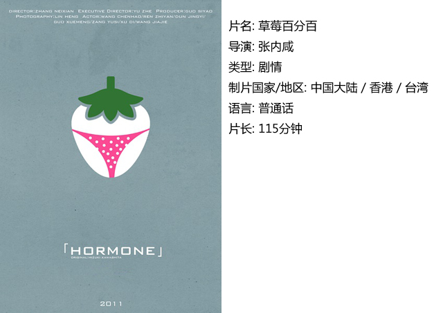
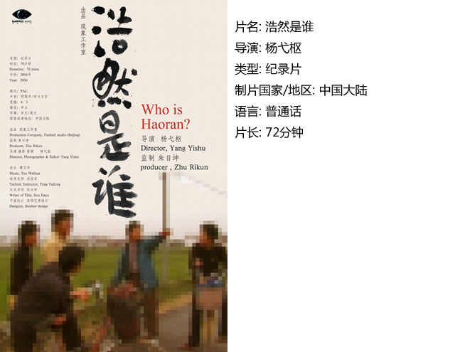

# ＜独立影像＞第九期：异样的青春，归向一处

**而我们这代80后，接受的教育却已和我们的周遭脱节，我们心中的理想和我们的环境失和。当我们期待用自己的努力去实现明天的希望时，发现生活如此的悲催，努力是不够的还需要拼爹了。生活的灰色和理想的纯洁摆在一起，剩下的只有灰色了。**

### 

### 

# <独立影像>第九期：异样的青春，归向一处

### 

## 影评人 / 于婷（ciae）

### 

### 

问及千人，青春印象，答案百千，因为在每个人的心中，青春并不相同。我们这代人的青春大概相似，读书，上学，中考，高考，过程中遇到非典，遇到汶川……这些或许都是我们共同的回忆，可是每个人内心深处定义的那份最深的印记却并不相同。

有人挂念着分手已久的初恋女友，怀念那段青涩的感情，有人烦心自己的学习，每日苦苦挣扎于学业，而有人对自己未曾表白的暗恋对象念念不忘，那人每每走过教室门口，平静于物理中的自己心里即起波澜，到了脸皮厚到足以表白的年龄，却再也没有那种感觉了。我们儿时的伙伴，并非都一路和我们走来读书、上学，他们的青春印记或许是上班学徒。更有那么几个不争气的初中同学或许早已辍学，游荡社会，或许有次打劫，自己哆哆嗦嗦掏钱的时候，那边一抬头，“哎呀，这不是老同学吗”于是放行，他的青春是什么，早已不同。

青春叛逆，叛逆着家长的说教，反抗着教育体制，而有人则与这个社会杠上了——你说这个坏，我偏要尝试一下，你说那个学习是正道，我偏偏不学习。可是叛逆之中却有你我的理想，我们要走一条不同的道路，这个理想是自己的，不是强加的，也不是现成的。所谓青春期的理想，本身就是叛逆的。而这在叛逆的道路上，走的路不同，因为理想不同，一样的年龄，却选择了异样的道路。

任何一代人都有青春回忆。父母那代人更多的是上山下乡，他们的记忆多的是混乱，理想恐怕是告别混乱的日子，回复平静，安安稳稳的生活。70后那一代更多的改革开放初期短暂的繁荣，为了那一短期的复苏而进军，那两代人的理想都是那么的明确。而我们这代80后，接受的教育却已和我们的周遭脱节，我们心中的理想和我们的环境失和。当我们期待用自己的努力去实现明天的希望时，发现生活如此的悲催，努力是不够的还需要拼爹了。生活的灰色和理想的纯洁摆在一起，剩下的只有灰色了。理想……理想已经被忽略了，因为压不住越来越多的灰色。我们曾认为我们的理想相比我们的前辈更加多彩，在这奔三的年龄，却发现，所谓的更加多彩也意味着告别青春梦想时的更加失落。走出校园，当生活的重压来临之时，却发现理想已经离开了，因为重复了前辈人的道路。

其实不一定在经历后才发现理想的离开。有一群幸运或聪慧一点的同龄人在不合适的年龄发现了理想和现实的脱节，他们用叛逆作为抗争，或许手段有那么点荒诞不经，但是那终归是抗争，可是先知和后知结局似乎是一样的。

这一切的抗争，都曾是你我青春时所共同抗争的。所谓的我的青春我做主，我的未来我决定，而抗争来抗争去，却免不了走入原道，不管是你抗争程度如何，也不管你现在身处何处，都要和上一代一样，走入现实的生活，走入而立之年。青春的不同，归向一处，除了少数幸运儿，多数人在现实中，理想还是都远去了。 

#### 一、马克

有人说，有理想才是幸福的，而只有理想却不前行，那只是空想。年轻时谁还没有点浮想联翩啊，可是有人最终把那些浮想变成为现实，而有些却一直只存在于头脑里。

年轻时那些理想，应该是自己所最为喜欢的，而你总得为喜欢的东西付出些代价，不管什么时候，什么年龄，都得有那种劲，为了理想往前冲。 

为理想而奋不顾身的时候，的确是最美好也是最单纯的。

#### 二、待业青年

待业青年，一个似乎遥远的称呼，而今却实实在在的存在。因为不喜欢上学，做着抗争而不妥协，那一群人在如今生存压力更甚于生活压力的时候，决然退出，不肯再忍受这一切。这些人似乎是生活在社会边缘的人，他们不满这个体制，他们叛逃了所谓的大部队，游离其外。这份游离的勇气和选择或许隐含的就是不愿接受理想和现实之不同的含义。他们不接受这不同而做着无力的抗争，可是不接受就代表胜利吗？

未必，因为生活本来就是一件不公平很操蛋的事情。

#### 三、彼岸

湖水，大海，这一切场景都是我们所熟知的，而却呈现出了一个我们似曾相识却又感到陌生的世界。宁静的湖水，波澜的大海，面对这种对照，每个人的感悟因自己的经历而不同，这样，你的感悟又是什么呢？

#### 

#### 四、草莓百分百

在情窦初开的年龄，心中好感的产生是那么莫名。一个梦想成为电影导演的真中，迷恋上了那天夕阳下楼上穿着草莓内裤的少女，在好友的百般鼓动之下，他向那位少女西野表白了，居然成功了。而真中却在和撮合他俩的女性朋友东凌的接触中发现自己的情感天平偏向了这一边，因为东凌似乎和他的兴趣和理想更近一点，于是决定在大学毕业之前拍出自己小说的DV，而过程中情感却因两位女孩的加盟另起波澜。

理想和情感，在实现的过程中碰撞、纠缠……

#### 

#### 五、浩然是谁

浩然是谁不重要，重要的是那一群小镇少年去寻找他的劲头。这群初中生厌恶学习，打架斗殴，在青春叛逆的道路上走的似乎很远。那些劲头似乎用不完，而在劲头用不完的青春时节，他们荒废学业，抛掷青春，直到最后他们也没有打到浩然。浩然摆脱了自己的危机，而那群制造危机的少年却发现，生活的压力和危机并未因自己的抗争和反叛而远离自己，他们并未像浩然那样轻松的摆脱自己头上的危机……

那苦逼的现实，还是来了，该来的总还是会来的，抗争无用……

 

### **【如何下载】~@_@?~**

**请加入独立影像流动分享群，在群共享中下载本期所推荐的独立电影！**

**流动群群号：94075202 ****入群请注意以下几点哦：**

1.流动群专供北斗读者下载本栏目所推荐的资源，验证身份时请注明“北斗读者”。

2.当期资源自发布后14天内可以下载，到期后工作人员将手动删除以上传后续资源，请注意时间。

3.此群采取流动制，群满员时，完成下载后请自动退群，以便他人入群下载。（但是请注意：只有当群满员时才需要各位流动，现在则无需退群，需要大家流动时会另行通知。）

**DNEY****新人群群号：152511792**

注：DNEY新人群为DNEY独立影像官方交流群，非流动制。DNEY同时为流动群和新人群提供资源，但新人群资源并不一定与本栏目同步。

关于**独立电影**和**DNEY**请参见[<独立影像>第一期：初识独立影像（上）](/?p=11506)，其中的**广告**也要记得看哦！

### 

### 

（采编：黄希敏；责编：黄希敏）

### 

### 
