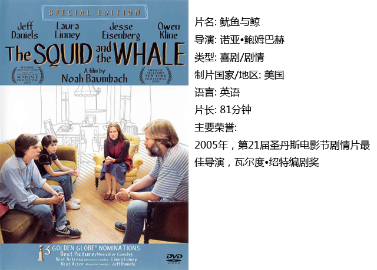
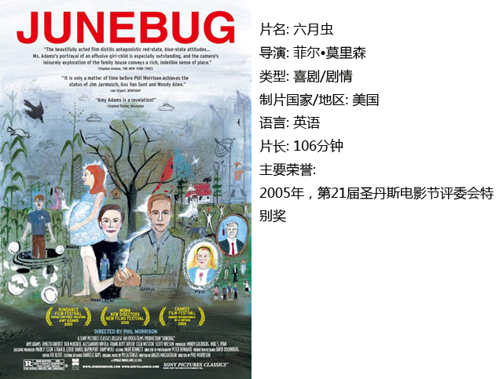

# ＜独立影像＞第二十一期：圣丹斯面孔（三）之家庭生活

**不是每一部电影里的主人公都是世界的拯救者，不是每一部电影都有一个危机等待解决，也不是每一部电影都剧情跌宕气势逼人。有一些电影偏偏就只追求一个平淡如水的小格局，因为创作者希望通过这样的小制作为观众呈现真实生活的一瞥。**  

# 圣丹斯面孔（三）之家庭生活

## 影评人 / 刘劼睿（Macquarie University）

 

对于任何一个独立电影的导演而言，在圣丹斯电影节上获奖都是在电影事业上积极的一步。其中家庭题材的电影，旨在刻画各个家庭成员在矛盾中挣扎的同时也不忘表达对彼此的关怀，更是独立电影人展示他们思想的热门选择。

家庭题材的电影所反映的社会现象、伦理政治宗教问题，以及各角色之间的交流、矛盾、误解和真情，看似琐碎，但是非常贴近观众的日常生活。这样的片段往往最能引起观影者的共鸣。

不是每一部电影里的主人公都是世界的拯救者，不是每一部电影都有一个危机等待解决，也不是每一部电影都剧情跌宕气势逼人。有一些电影偏偏就只追求一个平淡如水的小格局，因为创作者希望通过这样的小制作为观众呈现真实生活的一瞥。

接下来我们介绍三部曾在圣丹斯电影节上获奖的家庭电影，看看导演和演员是如何通过细节，呈现给观众一幕幕真实而动人的画面。

#### 一、鱿鱼与鲸

这部电影是导演根据自己童年时父母离婚的亲身经历改编的。故事发生在1986年的纽约布鲁克林。父亲是个奇葩，可谓与社会格格不入：他为了赢球，跟老婆孩子打网球的时候反复叮嘱他的队友打对方反手；认定不读名著的人都没有结交的价值；对于性很保守但是离婚后又跟自己的学生搅在一起。大儿子是父亲忠实的追随者，在谈恋爱的时候更是反刍父亲的每一句话。12岁的小儿子性早熟，而他的早熟性格跟母亲在他面前对于性的开放分不开。

这部半自传体的喜剧片真实得可怕，每个家庭成员都有缺陷：他们自私，总是无视自己做错的地方。电影诚恳地面对了一些其他电影会回避的话题，感人至深。

#### 二、六月虫

在芝加哥一间画廊工作的Madeline由于工作需要到南方去拜访一位画家，因而顺道拜访了和她闪婚的丈夫George在当地的家庭。电影讲的就是Madeline与新婚丈夫的家庭同住时发生的故事。

阅历遍布世界的新嫂子和住在小镇上眼界狭窄的弟媳的对话尴尬又搞笑；弟弟对凡事优于自己的哥哥十分尊敬，但又难免心生嫉妒；进入大城市的男人重回小城时，感到文化和生活方式上的不适。然而，尽管Madeline这位新来的家庭成员激化了George家里存在已久的矛盾；但是，作为旁观者的观众，又能够看到家庭成员在争吵和冷战之余还在悄悄为对方留意他喜欢的事物…

本片并没有落入家庭片的俗套，它把重点放在矛盾是如何得以解决的，客观地记录了这个家里发生的事。同时，各个家庭成员之间的关系让人欲言又止，这种微妙的感觉通过电影里的留白得到了很好的表现。

#### 三、请再靠近我

电影讲述的是弟弟Terry为了钱回家找很久没有联系的姐姐Sammy，而这短短几天里，家中爆发了一系列事件。

作为单亲妈妈，Sammy在生活和工作的不平衡中感到越来越力不从心；另一方面她的情感问题让她陷入了另外一个不平衡，其中交织着欲望，道德和她的宗教信仰。与此同时，生活一向散漫的Terry也因为他的小侄子Rudy开始思考一个人要如何在责任和享乐之间找到平衡。

这部电影最可贵之处就在于她的诚实。不夸张地说，电影里的每一个情节都可以被添油加醋改成一部非常感性，非常戏剧化的电影，甚至可能成为一部俗套的肥皂剧。不过导演和演员们都选择了忠实地表现真实生活中人与人的一来一往。看惯了好莱坞大制作的人也许会期待下一秒剧情来一个大逆转——可惜没有。这里有的只是最朴素的现实。而这恰恰也是独立电影的魅力所在。

 

### **【如何下载】~@_@?~**

**请加入独立影像流动分享群，在群共享中下载本期所推荐的独立电影！**

**流动群群号：187213480(新群)****入群请注意以下几点哦：**

1.流动群专供北斗读者下载本栏目所推荐的资源，验证身份时请注明“北斗读者”。

2.当期资源自发布后14天内可以下载，到期后工作人员将手动删除以上传后续资源，请注意时间。

3.此群采取流动制，群满员时，完成下载后请自动退群，以便他人入群下载。（但是请注意：只有当群满员时才需要各位流动，现在则无需退群，需要大家流动时会另行通知。）

关于**独立电影**和**DNEY**请参见[<独立影像>第一期：初识独立影像（上）](/?p=11506)，其中的**广告**也要记得看哦！

 

（采编：黄楚涵；责编：黄希敏）

 
