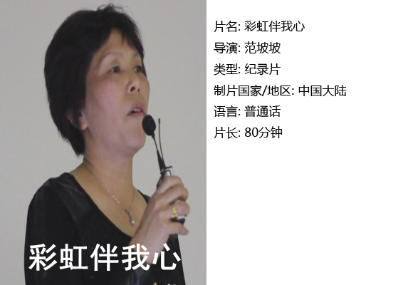
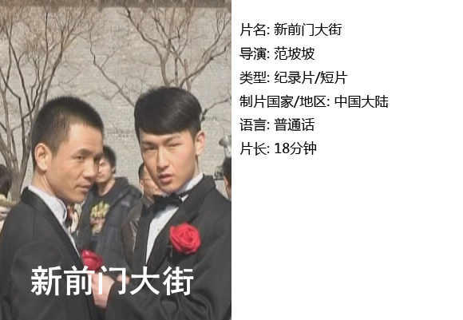
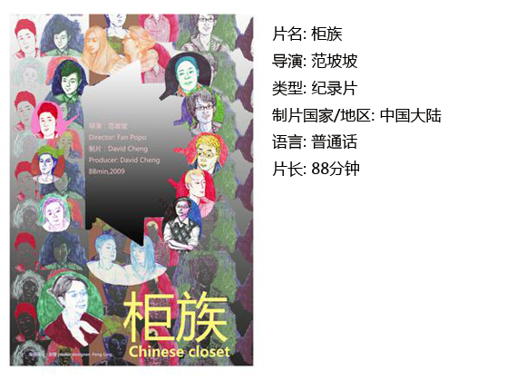

# ＜独立影像＞第二十七期：彩虹下的爱

**在导演的个人定位中，纪录片这一形式其实很重要，因为在一般的电影里，你看不到完整的社群概念。导演本人认同同性恋，他的目的就是要帮助这个社群提高被接受程度，提高他们在社会中的可见度，希望他们可以逃离“柜子”，被社会所宽容地接纳。**  

# 彩虹下的爱

## 影评人 / 马特（北京师范大学珠海分校）

  **小编：**

不知不觉间，《独立影像》已经是第二十七期了~撒花~\(^o^)/~

如今，线下放映活动在各大城市开展得红红火火，独立电影也受到了越来越多的关注~感谢大家支持的同时，《独立影像》栏目也将进行全新改版。为了进一步保护独立电影的版权与权益，我们将加大与DNEY的合作力度：从本期开始，独立影像将着力发文配合线下放映活动~

在八月下旬，摘星星青年沙龙将会放映四部优秀的同志题材独立电影，除了本期介绍的范坡坡导演的三部作品，还有堪称中国第一部女同纪录片的《盒子》献给大家，欢迎大家届时捧场~~！

 **马特：**

独立电影导演南希•萨瓦卡说过：“独立电影实际上是一种思维方式，我曾经以为它最大的特点是资金的来源问题，而我现在清楚地意识到它的界定有关于你讲述故事的思想方法和个性视角。”这句话正是说出了独立电影的特点，它为我们介绍了一种不同的视角，让我们借助镜头去看到一些隐秘的世界，去了解那些敏感而脆弱的人，去体验那些让我们内心动容的故事。

本期独立影像为大家介绍的是三部与同性恋相关的影片： 《彩虹伴我心》 、《新前门大街》 、《柜族》。这三部影片从不同的视角为我们表述了一些普通人不那么普通的生活和遭遇。他们都是普通人，和我们一样有对于幸福和美好的追求；然而他们身上又有一些不那么普通的经历，让我们平静地观看后心里悄然颤栗着。

导演范坡坡的作品给人一种深沉的人文关怀，他长期协助另一位致力于女性主义和同志话题的学者崔子恩的工作，后者的天主教信仰与人文关怀精神深刻地影响了这位年轻的导演，也使得这位导演去不断地探索与表达同志话题中的幸福与苦难。

#### 一、彩虹伴我心

这部片子从同性恋者父母的角度来讲述。人们站在父母的角度，对于子女是同性恋者这个事实往往是难以接受的，或者态度是非常微妙的，一些父母会感到愤怒、失望和自责，但也有的父母表示了莫大的理解和支持。

在子女出现这样的问题时，家长一开始的态度往往会有不理解，认为那可能是一种自以为的“时髦”或者“时尚”，而不是真爱，这和家长们所处年代的普遍意识是相关的，而这部电影里丝毫没有避讳这一点，似乎并不是说要讨论出一个是非究竟或者谁对谁错，因为家庭问题的关键并非是对错能够解决的，而在于双方的理解和信任。

整部片子如片名一般，没有像寻常的同志话题的纪录片那样一味地描述他人的不理解和歧视，而是站在一个温情的角度去描述这世上还有关怀与爱，这一点在关于边缘人群的电影中是比较不多见的，没有怨恨也没有伤感，只有希望，也许这种希望这是导演想要告诉和传递给同志群体的美好祝愿。

#### 二、新前门大街

对于同性恋群体来说，恐怕“见光”是一种最大的考验，但以一种公开的姿态出现在社会上又恰恰是一个边缘群体寻求自我认同的关键。作为一个被潜在的规则禁止表达声音的群体来说，同性恋又是如此渴求社会的公开接纳。

2009年2月14日，两对同性恋朋友选择西方的情人节，在新前门大街拍摄婚纱照。在大庭广众之下，我们可以看到一种公开的对于美好的表达，但我们也同样要看到并不是每个人都会是理解和善意的目光，有的人会猎奇，有的人会质疑，还有的人抱有一种中国式的对待弱势群体的方式，诸如“我最不歧视你们这种人了”这种表面理解实质疏离的态度。

也许任何一个边缘群体都有着如此的诉求，期待有朝一日可以光明正大地出现在社会上，和其他人一样享受阳光与生活，而不再需要镜头给予那些有着突出勇气的人，因为如果一个群体表达生活的美好还需要勇气才行的话，那就证明了所处的环境一定还不那么美好。

#### 三、柜族

人们用“出柜”来形容一个人成为同性恋，却不知这个群体恰恰似乎是生活在柜子里一般，朋友、家庭、社会……各方面的压力，让柜门紧锁。影片采访了十几位出柜同志，在他们的生活中，会有歧视、压制甚至暴力，但也会有感动、成长和理解。

导演范坡坡看到了正面的变化并且愿意表现在他的影片里，尤其体现在年轻人身上，人们对同性恋以及同性恋权益组织的理解和接受程度加大了，而且，近几年对“同志运动”本身的探讨也有所加深，包括有关本质主义和建构论的讨论，还有就出柜问题进行的讨论以及对低阶层、低收入的同性恋者的关注。

在导演的个人定位中，纪录片这一形式其实很重要，因为在一般的电影里，你看不到完整的社群概念。导演本人认同同性恋，他的目的就是要帮助这个社群提高被接受程度，提高他们在社会中的可见度，希望他们可以逃离“柜子”，被社会所宽容地接纳。

 

### **【如何观看】~@_@?~**

**** ** 请关注【摘星星® 青年沙龙】在全国各大城市（目前已有西安、上海、武汉、成都、厦门等城市）的线下放映活动~** **** ** 【摘星星®青年沙龙】【壹】Catherine Love 主题展/《盒子》+《柜族》** **[ http://www.douban.com/event/17023241/](http://www.douban.com/event/17023241/)** **** ** 【摘星星®青年沙龙】【贰】Catherine Love 主题展/《彩虹伴我心》** **[ http://www.douban.com/event/17023197/](http://www.douban.com/event/17023197/)** 

 关于**独立电影**和**DNEY**请参见[第一期：初识独立影像（上）](/?p=11506)，其中的广告也要记得看哦！  

（采编：黄楚涵；责编：黄楚涵）

 
