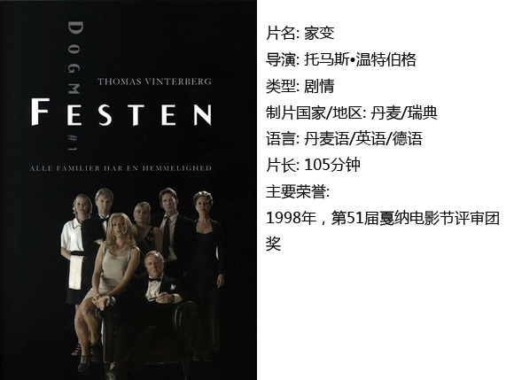
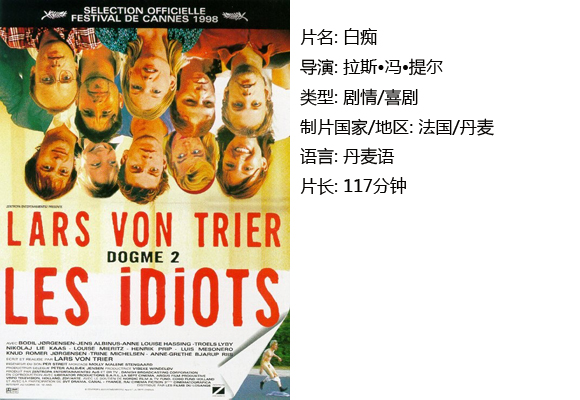
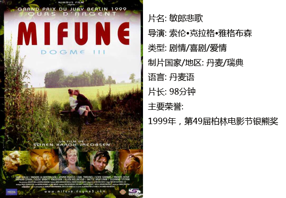

# ＜独立影像＞第二十三期：还原电影一个本真的表达

**如今，大量的电影已濒临死亡边缘，因为太注重外在的东西，刻意制造假象去迎合观众的趣味，反而淹没了真实的情感和电影本身的精神。因此必须立即采取措施，尽量抹掉一切科技带来的“化”，恢复“故事和角色”及电影构成的纯粹性。于是他们主张现场收音、用手提摄影、不事后配音、不用滤镜、以及拒用一切会美化画面的手法。**  

# 还原电影一个本真的表达

## 影评人 / 邓燕（四川农业大学）

 

说到二十世纪末最具影响力的电影运动，毫无疑问是Dogme95。

1995年，丹麦导演拉斯•冯•提尔与他在丹麦国家电影学院的校友托马斯•温特伯格、克里斯汀•莱文和索伦•克拉雅布克森在丹麦首都哥本哈根发表了纯洁誓言：“我以导演的名义发誓，要克制自己的个人口味，我已不再是艺术家，我的最大目标是要在角色及环境中找出真理，我发誓会用一切办法包括牺牲我的个人口味及美学考虑去达到此要求。”这标志着道格玛运动的开始。

这是一场推崇电影特立独行精神的运动，主张反对好莱坞，反对中产阶级化电影效果，他们的目的是要与当今影坛某些拍摄传统相抗衡。

如今，大量的电影已濒临死亡边缘，因为太注重外在的东西，刻意制造假象去迎合观众的趣味，反而淹没了真实的情感和电影本身的精神。因此必须立即采取措施，尽量抹掉一切科技带来的“化”，恢复“故事和角色”及电影构成的纯粹性。于是他们主张现场收音、用手提摄影、不事后配音、不用滤镜、以及拒用一切会美化画面的手法。

本期推荐的是最早获得道格玛运动认证的三部电影，希望这些“去伪存真”的影片能带给大家不一样的观影视觉感受，或许我们可以从影片朴素表现的背后听到导演对人性和生命本质的呐喊。

#### 一、Dogme1：《家变》

故事围绕身为地方豪绅的父亲的生日聚会展开，一篇题为《当爸爸在洗澡》的长子致辞使原本看似愉悦、欢快的庆祝氛围瞬间尴尬，而这正是影片重要的引爆点。深入浅出或许是对这部影片较为恰当的概括，导演托马斯•温特伯格将人性的丑陋、家庭伦理道德、伤痛的挣扎等一系列纠结深沉的话题浓缩成一场聚会，并巧妙地利用镜头刻画出一张张浮世绘，在这种正式的家庭聚会场合，儿子对童年时期遭受父亲的强奸毫不避讳甚至有意自曝家丑，在座的家人、客人有何反应？他们又是如何行动的？沿着这样的思路，我们会发现影片的结局如一声闷雷，钝响之后是疼痛。

#### 二、Dogme2：《白痴》

导演拉斯.冯.提尔的良心三部曲之一，讲述一个女人（海伦）和一个团体在各自内心挣扎下产生的碰撞，碰撞的契合点很令人玩味——扮白痴。

摇晃的镜头使得这部影片的风格很像纪录片，片中的角色自白、演员表情眼神都有点跟镜头直接对话的味道，当然这些并不影响叙事主题，反而对游走在白痴与正常人之间的现代人内心进行了很好的提炼。这使我想到一句老话：演戏的是疯子，看戏的是傻子。这似乎在另一种层面上拉近了观众与导演的沟通。

为什么要装白痴？或许就像史托佛告诉凯伦的：“社会越来越富有，人却越来越不快乐……当一个白痴，是一种奢侈，也是一种进步。白痴是人类的未来。”而海伦，这个“局外人”最终的回答是“我在这儿很快乐，当白痴是我一生中最棒的事。”

#### 三、Dogme3：《敏郎悲歌》

在这部有着浓郁饱和色彩的影片中，导演试图呈现的情感复杂而微妙。人到底需要什么？名利、地位、金钱还是爱情？不同的人有不同的追求，不可否认的是，我们都需要内心的舒适感。农场出生的克瑞斯顿娶了豪门女，而最终他们都被现实无情地扇了耳光，经验告诉我们，那些能与自身进行匹配的东西才是我们需要的，带着谎言的软磨硬泡注定会使人身心疲累。

而现实并非一张带着冷面具的脸，我们总是能在不期而至的温暖中得到意外的收获。女主角对生活的感受是：生活是一条长长的狗屎，我们需要每天吃上一截，习惯吧。在强势的生活面前，似乎每个人都背着冗长沉闷的悲剧在现实的残骸中拥抱取暖，当他们忘记刻意去摆脱生命不可承受之重时，可能就获得了最轻盈纯真的状态。

 

### **【如何下载】~@_@?~**

**请加入独立影像流动分享群，在群共享中下载本期所推荐的独立电影！**

**流动群群号：187213480(新群)****入群请注意以下几点哦：**

1.流动群专供北斗读者下载本栏目所推荐的资源，验证身份时请注明“北斗读者”。

2.当期资源自发布后14天内可以下载，到期后工作人员将手动删除以上传后续资源，请注意时间。

3.此群采取流动制，群满员时，完成下载后请自动退群，以便他人入群下载。（但是请注意：只有当群满员时才需要各位流动，现在则无需退群，需要大家流动时会另行通知。）

关于**独立电影**和**DNEY**请参见[<独立影像>第一期：初识独立影像（上）](/?p=11506)，其中的**广告**也要记得看哦！

 

（采编：黄楚涵；责编：黄希敏）

 
