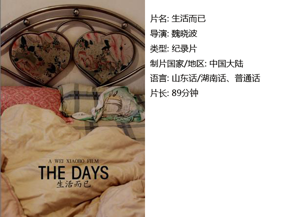

# ＜独立影像＞第二十九期：生活，而已

**摆脱现实的遭难与钱的困惑，已然成为中国年轻一代的夙愿，可怕的是人之所谓的追求犹然冒着那股骇人的铜臭味。世俗就世俗罢，但仔细想想这就是生活，没有那些牛逼的辉煌的日子，有的只是柴米油盐。**  

# **生活，而已**

## **影评人 / 黄依琳（南京师范大学）**

 

是谁说爱情是艺术，生活是艺术。生活会给你这样一个水泥搅拌机，将你困在这没完没了的霉斑墙上，无处可逃。

第一个镜头便是美丽的谢芳姑娘，哼地一声拿晓波和自己的妹夫比较，别人的人生是永远也羡慕不完的，镜头前的谢芳好似几岁孩子不满意地比较着自家父母与别家父母那般。使劲抹着干干的，怎么也掉不下来的眼泪，像是在表演，但很明显她只想演给晓波看。

接着镜头摇到长沙的天空以及他们租住的公寓楼。字幕出现，晓波交待他们在大学时只是相互利用的关系，毕业后才成为正常的男女朋友关系。关于利用这点到底是不是只是晓波的一己之见，我们无法得知，但既然影片得以完成也应该经过谢芳的认可，这样看来至少谢芳是默认的。

故事并不稀奇甚至是随处可见，一对贫穷的80后小情侣，在布置简单的出租屋里非常不耐烦地活着。片子的底色一直是两人拮据和迫切想要改变的生活，首先两个人生活的空间便是作为影片主要内景的家具简陋的出租屋。晓波采取各种角度和景别让这个空间变得真实，没有理想的国度，现实显山露水。80后的两人渴望的是一样的东西，钱和自由。这些讯息，丝毫不差地击中人心。

时间在镜头前流逝着，就像叛徒，静静地。晓波承担着做西红柿炒蛋，煮面条，扒蒜，做家具的任务，俨然一副安然自得的样子。但不如意的生活还在继续着，镜头跟着在公交上昏昏欲睡的晓波来到了晓波培训高考孩子们的教室，摄像机朝着那帮很不认真听课的孩子们。躺在宾馆床上看电视的晓波回头还得关心着招生的事，从早忙到晚的活，掐指算着赚到的零星的人民币。几个哥们凑在一块喝酒聊天，嘲笑自己作为人民终究是炮灰，但向世界扔一把火，毫无意义。晓波是个艺术家，他很明白自己就像一个渴望像蜻蜓一样飞翔却像草一样生长的麦子，电脑里的摇滚乐，独立电影，墙上的抽象艺术作品统统不重要，重要的是我们自己，重要的是摆在眼前的生活困境。就像《敏郎悲歌》中的台词：“生活是条长长的大粪，你得每天啃一大块。”

世界依然以苦恼为食，一片荒凉。两人躺在了床上，谢芳开始对晓波抱怨自己微薄的收入和到底要不要签劳动合同的问题，由于光线和角度的局限我们看不到晓波的表情，但听得出来他是一副事不关己的态度，当谢芳再次抱怨没钱买衣服买鞋子时，镜头转向了谢芳的豹纹雪地靴。这个情绪性很高的蒙太奇一下子胜过了千言万语的辩解。

爱情也许不会在同房时产生，而在那些没有动欲念的时刻里慢慢加深，他们依然寂寞，于是慢慢明白了交流比交合更加值得珍惜。爱情表达的方式各有千秋，但终究是殊途同归。好比晓波刚赚了钱便给谢芳姑娘买早饭，像大多数甜蜜的小情侣那样，谢芳心里一定高兴坏了却还笑着挑毛病，没有拥抱没有接吻，却真真实实地感动了我。那一定是有一种叫感同深受的东西在起作用；好比两人一块干活做家具时，晓波提醒谢芳有刺，那是一句胜过“我爱你”的话；好比谢芳感冒了，她躺在床上又开始抱怨起微薄的工资，活着没意思想跳江。晓波说了句：“你真跳吗？不要跳，不要跳。”又好比谢芳抱怨晓波不在乎自己时，一下被她自己的话戳中了心里最柔软的那个地方，眼泪很自然地掉了下来，真实的东西不需要理由，这回我信了。

生活没有情趣可言，每天都是柴米油盐。全是琐碎却给人想一直看下去的无形力量。两人的说话方式有些特别，晓波好似在故意地刺激着谢芳，但她却偏偏不吃这一套，要么沉默对待，要么也挖苦挖苦自己。有一回吃饭，晓波好像被谢芳的抱怨真的生气了。眉头皱到了一起，恨恨地说了一句。

“过日子就是买衣服啊？”

“那过日子就是天天喝白粥啊？”

镜头切到几乎被挖空的电饭煲。那时候我差点以为还有第三个摄影师。晓波的剪辑真的很厉害。

新年伴随着晓波打不通的催钱电话开始了，墙上粘贴着培训课表上的欠费清单，下雨湿了的破鞋，谢芳为了赶年夜饭见晓波家长宁愿买贵点的机票。到了晓波家之后，谢芳开始理解了晓波的窘迫以及生活中真实存在的那些压力，也许今后的她会少抱怨点经济上的问题。与前面一味要钱花攀比的谢芳不同，她懂事的一面展现了出来，虽然挺不满意的，但她还是没在晓波父母面前表现出来。

关于真实性的讨论在纪录片历史中永远不会终止。诚如片中两处做爱镜头。对于80后同居的小情侣来说这也许是不可缺少的一部分，但却是公共话题中不太敢触碰的点。本来剪辑时大可去掉，碟片上的那几个赫然大字也许将统统不存在，但这样一来却少了一笔欲念的真实，晓波还是没舍得删掉。

而纪录片不可能纯粹地客观，必然或多或少渗透着导演自己的思想而无法旁观，于是我一直认为片子是存在意象这样的东西，好比生活中的鱼儿，流浪猫，被放生的不知道名字的虫子。也许象征了一种没有归属的孤独感。还有镜头转向的那两次防盗网，被生活逼迫的不自由是多么无奈而伤感。而在独立制作的电影中，央视似乎老是充当着被反讽的对象，电视里国庆节什么港澳华人重新回家的感觉，春节联欢晚会主持人模式化的台词，没什么不好，只是离我们现实的生活太远。什么天堂，什么尘世，全是虚无缥缈的意淫。

站起来吧，路还长着，而且难行。最后那段美好得一塌糊涂，谢芳姑娘开始摆地摊了，当问及赚多少钱时，虽然挺微薄，她脸上还是绽放出片子里最灿烂的笑容。相比隔壁摊上会招徕生意的摊主，谢芳显得羞涩多了，她托着腮帮子看向远方的样子，是最动容的时刻。我们总感觉到未知的事物和更美好的生活的投影，在镜头失焦的彼岸，也许再赌一次我们就能拥有。

摆脱现实的遭难与钱的困惑，已然成为中国年轻一代的夙愿，可怕的是人之所谓的追求犹然冒着那股骇人的铜臭味。世俗就世俗罢，但仔细想想这就是生活，没有那些牛逼的辉煌的日子，有的只是柴米油盐。

只是——生活而已。

   **【小编推荐】** **关于探索生活本质、如何处理对待生活的态度，你还可以看……** **《让娜·迪尔曼》（导演：****香特尔·阿克曼）****、《我们不能白头偕老》（导演：莫里斯·皮亚拉）、《婚姻场景》（导演：英格玛·伯格曼）、《敏郎悲歌》（导演：索伦·克拉格·雅各布森）**  

### **【如何观看】~@_@?~**

**** **** **请关注【摘星星® 青年沙龙】在全国各大城市（目前已有西安、上海、武汉、成都、厦门、广州、北京等城市）的线下放映活动~~** **P.S. 【摘星星® 青年沙龙】在九月八日将全国同步放映王光利导演1992年作品《我毕业了》，这部电影片纪录了北京1988级大学生1992年毕业时的情形，展现了那一代年轻人对于生活、爱情、政治、性的种种观念，。为他们的青春做出另类注解的同时，也为那个时代留下了珍贵的影像记忆。对正在失去的1980年代理想主义的体认和感伤， 《我毕业了》是迄今为止最好的表达。** **以上是九月份放映的两部电影，具体请关注[摘星星® 青年沙龙](http://site.douban.com/177837/)小站发布的活动~~ [http://site.douban.com/177837/](http://site.douban.com/177837/) ** ** **

 关于**独立电影**和**DNEY**请参见[第一期：初识独立影像（上）](/?p=11506)，其中的广告也要记得看哦！  

（采编：黄楚涵；责编：黄楚涵）

 
