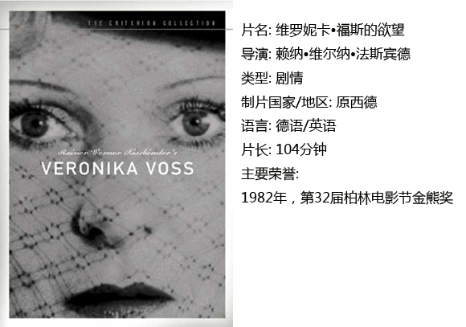

# ＜独立影像＞第二十五期：三位女性的德国史

**这三部影片的女主人公的经历覆盖了30年代到50年代末的德国历史，她们实际是二次世界大战前后的德国的化身。透过这三位女性，我们可以看到纳粹“第三帝国”对德国本土所造成的巨大伤害和50年代的“经济奇迹”光鲜外表下隐藏的腐败与罪恶。**  

# 三位女性的德国史

## 影评人 / 时黄岩（湖南大学）

 

二十世纪70年代后期，“新德国电影”主将法斯宾德拍摄了著名的反映德国女性生活与命运的“德国女性”三部曲：《玛利亚•布劳恩的婚姻》，《罗拉》，《维罗妮卡•福斯的欲望》。这三部影片的女主人公的经历覆盖了30年代到50年代末的德国历史，她们实际是二次世界大战前后的德国的化身。透过这三位女性，我们可以看到纳粹“第三帝国”对德国本土所造成的巨大伤害和50年代的“经济奇迹”光鲜外表下隐藏的腐败与罪恶。

二次大战后，西德电影市场被美国好莱坞占领，本土电影也纷纷模仿好莱坞的风格，德国电影陷入了过度商业化、格式化的泥潭，电影艺术质量极为低劣。1961年的“德国电影奖”评委会竟然在全年摄制的影片中找不出一部值得授予“最佳故事片”或“最佳导演”的影片。同年，西德送往威尼斯国际电影节参赛的5部影片全部被退回。这无疑证明西德电影的发展在艺术上已经处于最低谷。改革迫在眉睫。1962年2月28日，德国奥伯豪森市举办了第八届西德短片节，一批年轻的短片导演提出了一个重要宣言，阐明了“创立德国新电影”的要求，宣布与传统的商业性电影决裂，创立新的国际性电影语言。新德国电影运动由此展开。

法斯宾德被德国影评界比喻为新德国电影的生命中心——心脏。这位天才导演自学成才，24岁时拍摄处女作《爱神比死神更冷酷》，此后直至生命结束的13年间共执导了43部影片，加上他主演过的影片竟达60余部。拍片对于他来说是一种解脱灵魂的方式，或者说是对现实环境和人生冷漠状态的一种反抗。法斯宾德的影片多具有强烈的思辨性、批判性和一种深入骨髓的绝望感，影片中的主人公往往都对爱和沟通具有强烈的渴望和需求，但每每却以悲剧告终。下面就为大家介绍他的“德国女性”三部曲。

#### 一、《玛利亚•布劳恩的婚姻》

本片的故事开始于纳粹即将垮台的1944年，结束于战后德国开始全面复兴的1954年，通过女主人公玛利亚的婚姻悲剧反映战争给人精神上留下的永难弥合的创伤，同时也表现了德国经济恢复时期物质的丰富与精神痛苦的极大反差。战后人们并没有随着物质的发展而获得心灵的宁静，反而因为原有的价值体系的崩塌而痛苦。玛利亚便是因为其精神寄托——神圣婚姻的解体，而丧失了生存信念，最终走上了自我毁灭的道路。

从其故事情节来看，《玛利亚•布劳恩的婚姻》是一部好莱坞式的影片，它符合好莱坞剧情片最基本的模式：单一且主动的主人公在一个连续的现实时空环境中行动，因果关系推动剧情发展，从而达到一个闭合式的结局。但不同的是，玛利亚这个人物明显超出了传统剧情片人物塑造的娱乐性标准，她是一个矛盾结合体。玛利亚渴望稳定的婚姻，但她却表现出对婚姻的不忠；她追求金钱却也并非是一个贪婪者；她出卖自己的肉体却丝毫不对丈夫隐瞒；她为了金钱作了资本家奥斯瓦尔德的情人，但与他的关系却又不是简单的肉体与金钱的交易。以正常的价值观来看，玛利亚的确古怪之极，但放在故事发生的大环境下来看，玛利亚不过是为了将自己的生存与关于婚姻的理想统一起来而已。这不是一部普通的爱情主题类型片，而是一出冷酷的社会背景下毁灭与自我毁灭的悲剧。

《玛利亚》承袭了法斯宾德一贯的“绝望”主题，故事情节大多发生在室内。他采用多层次纵深画面构图的造型手段，营造狭小、封闭、压抑的令人窒息的空间环境，并通过切割画面的方式加剧狭迫感，例如监狱铁栅栏、纵横交错的窗框，这些无疑造成一种精神牢笼的感觉。在光效方面，也是运用昏暗低沉的灯光和大面积的阴影制造忧郁绝望的色调。

#### 二、《罗拉》

《罗拉》是一部颇具讽刺意味的影片，围绕妓女萝拉描写了发生在“经济奇迹”时期的一个三角恋爱的故事。法斯宾德以情节发生地——妓院象征整个社会，展现了充斥那里的金钱万能的腐朽观念和冷酷无情、明争暗斗的人际关系，更可悲的是，这些畸形的道德观念恰恰是这一时期多数人的常态。

罗拉与玛利亚一样，也是一名表面堕落，内心却渴望稳定婚姻与真挚爱情的女性，然而因为所处的社会环境，最终成为男性攫取钱财的筹码。不过幸运的是，罗拉最终如愿嫁给了真正爱自己的人。罗拉相对于玛利亚布劳恩的形象塑造略显空洞，原因或许在于玛利亚是一个行为主动的女人，当她面对痛苦与不公时总是在拼尽全力地反抗，而罗拉有反抗之心却无反抗之力，面对资本家的利用她只有歇斯底里。相比之下，反而是男主人公博姆更加令人印象深刻。

影片的色彩鲜艳纷乱，似乎是映射西德经济复苏时期物欲横流、光怪陆离的社会环境。妓院中的镜头，都是灯光昏暗，以红色为基调，充满情欲气息与性暗示，直接表现了资本家的糜烂生活。镜头转到男主人公博姆的办公室或家中时色调则变为深沉冷静的棕色或灰色。值得一提的是，有一幕罗拉与博姆坐在车中，罗拉的一半呈红色色调，博姆的一半则呈蓝色调。法斯宾德在这部影片中充分运用色彩来反映人物性格与故事情感基调。

#### 三、《维罗妮卡•福斯的欲望》

本片取材于二次大战以前，德国乌法公司的著名女演员聚贝勒.施米茨于50年代吞服安眠药自杀的事件。影片中，著名电影演员维罗妮卡在荧幕生涯结束后，婚姻破裂，事业颓败，终日沉迷于酒精与药物，她的医生卡茨利用这一点，加剧她对药物的依赖，并以此攫取其财富。报社记者发现后想要帮助维罗妮卡，但心有余而力不足，维罗妮卡最终在卡茨的精心设计下自杀身亡。

影片中，法斯宾德透过德国经济起飞大环境来看一位电影明星生涯的日落千丈，将这颗昔日明星的陨落与德国战后的政治、经济和社会关系、道德意识相交融。女巫式的卡茨医生代表着暴力、专权，控制着维罗妮卡等人的精神世界，仿佛是“第三帝国”死而复生的幽灵，而代表民主精神的记者罗伯特在与她的抗争中失败了，这就更增加了人们对历史的反思和对现实的警觉。

#### 结语：

这三部影片概括了二次世界大战后的德国社会，同时它们还有一个共同的主题——欲望。三位女主人公各有着自己的欲望，对爱情、对婚姻、对名誉、对金钱，她们都是因欲望而存在。在她们追求欲望的道路上不幸地被欲望更大能力更强的人所利用（即使是罗拉，她的婚姻也是建筑商为其经济利益而促成的），最终以悲剧收场。法斯宾德聚焦于三位女性，折射出50年代德国人精神上所遭受的痛苦。

 

### **【如何下载】~@_@?~**

**请加入独立影像流动分享群，在群共享中下载本期所推荐的独立电影！**

**流动群群号：187213480(新群)****入群请注意以下几点哦：**

1.流动群专供北斗读者下载本栏目所推荐的资源，验证身份时请注明“北斗读者”。

2.当期资源自发布后14天内可以下载，到期后工作人员将手动删除以上传后续资源，请注意时间。

3.此群采取流动制，群满员时，完成下载后请自动退群，以便他人入群下载。（但是请注意：只有当群满员时才需要各位流动，现在则无需退群，需要大家流动时会另行通知。）

关于**独立电影**和**DNEY**请参见[<独立影像>第一期：初识独立影像（上）](/?p=11506)，其中的**广告**也要记得看哦！

 

（采编：黄楚涵；责编：黄楚涵）

 
