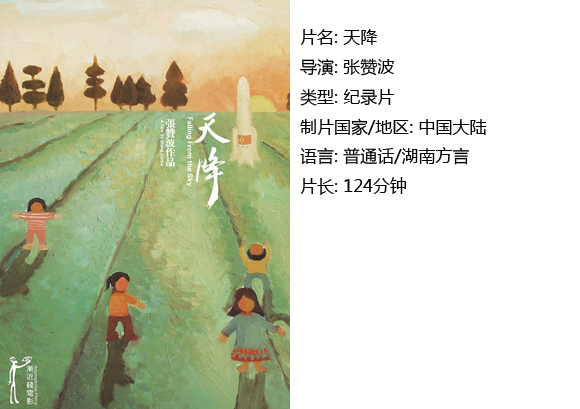

# ＜独立影像＞第二十八期：人在地球，怎能没有一招半式防身

**“天降”，顾名思义，不可思议的天外来客，不仅是那一片削去半个脑袋的卫星碎片，不仅是可以做成锅壶的破铜烂铁，不仅是砸坏了屋子找赔还要讨价还价半天的那块铁片……也许还有这个政权本身。**  

# **人在地球，怎能没有一招半式防身**

## **影评人 / 吴燕凌（中国地质大学（北京））******

 

湖南绥宁，本来一个默默无闻的小镇，却因回收卫星残骸一事，不为人知地为祖国做着重要的贡献。

一个16岁的女孩，被卫星碎片削去了半个脑袋，当过兵的父亲尚坚强待之，母亲的余生则只能笼罩在悲伤之中了。被残骸打坏的房子，打坏的庄稼……都是农民们默默忍受的事物。

出现的神八发射与奥运转播的电视镜头，以及孩子朗诵的张赞波的镜头是带有煽动性的，从“家园”、“祖国”、“土地”这样的段落标题，到多次作文，祖国的强大与农民的忍气吞声都在此形成了强烈的对比，反差之中便可听见导演低沉的控诉之声。

因此有必要在字幕之后，先证实一下事件的真实性和影响范围，是否人们的腹诽已到了这种程度。几番百度，也未置可否，说是砸死人的事确曾发生，部分地区却会拿了破铜烂铁回去铸成锅壶。

卫星残骸对坠落区的伤害，或许没有片子中渲染的那么大，即使可以用来做锅炉，但仍然构成对正常生活的骚扰。而一旦这种骚扰加强为伤害，例如砸死人，事实上，普通百姓毫无办法为自己讨回一个“公道”。除去卫星残骸，还有很多宏观的东西，对普通百姓而言，犹如天外来客，打扰、侵蚀着本来平静的农村生活。那位女老板说，在外头打工，不能照顾家里。另一位平凡而坦率的中年人则对着镜头无奈地说：“只能做下去，不做的话亏得更多……”直到落泪。

如果说卫星残骸的伤害性，不排除有导演刻意取材的可能，那么农民的语气与神态，却是无法假装的东西了。

而面对伤害，农民根本没有办法来作自我保护。

最精彩的一个段落是最后一次落卫星之后的赔偿谈判。田野上，戴眼镜的负责人，起初还一直保持风度说着官话“我们这里的老百姓是最好的、最积极的”，后来在几回合的太极后终于忍不住发飙了“两百块钱，太不把老百姓放在眼里了。”

同一时间，西昌卫星发射站派来的军人方面仍忙着摆谱，点着手指“国家、政府、农户……就这么几个原则。啊~”导演给了他背的PLAYBOY的包一个特写，军装与奢侈品在视觉上或许是个反差，在逻辑和认知中，却达成了强烈的一致性。

室内，那场从1260到600到2000的讨价还价长镜头，看的真是过瘾。农民的无奈和憨厚，任何时间陪着笑脸；官员的霸气锐气，任何时候都能讲出无法反驳的道理的架势；以及中间人两边圆场同时不停瞥官员神色的小动作，让人又笑又怜，更多的是尊敬——这样的不加佐料的真实，正是纪录片这一体裁最值得玩味，且超过电影的地方呢。

片末，导演用字幕说“献给我的魔幻主义祖国”。一时间，“我爱国而国不爱我”的悲伤逆流成河。

“天降”，顾名思义，不可思议的天外来客，不仅是那一片削去半个脑袋的卫星碎片，不仅是可以做成锅壶的破铜烂铁，不仅是砸坏了屋子找赔还要讨价还价半天的那块铁片……也许还有这个政权本身。

既然无法约束这个肆无忌惮掉落的怪物，无法使之有秩序地为我所用，那么面对这任性的“天降”，人们如何维护自己的利益，如何保护自己安静而有尊严地生活，是这个魔幻现实主义的时代，所必须付出所有艰辛，去解答的问题。

   

### **【如何观看】~@_@?~**

**** **** **请加入独立影像流动分享群，在群邮件中下载本期所推荐的独立电影！** **流动群群号：187213480(新群) 入群请注意以下几点哦：** 1.流动群专供北斗读者下载本栏目所推荐的资源，验证身份时请注明“北斗读者”。 2.当期资源自发布后14天内可以下载，到期后工作人员将手动删除以上传后续资源，请注意时间。 3.此群采取流动制，群满员时，完成下载后请自动退群，以便他人入群下载。（但是请注意：只有当群满员时才需要各位流动，现在则无需退群，需要大家流动时会另行通知。） ** **

 关于**独立电影**和**DNEY**请参见[第一期：初识独立影像（上）](/?p=11506)，其中的广告也要记得看哦！  

（采编：黄楚涵；责编：黄楚涵）

 
