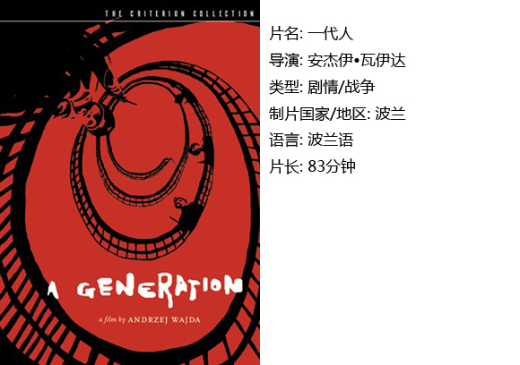
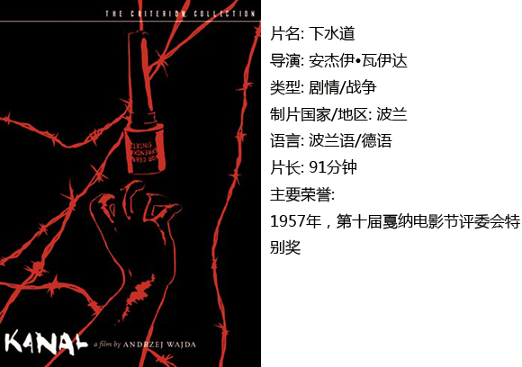
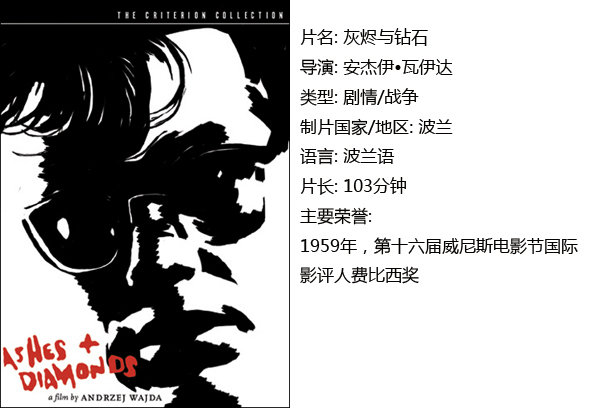

# ＜独立影像＞第二十六期：安杰伊•瓦依达与他的“战争三部曲”

**瓦依达作为一名电影工作者，用他的“战争三部曲”对当时的政治、社会和历史提出了一些自己的质疑。这些问题从来都不仅仅是波兰所面临的矛盾处境，而是所有国家都需要进行深刻思考的。广袤的大地上总需要有人道主义者，理想主义者，反战主义者伫立其中，他们会为了一个更好的世界时时叩问人类的良心。**  

# 安杰伊•瓦依达与他的“战争三部曲”

## 影评人 / 李润龙（山东艺术学院）

 

安杰伊•瓦依达是一位非常高产的波兰电影导演。从1955年大银幕处女作《一代人》以来，已经拍摄近50部导演作品，近年来比较轰动的就是2007年上映的《卡廷惨案》。

瓦依达的电影带有强烈的新现实主义风格。这种风格是二战之后在意大利兴起的一种电影技术手段，主要是应对战后由于社会经济状况不佳导致电影业受到巨大冲击的情况。电影在制作方面开始偏向写实：采用实景拍摄而不再是以前流行的摄影棚搭景，演员多选用非职业演员或者年轻演员，因为这样可以节约成本。再者，新现实主义电影主要都是反法西斯题材，因此深受当时反法西斯国家的喜爱并且被广泛地传播。

瓦依达作为二战之后开始接触电影的一名生活在社会主义波兰的年轻人，自然欣赏到了大量以反法西斯题材为主的新现实主义电影；因此，这种风格在他日后的创作当中也有深刻的体现。而说到瓦依达艺术成就最高的电影，当属他在电影拍摄早期独立制作的“战争三部曲”。

整个“战争三部曲”讲述了波兰这个国家在二战期间所面临的处境，以及瓦依达本人对于战争的一些思考。三部作品虽然在角色设置上并没有什么相关联的地方，但是完全可以看作一个整体。

#### 一、《一代人》

影片讲述一名生活在二战即将结束时期的波兰青年如何迈上共产主义革命道路。片中并没有正统社会主义影片中的那些喊着口号、标签化的革命英雄，相反，男主角是一个有着多种多样的情感、冒险冲动和纯个人想法的青年。而正是由于角色的反传统，再加上影片的镜头语言明显受到当时新现实主义的影响，瓦依达的这部作品在苏联受到了许多批评。

由于是处女作，虽然导演极力地向新现实主义靠拢，但是电影本身还是有很多当时苏联革命电影影响下存在的假大空的弊病。不过在当时的社会背景下，瓦依达能够对整个社会主义阵营所向往的斯大林主义产生一些个人的思考，已经实属不易。

#### 二、《下水道》

在《一代人》中投身革命的青年现在已经开始同德国纳粹进行战斗，所以《下水道》算是《一代人》的续集。但是在这部影片中，瓦依达试图向观众再现一段历史：苏联在已经对德国取得了近似于决定性的胜利之后，却突然停止了向敌军的进攻而让实力弱小的波兰军队面对依旧强大于自身的德国军队。

影片向观众展现了一个阴暗、污秽的下水道。这个下水道中充斥着各式各样的恐怖和危险，被困其中的波兰起义军进退两难。这好似在隐喻波兰在二战中的处境——后面有德军的围追堵截，前方又充满了各式各样的危险，本应伸出援手的苏联却在袖手旁观……

本片在人物设置上是整个“战争三部曲”里面最成功的，每一个角色都是真实可信的，每一个角色都具有自己独特的个性，在面临着危险的时候每个人都有着自己的想法和行动。

#### 三、《灰烬与钻石》

本片是整个三部曲中艺术成就最高的电影，瓦依达已经能够熟练地运用新现实主义的电影技法，而且在剧情内涵上也做到登峰造极。影片讲述了在二战结束的时候，一个曾经在《下水道》中生活过很久的波兰右翼抵抗组织青年在后方所遭遇的故事。这名青年仅从扮相上就与美国著名的反英雄偶像詹姆斯•迪恩十分地相像，没有受集体主义思维影响的他能够独立地思考判断。

这部影片极力地讽刺了当时在取得革命胜利之后，那些所谓的社会主义民主政治家的丑恶面貌，男主角也因为深陷于这场充满了暗杀和勾心斗角的政治游戏中而充满矛盾心理。

影片的题目取自于一首诗歌。这首诗歌的内涵在影片中有着非常丰富的体现——男主角那灰烬一般的生活最终只能靠钻石般的女主角支撑下去。小人物的悲哀在这里有了深刻的体现：对于生活的身不由己还是让他走上了毁灭的道路。影片结尾，男主角痛苦的蜷缩在荒地上的镜头充满了震撼力。

#### 结语：

瓦依达作为一名电影工作者，用他的“战争三部曲”对当时的政治、社会和历史提出了一些自己的质疑。这些问题从来都不仅仅是波兰所面临的矛盾处境，而是所有国家都需要进行深刻思考的。广袤的大地上总需要有人道主义者，理想主义者，反战主义者伫立其中，他们会为了一个更好的世界时时叩问人类的良心。

 

### **【如何下载】~@_@?~**

**请加入独立影像流动分享群，在群邮件中下载本期所推荐的独立电影！**

**流动群群号：187213480(新群)**** 入群请注意以下几点哦：**

1.流动群专供北斗读者下载本栏目所推荐的资源，验证身份时请注明“北斗读者”。

2.当期资源自发布后14天内可以下载，到期后工作人员将手动删除以上传后续资源，请注意时间。

3.此群采取流动制，群满员时，完成下载后请自动退群，以便他人入群下载。（但是请注意：只有当群满员时才需要各位流动，现在则无需退群，需要大家流动时会另行通知。）

关于**独立电影**和**DNEY**请参见[<独立影像>第一期：初识独立影像（上）](/?p=11506)，其中的**广告**也要记得看哦！

 

（采编：黄楚涵；责编：黄楚涵）

 
