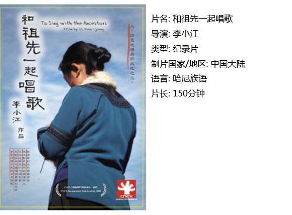

# ＜独立影像＞第二十四期：人诗意地栖居于大地之上

**也许有一天，透着影片中隐含的淡淡的伤感，这片哈尼人的土地也终将成为现代文明的一部分，那些古老而带着美感的东西也会慢慢被淡忘。那么这部片子就会成为所有向往在这个快节奏高效率的世界上找寻遗失的美好的人们永远的怀念和祭奠。 **  

# 人诗意地栖居于大地之上

## 影评人 / 马特（北京师范大学珠海分校）

 

导演手记：

荷尔德林用一句话阐述了人类的终极梦想“人诗意地栖居于大地之上”。在现实生活中，作为一种理想状态，我们越是追求，诗意地栖居却离我们越远。人类有史以来占有最丰富物质的我们，对于幸福的含义却越来越困惑。镜头伸向一个遥远的族群并不是猎奇，而是寻找一种久已忘却的栖居状态。对与哈尼族群诗意生活相伴相生的贫穷落后，作者的态度并不重要，族群内部和谐的状态，哥布内心的痛苦纠缠才是最有力量的。

我们跟踪一个巫师、一个盲歌手、一个诗人的生活轨迹，走进他们的内心，体验他们的情感，同时追寻这个族群祖先迁徙的足迹，穿越时间的重量，来到高山之巅，梯田边上，倾听远古的歌声，抚摸一个脆弱的梦想。

正文：

当我完整地看完这部电影的时候，给我的第一感觉，那就是这部电影实际上是由独立的故事剧情和独立的音乐糅合在一起的。从电影本身讲的话，音乐的穿插略显的有显突兀，或者说导演想在这150分钟里表现的东西太多了，所以必须把大量的影像元素和音乐放进去，让影片在故事叙事上有些拖沓，而音乐与剧情发展实际上有一些稍稍的不搭配，或者说导演希望表现的内容本身就是过于厚重而难以用一部片子完整说明的。

如果我们抛开这些制作上的必要的包装不看，而仅仅是感悟影片所表现的内容本身的话，我们不难看出这部影片中的极其浪漫主义的美感。导演李小江对于这类农业社会或者故土情节的影片的把握是比较专业的。包括《沿江而上》和他参与拍摄的纪录片《澜沧江——湄公河》中就可以看出这位导演有着对于传统文化情怀极其敏感的思索。

在影片的表现中，音乐不仅仅是一种娱乐的方式，更加是一种对于一个民族自身的认同和传统的固执追求，音乐是与神灵和祖先的沟通，而这种与神灵和祖先的沟通恰恰是这个民族维系的根本之源，虽然现代化不可避免的影响了这片古老的土地，但在心灵上，人们依然平静地沿袭着千百年来的传统，那种辛勤的劳动和与自然的相处。

也许有一天，透着影片中隐含的淡淡的伤感，这片哈尼人的土地也终将成为现代文明的一部分，那些古老而带着美感的东西也会慢慢被淡忘。那么这部片子就会成为所有向往在这个快节奏高效率的世界上找寻遗失的美好的人们永远的怀念和祭奠

  【如何下载】~@_@?~ 请加入独立影像流动分享群，在群邮件中下载本期所推荐的独立电影！ 流动群群号：187213480(新群) 入群请注意以下几点哦： 1.流动群专供北斗读者下载本栏目所推荐的资源，验证身份时请注明“北斗读者”。 2.当期资源自发布后14天内可以下载，到期后工作人员将手动删除以上传后续资源，请注意时间。 3.此群采取流动制，群满员时，完成下载后请自动退群，以便他人入群下载。（但是请注意：只有当群满员时才需要各位流动，现在则无需退群，需要大家流动时会另行通知。）

关于独立电影和DNEY请参见[<独立影像>第一期：初识独立影像（上）](/?p=11506)，其中的广告也要记得看哦！ 

（采编：黄楚涵；责编：黄希敏）

 
