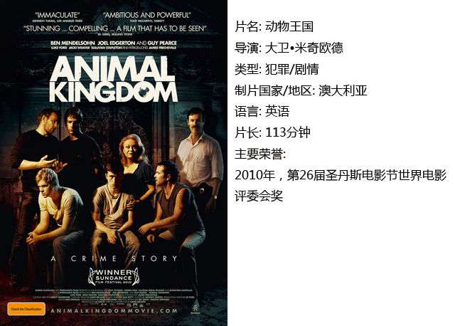
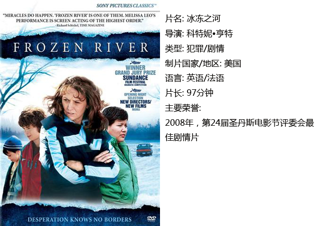
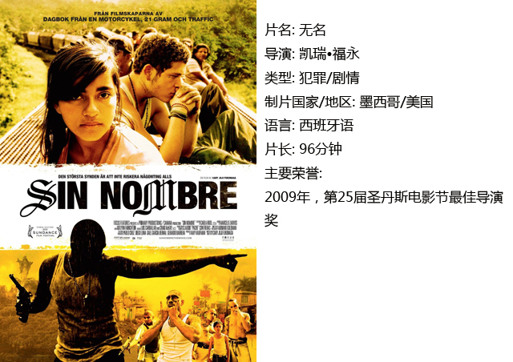

# ＜独立影像＞第二十期：圣丹斯面孔（二）之犯罪元素

**在谈到希望人们走进电影院的原因时，佩德罗•阿莫多瓦说：“去电影院看电影可以经历90分钟不一样的人生。”具体到犯罪题材的影片，我们可以理解为：这种影片给了大部分人在现实生活中不曾体验过的经历——一种挑战道德边缘与禁忌时的快感。**  

# ＜独立影像＞第二十期：

# 圣丹斯面孔（二）之犯罪元素

## 影评人 / 赵恺（黑龙江科技学院）

 

在谈到圣丹斯电影节时，我们常说这是一场“独立电影的盛宴”。如果圣丹斯是一桌丰盛的晚餐，那么犯罪题材就像桌上的一罐“老干妈”一样百搭。涉及到犯罪题材的影片可以是喜剧，可以是悲剧，可以惊悚，也可以很火爆。总之，在所有题材的电影中，犯罪题材绝对是数量最多的。对创作者而言，只要所讲的故事发生在“社会”中，十有八九是绕不开“犯罪”的。

从另一方面来说，犯罪题材的影片之所以能够长盛不衰也是因为这种影片总能够满足观众的需求，哪怕这种需求仅仅是为了追求视觉上的刺激或是为了满足内心的好奇甚至是意淫。在谈到希望人们走进电影院的原因时，佩德罗•阿莫多瓦说：“去电影院看电影可以经历90分钟不一样的人生。”具体到犯罪题材的影片，我们可以理解为：这种影片给了大部分人在现实生活中不曾体验过的经历——一种挑战道德边缘与禁忌时的快感。当然，犯罪题材的影片总是很能够牵动观众的感情：当影片里的主人公因为种种原因突破法律界限时，出于同情，我们总会希望主人公平安无事。在创作者的精心安排下，人们能在影片中找到共鸣。

正如之前我们所说的，圣丹斯电影节是电影行业中新人们的福地，因此这里的影片有一个共性：都是导演的“处女作”。接下来，我们也将介绍几部世界各地的犯罪电影，看看这些新人导演如何处理艰难时世中法律与人性的关系。

#### 一、动物王国

这是一部关于黑帮家族内部成员生存法则的影片。在片头，画面里出现了一幅一群狮子的壁画，再加上快速剪辑的黑白照片，这些告诉观众电影将要讲述的是一个怎样的家族。

电影从一个17岁少年的视角出发：母亲死于吸毒过量的约书亚被外婆带回家，这个家族正是当地臭名昭著的黑帮团伙“科迪”家族。在初来乍到的少年眼里，外婆就像狮群里当家的母狮一样把持着这个看上去有些粗鲁的家庭，在她的庇护下，约书亚的三个舅舅以及叔叔看上去也并不是那种令人闻风丧胆的暴徒。但随着相处时间越久，少年渐渐看到了这个家族残忍的一面。他陷入了两难的境地：既希望忠于家族，保护家族的成员，又在正义心的驱使下与警察接触而面临家族成员的追杀；与此同时，当地警方既希望帮助这个陷入漩涡的少年走上正轨，同时又想制裁这个家族的其他成员……

尽管这部澳洲本土的独立电影是导演大卫•米奇欧德的处女作，但他对紧张的节奏拿捏得当，对暴力冲突处理得十分成熟，使影片呈现出一种冰冷克制的气质。

#### 二、冰冻之河

影片的故事发生在美国与加拿大边界的一个贫困小镇，单身母亲蕾•艾迪独自抚养着两个孩子，为了生机，她不得不和另一个土著单身母亲合作，在边境线上做一些违法的事——帮助偷渡者穿越国境。这条冰封的河流不仅是两个国家的分界线，也是二人通往新生活的一条惊险之路。在一次次提心吊胆的旅途中，本来摩擦很大的两个女人慢慢改变了对彼此的态度。可是，警察早已盯上了她们俩……

这部电影的故事本身并无新意。和诸多犯罪题材影片的套路一样，处在社会底层的主人公为了改善生计，迫于无奈走上了犯罪之路。但由于女性导演的细腻占据了优势，本片犹如“冰冻之河”，节奏沉缓静水流深，传达出强有力的真情。同时，作为一部以表演见长的影片，主演梅丽莎•里奥几乎以素颜示人，加上大量的手持摄影以及对自然光的处理，演员的表演显得非常自然，塑造的角色十分真实。

#### 三、无名

这是一部野心勃勃的影片。即使是一个经验丰富的导演也可能处理不好移民偷渡、帮派追杀这些复杂的元素，但是新锐的年轻导演凯瑞•福永却在自己的长片处女作中做到了艳惊四座。

影片的叙事就像一列并轨进站的火车。开始是两条故事线索平行叙事，一条是讲述墨西哥黑帮，帮派内部宛如一个等级森严弱肉强食的社会；另一条线索则是洪都拉斯少女塞拉与父亲为了去美国与家人团聚，踏上了偷渡的列车。电影进行到三分之一的时候，影片的两条线索开始合并，人物命运产生了复杂的纠葛……

导演凯瑞•福永在他的处女作里展现出了惊人的叙事能力，据说他本人为了拍摄这部影片花了三年时间准备。他和移民一起扒火车体验真实，采访了大量的偷渡者作为素材。实际上，导演本身也来自一个移民家庭，父亲是日裔，母亲是欧洲人，继父是墨西哥人，这为描绘影片中复杂的人物内心以及归属感提供了借鉴。值得一提的是，这部低成本影片启用了大量的非职业演员，不经雕琢的表演给观众带来了很强的真实感。在拍摄移民坐在火车顶上的戏时，导演说服其他人的方法是身先士卒——自己先爬到车顶上去。

这部影片的一鸣惊人，也再次印证了圣丹斯是新人的福地。这之后，凯瑞•福永的电影事业有了很大进展，执导的新版《简爱》，同样获得了不错的评价。

 

### **【如何下载】~@_@?~**

**请加入独立影像流动分享群，在群共享中下载本期所推荐的独立电影！**

**流动群群号：187213480(新群)****入群请注意以下几点哦：**

1.流动群专供北斗读者下载本栏目所推荐的资源，验证身份时请注明“北斗读者”。

2.当期资源自发布后14天内可以下载，到期后工作人员将手动删除以上传后续资源，请注意时间。

3.此群采取流动制，群满员时，完成下载后请自动退群，以便他人入群下载。（但是请注意：只有当群满员时才需要各位流动，现在则无需退群，需要大家流动时会另行通知。）

关于**独立电影**和**DNEY**请参见[<独立影像>第一期：初识独立影像（上）](/?p=11506)，其中的**广告**也要记得看哦！

 

（采编：黄楚涵；责编：黄希敏）

 
