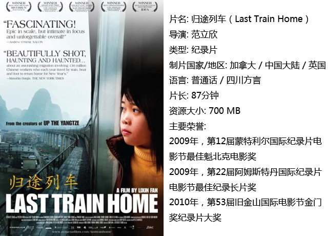
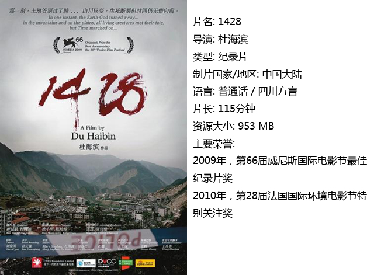
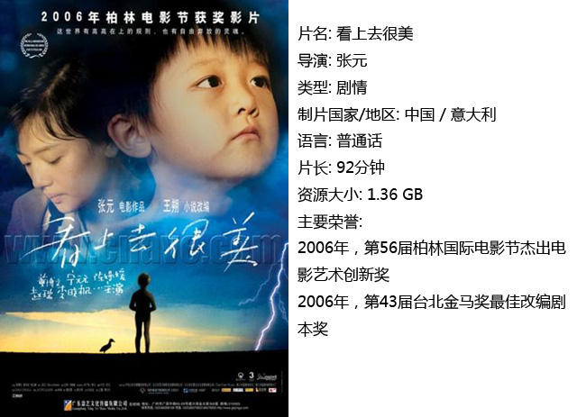
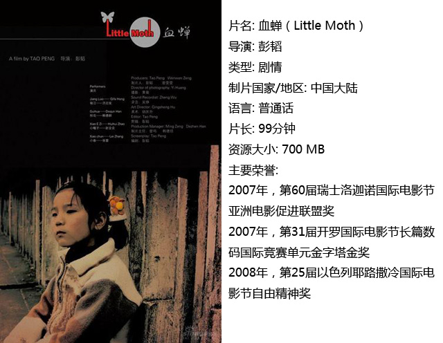

# ＜独立影像＞第二期：初识独立影像（下）

**他们静静地坐在那里，用手托着下巴，目不转睛地盯着屏幕，深怕错过任何一个精彩瞬间。我相信深藏在他们内心之中的是一份对于真实的渴望，因为电影不仅关乎艺术，它更关乎我们身处的现实社会。**

**它们共同托起了一整个时代的回忆，记录下无数人们几乎淡忘了的却又不可磨灭的历史。**

# ******初识独立影像（下）******

## **影评人 / 廖梦丹（厦门大学）******

编者： [在<独立影像>第一期：初识独立影像（上）](/?p=11506)发表之后，读者们应该已经初步理解了独立影像这一概念。那些下载并观看了上期所推荐的四部独立电影的读者也应该对独立电影有了一些感性认识。本期是“初识独立影像”专题下期，同样为大家推荐了四部华人导演的独立电影或纪录片。同时，还为大家请来了DNEY新任组长廖梦丹同学，让她谈一谈自己对于独立电影的认识和感受。  廖梦丹： 当我们醉心于主流商业电影的恢弘绚烂，尚未闻独立电影为何物时，殊不知中国独立电影产业正以它独有的姿态慢慢生根、发芽、结果……然而，圈子里的人都知道这一切有多么的来之不易。由于中国现行体制的约束，那些关注社会问题、揭露社会黑暗的独立电影总是因为题材敏感、内容真实而不被允许在各类院线上映。这直接导致它们只能在小范围内传播。 从一个酒吧放映会到一个学校放映专场，我们看到的总是同一群人。他们静静地坐在那里，用手托着下巴，目不转睛地盯着屏幕，深怕错过任何一个精彩瞬间。我相信深藏在他们内心之中的是一份对于真实的渴望，因为电影不仅关乎艺术，它更关乎我们身处的现实社会。对不易察觉的事件真相的揭示，对日常生活中琐碎细节的捕捉，对亲身见证历史之人的访谈……导演将这一切搬上荧幕，告诉我们那些被官方掩盖的事实，那些平凡小人物的生存状态，那些青春躁动所引起的风波……而这些，都能让我们真正成长。 从中国的独立电影的开山之作《铁西区》到《和凤鸣》，以及之后的众多经典作品。它们共同托起了一整个时代的回忆，记录下无数人们几乎淡忘了的却又不可磨灭的历史。那些有强烈社会责任感的独立电影人以个人的意志顽强地与时间进行着对抗，用无数珍贵的影像资料呼喊出微弱而坚定的声音，为这一党专政下的中国留下一份不同的解读。 如今，这一小撮还在坚挺着的星星之火，虽无燎原之势，却也照亮了一小片天地。众人相互依偎着围坐其间，温暖着各自的心房。共度难关时的热泪盈眶，相互对视时的惺惺相惜，所有独立思考的答案……都在镜头里默默展现，仿佛在等一个终能懂你的人。  

### 一、归途列车

每到春节，数以百万计身在异地的农民工便踏上了返乡的旅程。导演范立欣用他自己的摄像机记录下了一对农民工夫妇外出打工和返乡的经历。他们对生活并不抱有任何幻想，只是希望子女将来能生活得更好。 看完这部影片，我只觉得镜头实在太残忍，赤裸裸地展现出经济蓬勃发展的背后那些底层人物的辛酸和苦闷。和每一个家庭一样，他们也面对着儿女的叛逆问题，也有着各种各样的琐事与争吵。而这些，却足以让每个人动容。 

  

### 二、1428

2008年5月12日14：28，汶川大地震发生。那一幕幕创伤与悲痛似乎又要涌上我们的心头。然而导演并不止于将镜头定格于那一刻，更多的转向了灾难之后的无数个平常日子里人们的善良与悲悯、阴暗与算计。它一反官方报道的虚饰，记录下灾后重建时人们所展现的真实人性，迫使每个人直面内心。只有诚恳地反思过去，才能更好地面对将来。 拍下此片，只为留下真实的记录。    

### 三、看上去很美

这世界有高高在上的规则，也有自由奔放的灵魂。 ——张元 还记得幼儿园的小红花吗？当你听老师的话，按时吃饭、睡觉的时候，老师就会奖你一朵小红花。并不是“乖孩子”的方枪枪在怎么也得不到5朵小红花的情况下，想出了一个个令人惊奇的点子…… 影片一开始，我就被方枪枪各种稀奇古怪的言行逗乐了。老师要他道歉时蹦出的那一句“操你妈”更是令我忍俊不禁。然而，在欢乐背后它似乎也还在影射着什么……    

### 四、血蝉

由同名小说改编的电影《血蝉》讲诉的是一个令人悲伤的故事。小主人公是一个名叫小娥子的女孩，她因为患有血蝉疮而被父亲卖给了人贩子骆江，被迫成为一个利用身体残疾进行乞讨的工具。 命运总是在和小娥子开玩笑，在成功的从人贩子手中逃脱出来并遇到好心人后，却又因为时机之差终被抛弃。而她与另一个人，终究也这样错过。    （经作者同意后有删改） 

### **【如何下载】~@_@?~**

**请加入独立影像流动分享群，在群邮件中下载以上四部精彩的独立电影与纪录片！**

**流动下载群群号：94075202 ****入群请注意以下几点哦：**

1.流动群专供北斗读者下载本栏目所推荐的资源，验证身份时请注明“北斗读者”。

2.当期资源自发布后16天内可以下载，到期后QQ中转站将自动删除，请注意时间。

3.此群采取流动制，群满员时，完成下载后请自动退群，以便他人入群下载。（但是请注意：只有当群满员时才需要各位流动，现在则无需退群，需要大家流动时会另行通知。）

### **【广告】******

独立影像栏目长期招募荐影人负责撰写推荐稿

**要求（重要程度分先后）：**

1.在校大学生

2.对独立电影和纪录片有一定了解或很感兴趣者

3.文笔好那么一点点，思路清晰那么一点点，理解深入那么一点点

**工作内容：**

1.参与共同讨论以确定当期主题和推荐影片，之后观看影片并撰写推荐稿

2.工作时间、地点随意，每期荐影人讨论时自荐

福利：可以先于读者观看影片并随意下载海量资源

有意者请联系 **卓王孙QQ971885473 **，请注明“荐影人”

 **流动群群号：94075202 DNEY新人群群号：152511792** 注：流动群专供北斗读者下载本栏目所推荐的资源，验证身份时请注明“北斗读者”。当期资源自发布后16天内可以下载，到期后QQ中转站将自动删除， 请注意时间。此群采取流动制，群满员时，完成下载后请自动退群，以便他人入群下载。（但是请注意：只有当群满员时才需要各位流动，现在则无需退群，需要大家流动时会另行通知。） DNEY新人群则为DNEY独立影像官方交流群，非流动制。DNEY同时为流动群和新人群提供资源，但新人群资源并不一定与本栏目同步。 另， 独立影像，是一个才刚刚起步的新栏目，不知道读者们是否满意我们这种形式呢？希望热心的读者们来多多的献计献策吧^_^ 联系 **薄雯 qq173665309**，或者校内、QQ群里联系我们工作人员哟> <  

(采编：黄希敏 责编：黄希敏）
