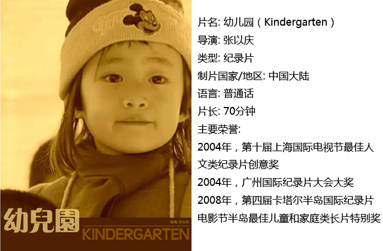
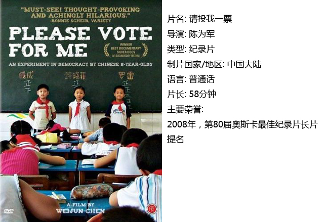
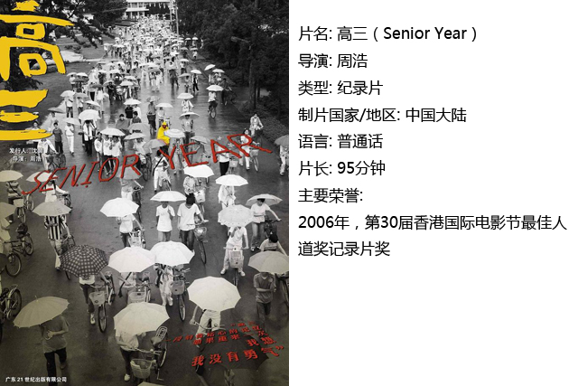
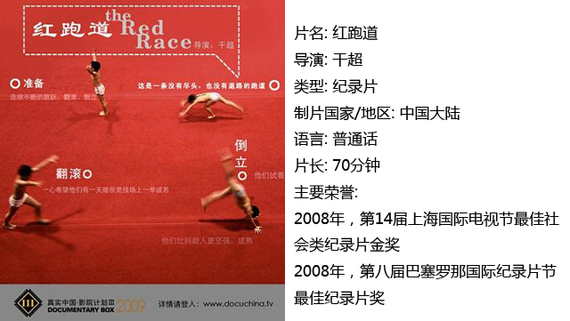
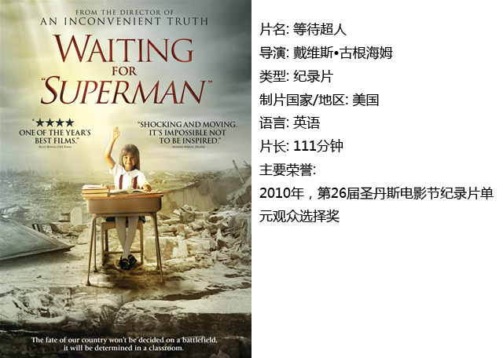

# ＜独立影像＞第五期：体制下的教育

** 当我们今天去质疑我们从小到大所接受的教育的时候，我们反抗的话语就来自教育本身。教育的影响从未消退，它今天仍然根深蒂固的存在于我们身体内。教育不仅是学校教育，整个社会的文明就是教育本身。** 

# 体制下的教育

## 影评人 / 孙晓辉（北京电影学院）

**编者：** 本期独立影像栏目为读者推荐了五部与教育体制相关的纪录片。其中四部聚焦中国大陆，这四部纪录片从幼儿园到高三，从高考制度到体育选拔，与读者一同回望那些已经逝去的学生时代，一同反思现行教育体制的优劣。最后一部《等待超人》则是对于美国公立教育制度的反思，使读者可以在思考中国自身问题的同时望向大洋彼岸的民主自由之邦，看一看那里正在发生的困扰全美公民的大难题。  **孙晓辉：** 对于逝去岁月的回望，总是伴随着伤感与反思。从《幼儿园》到《请投我一票》再到《高三》，一个人的成长历程构成了体制造人的完整图景。 从一无所知到被教导辨别是非与学习规则，这便是一个人成长为人的过程。当我们今天去质疑我们从小到大所接受的教育的时候，我们反抗的话语就来自教育本身。教育的影响从未消退，它今天仍然根深蒂固的存在于我们身体内。教育不仅是学校教育，整个社会的文明就是教育本身。我们是否质疑过为什么要孝敬父母？当一件事情从小以一种先天的道德正确性进入我们脑中的时候，它很可能会变成我们的逻辑。而孝敬父母这一道德不是灌输，而是潜移默化。 如果教育本身都是件值得质疑的事，那么去谈各种教育体制的优劣似乎变得更加没有意义。这五部纪录片展现给我们的问题都太过于沉重，而沉重的背后是无解。面对无解的问题，只有实用主义的观点去讨论它们趋向合理的趋势。 

### 一、幼儿园

幼儿园最重要的意义在于它把一个人由“家庭中的人”变为“社会中的人”，在已经适应家庭这种独特的人际关系后，人在幼儿园中开始接触社会中的人际关系。而社会中的人际关系帮助人找到了自我认知。幼儿园时期接受的逻辑奠定了青春期前整个价值观的基础。幼儿不加质疑的接受了观点的灌输，但是这种接受并没有什么大碍，当我们看到《幼儿园》中小孩说要炸死美国王八蛋后，更多的是一笑了之，不至于杞人忧天到认为这种教育下的小孩没救了。成人的世界很复杂，但幼儿的世界未必就是简单的。幼儿的独特世界是另一种维度的复杂，同样充满了丛林法则。 

### 二、请投我一票

当一个发生在中国某小学的民主试验结束后，许多观众对民主失去了信心。民主的主体应是选民，而不是被选举人。民主的重点在于选民的权利，而这个影片中的小学生根本没看到自己权利的力量之大。100年前袁世凯认为中国人对于政治认识尚处幼稚阶段，不适合民主政治。100年过去了，中国人对于政治的认识比幼稚阶段又好了多少呢。如果民主化今日实现，那么上台的会是民粹主义政党还是民族主义政党？清末宪政已经具有民主雏形，可惜被辛亥革命打破。错误或许不该再犯。 

### 三、高三

对于高考制度的弊病没有必要赘述。但如果用实用主义的观点来看，在现存的体制下，高考制度是否是最不坏的选择？最激烈反对高考制度的人来自在校的初高中学生，他们没有话语权。而拥有话语权的人或者是高考制度的既得利益者，或者已经脱离高中生活太长时间已经不去关心高考制度。而最有趣的地方在于我们经常看到有人怀念高三生活，我想怀念高三的逻辑和怀念文革差不多。在一个革命热情的感召下，一个人完成了平凡生活里的英雄梦想。 

### 四、红跑道

用对错来衡量这种体育培养体制显得太过于武断。最关键的问题是为什么存在这种培养机制。批判举国体制的人和为举国体制培养出的冠军喝彩的人有时候是同一群人。是谁种植了举国体制的土壤。政权为了寻找其合法性而鼓吹民族主义，举国体制带来的优异成绩恰恰是极为有效的宣传，其所带来的表面优势是我们容易看到的，而其弊端则藏在我们不容易发现的地方。无数孩子的悲剧童年固然值得同情，不过如果孩子一直活在自己的梦里，也未必是件难过的事。 

### 五、等待超人

教育公平问题并不仅存在于中国。中国和美国教育公平问题的差别在于，中国人将不公平交给了户籍、权利和金钱，美国人将不公平交给了运气。不公平是一个事实，但是避免这种不公平又是一件难以做到的事。如果要从源头解决起的话，那么最重要的便是人们对于教育的过度迷恋。怎么样的教育才是合理的教育，略显反智的美国人一思考，大家就想发笑。 

### 

### 【如何下载】~@_@?~

 **请加入独立影像流动分享群，在群邮件中下载本期所推荐的独立电影！** **流动群群号：94075202 入群请注意以下几点哦：** 1.流动群专供北斗读者下载本栏目所推荐的资源，验证身份时请注明“北斗读者”。 2.当期资源自发布后14天内可以下载，到期后工作人员将手动删除以上传后续资源，请注意时间。 3.此群采取流动制，群满员时，完成下载后请自动退群，以便他人入群下载。（但是请注意：只有当群满员时才需要各位流动，现在则无需退群，需要大家流动时会另行通知。） 

 **DNEY新人群群号：152511792** 注：DNEY新人群为DNEY独立影像官方交流群，非流动制。DNEY同时为流动群和新人群提供资源，但新人群资源并不一定与本栏目同步。  关于**独立电影**和**DNEY**请参见[第一期：初识独立影像（上）](/?p=11506)，其中的广告也要记得看哦！ 

**（采编：黄希敏；责编：黄希敏）**
