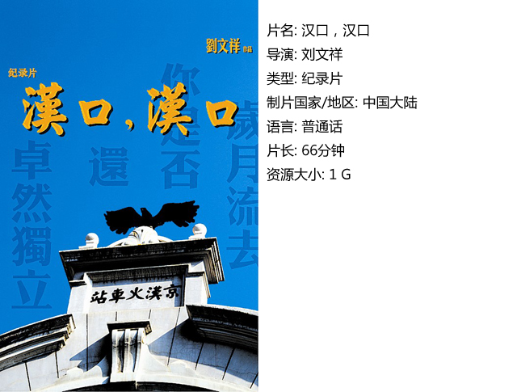

# ＜独立影像＞第八期：汉口，汉口

**当然，众所周知的是，这两座抗战时期非常重要的出版机构旧址还是已经化为尘土了。整个交通路被夷为平地之后，我感到我们的这个城市当下正在发生的事情非常典型，需要我们这些年轻人用现代的传媒手段把它记录和表达出来，发出一种声音，引起城市居民的一种思考，这就是我的初衷。**  

# <独立影像>第八期：汉口，汉口

## 导演 / 刘文祥（武汉大学）

 

#### **编者：**

DNEY创始人Young同学无私为大家奉献了共有42部的纪录片《一寸河山一寸血》，你们现在是不是光是下载电影就已经感觉到手软了？嘿嘿，不用担心，北斗的编辑们是最体谅读者的，在这种时候我们可不会再加重各位的负担的。本期独立影像栏目特别推荐一部电影，而且这部电影可以说是完全意义上的独立电影哦，简直比独立电影还要独立！ 纪录片《汉口，汉口》是武汉大学文学院07级学生刘文祥历时近2年，仅用一台单反、一部摄像机拍摄完成的一部深刻记录武汉市历史文化建筑的纪录片，其中展示了许多珍贵的影像资料。 PS：作为同龄人的编辑们感到压力好大啊…… 

#### **刘文祥：**

拍摄这部片子是我很早就有的想法，上大学以来我一直很关注武汉这座城市的历史文化。我从小就对历史文化很感兴趣，我的母亲对这方面也很有兴趣，可能是源于她的熏陶吧。而且，我也非常喜欢研究历史建筑，来到武汉这样一个充满文化底蕴而拥有如此之多古老建筑的城市，我自然就开始去关注身边的这些建筑、它们的美及其所承载的历史文化。 实际上我很早就有这个想法，但是一直没有开始付出实施，真正让我下定决心开始做这件事是在2009年的下半年。当时发生了一件武汉市民也深有感触的事，就是江汉路地铁站的拆迁。那时我也作为一名亲历者参与到其中——和武汉市著名的民俗学家刘谦定先生一起向武汉市文化局递交申请，要求将位于汉口交通路的上海杂志公司旧址与生活书店旧址认定为文物加以保护。当然，众所周知的是，这两座抗战时期非常重要的出版机构旧址还是已经化为尘土了。整个交通路被夷为平地之后，我感到我们的这个城市当下正在发生的事情非常典型，需要我们这些年轻人用现代的传媒手段把它记录和表达出来，发出一种声音，引起城市居民的一种思考，这就是我的初衷。 从专业角度来看，这部片子还存在诸多不足乃至于硬伤，这一点我有非常清醒的认识。对于拍摄记录片而言我仍然可以说是一个外行。这与其说是一部影视作品，不如说是我对文化遗产保护事业关注的一次尝试。希望通过这部片子，呼唤所有年轻人关注身边的历史，并用现代技术赋予我们的能力来记录它们，因为记录的意义是巨大的。   

#### 【相关报道】

**[长江日报](http://cjmp.cnhan.com/cjrb/html/2011-04/08/content_4795402.htm  )** **[楚天都市报](http://ctdsw.cnhubei.com/cnews/newpic/jy/201104/t1663950.shtml)**  **武汉人民广播电台《圆桌时间》** http://www.tudou.com/programs/view/UIaf5tKh4Q8/ http://www.tudou.com/programs/view/0shQaKdDTs8/  **关于《一寸山河一寸血》请参看** http://baike.baidu.com/view/1809855.htm  

### **【如何下载】~@_@?~**

**请加入独立影像流动分享群，在群共享中下载本期所推荐的独立电影！**

**流动群群号：94075202 ****入群请注意以下几点哦：**

1.流动群专供北斗读者下载本栏目所推荐的资源，验证身份时请注明“北斗读者”。

2.当期资源自发布后14天内可以下载，到期后工作人员将手动删除以上传后续资源，请注意时间。

3.此群采取流动制，群满员时，完成下载后请自动退群，以便他人入群下载。（但是请注意：只有当群满员时才需要各位流动，现在则无需退群，需要大家流动时会另行通知。）

 **DNEY****新人群群号：152511792**

注：DNEY新人群为DNEY独立影像官方交流群，非流动制。DNEY同时为流动群和新人群提供资源，但新人群资源并不一定与本栏目同步。

关于**独立电影**和**DNEY**请参见[<独立影像>第一期：初识独立影像（上）](/?p=11506)，其中的**广告**也要记得看哦！

 

（采编：黄希敏 责编：黄希敏）

 
