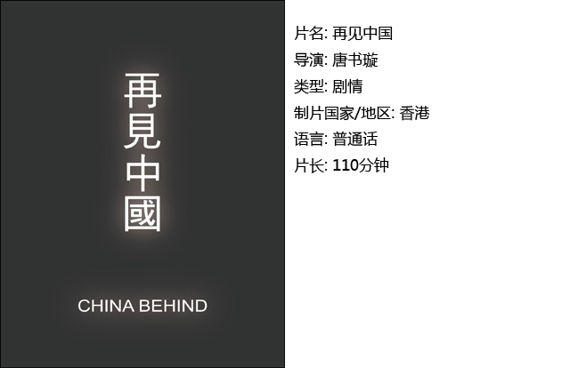

# ＜独立影像＞第六期：回望M时代

**这前后的两个三十年不应该是这样割裂开的，虽然我们这一代不曾经历过那些岁月，但是了解那个时代发生了什么、得到了什么、收获了什么、失去了什么、遗失了什么，还是很有必要的。人不可能永远活在自己的快乐之中而不去正视自己的痛苦，亦如国家不可能永远沉浸在自己的辉煌之中而不去面对失败和挫折。**  

# <独立影像>第六期：回望M时代

## 影评人 / 王斯王（上海海事大学）

 

从小我们就接受着这样一套教育——我国自改革开放以来取得了日新月异的变化和发展，但是与世界发达国家仍有很大的差距，诸如此类等等。那么改革开放之前的中国又是怎样的一番天地呢？

似乎我们的近代历史课本只是一部断代史，从甲午战争的枪炮开始论述，一直到1949新中国成立，这之后正如一个地质断层，仅有很少的笔墨描绘了土地改革和第一个五年计划。一直到党的12届三中全会上大家放下了毛泽东思想举起了邓小平旗帜，改革的春风吹遍了百废待兴的神州。然而那个年代发生了些什么却又很少被人了解。

这前后的两个三十年不应该是这样割裂开的，虽然我们这一代不曾经历过那些岁月，但是了解那个时代发生了什么、得到了什么、收获了什么、失去了什么、遗失了什么，还是很有必要的。人不可能永远活在自己的快乐之中而不去正视自己的痛苦，亦如国家不可能永远沉浸在自己的辉煌之中而不去面对失败和挫折。对待历史的态度决定了我们对于未来的思路，能够从历史之中吸取教训才是解决之道。

我们不能只记得在当年如此困难的情况下研制出了原子弹，我们也不能忘记当年造成了如此困难的所谓“三年自然灾害”造成的千万人的死亡，也不能忘记造成这灾难的虚报浮夸之风是怎么蔓延的。面对着土改、反右、跃进、文革、四清等等那么多前三十年的惨痛教训我们怎么能无动于衷，让它们随风而去呢？

面对历史的伤痛，我们总习惯于说：“历史的伤疤，过去就让他过去吧。”但是这对生命和痛苦的漠视如果反映在对于历史的态度之上，同样也会反映在我们对待现实的态度里。人是健忘的。当今日我们为高铁追尾而义愤填膺之时，还有多少人记得08年胶济铁路上的相撞呢？

秦人不暇自哀，而后人哀之；后人哀之而不鉴之，亦使后人而复哀后人也。难道我们还要顺着历史的车轮重复着错误的轮回吗？

犯错并不可怕，可怕的是不吸取教训不去总结不去反思，永远自认伟大光荣正确的继续错下去。影像画面或许能起到一定的警醒作用，使史实不至于就这样被忘得一干二净。

#### 一、张博士

他，有着时代的烙印，是毛的虔诚信徒。他，在文革中遭受迫害被迫退学。他，在工厂自学在大学旁听17年。他，为的是实现他小时候的理想——去苏联当翻译。他，是张博士。

#### 二、夹边沟

影片用独特的画面展示了在1960年前后，人间地狱一般的夹边沟劳改农场中发生的故事。他们是因言犯罪的右派知识分子，他们忍受着饥饿与贫寒，与死神做着抗争，只因他们“知无不言，言无不尽”。

#### 三、再见中国

几个年轻人无法忍受阶级斗争的冷嘲热讽以及无法把握命运的无助，计划逃离那片狂热的文革土地。逃避关卡的检查、躲过军队的巡逻、历经波折与艰辛，等待着他们的又将是怎样的宿命安排？

#### 四、中国（重点推荐>_<）

或许大家都能想象成千上万人身穿绿军装在广场上挥舞红宝书的文革场景，但是日常生活中的人们又是怎样的呢？感谢导演安东尼奥尼的镜头，为我们留下了一个似乎很近却又在逐渐远去的中国。影片结尾导演的自白很值得玩味——画虎画皮难画骨，知人知面不知心。

 

### 【如何下载】~@_@?~

**请加入独立影像流动分享群，在群邮件中下载本期所推荐的独立电影！**  **流动群群号：94075202 入群请注意以下几点哦：** 1.流动群专供北斗读者下载本栏目所推荐的资源，验证身份时请注明“北斗读者”。 2.当期资源自发布后14天内可以下载，到期后工作人员将手动删除以上传后续资源，请注意时间。 3.此群采取流动制，群满员时，完成下载后请自动退群，以便他人入群下载。（但是请注意：只有当群满员时才需要各位流动，现在则无需退群，需要大家流动时会另行通知。）    **DNEY新人群群号：152511792** 注：DNEY新人群为DNEY独立影像官方交流群，非流动制。DNEY同时为流动群和新人群提供资源，但新人群资源并不一定与本栏目同步。  关于**独立电影**和**DNEY**请参见[第一期：初识独立影像（上）](/?p=11506)，其中的广告也要记得看哦！  

（采编：黄希敏；责编：黄希敏）

